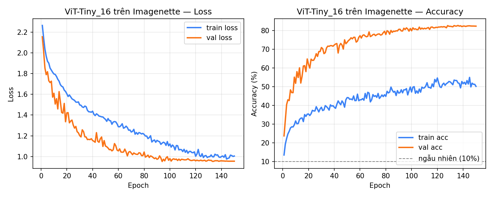
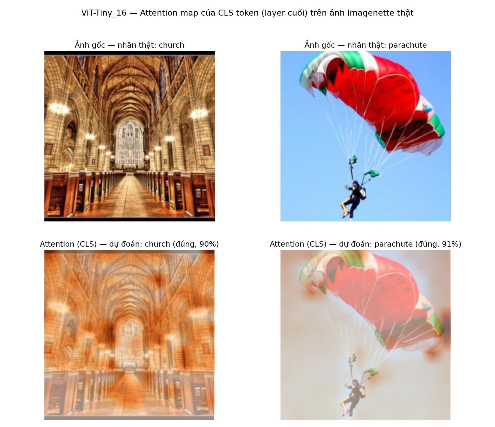

# Vision Transformer và Fine-tune World Foundation Model (Cosmos Predict2.5)

Đây là bài tập **bắt buộc** trong khoá "Transformers in Physical AI", gồm **hai Task đều phải hoàn thành**, thực hành hai khía cạnh khác nhau của kiến trúc Transformer trong Physical AI: tự xây dựng một ViT nhỏ từ đầu (Task 1), và fine-tune một World Foundation Model quy mô lớn đã pretrain sẵn — **Cosmos-Predict2.5-2B** của NVIDIA (Task 2). Bảng dưới đây tóm tắt khác biệt giữa hai Task; mỗi Task có yêu cầu, tiêu chí đánh giá và mục nộp bài riêng; số thứ tự Mục được đánh lại từ 1 trong từng Task, còn số Hình được đánh liên tục xuyên suốt tài liệu.

|  |  |  |
| --- | --- | --- |
| | **Task 1** | **Task 2** |
| Chủ đề | Phân loại ảnh bằng ViT huấn luyện from scratch | Sinh video robot manipulation bằng LoRA fine-tune |
| Phương pháp | Tự cài ViT-Tiny_16 (patch + position + attention), huấn luyện from scratch trên Imagenette | LoRA/DoRA: đóng băng mô hình gốc Cosmos-Predict2.5-2B, huấn luyện khoảng 50 triệu tham số adapter |
| Dữ liệu | Imagenette (10 lớp, tải tự động qua `torchvision`) | Video có sẵn, dataset `nvidia/GR1-100` |
| Phần cứng | Bất kỳ GPU nào — **Colab/Kaggle free tier (T4) là đủ**, không cần thuê máy | **1 GPU 80GB** (H100 hoặc A100 80GB) — bắt buộc thuê, không chạy được trên free tier |
| Repo tham chiếu | — (tự viết trong notebook, không dùng repo/checkpoint pretrained ngoài) | `terarachang/diffusers` (Cosmos Predict 2.5 LoRA) |

# Thuê GPU (cho Task 2)

Task 1 (ViT) chạy tốt trên GPU miễn phí của Google Colab hoặc Kaggle — **không cần đọc phần này**. Phần này chỉ liên quan đến **Task 2** (LoRA fine-tune Cosmos-Predict2.5-2B), vì Task 2 bắt buộc GPU 80GB mà các gói miễn phí không có.

## Cần GPU nào

|  |  |
| --- | --- |
| **Task** | **GPU cần thiết** |
| Task 1 (ViT) | Bất kỳ GPU nào có VRAM tầm trung trở lên — Colab/Kaggle free tier (T4, ~16GB) chạy tốt kiến trúc nhỏ ViT-Tiny_16 trên Imagenette. **Không cần thuê máy.** |
| Task 2 (LoRA) | Tối thiểu **1× GPU 80GB** (H100 hoặc A100 80GB). GPU 24GB trở xuống, hoặc Colab/Kaggle free tier, không đủ VRAM để load checkpoint Cosmos-Predict2.5-2B (xem Mục 2.2 của Task 2 nếu chỉ có GPU nhỏ hơn). |

## Thuê ở đâu: cloud bên thứ ba hay Google Cloud/AWS

Có hai hướng, khác nhau ở việc có credit miễn phí hay không và có phải xin quyền dùng GPU hay không:

|  |  |  |
| --- | --- | --- |
| **Hạng mục** | **GPU cloud bên thứ ba** (RunPod, Lambda Labs, Vast.ai...) | **Google Cloud / AWS** (credit tài khoản mới) |
| Chi phí | Trả tiền thật ngay từ đầu, tính theo giờ (tham khảo 2–3 USD/giờ cho 1×H100/A100 80GB tại thời điểm biên soạn, giá thay đổi theo nhà cung cấp). Không có credit miễn phí đáng kể. | Có credit khuyến mãi cho tài khoản mới — 300 USD/90 ngày (Google Cloud) hoặc 100–200 USD/6 tháng (AWS). |
| Thời gian chờ | Chọn GPU và khởi động máy gần như ngay lập tức, không cần xin phép. | Có rào cản trước khi dùng được GPU thật (xem bảng dưới) — có thể mất thời gian chờ duyệt. |
| Phù hợp khi | Cần chạy ngay, deadline gấp, hoặc không muốn qua thủ tục xin quota/nâng cấp tài khoản. | Có thời gian chờ xử lý thủ tục và muốn tận dụng credit miễn phí để giảm chi phí. |

Nếu chọn Google Cloud hoặc AWS, lưu ý **có credit không đồng nghĩa với có GPU** — cả hai đều có rào cản riêng cho tài khoản mới:

|  |  |  |
| --- | --- | --- |
| **Hạng mục** | **Google Cloud** | **AWS** |
| Credit khuyến mãi | 300 USD (Welcome credit), có hiệu lực 90 ngày kể từ lúc đăng ký. | 100 USD khi đăng ký, có thể nhận thêm tối đa 100 USD khi dùng các dịch vụ như Amazon EC2 và Amazon Bedrock. Free plan kết thúc sau 6 tháng hoặc khi hết credit, tuỳ điều kiện nào đến trước. |
| Điều kiện dùng GPU | Tài khoản Free Trial **không thể thêm GPU** vào VM và không được xin tăng quota. Cần nâng cấp lên tài khoản trả phí; credit chưa dùng vẫn được giữ đến hết 90 ngày, phần vượt credit bị tính phí. | Tài khoản mới thường có hạn mức vCPU cho các họ instance GPU (G, P) bằng 0. Cần gửi yêu cầu tăng hạn mức trong Service Quotas trước khi khởi tạo instance; yêu cầu có thể phải chờ duyệt hoặc bị từ chối. |
| Dịch vụ chính | Compute Engine (VM có GPU) và Cloud Storage (bucket chứa dữ liệu). | EC2 (họ P, G) và S3 (bucket chứa dữ liệu). |

Điều kiện trên lấy từ tài liệu của hai nhà cung cấp tại thời điểm biên soạn; chính sách có thể thay đổi, nên tự kiểm tra điều khoản hiện hành trước khi đăng ký và tự chịu chi phí phát sinh vượt credit.

## Vài lưu ý thực dụng

* Ước tính số giờ GPU cần trước khi khởi động, theo giá theo giờ của loại máy đã chọn — Task 2 tốn khoảng 35–60 USD cho một lần fine-tune hoàn chỉnh (Mục 1 của Task 2, hàng "Chi phí"); ước tính trước khi thuê để tránh phát sinh ngoài dự kiến.
* Với Google Cloud/AWS: đặt cảnh báo ngân sách (budget alert) ngay khi tạo tài khoản; dừng hoặc xoá VM ngay khi xong việc (VM đang chạy tính phí theo giờ, đĩa vẫn tính phí khi VM dừng); đặt VM và bucket lưu dữ liệu cùng một region.
* Với GPU cloud bên thứ ba: theo dõi phí theo giờ tương tự, và tắt máy (không chỉ ngắt kết nối) khi không dùng — hầu hết tính phí kể cả lúc máy rảnh.
* `scripts/task2/train.sh` chỉ lưu checkpoint định kỳ (`--checkpointing_epochs=20`), không có cờ resume tự động. Nếu chọn loại máy có thể bị thu hồi giữa chừng (Spot/Preemptible), học viên tự kiểm tra `train_cosmos_predict25_lora.py` có hỗ trợ `--resume_from_checkpoint` hay không trước khi phụ thuộc vào loại máy này — an toàn nhất là dùng máy on-demand cho lần chạy chính thức.

# Task 1 — Vision Transformer (ViT) cho Phân loại Ảnh

*(Bài tập bắt buộc — cần hoàn thành cả Task 1 và Task 2.)*

Học viên xây dựng một kiến trúc Vision Transformer (ViT) thu gọn, huấn luyện **from scratch** trên Imagenette, để thực hành trực tiếp nguyên lý cốt lõi của ViT: phân tách ảnh thành các patch (piece), gán cho mỗi patch một position, rồi dùng attention để mô hình học quan hệ giữa các patch. Bài tập bám sát nguyên lý của bài báo gốc *"An Image is Worth 16x16 Words: Transformers for Image Recognition at Scale"*; kiến trúc của bài tập được gọi là **ViT-Tiny_16**. Khác với Task 2 (fine-tune một checkpoint World Foundation Model đã pretrain sẵn), Task 1 huấn luyện toàn bộ mô hình from scratch trên một bài toán phân loại ảnh thu gọn — không cần GPU thuê, chỉ cần GPU miễn phí (Colab/Kaggle) là đủ.

## 1. Mô tả Bài tập

|  |  |
| --- | --- |
| **Thành phần** | **Chi tiết mô tả** |
| Mục tiêu | Học viên xây dựng một kiến trúc Vision Transformer (ViT) thu gọn để giải quyết bài toán phân loại ảnh, qua đó thể hiện rõ nguyên lý "token = nội dung patch + position patch" và vai trò của attention trong việc trao đổi thông tin giữa các patch. |
| Nền tảng | Bất kỳ notebook Python nào có GPU (Google Colab, Kaggle Notebooks, hoặc máy cá nhân) — chỉ cần `torch` và `torchvision`, không yêu cầu cài đặt bổ sung nào khác. |
| Dữ liệu | **Imagenette** — tập con chính thức của ImageNet do fastai công bố, gồm 10 lớp (tench, English springer, cassette player, chain saw, church, French horn, garbage truck, gas pump, golf ball, parachute) với khoảng 13.000 ảnh thật; được tải tự động thông qua `torchvision.datasets.Imagenette`. |
| Thời lượng dự kiến | Khoảng 2,5–3 giờ trên GPU tầm trung (vd. Colab T4), bao gồm thời gian tải dữ liệu (~1,5GB), huấn luyện mô hình, và quay video minh hoạ — có thể lâu hơn nếu dùng GPU yếu hơn hoặc CPU. |
| Cần nộp | Một notebook đã hoàn thành (lưu giữ output), một video minh hoạ ngắn (Mục 4), và một đoạn giải thích ngắn gọn (có thể viết ngay trong notebook, không cần báo cáo riêng). |

## 2. Yêu cầu Kỹ thuật

|  |  |
| --- | --- |
| **Hạng mục** | **Chi tiết triển khai** |
| Tiền xử lý | Tải Imagenette qua `torchvision.datasets.Imagenette(size="320px", download=True)`; áp dụng `RandomResizedCrop(224)` cho tập train và `Resize(256)` kết hợp `CenterCrop(224)` cho tập validation, để đưa toàn bộ ảnh về cùng kích thước 224×224. |
| Tokenization & Position | Mỗi ảnh 224×224 được phân tách thành các patch cố định kích thước 16×16 (tương ứng 14×14 = 196 patch/ảnh — đúng nghĩa đen với tên gọi "16x16 Words" trong bài báo gốc). Mỗi patch đi qua một lớp `nn.Linear` để tạo embedding, rồi cộng thêm một position embedding (bảng tham số học được, `nn.Embedding`) theo chỉ số patch. Một token [CLS] được thêm vào đầu chuỗi để tổng hợp thông tin phục vụ phân loại. |
| Transformer blocks | Học viên được phép dùng `nn.TransformerEncoderLayer` / `nn.TransformerEncoder` có sẵn trong PyTorch, không bắt buộc tự cài attention từ đầu — trọng tâm của bài tập nằm ở tokenization và position, không phải ở cách triển khai attention. |
| Kiến trúc gợi ý | Kiến trúc của bài tập được đặt tên **ViT-Tiny_16** (theo quy ước `ViT-{kích thước}_{patch size}`), với embed_dim = 64, số head = 4, số layer = 4, MLP hidden = 128; đầu ra của token [CLS] được ánh xạ qua một MLP head sang 10 lớp. |
| Siêu tham số huấn luyện | batch_size = 32 (mức vừa phải để phù hợp bộ nhớ, do ảnh 224×224 và 196 patch/ảnh khá nặng), optimizer = AdamW, learning_rate = 3e-4, số epoch = 15–20, hàm loss = CrossEntropyLoss. |
| Kết quả cần đạt | Val accuracy phải cao hơn rõ rệt so với xác suất ngẫu nhiên: > 45% top-1 trên 10 lớp của Imagenette (ngẫu nhiên = 10%). Mức này là bình thường khi huấn luyện from scratch trên một mô hình nhỏ — cần được thảo luận trong phần giải thích (Mục 3, bước 6). |
| **Liêm chính học thuật** | **Nghiêm cấm sử dụng code, checkpoint, hoặc bất kỳ pretrained weights nào có sẵn** (kể cả các bản ViT đã pretrain từ `torchvision`, `timm`, HuggingFace, hay bất kỳ nguồn nào khác) — toàn bộ mô hình phải được huấn luyện from scratch. Notebook phải thể hiện rõ ràng quá trình huấn luyện từ tham số khởi tạo ngẫu nhiên (loss cao, accuracy xấp xỉ ngẫu nhiên ở epoch đầu tiên, sau đó cải thiện dần theo thời gian). Bài nộp không có bằng chứng này trong log hoặc video minh hoạ sẽ bị xem là vi phạm liêm chính học thuật và nhận 0 điểm cho tiêu chí Huấn luyện & Kết quả. |
| (Tuỳ chọn, điểm cộng) | Trực quan hoá attention map của token [CLS], chồng lên 1–2 ảnh test, để quan sát vùng ảnh mà mô hình tập trung chú ý. |

### 2.1 Minh hoạ Kiến trúc Tổng quan

Hai sơ đồ dưới đây minh hoạ luồng xử lý đã mô tả ở bảng trên: từ một ảnh đầu vào cho tới một token duy nhất (Hình 1), và từ toàn bộ chuỗi token cho tới logits đầu ra (Hình 2). Cả hai chỉ minh hoạ nguyên lý, không vẽ đúng tỷ lệ số patch hay số chiều thực tế.

<figure>
<svg viewBox="0 0 780 250" width="780" style="max-width:100%;height:auto;font-family:system-ui,-apple-system,sans-serif;" role="img" aria-labelledby="vitFig1Title vitFig1Desc">
<title id="vitFig1Title">Sơ đồ patch tokenization của ViT-Tiny_16</title>
<desc id="vitFig1Desc">Ảnh đầu vào được chia thành các patch 16×16, mỗi patch được làm phẳng thành một vector rồi chiếu qua lớp Linear để tạo thành một token.</desc>
<defs>
<marker id="arrowFig1" markerWidth="8" markerHeight="8" refX="6" refY="3" orient="auto"><path d="M0,0 L6,3 L0,6 Z" fill="#475569"/></marker>
<filter id="fig1Shadow" x="-30%" y="-30%" width="160%" height="160%"><feDropShadow dx="0" dy="1.5" stdDeviation="1.6" flood-color="#0f172a" flood-opacity="0.18"/></filter>
</defs>
<rect x="10" y="8" width="760" height="232" rx="10" fill="#f8fafc" stroke="#e2e8f0" stroke-width="1"/>
<text x="34" y="30" font-size="12" fill="#334155">ảnh 224×224</text>
<rect x="34" y="36" width="176" height="176" rx="4" fill="#ffffff" stroke="#475569" stroke-width="1.5" filter="url(#fig1Shadow)"/>
<line x1="63.3" y1="36" x2="63.3" y2="212" stroke="#cbd5e1" stroke-width="1"/>
<line x1="92.6" y1="36" x2="92.6" y2="212" stroke="#cbd5e1" stroke-width="1"/>
<line x1="121.9" y1="36" x2="121.9" y2="212" stroke="#cbd5e1" stroke-width="1"/>
<line x1="151.2" y1="36" x2="151.2" y2="212" stroke="#cbd5e1" stroke-width="1"/>
<line x1="180.5" y1="36" x2="180.5" y2="212" stroke="#cbd5e1" stroke-width="1"/>
<line x1="34" y1="65.3" x2="210" y2="65.3" stroke="#cbd5e1" stroke-width="1"/>
<line x1="34" y1="94.6" x2="210" y2="94.6" stroke="#cbd5e1" stroke-width="1"/>
<line x1="34" y1="123.9" x2="210" y2="123.9" stroke="#cbd5e1" stroke-width="1"/>
<line x1="34" y1="153.2" x2="210" y2="153.2" stroke="#cbd5e1" stroke-width="1"/>
<line x1="34" y1="182.5" x2="210" y2="182.5" stroke="#cbd5e1" stroke-width="1"/>
<rect x="92.6" y="123.9" width="29.3" height="29.3" rx="3" fill="#dbeafe" stroke="#2563eb" stroke-width="2"/>
<text x="107" y="230" font-size="11" fill="#2563eb" text-anchor="middle">1 patch (16×16)</text>
<line x1="124" y1="136" x2="277" y2="118" stroke="#475569" stroke-width="1.5" marker-end="url(#arrowFig1)"/>
<rect x="280" y="88" width="60" height="60" rx="4" fill="#dbeafe" stroke="#2563eb" stroke-width="2" filter="url(#fig1Shadow)"/>
<text x="310" y="166" font-size="11" fill="#334155" text-anchor="middle">16×16×3</text>
<line x1="342" y1="118" x2="397" y2="118" stroke="#475569" stroke-width="1.5" marker-end="url(#arrowFig1)"/>
<rect x="400" y="103" width="10" height="30" fill="#93c5fd" stroke="#2563eb" stroke-width="0.5"/>
<rect x="412" y="103" width="10" height="30" fill="#93c5fd" stroke="#2563eb" stroke-width="0.5"/>
<rect x="424" y="103" width="10" height="30" fill="#93c5fd" stroke="#2563eb" stroke-width="0.5"/>
<rect x="436" y="103" width="10" height="30" fill="#93c5fd" stroke="#2563eb" stroke-width="0.5"/>
<rect x="448" y="103" width="10" height="30" fill="#93c5fd" stroke="#2563eb" stroke-width="0.5"/>
<rect x="460" y="103" width="10" height="30" fill="#93c5fd" stroke="#2563eb" stroke-width="0.5"/>
<rect x="472" y="103" width="10" height="30" fill="#93c5fd" stroke="#2563eb" stroke-width="0.5"/>
<rect x="484" y="103" width="10" height="30" fill="#93c5fd" stroke="#2563eb" stroke-width="0.5"/>
<text x="502" y="124" font-size="14" fill="#475569">...</text>
<text x="447" y="153" font-size="11" fill="#334155" text-anchor="middle">flatten → 768</text>
<line x1="522" y1="118" x2="552" y2="118" stroke="#475569" stroke-width="1.5" marker-end="url(#arrowFig1)"/>
<rect x="555" y="88" width="100" height="60" rx="6" fill="#eff6ff" stroke="#2563eb" stroke-width="2" filter="url(#fig1Shadow)"/>
<text x="605" y="114" font-size="13" font-weight="600" fill="#1e3a8a" text-anchor="middle">Linear</text>
<text x="605" y="132" font-size="10" fill="#475569" text-anchor="middle">→ embed_dim</text>
<line x1="655" y1="118" x2="700" y2="118" stroke="#475569" stroke-width="1.5" marker-end="url(#arrowFig1)"/>
<circle cx="726" cy="118" r="23" fill="#2563eb" filter="url(#fig1Shadow)"/>
<text x="726" y="122" font-size="10" fill="#ffffff" font-weight="600" text-anchor="middle">token</text>
</svg>
<figcaption>Hình 1. Từ ảnh tới patch token (minh hoạ, không theo đúng tỷ lệ). Ảnh đầu vào 224×224 được chia thành các patch 16×16 — trên thực tế tạo thành lưới 14×14 = 196 patch, hình chỉ vẽ một phần lưới để dễ quan sát. Mỗi patch được làm phẳng (flatten) thành một vector 768 chiều (16×16×3 kênh màu), sau đó chiếu qua một lớp Linear để trở thành một token có số chiều embed_dim.</figcaption>
</figure>

<figure>
<svg viewBox="0 0 660 720" width="660" style="max-width:100%;height:auto;font-family:system-ui,-apple-system,sans-serif;" role="img" aria-labelledby="vitFig2Title vitFig2Desc">
<title id="vitFig2Title">Kiến trúc tổng thể của ViT-Tiny_16</title>
<desc id="vitFig2Desc">Chuỗi token gồm CLS và các patch được cộng position embedding, đi qua N lớp Transformer Encoder với kết nối residual quanh Multi-Head Self-Attention và MLP, sau đó lấy riêng vector CLS đưa qua MLP head để tạo logits phân loại.</desc>
<defs>
<marker id="arrowFig2" markerWidth="8" markerHeight="8" refX="6" refY="3" orient="auto"><path d="M0,0 L6,3 L0,6 Z" fill="#475569"/></marker>
<filter id="fig2Shadow" x="-30%" y="-30%" width="160%" height="160%"><feDropShadow dx="0" dy="1.5" stdDeviation="1.6" flood-color="#0f172a" flood-opacity="0.18"/></filter>
</defs>
<rect x="10" y="10" width="640" height="122" rx="10" fill="#eff6ff"/>
<rect x="10" y="140" width="640" height="410" rx="10" fill="#f0fdf4"/>
<rect x="10" y="558" width="640" height="140" rx="10" fill="#fffbeb"/>
<circle cx="28" cy="28" r="10" fill="#2563eb"/>
<text x="28" y="32" font-size="11" font-weight="700" fill="#ffffff" text-anchor="middle">1</text>
<text x="46" y="32" font-size="12" font-weight="600" fill="#1e3a8a">Chuỗi token đầu vào</text>
<text x="400" y="32" font-size="10" font-style="italic" fill="#475569">(chi tiết tạo 1 token — xem Hình 1)</text>
<rect x="40" y="50" width="28" height="28" rx="4" fill="#fef3c7" stroke="#f59e0b" stroke-width="2" filter="url(#fig2Shadow)"/>
<text x="54" y="68" font-size="9" font-weight="700" fill="#92400e" text-anchor="middle">CLS</text>
<rect x="82" y="50" width="28" height="28" rx="4" fill="#dbeafe" stroke="#2563eb" stroke-width="1.5" filter="url(#fig2Shadow)"/>
<rect x="120" y="50" width="28" height="28" rx="4" fill="#dbeafe" stroke="#2563eb" stroke-width="1.5" filter="url(#fig2Shadow)"/>
<rect x="158" y="50" width="28" height="28" rx="4" fill="#dbeafe" stroke="#2563eb" stroke-width="1.5" filter="url(#fig2Shadow)"/>
<rect x="196" y="50" width="28" height="28" rx="4" fill="#dbeafe" stroke="#2563eb" stroke-width="1.5" filter="url(#fig2Shadow)"/>
<text x="240" y="70" font-size="16" fill="#475569">...</text>
<rect x="262" y="50" width="28" height="28" rx="4" fill="#dbeafe" stroke="#2563eb" stroke-width="1.5" filter="url(#fig2Shadow)"/>
<line x1="40" y1="86" x2="290" y2="86" stroke="#94a3b8" stroke-width="1.5" stroke-dasharray="4 3"/>
<text x="40" y="100" font-size="11" fill="#64748b">+ position embedding (0..196)</text>
<line x1="310" y1="112" x2="310" y2="177" stroke="#475569" stroke-width="1.5" marker-end="url(#arrowFig2)"/>
<circle cx="28" cy="158" r="10" fill="#16a34a"/>
<text x="28" y="162" font-size="11" font-weight="700" fill="#ffffff" text-anchor="middle">2</text>
<text x="46" y="162" font-size="12" font-weight="600" fill="#14532d">Transformer Encoder Layer (lặp lại × N)</text>
<rect x="185" y="198" width="250" height="322" rx="12" fill="none" stroke="#94a3b8" stroke-width="1.2" stroke-dasharray="5 4"/>
<rect x="393" y="188" width="46" height="20" rx="10" fill="#16a34a"/>
<text x="416" y="202" font-size="11" font-weight="700" fill="#ffffff" text-anchor="middle">× N</text>
<circle cx="310" cy="185" r="7" fill="#ffffff" stroke="#475569" stroke-width="1.5"/>
<text x="310" y="189" font-size="9" fill="#334155" text-anchor="middle">x</text>
<line x1="310" y1="192" x2="310" y2="208" stroke="#475569" stroke-width="1.5" marker-end="url(#arrowFig2)"/>
<rect x="205" y="210" width="210" height="46" rx="6" fill="#dbeafe" stroke="#2563eb" stroke-width="1.5" filter="url(#fig2Shadow)"/>
<text x="310" y="237" font-size="12" font-weight="600" fill="#1e3a8a" text-anchor="middle">Multi-Head Self-Attention</text>
<line x1="310" y1="256" x2="310" y2="278" stroke="#475569" stroke-width="1.5" marker-end="url(#arrowFig2)"/>
<path d="M310,185 C 470,185 470,290 324,290" fill="none" stroke="#94a3b8" stroke-width="1.5" stroke-dasharray="4 3" marker-end="url(#arrowFig2)"/>
<text x="420" y="180" font-size="10" fill="#64748b">residual</text>
<circle cx="310" cy="290" r="12" fill="#ffffff" stroke="#475569" stroke-width="1.5"/>
<text x="310" y="295" font-size="14" font-weight="700" fill="#334155" text-anchor="middle">+</text>
<line x1="310" y1="302" x2="310" y2="318" stroke="#475569" stroke-width="1.5" marker-end="url(#arrowFig2)"/>
<rect x="250" y="320" width="120" height="30" rx="15" fill="#f1f5f9" stroke="#475569" stroke-width="1.5" filter="url(#fig2Shadow)"/>
<text x="310" y="340" font-size="11" font-weight="600" fill="#334155" text-anchor="middle">LayerNorm</text>
<line x1="310" y1="350" x2="310" y2="368" stroke="#475569" stroke-width="1.5" marker-end="url(#arrowFig2)"/>
<rect x="205" y="370" width="210" height="46" rx="6" fill="#ede9fe" stroke="#7c3aed" stroke-width="1.5" filter="url(#fig2Shadow)"/>
<text x="310" y="397" font-size="12" font-weight="600" fill="#4c1d95" text-anchor="middle">MLP (Feed-Forward)</text>
<line x1="310" y1="416" x2="310" y2="438" stroke="#475569" stroke-width="1.5" marker-end="url(#arrowFig2)"/>
<path d="M310,350 C 470,350 470,450 324,450" fill="none" stroke="#94a3b8" stroke-width="1.5" stroke-dasharray="4 3" marker-end="url(#arrowFig2)"/>
<text x="420" y="345" font-size="10" fill="#64748b">residual</text>
<circle cx="310" cy="450" r="12" fill="#ffffff" stroke="#475569" stroke-width="1.5"/>
<text x="310" y="455" font-size="14" font-weight="700" fill="#334155" text-anchor="middle">+</text>
<line x1="310" y1="462" x2="310" y2="478" stroke="#475569" stroke-width="1.5" marker-end="url(#arrowFig2)"/>
<rect x="250" y="480" width="120" height="30" rx="15" fill="#f1f5f9" stroke="#475569" stroke-width="1.5" filter="url(#fig2Shadow)"/>
<text x="310" y="500" font-size="11" font-weight="600" fill="#334155" text-anchor="middle">LayerNorm</text>
<line x1="310" y1="510" x2="310" y2="632" stroke="#475569" stroke-width="1.5" marker-end="url(#arrowFig2)"/>
<circle cx="28" cy="576" r="10" fill="#d97706"/>
<text x="28" y="580" font-size="11" font-weight="700" fill="#ffffff" text-anchor="middle">3</text>
<text x="46" y="580" font-size="12" font-weight="600" fill="#78350f">Classification Head</text>
<circle cx="310" cy="650" r="16" fill="#f59e0b" filter="url(#fig2Shadow)"/>
<text x="310" y="654" font-size="10" font-weight="700" fill="#ffffff" text-anchor="middle">CLS</text>
<line x1="326" y1="650" x2="338" y2="650" stroke="#475569" stroke-width="1.5" marker-end="url(#arrowFig2)"/>
<rect x="340" y="632" width="110" height="36" rx="6" fill="#eff6ff" stroke="#2563eb" stroke-width="1.5" filter="url(#fig2Shadow)"/>
<text x="395" y="654" font-size="12" font-weight="600" fill="#1e3a8a" text-anchor="middle">MLP head</text>
<line x1="450" y1="650" x2="466" y2="650" stroke="#475569" stroke-width="1.5" marker-end="url(#arrowFig2)"/>
<rect x="468" y="632" width="160" height="36" rx="6" fill="#ecfdf5" stroke="#059669" stroke-width="1.5" filter="url(#fig2Shadow)"/>
<text x="548" y="654" font-size="12" font-weight="600" fill="#065f46" text-anchor="middle">logits (10 lớp)</text>
</svg>
<figcaption>Hình 2. Kiến trúc tổng thể của ViT-Tiny_16 (minh hoạ), gồm 3 giai đoạn. (1) Các patch token (xanh) được ghép thêm token [CLS] (cam) vào đầu chuỗi và cộng thêm position embedding. (2) Chuỗi token đi qua N lớp Transformer Encoder — mỗi lớp gồm Multi-Head Self-Attention và MLP, mỗi khối có một kết nối residual (đường nét đứt, nhãn "residual") cộng ngược trở lại trước khi qua LayerNorm, đúng cấu trúc post-norm mặc định của <code>nn.TransformerEncoderLayer</code> trong PyTorch (khớp với code ở Mục 6 và Mục 7.2). (3) Chỉ riêng vector đầu ra tại vị trí [CLS] được trích ra và đưa qua một MLP head để tạo logits cho 10 lớp.</figcaption>
</figure>

## 3. Quy trình Thực hiện

1. **Tải dữ liệu:** sử dụng `torchvision.datasets.Imagenette(size="320px", download=True)`, áp dụng các phép biến đổi resize/crop về 224×224, và khởi tạo `DataLoader` cho tập train/val.
2. **Cài đặt hàm patch tokenization:** phân tách ảnh thành các patch 16×16, thực hiện embedding, cộng position embedding, và thêm token [CLS] (xem Hình 1, Mục 2.1).
3. **Xây dựng mô hình ViT-Tiny_16:** kết hợp tokenizer ở bước 2 với `nn.TransformerEncoder` (4 layer), lấy đầu ra tại vị trí [CLS], sau đó đưa qua MLP head để thu được logits (xem Hình 2, Mục 2.1).
4. **Huấn luyện mô hình:** thực hiện theo các siêu tham số tại Mục 2; ghi log train/val accuracy và loss theo từng epoch; trực quan hoá kết quả theo hướng dẫn tại Mục 7.1.
5. **(Tuỳ chọn) Trực quan hoá attention:** trích xuất attention weight của token [CLS] tại layer cuối, reshape thành lưới 14×14, và chồng lên ảnh gốc — code mẫu tại Mục 7.2.
6. **Viết đoạn giải thích (3–5 câu)** ngay trong notebook (markdown cell), trình bày rõ: "piece" trong bài toán này là gì, "position" là gì, kết quả accuracy đạt được, và lý giải các yếu tố khiến accuracy còn khiêm tốn so với các mô hình ViT pretrain quy mô lớn (huấn luyện from scratch, kiến trúc nhỏ, tài nguyên và thời gian huấn luyện hạn chế).
7. **Quay video minh hoạ** theo yêu cầu tại Mục 4.

## 4. Yêu cầu về Video Minh hoạ (Bắt buộc)

* **Thời lượng:** 2–3 phút.
* **Hình thức:** quay màn hình kết hợp thuyết minh trực tiếp (sử dụng OBS Studio, Loom, hoặc công cụ ghi màn hình sẵn có của hệ điều hành) — không yêu cầu dựng phim.
* **Nội dung bắt buộc:**
  * Thực thi trực tiếp notebook (thể hiện rõ các output cell đang chạy, không phải ảnh chụp tĩnh).
  * Giải thích ngắn gọn bằng lời: "piece" là gì (patch ảnh) và "position" là gì (chỉ số hàng/cột của patch).
  * Trình bày kết quả huấn luyện sau cùng (val accuracy, đồ thị loss).
  * Trình bày loss/accuracy tại epoch đầu tiên (xấp xỉ mức ngẫu nhiên), làm bằng chứng mô hình được huấn luyện from scratch, không sử dụng pretrained weights.
  * (Nếu thực hiện phần tuỳ chọn) trình bày attention map và giải thích patch nào được mô hình chú ý nhiều nhất.
* **Nộp bài:** tải video lên YouTube (chế độ Unlisted) hoặc Google Drive (cấp quyền xem cho email giảng viên), đính kèm đường dẫn ở đầu notebook.

## 5. Tiêu chí Đánh giá

|  |  |  |
| --- | --- | --- |
| **Tiêu chí đánh giá** | **Trọng số** | **Mô tả yêu cầu** |
| Tokenization & Position | 30% | Patch và position embedding được cài đặt đúng nguyên tắc "token = nội dung + position"; pipeline thực thi chính xác. |
| Huấn luyện & Kết quả | 30% | Mô hình hội tụ trong quá trình huấn luyện, đạt mức accuracy hợp lý theo yêu cầu tại Mục 2. |
| Video minh hoạ (bắt buộc) | 25% | Đáp ứng đầy đủ nội dung tại Mục 4, thể hiện notebook thực thi thật và học viên tự giải thích được "piece"/"position" bằng lời của mình. Thiếu video thì phần code coi như không được chấm điểm. |
| Giải thích trong notebook | 15% | Đoạn giải thích 3–5 câu, trình bày rõ ràng, đúng trọng tâm (piece/position/kết quả). |
| Attention visualization (điểm cộng) | +10% | Trực quan hoá và giải thích được attention map chồng lên ảnh gốc. |

## 6. Gợi ý Triển khai (Pseudocode)

Phần dưới đây chỉ là **pseudocode mô tả luồng xử lý** (khớp với Hình 1, Hình 2), không phải code PyTorch hoàn chỉnh — học viên tự viết lại bằng `torch`/`torch.nn` thật. Đây cũng là yêu cầu bắt buộc ở mục Liêm chính học thuật, Mục 2: bài nộp phải là cài đặt của riêng học viên.

```text
# Bước 1 — patch tokenization
hàm extract_patches(ảnh, patch_size = 16):
    chia ảnh (kênh, H, W) thành các patch không chồng lấn, mỗi patch (patch_size × patch_size)
    làm phẳng (flatten) mỗi patch thành 1 vector
    trả về patches, shape (num_patches, patch_dim)


# Bước 2 — kiến trúc ViT-Tiny_16 (đặt tên theo quy ước ViT-{size}_{patch})
lớp ViTTiny16:

    khởi tạo(num_patches, patch_dim, embed_dim, num_heads, num_layers, num_classes):
        patch_embed  ← lớp Linear(patch_dim → embed_dim)
        pos_embed    ← bảng embedding vị trí, kích thước (num_patches + 1) × embed_dim
        cls_token    ← 1 vector tham số học được (embed_dim chiều)
        encoder      ← chồng num_layers lớp Transformer Encoder
                        (mỗi lớp: Multi-Head Self-Attention + MLP, có residual + LayerNorm — xem Hình 2)
        head         ← lớp Linear(embed_dim → num_classes)

    forward(patches):                                    # patches: (batch, num_patches, patch_dim)
        tokens ← patch_embed(patches)                     # nội dung từng patch
        tokens ← ghép [cls_token, tokens]                  # thêm token [CLS] vào đầu chuỗi
        tokens ← tokens + pos_embed(vị_trí 0..num_patches)  # cộng position embedding
        ra     ← encoder(tokens)                            # đi qua N lớp Transformer Encoder
        trả về head(ra tại vị trí của [CLS])                 # phân loại dựa trên CLS
```

## 7. Trực quan hoá Kết quả

Bài tập yêu cầu hai hình thức trực quan hoá: đồ thị loss/accuracy (bắt buộc), và attention map (tuỳ chọn, điểm cộng). Hai ảnh ví dụ dưới đây là **kết quả thực nghiệm thật**, thu được từ một lần huấn luyện trên GPU — không phải ảnh minh hoạ dựng sẵn. Lưu ý: để đồ thị và attention map trong ví dụ này rõ nét nhất có thể, lần huấn luyện minh hoạ sử dụng một cấu hình **lớn và dài hơn đáng kể** so với yêu cầu tại Mục 2 — embed_dim = 192, số head = 3, số layer = 12 (thay vì 64/4/4), có thêm mixup augmentation, huấn luyện trong 150 epoch (thay vì 15–20). Với đúng cấu hình ViT-Tiny_16 nhỏ theo Mục 2, học viên vẫn hoàn toàn có thể vượt ngưỡng >45% trong 15–20 epoch, nhưng không nên kỳ vọng đạt mức ~82% như ví dụ dưới đây. Kết quả thực tế có thể khác đôi chút tuỳ theo seed và quá trình tinh chỉnh.

### 7.1 Biểu đồ Loss/Accuracy (bắt buộc)

```python
import matplotlib.pyplot as plt

# history: list các dict {"epoch", "train_loss", "train_acc", "val_loss", "val_acc"} log mỗi epoch
epochs = [h["epoch"] for h in history]

fig, axes = plt.subplots(1, 2, figsize=(10, 4))
axes[0].plot(epochs, [h["train_loss"] for h in history], label="train loss")
axes[0].plot(epochs, [h["val_loss"] for h in history], label="val loss")
axes[0].set_xlabel("Epoch"); axes[0].set_ylabel("Loss"); axes[0].legend()

axes[1].plot(epochs, [h["train_acc"] * 100 for h in history], label="train acc")
axes[1].plot(epochs, [h["val_acc"] * 100 for h in history], label="val acc")
axes[1].axhline(10, color="gray", linestyle="--", label="ngẫu nhiên (10%)")
axes[1].set_xlabel("Epoch"); axes[1].set_ylabel("Accuracy (%)"); axes[1].legend()
fig.tight_layout()
fig.savefig("loss_accuracy_curve.png", dpi=150)
```

**Kết quả thực nghiệm** (val accuracy đạt ~82% sau 150 epoch, vượt xa mức ngẫu nhiên 10% và cao hơn đáng kể so với ngưỡng >45% yêu cầu tại Mục 2):



> **Vì sao val accuracy lại cao hơn train accuracy?** Đây không phải lỗi hiển thị. Lần huấn luyện minh hoạ này dùng **mixup** (chỉ áp dụng cho tập train): mỗi ảnh train thực chất là một ảnh "lai" giữa hai ảnh khác lớp, còn nhãn cũng bị trộn theo tỷ lệ tương ứng. `train_acc` so khớp dự đoán với ảnh lai này — một bài toán khó hơn hẳn phân loại ảnh sạch — nên bị đánh giá thấp một cách giả tạo. Tập val không dùng mixup (ảnh và nhãn sạch), nên `val_acc` phản ánh đúng năng lực thật của mô hình. Hai con số này đang đo trên hai độ khó khác nhau, không so sánh trực tiếp được. Lưu ý: mixup không nằm trong yêu cầu tại Mục 2 — nếu làm đúng cấu hình gốc (không mixup), train_acc và val_acc sẽ theo đúng quy luật thông thường (train ≥ val).

### 7.2 Attention Map của Token [CLS] (tuỳ chọn, điểm cộng)

Theo mặc định, `nn.TransformerEncoderLayer` không trả về attention weights (do sử dụng fast-path với `need_weights=False` để tối ưu tốc độ). Do đó, cần trích xuất weight từ layer cuối bằng cách gọi trực tiếp `self_attn` của layer này với `need_weights=True`:

```python
def cls_attention_map(model, img_tensor):
    patches = extract_patches(img_tensor).unsqueeze(0)
    tokens = model.patch_embed(patches)
    cls = model.cls_token.expand(1, -1, -1)
    tokens = torch.cat([cls, tokens], dim=1)
    pos_ids = torch.arange(tokens.size(1)).unsqueeze(0)
    x = tokens + model.pos_embed(pos_ids)

    layers = model.encoder.layers
    for layer in layers[:-1]:            # chạy bình thường qua các layer trước
        x = layer(x)

    last = layers[-1]                     # layer cuối: tự gọi self_attn để lấy weights
    attn_out, attn_w = last.self_attn(x, x, x, need_weights=True, average_attn_weights=True)
    x = last.norm1(x + last.dropout1(attn_out))
    ff = last.linear2(last.dropout(last.activation(last.linear1(x))))
    x = last.norm2(x + last.dropout2(ff))
    logits = model.head(x[:, 0])

    cls_attn = attn_w[0, 0, 1:]           # hàng 0 = CLS hỏi 196 patch còn lại
    return cls_attn.reshape(14, 14), logits.argmax(-1).item()
```

Lưới attention 14×14 sau đó được chồng lên ảnh gốc bằng `imshow(grid, cmap="Oranges", alpha=0.6, extent=(0, 224, 224, 0), interpolation="bilinear")` — sử dụng thang màu sequential một tông (cam, sáng→đậm) thay vì colormap kiểu rainbow, kết hợp nội suy bilinear để heatmap mượt hơn so với lưới patch thô.

**Kết quả thực nghiệm** — hai ảnh test từ Imagenette (church, parachute), cả hai đều được mô hình dự đoán đúng lớp với độ tin cậy cao (90% và 91%). Attention rõ ràng tập trung vào vùng chứa vật thể chính — các mái vòm và lối đi bên trong nhà thờ, cánh dù — thay vì phân bố đều trên toàn ảnh:



## 8. Nộp bài

1. Đường dẫn notebook (Colab, Kaggle, hoặc file `.ipynb` đính kèm) — đã hoàn thành, lưu giữ output và đồ thị loss/accuracy.
2. Đường dẫn video minh hoạ (2–3 phút, xem Mục 4).
3. Đoạn giải thích ngắn (trong notebook hoặc đính kèm): "piece" là gì, "position" là gì, kết quả accuracy đạt được.

<div style="page-break-before:always"></div>

# Task 2 — LoRA fine-tune trên video robot manipulation

*(Bài tập bắt buộc — cần hoàn thành cả Task 1 và Task 2.)*

Học viên fine-tune Cosmos-Predict2.5-2B để mô hình sinh video theo đúng phong cách và tác vụ robot manipulation của một tập video cho trước. Kỹ thuật dùng ở Task 2 là **LoRA (Low-Rank Adaptation)**: thay vì cập nhật toàn bộ 2 tỷ tham số của mô hình, ta đóng băng (freeze) toàn bộ trọng số gốc và chỉ huấn luyện một cặp ma trận hạng thấp được chèn thêm vào các lớp attention/feed-forward — khoảng 50 triệu tham số. Đây là lý do Task 2 khả thi trên một GPU thuê, thay vì cần cả cụm GPU như khi pretrain mô hình gốc.

## 1. Mô tả Bài tập

|  |  |
| --- | --- |
| **Thành phần** | **Chi tiết mô tả** |
| Mục tiêu | Học viên fine-tune (LoRA/DoRA) mô hình World Foundation Model Cosmos-Predict2.5-2B đã pretrain sẵn, để mô hình sinh video thể hiện rõ tác vụ/phong cách robot manipulation trong tập dữ liệu huấn luyện — khác biệt rõ so với video sinh ra từ checkpoint gốc chưa fine-tune. |
| Nền tảng | **Bắt buộc thuê GPU cloud tối thiểu 1× 80GB** (H100 hoặc A100 80GB) — xem phần "Thuê GPU" đầu tài liệu để biết nên thuê ở đâu. **Không chạy được trên Colab/Kaggle free tier**, kể cả chỉ để load checkpoint (mô hình gốc đã chiếm hơn 24GB). |
| Chi phí | Ước tính 35–60 USD cho một lần fine-tune hoàn chỉnh (100 epoch, ~17 giờ trên 1×H100, giá thuê tham khảo 2–3 USD/giờ) — học viên tự chi trả. Task 1 (ViT) không tốn chi phí này — chạy tốt trên GPU miễn phí của Colab/Kaggle (xem bảng so sánh đầu tài liệu). |
| Dữ liệu | Có thể dùng bộ mẫu 92 video robot pick-and-place do NVIDIA cung cấp sẵn — dataset [`nvidia/GR1-100`](https://huggingface.co/datasets/nvidia/GR1-100) trên HuggingFace (tải tự động qua script, xem `scripts/task2/setup.sh`) — hoặc tự quay/sưu tầm bộ video robot manipulation riêng (khuyến khích — xem mục điểm cộng tại Mục 2). |
| Thời lượng dự kiến | Khoảng 20–24 giờ tổng cộng, phần lớn là thời gian training chạy nền (~17 giờ trên 1×H100, không cần can thiệp trực tiếp) — nên khởi động training sớm, chạy qua đêm. |
| Cần nộp | Log training (loss curve, đường dẫn Weights & Biases run), video so sánh output trước/sau fine-tune với cùng prompt, và một video minh hoạ (Mục 4). |

## 2. Yêu cầu Kỹ thuật

|  |  |
| --- | --- |
| **Hạng mục** | **Chi tiết triển khai** |
| Mô hình nền | `nvidia/Cosmos-Predict2.5-2B` — checkpoint pretrained của NVIDIA, gated trên HuggingFace (cần đăng nhập và chấp nhận NVIDIA Open Model License trước khi tải). Toàn bộ trọng số gốc (VAE, text encoder, các khối DiT) được **đóng băng**, giữ nguyên trong suốt quá trình fine-tune. |
| Phương pháp fine-tune | LoRA (hoặc DoRA), rank = 32, alpha = 32, chèn adapter vào các lớp projection của attention (`to_q`, `to_k`, `to_v`, `to_out.0`) và feed-forward (`ff.net.0.proj`, `ff.net.2`) trong mỗi khối DiT — chỉ khoảng 50 triệu tham số adapter được huấn luyện. |
| Dữ liệu huấn luyện | Tối thiểu 20 video robot manipulation (`.mp4`, vài giây/clip) kèm mô tả prompt tương ứng (`.txt`), tổ chức theo cấu trúc thư mục quy định trong `scripts/task2/README.md`. Dùng bộ mẫu NVIDIA (92 video) nếu không tự có dữ liệu. |
| Siêu tham số | Độ phân giải 432×768, batch_size = 1, bf16 + gradient checkpointing, num_train_epochs = 100 (khuyến nghị — NVIDIA xác nhận mức này đã cho kết quả tốt, chi phí hợp lý hơn mức mặc định 500 epoch), checkpoint mỗi 20 epoch. |
| Kết quả cần đạt | Với cùng một prompt, video sinh ra từ checkpoint **đã fine-tune** phải thể hiện rõ đặc trưng của tập dữ liệu train (dáng tay robot, loại vật thể, góc camera, phong cách chuyển động...), khác biệt quan sát được so với video sinh ra từ checkpoint **gốc** (chưa fine-tune) — minh chứng bằng so sánh trực tiếp cạnh nhau (Mục 7). |
| **Liêm chính học thuật** | Log training (loss curve, đường dẫn W&B run) và toàn bộ video so sánh phải là kết quả thật từ lần chạy của chính học viên, trên dữ liệu học viên đã chọn/chuẩn bị. **Nghiêm cấm nộp lại video mẫu có sẵn trong tài liệu hướng dẫn của NVIDIA mà không tự chạy training.** Bài nộp thiếu bằng chứng training thật (log, W&B run) sẽ nhận 0 điểm cho tiêu chí Fine-tuning & Kết quả. |
| (Tuỳ chọn, điểm cộng) | Tự quay hoặc sưu tầm bộ video robot manipulation của riêng mình (không dùng bộ mẫu NVIDIA) để fine-tune — thể hiện khả năng tự chuẩn bị dữ liệu thật, không chỉ chạy lại ví dụ có sẵn. |

### 2.1 Minh hoạ Kiến trúc và Cơ chế Fine-tune

Hai sơ đồ dưới đây minh hoạ hai lớp nội dung: cơ chế LoRA ở mức một lớp Linear đơn lẻ (Hình 5), và toàn bộ pipeline sinh video có chèn LoRA (Hình 6). Cả hai chỉ minh hoạ nguyên lý, không vẽ đúng tỷ lệ số khối hay số chiều thực tế của Cosmos-Predict2.5-2B.

<figure>
<svg viewBox="0 0 760 410" width="760" style="max-width:100%;height:auto;font-family:system-ui,-apple-system,sans-serif;" role="img" aria-labelledby="wfmFig1Title wfmFig1Desc">
<title id="wfmFig1Title">LoRA mechanism on a Linear layer</title>
<desc id="wfmFig1Desc">The base weight W of the Linear layer is frozen; a parallel branch of two low-rank matrices A and B is multiplied together and added to the base branch's output, forming the effective weight W plus delta W.</desc>
<defs>
<marker id="arrowWfm1" markerWidth="8" markerHeight="8" refX="6" refY="3" orient="auto"><path d="M0,0 L6,3 L0,6 Z" fill="#475569"/></marker>
<filter id="wfm1Shadow" x="-30%" y="-30%" width="160%" height="160%"><feDropShadow dx="0" dy="1.5" stdDeviation="1.6" flood-color="#0f172a" flood-opacity="0.18"/></filter>
</defs>
<rect x="10" y="8" width="740" height="394" rx="10" fill="#f8fafc" stroke="#e2e8f0" stroke-width="1"/>
<text x="40" y="118" font-size="11" fill="#334155" text-anchor="middle">input</text>
<circle cx="40" cy="150" r="14" fill="#ffffff" stroke="#475569" stroke-width="2" filter="url(#wfm1Shadow)"/>
<text x="40" y="155" font-size="13" font-weight="600" fill="#334155" text-anchor="middle">x</text>
<line x1="50" y1="140" x2="90" y2="70" stroke="#475569" stroke-width="1.5" marker-end="url(#arrowWfm1)"/>
<line x1="50" y1="160" x2="90" y2="230" stroke="#475569" stroke-width="1.5" marker-end="url(#arrowWfm1)"/>
<rect x="94" y="40" width="180" height="60" rx="6" fill="#f1f5f9" stroke="#64748b" stroke-width="2" filter="url(#wfm1Shadow)"/>
<text x="184" y="66" font-size="13" font-weight="600" fill="#334155" text-anchor="middle">W (base weight)</text>
<text x="184" y="84" font-size="10" fill="#64748b" text-anchor="middle">frozen — not updated</text>
<line x1="274" y1="70" x2="330" y2="150" stroke="#475569" stroke-width="1.5" marker-end="url(#arrowWfm1)"/>
<rect x="94" y="198" width="80" height="64" rx="6" fill="#fef3c7" stroke="#f59e0b" stroke-width="2" filter="url(#wfm1Shadow)"/>
<text x="134" y="226" font-size="13" font-weight="600" fill="#92400e" text-anchor="middle">A</text>
<text x="134" y="244" font-size="9" fill="#92400e" text-anchor="middle">d × r</text>
<text x="134" y="256" font-size="9" fill="#92400e" text-anchor="middle">(down-proj)</text>
<line x1="174" y1="230" x2="204" y2="230" stroke="#475569" stroke-width="1.5" marker-end="url(#arrowWfm1)"/>
<rect x="208" y="198" width="80" height="64" rx="6" fill="#fef3c7" stroke="#f59e0b" stroke-width="2" filter="url(#wfm1Shadow)"/>
<text x="248" y="222" font-size="13" font-weight="600" fill="#92400e" text-anchor="middle">B</text>
<text x="248" y="240" font-size="9" fill="#92400e" text-anchor="middle">r × d</text>
<text x="248" y="252" font-size="9" fill="#92400e" text-anchor="middle">(up-proj)</text>
<line x1="288" y1="230" x2="330" y2="150" stroke="#475569" stroke-width="1.5" marker-end="url(#arrowWfm1)"/>
<text x="300" y="185" font-size="10" fill="#64748b">× (alpha / r)</text>
<circle cx="352" cy="150" r="16" fill="#ffffff" stroke="#475569" stroke-width="1.5" filter="url(#wfm1Shadow)"/>
<text x="352" y="156" font-size="16" font-weight="700" fill="#334155" text-anchor="middle">+</text>
<line x1="368" y1="150" x2="428" y2="150" stroke="#475569" stroke-width="1.5" marker-end="url(#arrowWfm1)"/>
<text x="462" y="118" font-size="11" fill="#334155" text-anchor="middle">output</text>
<circle cx="462" cy="150" r="14" fill="#ffffff" stroke="#475569" stroke-width="2" filter="url(#wfm1Shadow)"/>
<text x="462" y="155" font-size="13" font-weight="600" fill="#334155" text-anchor="middle">h</text>
<text x="462" y="186" font-size="11" fill="#475569" text-anchor="middle">= Wx + (alpha/r)·B·A·x</text>
<rect x="40" y="270" width="680" height="112" rx="8" fill="#eff6ff" stroke="#93c5fd" stroke-width="1"/>
<text x="60" y="294" font-size="11" font-weight="600" fill="#1e3a8a">What this means:</text>
<text x="60" y="316" font-size="10.5" fill="#334155">The layer's effective weight becomes W' = W + ΔW, where ΔW = (alpha/r)·B·A —</text>
<text x="60" y="336" font-size="10.5" fill="#334155">with rank at most r = 32, instead of updating the full-rank matrix W directly.</text>
<text x="60" y="356" font-size="10.5" fill="#334155">Only A, B are trained (~50M parameters, vs. 2B in the base model); W keeps its</text>
<text x="60" y="374" font-size="10.5" fill="#334155">pretrained value throughout fine-tuning.</text>
</svg>
<figcaption>Hình 5. Cơ chế LoRA áp dụng trên một lớp Linear (minh hoạ). Nhánh trên (xám) là trọng số gốc W, đóng băng hoàn toàn. Nhánh dưới (cam) là hai ma trận hạng thấp A (chiếu xuống r=32 chiều) và B (chiếu lại về số chiều gốc) — tích B·A xấp xỉ một "phần cập nhật" ΔW cho W, nhưng chỉ tốn ~50 triệu tham số thay vì hàng tỷ. Cùng cơ chế này được áp dụng lặp lại cho các lớp <code>to_q</code>, <code>to_k</code>, <code>to_v</code>, <code>to_out.0</code>, <code>ff.net.0.proj</code>, <code>ff.net.2</code> trong mỗi khối DiT (xem Hình 6).</figcaption>
</figure>

<figure>
<svg viewBox="0 0 700 640" width="700" style="max-width:100%;height:auto;font-family:system-ui,-apple-system,sans-serif;" role="img" aria-labelledby="wfmFig2Title wfmFig2Desc">
<title id="wfmFig2Title">Cosmos-Predict2.5-2B video generation pipeline with LoRA</title>
<desc id="wfmFig2Desc">The text prompt and first frame image are encoded, passed through N DiT blocks repeated over T rectified-flow denoising steps, each block with LoRA inserted into attention and MLP, then the VAE decoder decodes the latent into video.</desc>
<defs>
<marker id="arrowWfm2" markerWidth="8" markerHeight="8" refX="6" refY="3" orient="auto"><path d="M0,0 L6,3 L0,6 Z" fill="#475569"/></marker>
<filter id="wfm2Shadow" x="-30%" y="-30%" width="160%" height="160%"><feDropShadow dx="0" dy="1.5" stdDeviation="1.6" flood-color="#0f172a" flood-opacity="0.18"/></filter>
</defs>
<rect x="10" y="10" width="680" height="110" rx="10" fill="#eff6ff"/>
<rect x="10" y="130" width="680" height="380" rx="10" fill="#f0fdf4"/>
<rect x="10" y="520" width="680" height="110" rx="10" fill="#fffbeb"/>
<circle cx="28" cy="28" r="10" fill="#2563eb"/>
<text x="28" y="32" font-size="11" font-weight="700" fill="#ffffff" text-anchor="middle">1</text>
<text x="46" y="32" font-size="12" font-weight="600" fill="#1e3a8a">Frozen input encoders</text>
<rect x="40" y="50" width="180" height="50" rx="6" fill="#dbeafe" stroke="#2563eb" stroke-width="1.5" filter="url(#wfm2Shadow)"/>
<text x="130" y="70" font-size="11" font-weight="600" fill="#1e3a8a" text-anchor="middle">Text prompt</text>
<text x="130" y="86" font-size="9" fill="#334155" text-anchor="middle">→ Text encoder (frozen)</text>
<rect x="250" y="50" width="180" height="50" rx="6" fill="#dbeafe" stroke="#2563eb" stroke-width="1.5" filter="url(#wfm2Shadow)"/>
<text x="340" y="70" font-size="11" font-weight="600" fill="#1e3a8a" text-anchor="middle">First frame image</text>
<text x="340" y="86" font-size="9" fill="#334155" text-anchor="middle">→ VAE encoder (frozen)</text>
<rect x="460" y="50" width="200" height="50" rx="6" fill="#fef3c7" stroke="#f59e0b" stroke-width="1.5" filter="url(#wfm2Shadow)"/>
<text x="560" y="70" font-size="11" font-weight="600" fill="#92400e" text-anchor="middle">Initial Gaussian noise</text>
<text x="560" y="86" font-size="9" fill="#92400e" text-anchor="middle">(latent video, T denoising steps)</text>
<line x1="130" y1="100" x2="130" y2="130" stroke="#475569" stroke-width="1.5" marker-end="url(#arrowWfm2)"/>
<line x1="340" y1="100" x2="340" y2="130" stroke="#475569" stroke-width="1.5" marker-end="url(#arrowWfm2)"/>
<line x1="560" y1="100" x2="560" y2="130" stroke="#475569" stroke-width="1.5" marker-end="url(#arrowWfm2)"/>
<circle cx="28" cy="150" r="10" fill="#16a34a"/>
<text x="28" y="154" font-size="11" font-weight="700" fill="#ffffff" text-anchor="middle">2</text>
<text x="46" y="154" font-size="12" font-weight="600" fill="#14532d">DiT block × N, repeated over T rectified-flow denoising steps</text>
<rect x="120" y="175" width="440" height="300" rx="12" fill="none" stroke="#94a3b8" stroke-width="1.2" stroke-dasharray="5 4"/>
<rect x="490" y="166" width="70" height="20" rx="10" fill="#16a34a"/>
<text x="525" y="180" font-size="10" font-weight="700" fill="#ffffff" text-anchor="middle">× N blocks</text>
<rect x="160" y="192" width="200" height="46" rx="6" fill="#dbeafe" stroke="#2563eb" stroke-width="1.5" filter="url(#wfm2Shadow)"/>
<text x="260" y="212" font-size="11" font-weight="600" fill="#1e3a8a" text-anchor="middle">Self-Attention</text>
<text x="260" y="228" font-size="8.5" fill="#1e40af" text-anchor="middle">(LoRA on to_q/to_k/to_v/to_out)</text>
<rect x="152" y="196" width="216" height="54" rx="8" fill="none" stroke="#f59e0b" stroke-width="1.5" stroke-dasharray="3 2"/>
<line x1="260" y1="238" x2="260" y2="258" stroke="#475569" stroke-width="1.5" marker-end="url(#arrowWfm2)"/>
<rect x="160" y="260" width="200" height="46" rx="6" fill="#ede9fe" stroke="#7c3aed" stroke-width="1.5" filter="url(#wfm2Shadow)"/>
<text x="260" y="280" font-size="11" font-weight="600" fill="#4c1d95" text-anchor="middle">Cross-Attention</text>
<text x="260" y="296" font-size="8.5" fill="#5b21b6" text-anchor="middle">(conditioned on text embedding)</text>
<line x1="260" y1="306" x2="260" y2="326" stroke="#475569" stroke-width="1.5" marker-end="url(#arrowWfm2)"/>
<rect x="160" y="328" width="200" height="46" rx="6" fill="#dcfce7" stroke="#16a34a" stroke-width="1.5" filter="url(#wfm2Shadow)"/>
<text x="260" y="348" font-size="11" font-weight="600" fill="#14532d" text-anchor="middle">MLP (Feed-Forward)</text>
<text x="260" y="364" font-size="8.5" fill="#166534" text-anchor="middle">(LoRA on ff.net.0.proj/ff.net.2)</text>
<rect x="152" y="332" width="216" height="54" rx="8" fill="none" stroke="#f59e0b" stroke-width="1.5" stroke-dasharray="3 2"/>
<text x="380" y="215" font-size="9" fill="#b45309" font-style="italic">orange border =</text>
<text x="380" y="228" font-size="9" fill="#b45309" font-style="italic">LoRA inserted (Fig. 1)</text>
<line x1="260" y1="374" x2="260" y2="420" stroke="#475569" stroke-width="1.5" marker-end="url(#arrowWfm2)"/>
<rect x="180" y="422" width="160" height="34" rx="17" fill="#f1f5f9" stroke="#475569" stroke-width="1.5" filter="url(#wfm2Shadow)"/>
<text x="260" y="444" font-size="11" font-weight="600" fill="#334155" text-anchor="middle">predicted velocity</text>
<line x1="260" y1="456" x2="260" y2="470" stroke="#475569" stroke-width="1.5"/>
<path d="M260,470 C 420,470 420,190 368,190" fill="none" stroke="#94a3b8" stroke-width="1.5" stroke-dasharray="4 3" marker-end="url(#arrowWfm2)"/>
<text x="430" y="330" font-size="10" fill="#64748b" text-anchor="middle">repeat for T denoising steps</text>
<text x="430" y="345" font-size="10" fill="#64748b" text-anchor="middle">(latent → progressively cleaner)</text>
<line x1="260" y1="475" x2="260" y2="498" stroke="#475569" stroke-width="1.5" marker-end="url(#arrowWfm2)"/>
<circle cx="28" cy="540" r="10" fill="#d97706"/>
<text x="28" y="544" font-size="11" font-weight="700" fill="#ffffff" text-anchor="middle">3</text>
<text x="46" y="544" font-size="12" font-weight="600" fill="#78350f">Video decoding (frozen decoder)</text>
<rect x="180" y="558" width="160" height="46" rx="6" fill="#f1f5f9" stroke="#475569" stroke-width="1.5" filter="url(#wfm2Shadow)"/>
<text x="260" y="578" font-size="11" font-weight="600" fill="#334155" text-anchor="middle">clean latent</text>
<text x="260" y="594" font-size="9" fill="#475569" text-anchor="middle">(after T steps)</text>
<line x1="340" y1="581" x2="382" y2="581" stroke="#475569" stroke-width="1.5" marker-end="url(#arrowWfm2)"/>
<rect x="386" y="558" width="150" height="46" rx="6" fill="#eff6ff" stroke="#2563eb" stroke-width="1.5" filter="url(#wfm2Shadow)"/>
<text x="461" y="578" font-size="11" font-weight="600" fill="#1e3a8a" text-anchor="middle">VAE decoder</text>
<text x="461" y="594" font-size="9" fill="#334155" text-anchor="middle">(frozen)</text>
<line x1="536" y1="581" x2="578" y2="581" stroke="#475569" stroke-width="1.5" marker-end="url(#arrowWfm2)"/>
<rect x="582" y="558" width="90" height="46" rx="6" fill="#ecfdf5" stroke="#059669" stroke-width="1.5" filter="url(#wfm2Shadow)"/>
<text x="627" y="586" font-size="11" font-weight="600" fill="#065f46" text-anchor="middle">video</text>
</svg>
<figcaption>Hình 6. Pipeline sinh video của Cosmos-Predict2.5-2B khi có chèn LoRA (minh hoạ). (1) Text prompt và ảnh khung hình đầu được mã hoá bởi text encoder và VAE encoder — cả hai đều đóng băng. (2) Latent nhiễu ban đầu đi qua N khối DiT (Self-Attention, Cross-Attention với text, MLP), lặp lại qua T bước rectified-flow denoising để dần khử nhiễu; các khối viền cam nét đứt là nơi LoRA được chèn vào theo đúng cơ chế ở Hình 5 — đây là phần duy nhất được cập nhật trong quá trình fine-tune. (3) Latent sạch cuối cùng được VAE decoder (đóng băng) giải mã thành video đầu ra.</figcaption>
</figure>

### 2.2 Nếu Compute Hạn chế (GPU nhỏ hơn hoặc không đủ thời gian)

Có hai vấn đề khác nhau, mỗi vấn đề cần một hướng xử lý riêng: **thiếu VRAM** (GPU nhỏ hơn 80GB) so với **thiếu thời gian/chi phí** (có GPU 80GB nhưng không đủ ngân sách để chạy đủ 100 epoch trên toàn bộ dữ liệu).

**Nếu thiếu VRAM.** Mức 80GB tại Mục 2 là yêu cầu chính thức của NVIDIA — phần lớn chi phí VRAM này không nằm ở 2 tỷ tham số của DiT (chỉ khoảng 4GB ở bf16), mà ở **text encoder Cosmos-Reason1** (một VLM kích thước lớn) và **activation memory** khi xử lý chuỗi latent video dài qua nhiều lớp attention. `train_cosmos_predict25_lora.py` (script chính thức Task 2 dùng) chỉ có **một** tuỳ chọn giảm VRAM dựng sẵn — cờ `--gradient_checkpointing` (đã bật mặc định trong `train.sh`) — chứ **không có** một "config" riêng kiểu chọn từng lớp cần checkpoint (script này không phải là stack huấn luyện gốc của NVIDIA, nơi có các cấu hình Selective Activation Checkpointing theo tên riêng cho từng preset — chưa được port sang fork `diffusers` dùng ở Task 2). Nếu chỉ có GPU nhỏ hơn (ví dụ 24GB), có thể thử xếp chồng thêm các kỹ thuật dưới đây — nhưng **không có gì đảm bảo đủ để training chạy được**, và một số kỹ thuật cần tự sửa lại script (recipe hiện tại chưa có sẵn các tuỳ chọn này):

|  |  |  |
| --- | --- | --- |
| **Kỹ thuật** | **Mức độ tin cậy** | **Đánh đổi** |
| Giảm resolution / số frame (`--height`, `--width`, `--num_output_frames`) | Cao, dễ áp dụng ngay | Chất lượng video kết quả thấp hơn |
| Gradient checkpointing (`--gradient_checkpointing`) | Đã bật sẵn mặc định trong `train.sh` | Chậm hơn khoảng 20–30% |
| Quantize trọng số gốc (frozen) xuống 8-bit/4-bit theo kiểu QLoRA (`bitsandbytes`) | Trung bình | Cần tự viết thêm code load model, chưa có sẵn trong recipe |
| CPU/group offloading (`enable_group_offload`) cho phần đóng băng | Tiềm năng giảm VRAM lớn nhất | Rất chậm; chưa chắc tương thích với backward pass — `diffusers` mới test kỹ cho inference, chưa cho training |
| SageAttention (`set_attention_backend("sage")`) | Thấp cho training | Backend attention lượng tử hoá int8, thiết kế chủ yếu cho inference (forward-only) — không đảm bảo hỗ trợ backward pass |

Nếu GPU chỉ có 24GB, nên coi đây là một hướng thử nghiệm/side-project kỹ thuật riêng, không phải một phương án chắc chắn thay thế được yêu cầu 80GB ở Mục 2.

**Nếu thiếu thời gian/chi phí (không phải thiếu VRAM).** Cách đơn giản và ít rủi ro nhất là **giảm số lượng video trong tập train**, khác hẳn các kỹ thuật ở bảng trên: giảm số video không giảm VRAM mỗi step (VRAM phụ thuộc resolution/batch, không phụ thuộc số lượng video), mà giảm **tổng số step mỗi epoch**, nên rút ngắn trực tiếp thời gian và chi phí training. `train_cosmos_predict25_lora.py` không có flag giới hạn số mẫu (`--max_samples` hay tương tự) — cách làm là chuẩn bị `--train_data_dir` chỉ chứa đúng số video muốn dùng:

* Dùng đúng mức tối thiểu của bài tập (20 video, xem Mục 1) thay vì toàn bộ 92 video mẫu của NVIDIA, hoặc chọn một tập con 20–30 video từ dữ liệu tự thu thập.
* Có thể giảm `--num_train_epochs` tương ứng để giữ tổng thời gian hợp lý, nhưng vẫn cần đủ step để loss thể hiện xu hướng giảm rõ ràng (yêu cầu Mục 7.1) — không giảm tới mức mô hình chưa kịp học gì.
* Ghi rõ trong báo cáo/video số lượng video và epoch thực tế đã dùng, vì đây là thay đổi so với khuyến nghị mặc định (100 epoch trên toàn bộ dữ liệu, Mục 2).

## 3. Quy trình Thực hiện

1. **Xin quyền truy cập checkpoint:** đăng nhập HuggingFace, vào trang `nvidia/Cosmos-Predict2.5-2B`, chấp nhận NVIDIA Open Model License, tạo access token và `huggingface-cli login` trên máy sẽ chạy training.
2. **Thuê GPU cloud** tối thiểu 1× 80GB (H100 hoặc A100 80GB) — xem phần "Thuê GPU" đầu tài liệu.
3. **Setup môi trường:** clone repo, cài dependency — chạy `scripts/task2/setup.sh` (tự động tải sẵn bộ dữ liệu mẫu 92 video robot pick-and-place nếu chưa có dữ liệu riêng).
4. **Chuẩn bị dữ liệu** (nếu tự thu thập): tổ chức video `.mp4` và prompt `.txt` tương ứng theo đúng cấu trúc thư mục mô tả trong `scripts/task2/README.md`.
5. **Chạy LoRA fine-tuning:** `scripts/task2/train.sh`, theo dõi loss qua Weights & Biases; mất khoảng 17 giờ trên 1×H100 cho 100 epoch.
6. **Sinh video và so sánh:** chạy `scripts/task2/infer.sh` hai lần với cùng bộ prompt test — một lần dùng adapter đã fine-tune, một lần bỏ qua adapter (checkpoint gốc) — đặt video cạnh nhau để so sánh (xem Mục 7).
7. **Viết đoạn giải thích (3–5 câu)** trình bày: LoRA là gì (đóng băng W, chỉ train A/B hạng thấp), điểm khác biệt quan sát được giữa video trước/sau fine-tune, và loss cuối cùng đạt được.
8. **Quay video minh hoạ** theo yêu cầu tại Mục 4.

## 4. Yêu cầu về Video Minh hoạ (Bắt buộc)

* **Thời lượng:** 3–4 phút.
* **Hình thức:** quay màn hình kết hợp thuyết minh trực tiếp — không yêu cầu dựng phim.
* **Nội dung bắt buộc:**
  * Trình bày training log thật (loss curve trên W&B hoặc log file), không phải ảnh chụp tĩnh lấy từ tài liệu hướng dẫn.
  * Giải thích ngắn gọn bằng lời cơ chế LoRA: vì sao chỉ cần train ~50 triệu tham số thay vì 2 tỷ.
  * Phát video so sánh cạnh nhau — cùng prompt, một bên là checkpoint gốc, một bên là checkpoint đã fine-tune — và chỉ ra điểm khác biệt quan sát được.
  * Nêu rõ cấu hình đã dùng (rank, epoch, GPU thuê) và thời gian/chi phí training thực tế.
* **Nộp bài:** tải video lên YouTube (chế độ Unlisted) hoặc Google Drive (cấp quyền xem cho email giảng viên).

## 5. Tiêu chí Đánh giá

|  |  |  |
| --- | --- | --- |
| **Tiêu chí đánh giá** | **Trọng số** | **Mô tả yêu cầu** |
| Fine-tuning & Kết quả | 35% | Training chạy thành công, loss giảm rõ theo log thật (W&B/log file); adapter LoRA được lưu và load lại đúng để sinh video. |
| So sánh trước/sau fine-tune | 25% | Video sinh ra sau fine-tune khác biệt quan sát được so với checkpoint gốc với cùng prompt, đúng đặc trưng tập dữ liệu train. |
| Video minh hoạ (bắt buộc) | 25% | Đáp ứng đầy đủ nội dung tại Mục 4, thể hiện log/kết quả thật và học viên tự giải thích được cơ chế LoRA bằng lời của mình. |
| Giải thích trong báo cáo/notebook | 15% | Đoạn giải thích 3–5 câu, đúng trọng tâm (cơ chế LoRA, kết quả, cấu hình đã dùng). |
| Tự thu thập dữ liệu (điểm cộng) | +10% | Dùng bộ video robot manipulation tự quay/sưu tầm thay vì bộ mẫu NVIDIA. |

## 6. Gợi ý Triển khai (Pseudocode)

Mô hình nền ở bài tập này đã có sẵn (pretrained) — trọng tâm liêm chính học thuật nằm ở việc **tự chạy training thật** (Mục 2), không phải tự cài lại LoRA từ đầu. Phần dưới đây chỉ mô tả nguyên lý của một bước train (khớp với Hình 5, Hình 6), để hiểu rõ `train_cosmos_predict25_lora.py` (script chính thức, dùng trực tiếp) đang làm gì bên trong:

```text
# Bước 1 — chèn LoRA vào mô hình gốc, đóng băng phần còn lại
hàm inject_lora(mô_hình, rank = 32, alpha = 32,
                 target_modules = [to_q, to_k, to_v, to_out.0, ff.net.0.proj, ff.net.2]):
    với mỗi lớp Linear trong mô_hình có tên nằm trong target_modules:
        đóng băng trọng số W của lớp (requires_grad = False)
        khởi tạo A (kích thước d × rank), B (kích thước rank × d), B khởi tạo = 0
        thay forward(x) bằng: W·x + (alpha / rank) · B·(A·x)
    đóng băng toàn bộ phần còn lại của mô hình (VAE, text encoder)
    trả về mô_hình với A, B là tham số duy nhất có requires_grad = True


# Bước 2 — một bước huấn luyện (rectified flow)
hàm train_step(mô_hình, video, prompt):
    latent      ← VAE_encoder(video)                      # không lan truyền gradient
    text_emb    ← text_encoder(prompt)                     # không lan truyền gradient
    nhiễu       ← lấy mẫu Gauss cùng shape với latent
    t           ← lấy mẫu ngẫu nhiên bước thời gian ∈ [0, 1]
    latent_nhiễu ← (1 - t) · latent + t · nhiễu             # nội suy tuyến tính (rectified flow)
    velocity_dự_đoán ← mô_hình(latent_nhiễu, t, text_emb)   # chỉ A, B của các khối DiT có gradient
    velocity_mục_tiêu ← nhiễu - latent
    loss ← MSE(velocity_dự_đoán, velocity_mục_tiêu)
    loss.backward()                                         # gradient chỉ chảy tới A, B
    cập_nhật(A, B)                                          # W của mô hình gốc không đổi
```

## 7. Trực quan hoá Kết quả

Bài tập yêu cầu hai hình thức trực quan hoá: đồ thị loss training (bắt buộc), và video so sánh trước/sau fine-tune (bắt buộc, xem Mục 4). Không có sẵn ảnh kết quả mẫu trong tài liệu này — mỗi lần training cho ra dữ liệu khác nhau tuỳ theo tập video học viên chọn, nên **học viên phải tự tạo hai mục dưới đây từ lần chạy thật của mình**.

### 7.1 Đồ thị Loss Training (bắt buộc)

Weights & Biases tự động vẽ đồ thị loss theo step trong quá trình training (`--report_to=wandb` đã bật sẵn trong `scripts/task2/train.sh`). Có thể export biểu đồ trực tiếp từ dashboard W&B, hoặc dùng đoạn code sau nếu muốn tự vẽ lại từ log:

```python
import matplotlib.pyplot as plt

# log: list các dict {"step", "loss"} đọc từ file log training hoặc export từ W&B
steps = [l["step"] for l in log]
losses = [l["loss"] for l in log]

fig, ax = plt.subplots(figsize=(7, 4))
ax.plot(steps, losses)
ax.set_xlabel("Training step"); ax.set_ylabel("Loss (rectified flow, MSE)")
ax.set_title("Loss training LoRA — Cosmos-Predict2.5-2B")
fig.tight_layout()
fig.savefig("lora_loss_curve.png", dpi=150)
```

Loss cần thể hiện xu hướng giảm rõ ràng theo step — không cần giảm về gần 0 (loss rectified-flow trên video thật hiếm khi về rất thấp), nhưng phải có xu hướng giảm quan sát được so với các step đầu.

### 7.2 So sánh Video Trước/Sau Fine-tune (bắt buộc)

Chạy `scripts/task2/infer.sh` hai lần với cùng bộ prompt test:

```bash
# Lần 1 — checkpoint gốc (bỏ qua adapter)
LORA_DIR="" bash infer.sh

# Lần 2 — checkpoint đã fine-tune
LORA_DIR="./lora_out/checkpoint-100" bash infer.sh
```

Ghép hai video (gốc và đã fine-tune) cạnh nhau — bằng `ffmpeg -i a.mp4 -i b.mp4 -filter_complex hstack out.mp4` hoặc công cụ dựng video bất kỳ — để tiện so sánh trực tiếp trong video minh hoạ (Mục 4).

## 8. Nộp bài

1. Đường dẫn W&B run (hoặc log file training đính kèm) thể hiện loss giảm theo step.
2. Đồ thị loss training (Mục 7.1).
3. Video so sánh trước/sau fine-tune, cùng prompt (Mục 7.2).
4. Đường dẫn video minh hoạ (3–4 phút, xem Mục 4).
5. Đoạn giải thích ngắn: cơ chế LoRA, cấu hình đã dùng, kết quả quan sát được.

# Tài liệu Tham khảo

**Task 1**

* **Bài báo gốc:** Dosovitskiy et al., *"An Image is Worth 16x16 Words: Transformers for Image Recognition at Scale"* (ViT) — nguồn gốc nguyên lý "patch + position + attention" mà bài tập này thực hành.

**Task 2**

* NVIDIA, [*"Fine-Tuning NVIDIA Cosmos Predict 2.5 with LoRA/DoRA for Robot Video Generation"*](https://huggingface.co/blog/nvidia/cosmos-fine-tuning-for-robot-video-generation) — hướng dẫn gốc mà bài tập này dựa theo, bao gồm script training/inference và bộ dữ liệu mẫu.
* Dataset [`nvidia/GR1-100`](https://huggingface.co/datasets/nvidia/GR1-100) trên HuggingFace — 92 video robot Fourier GR1-T2 thực hiện các tác vụ pick-and-place, dùng làm bộ dữ liệu mẫu cho bài tập.
* Repo [`terarachang/diffusers`](https://github.com/terarachang/diffusers/tree/cosmos_predict_2.5_lora_clean/examples/cosmos), nhánh `cosmos_predict_2.5_lora_clean` — chứa script `train_cosmos_predict25_lora.py` và `download_and_preprocess_datasets.sh` dùng trong `scripts/task2/`.
* Model card [`nvidia/Cosmos-Predict2.5-2B`](https://huggingface.co/nvidia/Cosmos-Predict2.5-2B) trên HuggingFace — thông tin checkpoint, giấy phép sử dụng (NVIDIA Open Model License).
* Hu et al., *"LoRA: Low-Rank Adaptation of Large Language Models"* — nguồn gốc kỹ thuật LoRA minh hoạ tại Hình 5.

**Thuê GPU** (Task 2)

* Điều khoản credit: [Google Cloud Free Program](https://docs.cloud.google.com/free/docs/free-cloud-features) và [AWS Free Tier credits](https://aws.amazon.com/about-aws/whats-new/2025/07/aws-free-tier-credits-month-free-plan/).
