## 1. Install Libaries

### 1.1 Update Env
```code 
sudo apt update
```
### 1.2 Build and Make
```code 
sudo apt install build-essential
```
### 1.3 Install Mesa and GL
```code 
sudo apt install libgl1-mesa-dev
```
### 1.4 Install GLFW:
- GLFW gives us the bare necessities required for rendering goodies to the screen
- It allows us to create an OpenGL context, define window parameters, and handle user input, which is plenty enough for our purposes. 
```code 
sudo apt install libglfw3-dev
```
### 1.5 Install GLM for math
```code 
sudo apt install libglm-dev
```
### 1.6 Use
```c 
#include <GLFW/glfw3.h>
```

## 2. GLAD
- Because OpenGL is only really a standard/specification it is up to the driver manufacturer to implement the specification to a driver that the specific graphics card supports
- Since there are many different versions of OpenGL drivers, the location of most of its functions is not known at compile-time and needs to be queried at run-time.
- GLAD uses a [web service](https://glad.dav1d.de/) where we can tell GLAD for which version of OpenGL we'd like to define and load all relevant OpenGL functions according to that version. 
- Go to the GLAD web service, make sure the language is set to C++, and in the API section select an OpenGL **version of at least 3.3** (which is what we'll be using; higher versions are fine as well). Also make sure the profile is set to Core and that the Generate a loader option is ticked
- GLAD by now should have provided you a zip file containing two include folders, and a single glad.c file. Copy both include folders (glad and KHR) into your include(s) directoy (or add an extra item pointing to these folders), and add the glad.c file to your project. 

```code
#include <glad/glad.h> 
```

## 3. Structure
```bash
nmc@nmc-desktop:~/WorkSpace/Program/Robot/OpenGL/Assignment_1$ tree
.
├── 09_Basic_Lighting
│   ├── color.fs
│   ├── color.vs
│   ├── light_cube.fs
│   └── light_cube.vs
├── build
│   └── opengl_app
├── CMakeLists.txt
├── camera
│   └── camera.h
├── shader
│   ├── shader.cpp
│   └── shader.h
└── stb
│    └── stb_image.h
├── glad
│   ├── include
│   │   ├── glad
│   │   │   └── glad.h
│   │   └── KHR
│   │       └── khrplatform.h
│   └── src
│       └── glad.c
├── main.cpp
└── readme
```

## 4. Use
``` bash
mkdir build && cd build
cmake --build .
cmake ..
make
./opengl_app 
```

## 5. Tech
### 5.1 Create Window 
- [GLFW's window handling](https://www.glfw.org/docs/latest/window.html#window_hints) documentation

### Double buffer
- When an application draws in a single buffer the resulting image may display flickering issues
- This is because the resulting output image is not drawn in an instant, but drawn pixel by pixel and usually from left to right and top to bottom
- Because this image is not displayed at an instant to the user while still being rendered to, the result may contain artifacts.
- To circumvent these issues, windowing applications apply a double buffer for rendering.
- The front buffer contains the final output image that is shown at the screen, while all the rendering commands draw to the back buffer. As soon as all the rendering commands are finished we swap the back buffer to the front buffer so the image can be displayed without still being rendered to, removing all the aforementioned artifacts. 

### glClearColor & glClear
the **glClearColor** function is a state-setting function and **glClear** is a state-using function in that it uses the current state to retrieve the clearing color from. 

# 3D Graphics Rendering Pipeline
The graphics pipeline can be divided into two large parts
- The first transforms your 3D coordinates into 2D coordinates 
- The second part transforms the 2D coordinates into actual colored pixels

All of these steps are highly specialized (they have one specific function) and can easily be executed in parallel.

The processing cores run small programs on the GPU for each step of the pipeline. These small programs are called shaders (GLSL). 
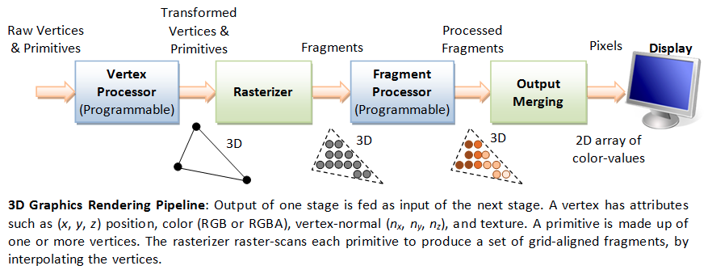
- ***Vertex data is a collection of vertices***. A vertex is a collection of data per 3D coordinate. This vertex's data is represented using vertex attributes that can contain any data we'd like (**3D position and some color value**).
    - In order for OpenGL to know what to make of your collection of coordinates and color values OpenGL requires you to hint what kind of render types you want to form with the data (**GL_POINTS**, **GL_TRIANGLES**, **GL_LINE_STRIP**).
- ***Vertex shader*** that takes as input a single vertex. The main purpose of the vertex shader is to transform 3D coordinates into different 3D coordinates.
- The output of the vertex shader stage is optionally passed to the ***geometry shader***. The geometry shader takes as input a collection of vertices that form a primitive and has the ability to generate other shapes by emitting new vertices to form new (or other) primitive(s).
- ***The primitive assembly*** stage takes as input all the vertices (or vertex if GL_POINTS is chosen) from the vertex (or geometry) shader that form one or more primitives and assembles all the point(s) in the primitive shape given;
- The output of the primitive assembly stage is then passed on to the ***rasterization stage*** where it maps the resulting primitive(s) to the corresponding pixels on the final screen, resulting in fragments for the fragment shader to use. *Before the fragment shaders run, clipping is performed. Clipping discards all fragments that are outside your view, increasing performance* . 
- ***The fragment shader*** is to calculate the final color of a pixel and this is usually the stage where all the advanced OpenGL effects occur. *(like lights, shadows, color of the light and so on)*. 
- ***The final object*** will then pass through one more stage that we call the *alpha test and blending stage*. This stage checks the corresponding depth (and stencil) value of the fragment and uses those to check if ***the resulting fragment is in front or behind other objects and should be discarded accordingly***. The stage also checks for ***alpha values*** (alpha values define the opacity of an object) and blends the objects accordingly.

OpenGL required to define at least a vertex and fragment shader of our own (there are no default vertex/fragment shaders on the GPU)


# Vertex input
- OpenGL only processes 3D coordinates when they're in a specific range between -1.0 and 1.0 on all 3 axes (x, y and z)
- All coordinates within this so called ***normalized device coordinates*** range will end up visible on your screen (and all coordinates outside this region won't). 

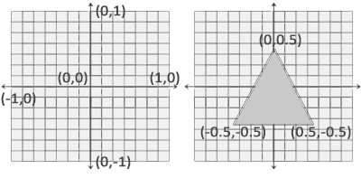

```c
float vertices[] = {
    -0.5f, -0.5f, 0.0f,
     0.5f, -0.5f, 0.0f,
     0.0f,  0.5f, 0.0f
};  
```
- Because OpenGL works in 3D space we render a 2D triangle with each vertex having a z coordinate of 0.0. This way the depth of the triangle remains the same making it look like it's 2D. 

> Normalized Device Coordinates (NDC)

>  Once your vertex coordinates have been processed in the vertex shader, they should be in normalized device coordinates which is a small space where the x, y and z values vary from -1.0 to 1.0. 
> Any coordinates that fall outside this range will be discarded/clipped and won't be visible on your screen. Below you can see the triangle we specified within normalized device coordinates (ignoring the z axis):

> Unlike usual screen coordinates the positive y-axis points in the up-direction and the (0,0) ***coordinates are at the center of the graph***, instead of top-left. Eventually you want all the (transformed) coordinates to end up in this coordinate space, otherwise they won't be visible. 

> Your NDC coordinates will then be transformed to screen-space coordinates via the viewport transform using the data you provided with **glViewport**. 


- The vertex shader. This is done by ***creating memory on the GPU where we store the vertex data, configure how OpenGL should interpret the memory and specify how to send the data to the graphics card***. The vertex shader then processes as much vertices as we tell it to from its memory. 
- ***vertex buffer objects (VBO)*** that can store a large number of vertices in the GPU's memory. The advantage of using those buffer objects is that ***we can send large batches of data all at once to the graphics card***, and keep it there if there's enough memory left, without having to send data one vertex at a time. ***Sending data to the graphics card from the CPU is relatively slow, so wherever we can we try to send as much data as possible at once***. Once the data is in the graphics card's memory the vertex shader has almost instant access to the vertices making it extremely fast.
- This buffer has a unique ID corresponding to that buffer, so we can generate one with a ***buffer ID using the glGenBuffers function*** 
```c 
unsigned int VBO;
glGenBuffers(1, &VBO);  
```
- OpenGL has many types of buffer objects and the buffer type of a vertex buffer object is GL_ARRAY_BUFFER. 
```c 
glBindBuffer(GL_ARRAY_BUFFER, VBO);  
```
- Call to the glBufferData function that copies the previously defined vertex data into the buffer's memory
```c 
glBufferData(GL_ARRAY_BUFFER, sizeof(vertices), vertices, GL_STATIC_DRAW);
```
- The fourth parameter specifies
    - **GL_STREAM_DRAW**: the data is set only once and used by the GPU at most a few times.
    - **GL_STATIC_DRAW**: the data is set only once and used many times.
    - **GL_DYNAMIC_DRAW**: the data is changed a lot and used many times.

- As of now we stored the vertex data within memory on the graphics card as managed by a vertex buffer object named VBO.


# Vertex shader
We need to do is write the vertex shader in the shader language GLSL (OpenGL Shading Language) and then compile this shader so we can use it in our application.

``` c
#version 330 core
layout (location = 0) in vec3 aPos;

void main()
{
    gl_Position = vec4(aPos.x, aPos.y, aPos.z, 1.0);
}
```
Next we declare all the input vertex attributes in the vertex shader with the in keyword. 
We also specifically set the location of the input variable via layout (location = 0)

To set ***the output of the vertex shader we have to assign the position data to the predefined gl_Position variable*** which is a vec4 behind the scenes

## Compiling a shader
``` c
const char *vertexShaderSource = "#version 330 core\n"
    "layout (location = 0) in vec3 aPos;\n"
    "void main()\n"
    "{\n"
    "   gl_Position = vec4(aPos.x, aPos.y, aPos.z, 1.0);\n"
    "}\0";
```

In order for OpenGL to use the shader it has to dynamically compile it at run-time from its source code. The first thing we need to do is ***create a shader object, again referenced by an ID. So we store the vertex shader as an unsigned int and create the shader with glCreateShader***: 
``` c
unsigned int vertexShader;
vertexShader = glCreateShader(GL_VERTEX_SHADER);
```
Next we attach the shader source code to the shader object and compile the shader:
``` c

glShaderSource(vertexShader, 1, &vertexShaderSource, NULL);
glCompileShader(vertexShader);
```

# Fragment shader
The fragment shader is all about calculating the color output of your pixels. 
> Colors in computer graphics are represented as an array of 4 values: the red, green, blue and alpha (opacity) component, commonly abbreviated to RGBA. When defining a color in OpenGL or GLSL we set the strength of each component to a value between 0.0 and 1.0

``` c
#version 330 core
out vec4 FragColor;

void main()
{
    FragColor = vec4(1.0f, 0.5f, 0.2f, 1.0f);
} 

```
The fragment shader only requires one output variable and that is a vector of size 4 that defines the final color output that we should calculate ourselves.

The process for compiling a fragment shader is similar to the vertex shader, although this time we use the GL_FRAGMENT_SHADER constant as the shader type: 

## Shader program
A shader program object is the final linked version of multiple shaders combined. To use the recently compiled shaders we have to link them to a shader program object and then activate this shader program when rendering objects.
``` c
unsigned int shaderProgram;
shaderProgram = glCreateProgram();

glAttachShader(shaderProgram, vertexShader);
glAttachShader(shaderProgram, fragmentShader);
glLinkProgram(shaderProgram);
```
The result is a program object that we can activate by calling glUseProgram with the newly created program object as its argument: 
``` c
glUseProgram(shaderProgram);
```

Don't forget to delete the shader objects once we've linked them into the program object; we no longer need them anymore: 
``` c
glDeleteShader(vertexShader);
glDeleteShader(fragmentShader);  
```

Right now we sent the input vertex data to the GPU and instructed the GPU how it should process the vertex data within a vertex and fragment shader

# Linking Vertex Attributes
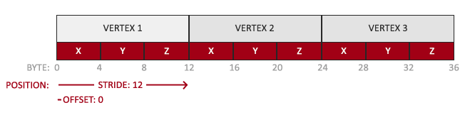

- The position data is stored as 32-bit (4 byte) floating point values.
- Each position is composed of 3 of those values.
- There is no space (or other values) between each set of 3 values. The values are tightly packed in the array.
- The first value in the data is at the beginning of the buffer.

``` c
glVertexAttribPointer(0, 3, GL_FLOAT, GL_FALSE, 3 * sizeof(float), (void*)0);
glEnableVertexAttribArray(0);  
```
- The first parameter specifies which vertex attribute we want to configure. Remember that we specified the location of the position vertex attribute in the vertex shader with layout (location = 0). 
- The next argument specifies the size of the vertex attribute. The vertex attribute is a vec3 so it is composed of 3 values.
- The third argument specifies the type of the data which is GL_FLOAT (a vec* in GLSL consists of floating point values).
- The next argument specifies if we want the data to be normalized. If we're inputting integer data types (int, byte) and we've set this to GL_TRUE, the integer data is normalized to 0 (or -1 for signed data) and 1 when converted to float. This is not relevant for us so we'll leave this at GL_FALSE.
- The fifth argument is known as the stride and tells us the space between consecutive vertex attributes. 
- The last parameter is of type void* and thus requires that weird cast. This is the offset of where the position data begins in the buffer.

## Vertex Array Object
A vertex array object (also known as VAO) can be bound just like a vertex buffer object and any subsequent vertex attribute calls from that point on will be stored inside the VAO.

This has the advantage that when configuring vertex attribute pointers you only have to make those calls once and whenever we want to draw the object, we can just bind the corresponding VAO.

> Core OpenGL requires that we use a VAO so it knows what to do with our vertex inputs. If we fail to bind a VAO, OpenGL will most likely refuse to draw anything. 

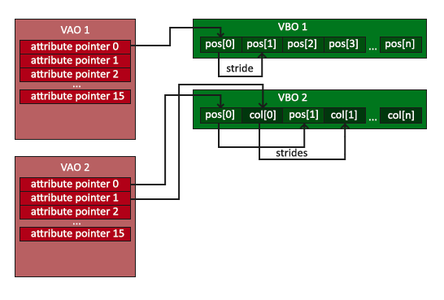

``` c
// 1. bind Vertex Array Object
glBindVertexArray(VAO);
// 2. copy our vertices array in a buffer for OpenGL to use
glBindBuffer(GL_ARRAY_BUFFER, VBO);
glBufferData(GL_ARRAY_BUFFER, sizeof(vertices), vertices, GL_STATIC_DRAW);
// 3. then set our vertex attributes pointers
glVertexAttribPointer(0, 3, GL_FLOAT, GL_FALSE, 3 * sizeof(float), (void*)0);
glEnableVertexAttribArray(0);  

  
[...]

// ..:: Drawing code (in render loop) :: ..
// 4. draw the object
glUseProgram(shaderProgram);
glBindVertexArray(VAO);
someOpenGLFunctionThatDrawsOurTriangle(); 
```

A VAO that stores our vertex attribute configuration and which VBO to use. Usually when you have multiple objects you want to draw, you first generate/configure all the VAOs (and thus the required VBO and attribute pointers) and store those for later use

#  Element Buffer Objects
```c
float vertices[] = {
    // first triangle 
     0.5f,  0.5f, 0.0f,   // top right
     0.5f, -0.5f, 0.0f    // bottom right
    -0.5f,  0.5f, 0.0f,   // top left
    // second triangle
     0.5f, -0.5f, 0.0f,   // bottom right
    -0.5f, -0.5f, 0.0f,   // bottom left
    -0.5f,  0.5f, 0.0f    // top left
};
```

There is some overlap on the vertices specified. We specify bottom right and top left twice! This is an overhead of 50% since the same rectangle could also be specified with only 4 vertices, instead of 6. 

An EBO is a buffer, just like a vertex buffer object, that stores indices that OpenGL uses to decide what vertices to draw.This so called indexed drawing is exactly the solution to our problem

``` c
float vertices[] = {
     0.5f,  0.5f, 0.0f,   // Top right
     0.5f, -0.5f, 0.0f,   // Bottom right
    -0.5f, -0.5f, 0.0f,   // Bottom left
    -0.5f,  0.5f, 0.0f    // Top left
};

unsigned int indices[] {
    0, 1,  3,   // First triangle
    1, 2,  3    // Second triangle
};
```
Only need 4 vertices instead of 6. Next we need to create the element buffer object: 

``` c
unsigned in EBO;
glGenBuffers(1, &EBO);
glBindBuffer(GL_ELEMENT_ARRAY_BUFFER, EBO);
glBufferData(GL_ELEMENT_ARRAY_BUFFER, sizeof(indices), indices, GL_STATIC_DRAW);
glDrawElements(GL_TRIANGLES, 6, GL_UNSIGNED_INT, 0);
```
 - The second argument is the count or number of elements we'd like to draw. We specified 6 indices so we want to draw 6 vertices in total. 
 - The third argument is the type of the indices which is of type GL_UNSIGNED_INT.
 - The last argument allows us to specify an offset in the EBO (or pass in an index array, but that is when you're not using element buffer objects), but we're just going to leave this at 0. 

 - The glDrawElements function takes its indices from the EBO currently bound to the GL_ELEMENT_ARRAY_BUFFER target. It just so happens that a vertex array object also keeps track of element buffer object bindings. The last element buffer object that gets bound while a VAO is bound, is stored as the VAO's element buffer object. Binding to a VAO then also automatically binds that EBO. 
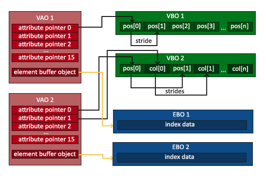

> A VAO stores the glBindBuffer calls when the target is GL_ELEMENT_ARRAY_BUFFER. This also means it stores its unbind calls so make sure you don't unbind the element array buffer before unbinding your VAO, otherwise it doesn't have an EBO configured.

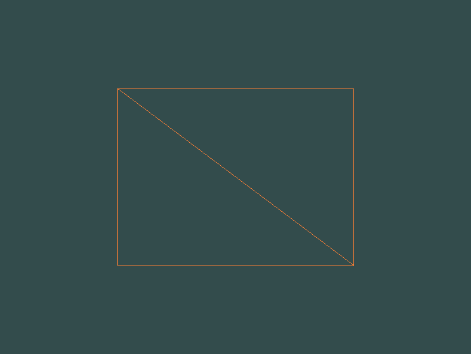


# Shaders

## GLSL
```c
# Version version_number
in type in_variable_name;
in type in_variable_name;

out type out_variable_name;

uniform type uniform_name;

void main() 
{
    // Process inputs

    // Output processed stuff to output variable
    out_variable_name = processed;
}
```

The vertex shader each input variable is also known as a vertex attribute. 
OpenGL guarantees there are always at least 16 4-component vertex attributes available, but some hardware may allow for more which you can retrieve by querying **GL_MAX_VERTEX_ATTRIBS**: 
```c++
int nrAttributes;
glGetIntegerv(GL_MAX_VERTEX_ATTRIBS, &nrAttributes);
sts::cout << "Maximun nr of vertex attributes supported: " << nrAttributes << std::endl;
```
This often returns the minimum of **16** which should be more than enough for most purposes. 

## Types
GLSL also features two container types that we'll be using a lot, namely **vectors** and **matrices**. 

### Vectors
- vecn: the default vector of n floats.
- bvecn: a vector of n booleans.
- ivecn: a vector of n integers.
- uvecn: a vector of n unsigned integers.
- dvecn: a vector of n double components.

GLSL also allows you to use **rgba** for colors or **stpq** for texture coordinates, accessing the same components. 

The vector datatype allows for some interesting and flexible component selection called **swizzling**
``` c
vec2 someVec;
vec4 differentVec = somVec.xyxx;
vec2 vect = vec2(0.5, 0.7);
vec4 = vec4(vect, 0.0, 0.0);
```

### Ins and Outs
Each shader can specify inputs and outputs using those keywords and wherever an output variable matches with an input variable of the next shader stage they're passed along. The vertex and fragment shader differ a bit though. 

The ***vertex shader differs in its input, in that it receives its input straight from the vertex data***. 

To define how the vertex data is organized we specify the input variables with location metadata so we can configure the vertex attributes on the CPU.
 > It is also possible to omit the layout (location = 0) specifier and query for the attribute locations in your OpenGL code via glGetAttribLocation


The other exception is that the ***fragment shader requires a vec4 color output variable***, since the fragment shaders needs to generate a final output color.

So if we want to send data from one shader to the other we'd have to declare an output in the sending shader and a similar input in the receiving shader. ***When the types and the names are equal on both sides OpenGL will link those variables together and then it is possible to send data between shaders*** (this is done when linking a program object). 

Vertex shader: 
``` c
#version 330 core
layout (location = 0) in vec3 aPos; // the position variable has attribute position 0
  
out vec4 vertexColor; // specify a color output to the fragment shader

void main()
{
    gl_Position = vec4(aPos, 1.0); // see how we directly give a vec3 to vec4's constructor
    vertexColor = vec4(0.5, 0.0, 0.0, 1.0); // set the output variable to a dark-red color
}
```

Fragment shader:
``` c
#version 330 core
out vec4 FragColor;
  
in vec4 vertexColor; // the input variable from the vertex shader (same name and same type)  

void main()
{
    FragColor = vertexColor;
} 
```

### Uniforms
***Uniforms are another way to pass data from our application on the CPU to the shaders on the GPU***. Uniforms are however slightly different compared to vertex attributes

 - **Uniforms are global**. Global, meaning that a uniform variable is unique per shader program object, and can be accessed from any shader at any stage in the shader program.
 - Second, whatever you set the uniform value to, uniforms will keep their values until they're either reset or updated. 

``` c
#version 330 core
out vec4 FragColor;
  
uniform vec4 ourColor; // we set this variable in the OpenGL code.

void main()
{
    FragColor = ourColor;
}   

```

``` c
float timeValue = glfwGetTimer();
float greenValue = (sin(timeValue)/2.0f) + 0.5f
int vertexColorLocation = glGetUniformLocation(shaderProgram, "ourColor");
glUseProgram(shaderProgram);
glUniform4f(vertexColorLocatio, 0.0f, greenValue, 0.0f, 1.0f);
```

- Then we query for the location of the ourColor uniform using **glGetUniformLocation**. We supply the shader program and the name of the uniform (that we want to retrieve the location from) to the query function. 
- The uniform value using the **glUniform4f** function. Note that finding the uniform location does not require you to use the shader program first, but updating a uniform does require you to first use the program (by calling glUseProgram), because it sets the uniform on the currently active shader program. 
    - f: the function expects a float as its value.
    - i: the function expects an int as its value.
    - ui: the function expects an unsigned int as its value.
    - 3f: the function expects 3 floats as its value.
    - fv: the function expects a float vector/array as its value.

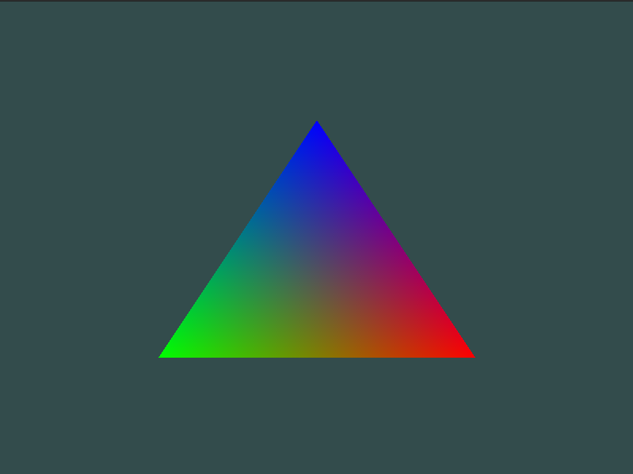


# Textures
A texture is a 2D image (even 1D and 3D textures exist) used to add detail to an object; 

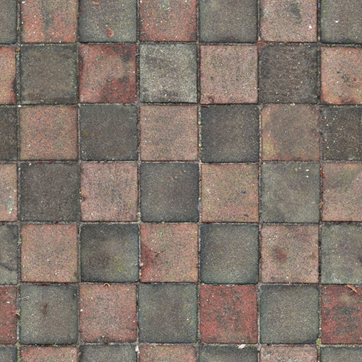

In order to map a texture to the triangle we need to tell each vertex of the triangle which part of the texture it corresponds to. ***Each vertex should thus have a texture coordinate associated with them that specifies what part of the texture image to sample from***. Fragment interpolation then does the rest for the other fragmnts

 ***Texture coordinates start at (0,0) for the lower left corner of a texture image to (1,1) for the upper right corner of a texture image***. The following image shows how we map texture coordinates to the triangle: 
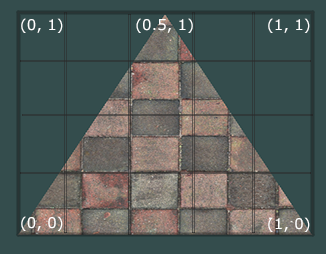

``` c
float textCoords[] {
    0.0f, 0.0f,     // lower-left corner
    1.0f, 0.0f,     // lower-right corner
    0.5f, 1.0f      // top-center corner
};
```

## Texture Wrapping
Texture coordinates usually range from (0,0) to (1,1) but what happens if we specify coordinates outside this range? The default behavior of OpenGL is to repeat the texture images
- GL_REPEAT: The default behavior for textures. Repeats the texture image.
- GL_MIRRORED_REPEAT: Same as GL_REPEAT but mirrors the image with each repeat.
- GL_CLAMP_TO_EDGE: Clamps the coordinates between 0 and 1. The result is that higher coordinates become clamped to the edge, resulting in a stretched edge pattern.
- GL_CLAMP_TO_BORDER: Coordinates outside the range are now given a user-specified border color.
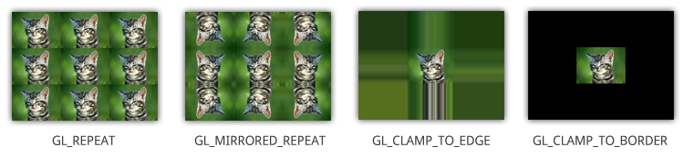

Each of the aforementioned options can be set per coordinate axis (s, t (and r if you're using 3D textures) equivalent to x,y,z) with the glTexParameter* function: 
``` c
glTetxParameteri(GL_TEXTURE_2D, GL_TEXTURE_S, GL_MIRRORED_REPEAT);

glTetxParameteri(GL_TEXTURE_2D, GL_TEXTURE_T, GL_MIRRORED_REPEAT);
```
If we choose the GL_CLAMP_TO_BORDER option we should also specify a border color. This is done using the fv equivalent of the glTexParameter function with GL_TEXTURE_BORDER_COLOR as its option where we pass in a float array of the border's color value: 

``` c
float borderColor[] = {1.0f, 1.0f, 0.0f, 1.0f};
glTextParameterfv(GL_TEXTURE_2D, GL_TEXTURE_BORDER_COLOR, borderColor);
```


## Texture filltering
Texture coordinates do not depend on resolution but can be any floating point value, thus OpenGL has to figure out which texture pixel (also known as a ***texel*** ) to map the texture coordinate to.

There are several options available but for now we'll discuss the most important options: GL_NEAREST and GL_LINEAR. 
- GL_NEAREST (also known as nearest neighbor or point filtering) is the default texture filtering method of OpenGL
- GL_LINEAR (also known as (bi)linear filtering) takes an interpolated value from the texture coordinate's neighboring texels, approximating a color between the texels.
- ***GL_NEAREST results in blocked patterns where we can clearly see the pixels*** that form the texture while ***GL_LINEAR produces a smoother pattern*** where the individual pixels are less visible. 
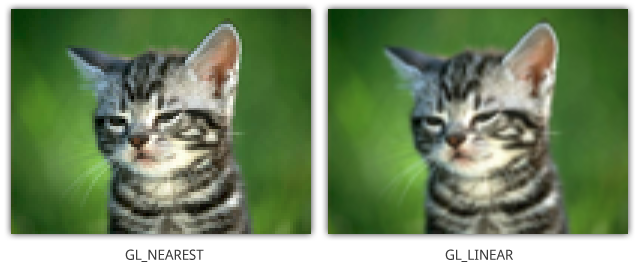

Texture filtering can be set for magnifying and minifying operations (when scaling up or downwards)
``` c
glTextParameteri(GL_TEXTURE_2D, GLTEXTURE_MIN_FILTER, GL_NEAREST);

glTextParameteri(GL_TEXTURE_2D, GLTEXTURE_MAX_FILTER, GL_LINEAR);
```

### MipMaps
Imagine we had a large room with thousands of objects, each with an attached texture. ***There will be objects far away that have the same high resolution texture attached as the objects close to the viewer***.

Since the objects are far away and probably only produce a few fragments, ***OpenGL has difficulties retrieving the right color value for its fragment from the high resolution texture***, since it has to pick a texture color for a fragment that spans a large part of the texture. This will produce visible artifacts on small objects, ***not to mention the waste of memory bandwidth using high resolution textures on small objects***. 

To solve this issue OpenGL uses a concept called ***mipmaps*** that is basically a collection of texture images where each subsequent texture is twice as small compared to the previous one.

The idea behind mipmaps should be easy to understand: after a certain distance threshold from the viewer, ***OpenGL will use a different mipmap texture that best suits the distance to the object***.
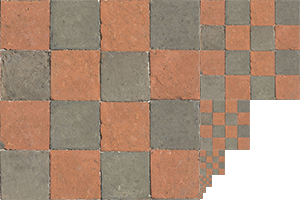
```c
glTexParameteri(GL_TEXTURE_2D, GL_TEXTURE_MIN_FILTER, GL_LINEAR_MIPMAP_LINEAR);
glTexParameteri(GL_TEXTURE_2D, GL_TEXTURE_MAG_FILTER, GL_LINEAR);
```
- GL_NEAREST_MIPMAP_NEAREST: takes the nearest mipmap to match the pixel size and uses nearest neighbor interpolation for texture sampling.
- GL_LINEAR_MIPMAP_NEAREST: takes the nearest mipmap level and samples that level using linear interpolation.
- GL_NEAREST_MIPMAP_LINEAR: linearly interpolates between the two mipmaps that most closely match the size of a pixel and samples the interpolated level via nearest neighbor interpolation.
- GL_LINEAR_MIPMAP_LINEAR: linearly interpolates between the two closest mipmaps and samples the interpolated level via linear interpolation.

## Loading and creating texture
Texture images can be stored in dozens of file formats, each with their own structure and ordering of data, so how do we get those images in our application?

[stb_image.h](https://github.com/nothings/stb/blob/master/stb_image.h) is a very popular single header image loading library by Sean Barrett that is able to load most popular file formats and is easy to integrate in your project(s). 

``` c
#define STB_IMAGE_IMPLEMENTATION
#include "stb_image.h"

int width, height, nrChannels;
unsigned char *data = stbi_load("container.jpg", &width, &height, &nrChannels, 0); 
```

### Generating a texture
``` c
unsigned int texture;
glGenTextures(1, &texture); 
glBindTexture(GL_TEXTURE_2D, texture);  

glTexImage2D(GL_TEXTURE_2D, 0, GL_RGB, width, height, 0, GL_RGB, GL_UNSIGNED_BYTE, data);
glGenerateMipmap(GL_TEXTURE_2D);
```
- The first argument specifies the texture target; setting this to GL_TEXTURE_2D means this operation will generate a texture on the currently bound texture object at the same target (so any textures bound to targets GL_TEXTURE_1D or GL_TEXTURE_3D will not be affected).
- The second argument specifies the mipmap level for which we want to create a texture for if you want to set each mipmap level manually, but we'll leave it at the base level which is 0.
- The third argument tells OpenGL in what kind of format we want to store the texture. Our image has only RGB values so we'll store the texture with RGB values as well.
- The 4th and 5th argument sets the width and height of the resulting texture. We stored those earlier when loading the image so we'll use the corresponding variables.
- The next argument should always be 0 (some legacy stuff).
- The 7th and 8th argument specify the format and datatype of the source image. We loaded the image with RGB values and stored them as chars (bytes) so we'll pass in the corresponding values.
- The last argument is the actual image data.

``` c
unsigned int texture;
glGenTextures(1, &texture);
glBindTexture(GL_TEXTURE_2D, texture);
// set the texture wrapping/filtering options (on the currently bound texture object)
glTexParameteri(GL_TEXTURE_2D, GL_TEXTURE_WRAP_S, GL_REPEAT);	
glTexParameteri(GL_TEXTURE_2D, GL_TEXTURE_WRAP_T, GL_REPEAT);
glTexParameteri(GL_TEXTURE_2D, GL_TEXTURE_MIN_FILTER, GL_LINEAR_MIPMAP_LINEAR);
glTexParameteri(GL_TEXTURE_2D, GL_TEXTURE_MAG_FILTER, GL_LINEAR);
// load and generate the texture
int width, height, nrChannels;
unsigned char *data = stbi_load("container.jpg", &width, &height, &nrChannels, 0);
if (data)
{
    glTexImage2D(GL_TEXTURE_2D, 0, GL_RGB, width, height, 0, GL_RGB, GL_UNSIGNED_BYTE, data);
    glGenerateMipmap(GL_TEXTURE_2D);
}
else
{
    std::cout << "Failed to load texture" << std::endl;
}
stbi_image_free(data);
```

### Applying texture
``` c

float vertices[] = {
    // positions          // colors           // texture coords
     0.5f,  0.5f, 0.0f,   1.0f, 0.0f, 0.0f,   1.0f, 1.0f,   // top right
     0.5f, -0.5f, 0.0f,   0.0f, 1.0f, 0.0f,   1.0f, 0.0f,   // bottom right
    -0.5f, -0.5f, 0.0f,   0.0f, 0.0f, 1.0f,   0.0f, 0.0f,   // bottom left
    -0.5f,  0.5f, 0.0f,   1.0f, 1.0f, 0.0f,   0.0f, 1.0f    // top left 
};

glVertexAttribPointer(2, 2, GL_FLOAT, GL_FALSE, 8 * sizeof(float), (void*)(6 * sizeof(float)));
glEnableVertexAttribArray(2);  
```
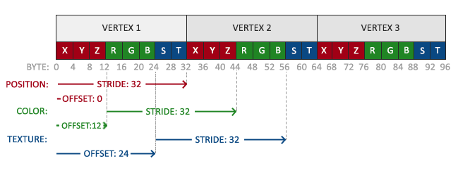

## Texture Units
***The default texture unit for a texture is 0 which is the default active texture unit so we didn't need to assign a location*** in the previous section; 

we can bind to multiple textures at once as long as we activate the corresponding texture unit first. Just like **glBindTexture** we can activate texture units using **glActiveTexture** passing in the texture unit we'd like to use: 
``` c
glActiveTextur(GL_TEXTURE0);
glBindTexture(GL_TEXTURE_2D, texture);
```
> OpenGL should have a ***at least a minimum of 16 texture units*** for you to use which you can activate using GL_TEXTURE0 to GL_TEXTURE15. 


# Transformations
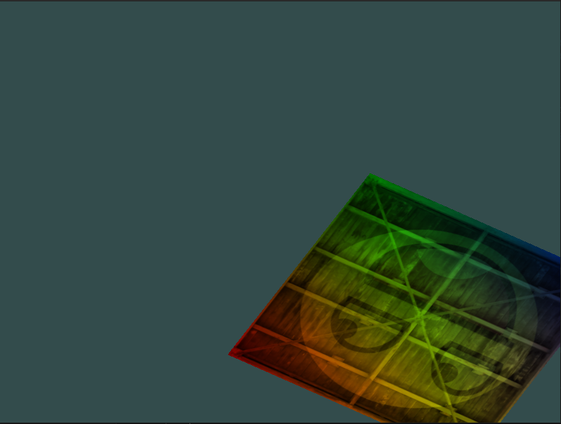

``` c
#include <glm/glm.hpp>
#include <glm/gtc/matrix_transform.hpp>
#include <glm/gtc/type_ptr.hpp>

glm::mat4 trans = glm::mat4(1.0f);
trans = glm::translate(trans, glm::vec3(0.5f, -0.5f, 0.0f));
trans = glm::rotate(trans, (float)glfwGetTime(), glm::vec3(0.0f, 0.0f, 1.0f));

unsigned int transformLoc = glGetUniformLocation(ourShader.ID, "transform");
glUniformMatrix4fv(transformLoc, 1, GL_FALSE, glm::value_ptr(trans));
```

vertex shader:
``` c
#version 330 core
layout (location = 0) in vec3 aPos;
layout (location = 1) in vec2 aTexCoord;

out vec2 TexCoord;
  
uniform mat4 transform;

void main()
{
    gl_Position = transform * vec4(aPos, 1.0f);
    TexCoord = vec2(aTexCoord.x, aTexCoord.y);
} 
```

# Coordinate Systems
Transforming coordinates to NDC is usually accomplished in a step-by-step fashion where we transform an object's vertices to several coordinate systems before finally transforming them to NDC

The advantage of transforming them to several intermediate coordinate systems ***is that some operations/calculations are easier in certain coordinate systems as will soon become apparent***. There are a total of 5 different coordinate systems that are of importance to us: 

 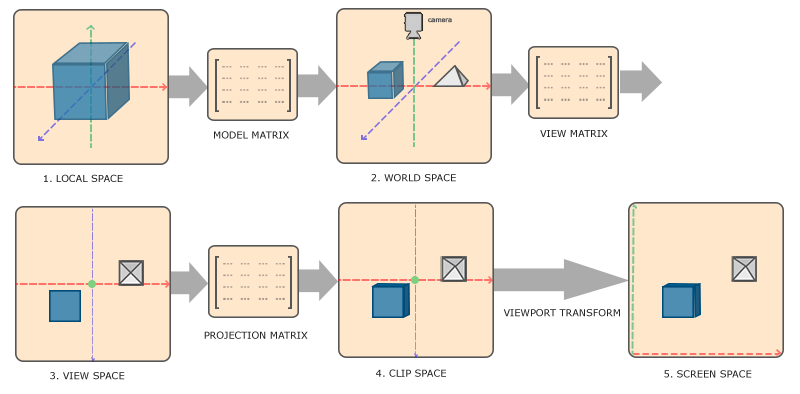

 - Local space (or Object space, the coordinates of your object relative to its local origin)
 - World space (These coordinates are relative to some global origin of the world, together with many other objects also placed relative to this world's origin.)
 - View space (or Eye space, as seen from the camera or viewer's point of view. )
 - Clip space ( Clip coordinates are processed to the -1.0 and 1.0 range and determine which vertices will end up on the screen. )
 - Screen space (viewport transform that transforms the coordinates from -1.0 and 1.0 to the coordinate range defined by glViewport)
    - This viewing box a projection matrix creates is called a **frustum** and each coordinate that ends up inside this frustum will end up on the user's screen
    - The total process to convert coordinates within a specified range to **NDC** that can easily be ***mapped to 2D view-space coordinates is called projection since the projection matrix projects 3D coordinates to the easy-to-map-to-2D normalized device coordinates***. 
    - Once all the vertices are transformed to clip space a final operation called ***perspective division*** is performed where we divide the x, y and z components of the position vectors ***by the vector's homogeneous w component***;
    - We can either create an ***orthographic projection matrix*** or a ***perspective projection matrix***. 

### Orthographic projection
An orthographic projection matrix defines a ***cube-like frustum box*** that defines the clipping space where each vertex outside this box is clipped.

When creating an orthographic projection matrix we specify the ***width, height and length*** of the visible frustum.

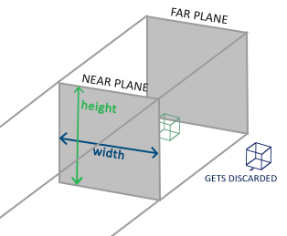

The frustum defines the visible coordinates and is specified by a ***width, a height and a near and far plane***

``` c
glm::ortho(0.0f, 800.0f, 0.0f, 600.0f, 0.1f, 100.0f);
```
- The first two parameters specify the left and right coordinate of the frustum
- The third and fourth parameter specify the bottom and top part of the frustum
- The 5th and 6th parameter then define the distances between the near and far plane. 

### Perspective projection
Each component of the vertex coordinate is divided by its w component giving smaller vertex coordinates the further away a vertex is from the viewer
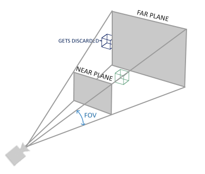
``` c
glm::mat4 proj = glm::perspective(glm::radians(45.0f), (float)width/(float)height, 0.1f, 100.0f);
```
- Its first parameter defines the ***fov*** value, that stands for ***field of view*** and sets how large the viewspace is. For a realistic view it is usually set to 45 degrees.
- The second parameter sets the ***aspect ratio which is calculated by dividing the viewport's width by its height***.
- The third and fourth parameter set the near and far plane of the frustum.

#### Putting it all together
We create a transformation matrix for each of the aforementioned steps: model, view and projection matrix. A vertex coordinate is then transformed to clip coordinates as follows: 

$$V_{\text{clip}} = M_{\text{projection}} \cdot M_{\text{view}} \cdot M_{\text{model}} \cdot V_{\text{local}}$$

The resulting vertex should then be assigned to ***gl_Position*** in the vertex shader and OpenGL will then automatically perform perspective division and clipping. 

## 3D

To start drawing in 3D we'll first create a model matrix. The model matrix consists of translations, scaling and/or rotations we'd like to apply to transform all object's vertices to the ***global world space***.

Let's transform our plane a bit by rotating it on the x-axis so it looks like it's laying on the floor. The model matrix then looks like this: 

``` c
glm::mat4 model = glm::mat4(1.0f);
model = glm::rotate(model, glm::radians(-55.0f), glm::vec3(1.0f, 0.0f, 0.0f)); 
```

By multiplying the vertex coordinates with this model matrix we're transforming the vertex coordinates to world coordinates. Our plane that is slightly on the floor thus represents the plane in the global world. 

Next we need to create a ***view matrix***. We want to move slightly backwards in the scene so the object becomes visible (when in world space we're located at the origin (0,0,0)). To move around the scene, think about the following: 
- To move a camera backwards, is the same as moving the entire scene forward.
> Right-handed system

> By convention, OpenGL is a right-handed system. What this basically says is that the positive x-axis is to your right, the positive y-axis is up and the positive z-axis is backwards. Think of your screen being the center of the 3 axes and the positive z-axis going through your screen towards you. The axes are drawn as follows: 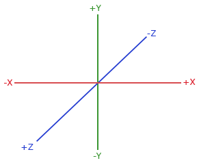

view matrix looks like this: 
``` c
glm::mat4 view = glm::mat4(1.0f);
// note that we're translating the scene in the reverse direction of where we want to move
view = glm::translate(view, glm::vec3(0.0f, 0.0f, -3.0f)); 
```

projection matrix.
``` c
glm::mat4 projection;
projection = glm::perspective(glm::radians(45.0f), 800.0f / 600.0f, 0.1f, 100.0f);
```

vertex shader
``` c
#version 330 core
layout (location = 0) in vec3 aPos;
...
uniform mat4 model;
uniform mat4 view;
uniform mat4 projection;

void main()
{
    // note that we read the multiplication from right to left
    gl_Position = projection * view * model * vec4(aPos, 1.0);
    ...
}
```

main.cpp
``` c
int modelLoc = glGetUniformLocation(ourShader.ID, "model");
glUniformMatrix4fv(modelLoc, 1, GL_FALSE, glm::value_ptr(model));
... // same for View Matrix and Projection Matrix
```

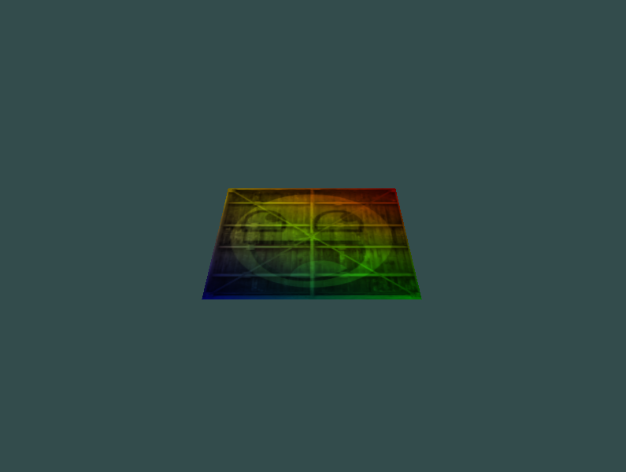

#### Z-buffer
OpenGL stores all its depth information in a z-buffer, also known as a ***depth buffer***.
If the current fragment is behind the other fragment it is discarded, otherwise overwritten. This process is called ***depth testing*** and is done automatically by OpenGL. 
The ***glEnable and glDisable*** functions allow us to enable/disable certain functionality in OpenGL. That functionality is then enabled/disabled until another call is made to disable/enable it. Right now we want to enable depth testing by enabling GL_DEPTH_TEST: 
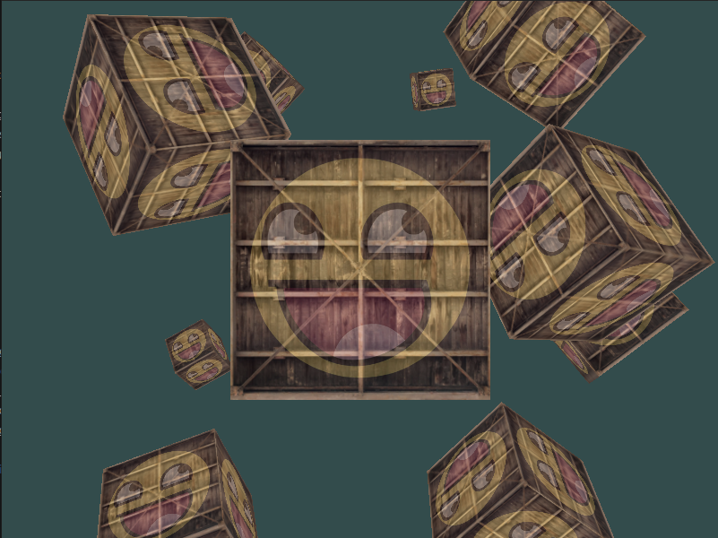


# CAMERA

## Camera/View space

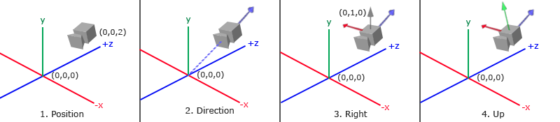

### 1. Camera position
The camera position is a vector in world space that points to the camera's position. 
``` c
glm::vec3 cameraPos = glm::vec3(0.0f, 0.0f, 3.0f); 
```

### 2. Camera direction
Subtracting the camera position vector from the scene's origin vector thus results in the direction vector we want.

***For the view matrix's coordinate system we want its z-axis to be positive*** and because by convention (in OpenGL) the camera points towards the negative z-axis we want to negate the direction vector. If we switch the subtraction order around we now get a vector pointing towards the camera's positive z-axis: 
``` c
glm::vec3 cameraTarget = glm::vec3(0.0f, 0.0f, 0.0f);
glm::vec3 cameraDirection = glm::normalize(cameraPos - cameraTarget);
```

### 3. Right axis
Right vector that represents the positive x-axis of the camera space. 

To get the right vector we use a little trick by first specifying an up vector that points upwards (in world space). Then we do a cross product on the up vector and the direction vector from step 2.

Since the result of a cross product is a vector perpendicular to both vectors, we will get a vector that points in the positive x-axis's direction.

``` c
glm::vec3 up = glm::vec3(0.0f, 1.0f, 0.0f); 
glm::vec3 cameraRight = glm::normalize(glm::cross(up, cameraDirection));
```

### 4. Up axis
Now that we have both the x-axis vector and the z-axis vector, retrieving the vector that points to the camera's positive y-axis is relatively easy: we take the cross product of the right and direction vector: 
``` c
glm::vec3 cameraUp = glm::cross(cameraDirection, cameraRight);
```
## Look At
A great thing about matrices is that if you define a coordinate space using 3 perpendicular (or non-linear) axes you can create a matrix with those 3 axes plus a translation vector and you can transform any vector to that coordinate space by multiplying it with this matrix. 
$$LookAt = \text{Matrix}_{Rotation} * \text{Matrix}_{Translation}$$

$$LookAt = \begin{bmatrix} R_x & R_y & R_z & 0 \\ U_x & U_y & U_z & 0 \\ D_x & D_y & D_z & 0 \\ 0 & 0 & 0 & 1 \end{bmatrix} * \begin{bmatrix} 1 & 0 & 0 & -P_x \\ 0 & 1 & 0 & -P_y \\ 0 & 0 & 1 & -P_z \\ 0 & 0 & 0 & 1 \end{bmatrix}$$


- R is the right vector
- U is the up vector
- D is the direction vector  
- P is the camera's position vector

Using this ***LookAt matrix as our view matrix effectively transforms all the world coordinates to the view space*** we just defined. The LookAt matrix then does exactly what it says: it creates a view matrix that looks at a given target. 

GLM already does all this work for us. We only have to specify a ***camera position, a target position and a vector that represents the up vector in world space*** (the up vector we used for calculating the right vector). GLM then creates the LookAt matrix that we can use as our view matrix: 

``` c
glm::mat4 view;
view = glm::lookAt(glm::vec3(0.0f, 0.0f, 3.0f), 
  		   glm::vec3(0.0f, 0.0f, 0.0f), 
  		   glm::vec3(0.0f, 1.0f, 0.0f));
```

We use a little bit of trigonometry to create an x and z coordinate each frame that represents a point on a circle and we'll use these for our camera position. By re-calculating the x and y coordinate over time we're traversing all the points in a circle and thus the camera rotates around the scene. We enlarge this circle by a pre-defined radius and create a new view matrix each frame using GLFW's glfwGetTime function: 

``` c
const float radius = 10.0f;
float camX = sin(glfwGetTime()) * radius;
float camZ = cos(glfwGetTime()) * radius;
glm::mat4 view;
view = glm::lookAt(glm::vec3(camX, 0.0, camZ), glm::vec3(0.0, 0.0, 0.0), glm::vec3(0.0, 1.0, 0.0)); 
```

## Walk around
``` c
glm::vec3 cameraPos   = glm::vec3(0.0f, 0.0f,  3.0f);
glm::vec3 cameraFront = glm::vec3(0.0f, 0.0f, -1.0f);
glm::vec3 cameraUp    = glm::vec3(0.0f, 1.0f,  0.0f);

view = glm::lookAt(cameraPos, cameraPos + cameraFront, cameraUp);
```
- First we set the camera position to the previously defined cameraPos.
- The direction is the current position + the direction vector we just defined. 

This ensures that however we move, the camera keeps looking at the target direction. Let's play a bit with these variables by updating the cameraPos vector when we press some keys. 

``` c
void processInput(GLFWwindow *window)
{
    ...
    const float cameraSpeed = 0.05f; // adjust accordingly
    if (glfwGetKey(window, GLFW_KEY_W) == GLFW_PRESS)
        cameraPos += cameraSpeed * cameraFront;
    if (glfwGetKey(window, GLFW_KEY_S) == GLFW_PRESS)
        cameraPos -= cameraSpeed * cameraFront;
    if (glfwGetKey(window, GLFW_KEY_A) == GLFW_PRESS)
        cameraPos -= glm::normalize(glm::cross(cameraFront, cameraUp)) * cameraSpeed;
    if (glfwGetKey(window, GLFW_KEY_D) == GLFW_PRESS)
        cameraPos += glm::normalize(glm::cross(cameraFront, cameraUp)) * cameraSpeed;
}
```
> Note that we ***normalize the resulting right vector***. If we wouldn't normalize this vector, the resulting cross product may return differently sized vectors based on the cameraFront variable. If we would not normalize the vector we would move slow or fast based on the camera's orientation instead of at a consistent movement speed. 

### Movement speed
Graphics applications and games usually keep track of a ***deltatime*** variable that stores the time it took to render the last frame.

We then multiply all velocities with this deltaTime value. The result is that when we have a large deltaTime in a frame, meaning that the last frame took longer than average, the velocity for that frame will also be a bit higher to balance it all out.

To calculate the deltaTime value we keep track of 2 global variables: 
``` c
float deltaTime = 0.0f;	// Time between current frame and last frame
float lastFrame = 0.0f; // Time of last frame
```

Within each frame we then calculate the new deltaTime value for later use: 
``` c
float currentFrame = glfwGetTime();
deltaTime = currentFrame - lastFrame;
lastFrame = currentFrame;  
```

Now that we have deltaTime we can take it into account when calculating the velocities: 
``` c
void processInput(GLFWwindow *window)
{
    float cameraSpeed = 2.5f * deltaTime;
    [...]
}
```

## Look around
To look around the scene we have to change the cameraFront vector based on the input of the mouse. 

However, changing the direction vector based on mouse rotations is a little complicated and requires some trigonometry.

### Euler angles
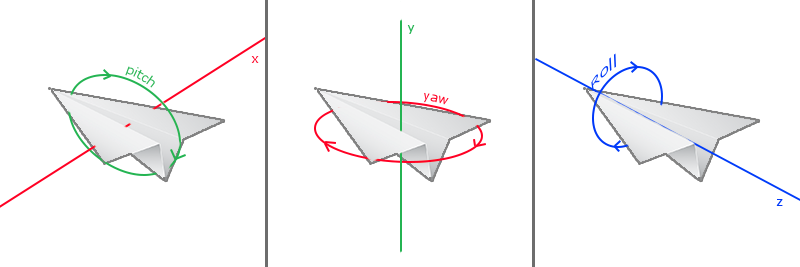
- The pitch is the angle that depicts how much we're looking up or down as seen in the first image. 
- The yaw value which represents the magnitude we're looking to the left or to the right.
- The roll represents how much we roll as mostly used in space-flight cameras.

For our camera system we only care about the ***yaw and pitch values***

 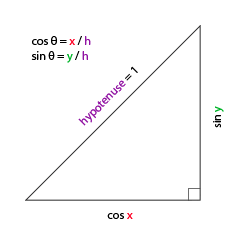

Let's imagine this same triangle, but now looking at it from a top perspective with the adjacent and opposite sides being parallel to the scene's x and z axis (as if looking down the y-axis). 

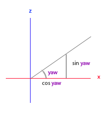
``` c
glm::vec3 direction;
direction.x = cos(glm::radians(yaw)); // Note that we convert the angle to radians first
direction.z = sin(glm::radians(yaw));
```
look at the y axis side as if we're sitting on the xz plane: 
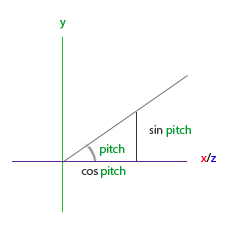
``` c
direction.y = sin(glm::radians(pitch));  
```
However, from the pitch triangle we can also see the xz sides are influenced by cos(pitch) so we need to make sure this is also part of the direction vector. With this included we get the final direction vector as translated from yaw and pitch Euler angles: 

``` c
direction.x = cos(glm::radians(yaw)) * cos(glm::radians(pitch));
direction.y = sin(glm::radians(pitch));
direction.z = sin(glm::radians(yaw)) * cos(glm::radians(pitch));
```

We've set up the scene world so everything's positioned in the direction of the negative z-axis. However, if we look at the x and z yaw triangle we see that a θ of 0 results in the camera's direction vector to point towards the positive x-axis. To make sure the camera points towards the negative z-axis by default we can give the yaw a default value of a 90 degree clockwise rotation. Positive degrees rotate counter-clockwise so we set the default yaw value to: 

``` c
yaw = -90.0f;
```
### Mouse input
The yaw and pitch values are obtained from mouse (or controller/joystick) movement where horizontal mouse-movement affects the yaw and vertical mouse-movement affects the pitch.

The idea is to store the last frame's mouse positions and calculate in the current frame how much the mouse values changed.

Capturing a cursor means that, once the application has focus, the mouse cursor stays within the center of the window 

``` c
glfwSetInputMode(window, GLFW_CURSOR, GLFW_CURSOR_DISABLED);  
```

To calculate the pitch and yaw values we need to tell GLFW to listen to mouse-movement events. 

``` c
void mouse_callback(GLFWwindow* window, double xpos, double ypos);


glfwSetCursorPosCallback(window, mouse_callback);  
```

When handling mouse input for a fly style camera there are several steps we have to take before we're able to fully calculate the camera's direction vector:

1. Calculate the mouse's offset since the last frame.
2. Add the offset values to the camera's yaw and pitch values.
3. Add some constraints to the minimum/maximum pitch values.
4. Calculate the direction vector.

The first step is to calculate the offset of the mouse since last frame.
``` c
float lastX = 400, lastY = 300;
```

Then in the mouse's callback function we calculate the offset movement between the last and current frame: 
``` c
float xoffset = xpos - lastX;
float yoffset = lastY - ypos; // reversed since y-coordinates range from bottom to top
lastX = xpos;
lastY = ypos;

const float sensitivity = 0.1f;
xoffset *= sensitivity;
yoffset *= sensitivity;
```

Next we add the offset values to the globally declared pitch and yaw values: 
``` c
yaw   += xoffset;
pitch += yoffset;  
```

In the third step we'd like to add some constraints to the camera so users won't be able to make weird camera movements (also causes a LookAt flip once direction vector is parallel to the world up direction). The pitch needs to be constrained in such a way that users won't be able to look higher than 89 degrees (at 90 degrees we get the LookAt flip) and also not below -89 degrees. This ensures the user will be able to look up to the sky or below to his feet but not further. 

``` c
if(pitch > 89.0f)
  pitch =  89.0f;
if(pitch < -89.0f)
  pitch = -89.0f;
```

The fourth and last step is to calculate the actual direction vector
``` c
glm::vec3 direction;
direction.x = cos(glm::radians(yaw)) * cos(glm::radians(pitch));
direction.y = sin(glm::radians(pitch));
direction.z = sin(glm::radians(yaw)) * cos(glm::radians(pitch));
cameraFront = glm::normalize(direction);
```

If you'd now run the code you'll notice the camera makes a large sudden jump whenever the window first receives focus of your mouse cursor. 

If it is the first time, we update the initial mouse positions to the new xpos and ypos values. The resulting mouse movements will then use the newly entered mouse's position coordinates to calculate the offsets: 

``` c
if (firstMouse) // initially set to true
{
    lastX = xpos;
    lastY = ypos;
    firstMouse = false;
}
```

The final code:
``` c
void mouse_callback(GLFWwindow* window, double xpos, double ypos)
{
    if (firstMouse)
    {
        lastX = xpos;
        lastY = ypos;
        firstMouse = false;
    }
  
    float xoffset = xpos - lastX;
    float yoffset = lastY - ypos; 
    lastX = xpos;
    lastY = ypos;

    float sensitivity = 0.1f;
    xoffset *= sensitivity;
    yoffset *= sensitivity;

    yaw   += xoffset;
    pitch += yoffset;

    if(pitch > 89.0f)
        pitch = 89.0f;
    if(pitch < -89.0f)
        pitch = -89.0f;

    glm::vec3 direction;
    direction.x = cos(glm::radians(yaw)) * cos(glm::radians(pitch));
    direction.y = sin(glm::radians(pitch));
    direction.z = sin(glm::radians(yaw)) * cos(glm::radians(pitch));
    cameraFront = glm::normalize(direction);
}  
```

### Zoom
As a little extra to the camera system we'll also implement a zooming interface.

Field of view or fov largely defines how much we can see of the scene. When the field of view becomes smaller, the scene's projected space gets smaller. This smaller space is projected over the same NDC, giving the illusion of zooming in

To zoom in, we're going to use the mouse's scroll wheel. Similar to mouse movement and keyboard input we have a callback function for mouse scrolling: 

``` c
void scroll_callback(GLFWwindow* window, double xoffset, double yoffset)
{
    fov -= (float)yoffset;
    if (fov < 1.0f)
        fov = 1.0f;
    if (fov > 45.0f)
        fov = 45.0f; 
}
```
When scrolling, the yoffset value tells us the amount we scrolled vertically. When the scroll_callback function is called we change the content of the globally declared fov variable.

Since 45.0 is the default fov value we want to constrain the zoom level between 1.0 and 45.0. 

``` c
projection = glm::perspective(glm::radians(fov), 800.0f / 600.0f, 0.1f, 100.0f); 

glfwSetScrollCallback(window, scroll_callback); 
```

# Colors
Since now we'll be using light sources we want to display them as visual objects in the scene and add at least one object to simulate the lighting from. 

We'll also be needing a light object to show where the light source is located in the 3D scene.

Because we're also going to render a light source cube, we want to generate a new VAO specifically for the light source. We could render the light source with the same VAO and then do a few light position transformations on the model matrix, but in the upcoming chapters we'll be changing the vertex data and attribute pointers of the container object quite often and we don't want these changes to propagate to the light source object (we only care about the light cube's vertex positions), so we'll create a new VAO: 
``` c
unsigned int lightVAO;
glGenVertexArrays(1, &lightVAO);
glBindVertexArray(lightVAO);
// we only need to bind to the VBO, the container's VBO's data already contains the data.
glBindBuffer(GL_ARRAY_BUFFER, VBO);
// set the vertex attribute 
glVertexAttribPointer(0, 3, GL_FLOAT, GL_FALSE, 3 * sizeof(float), (void*)0);
glEnableVertexAttribArray(0);
```
Light source cube there is one thing left to define and that is the fragment shader for both the container and the light source: 
``` c
#version 330 core
out vec4 FragColor;
  
uniform vec3 objectColor;
uniform vec3 lightColor;

void main()
{
    FragColor = vec4(lightColor * objectColor, 1.0);
}
```

``` c
// don't forget to use the corresponding shader program first (to set the uniform)
lightingShader.use();
lightingShader.setVec3("objectColor", 1.0f, 0.5f, 0.31f);
lightingShader.setVec3("lightColor",  1.0f, 1.0f, 1.0f);
```

The fragment shader of the light source cube ensures the cube's color remains bright by defining a constant white color on the lamp: 
``` c
#version 330 core
out vec4 FragColor;

void main()
{
    FragColor = vec4(1.0); // set all 4 vector values to 1.0
}
```

The light source's location in world-space coordinates: 
``` c
glm::vec3 lightPos(1.2f, 1.0f, 2.0f);
model = glm::mat4(1.0f);
model = glm::translate(model, lightPos);
model = glm::scale(model, glm::vec3(0.2f)); 

lightCubeShader.use();
// set the model, view and projection matrix uniforms
[...]
// draw the light cube object
glBindVertexArray(lightCubeVAO);
glDrawArrays(GL_TRIANGLES, 0, 36);	
```


# Basic Lighting
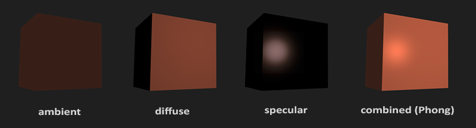

- ***Ambient lighting***: even when it is dark there is usually still some light somewhere in the world (the moon, a distant light) so objects are almost never completely dark. To simulate this we use an ambient lighting constant that always gives the object some color.
- ***Diffuse lighting***: simulates the directional impact a light object has on an object. This is the most visually significant component of the lighting model. The more a part of an object faces the light source, the brighter it becomes.
- ***Specular lighting***: simulates the bright spot of a light that appears on shiny objects. Specular highlights are more inclined to the color of the light than the color of the object.

## Ambient lighting
Light usually does not come from a single light source, but from many light sources scattered all around us, even when they're not immediately visible. 

One of the properties of light is that it can scatter and bounce in many directions, reaching spots that aren't directly visible; light can thus reflect on other surfaces and have an indirect impact on the lighting of an object.

Algorithms that take this into consideration are called ***global illumination algorithms***, but these are complicated and expensive to calculate. 

Adding ambient lighting to the scene is really easy. We take the light's color, multiply it with a small constant ambient factor, multiply this with the object's color, and use that as the fragment's color in the cube object's shader: 

``` c
void main()
{
    float ambientStrength = 0.1;
    vec3 ambient = ambientStrength * lightColor;

    vec3 result = ambient * objectColor;
    FragColor = vec4(result, 1.0);
}  
```
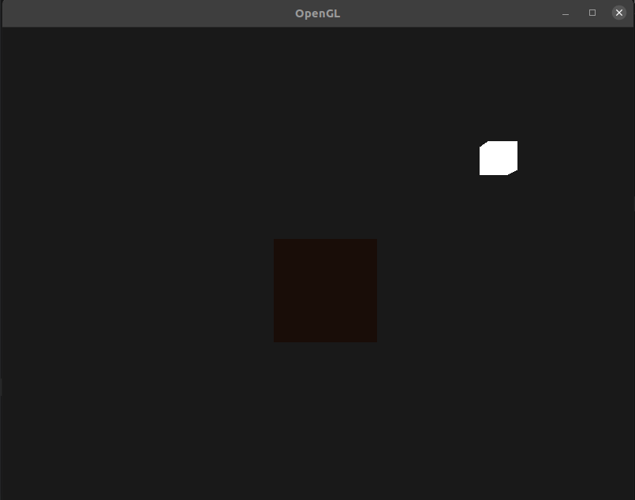


## Diffuse lighting

Diffuse lighting gives the object more brightness the closer its fragments are aligned to the light rays from a light source.

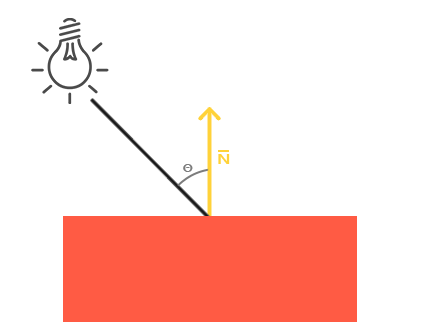

To the left we find a light source with a light ray targeted at a single fragment of our object. 

We need to measure at what angle the light ray touches the fragment. ***If the light ray is perpendicular to the object's surface the light has the greatest impact***. ***To measure the angle between the light ray and the fragment we use something called a normal vector***, that is a vector perpendicular to the fragment's surface

The lower the angle between two unit vectors, the more the dot product is inclined towards a value of 1. When the angle between both vectors is 90 degrees, the dot product becomes 0. The same applies to θ: the larger θ becomes, the less of an impact the light should have on the fragment's color. 
- Normal vector: a vector that is perpendicular to the vertex' surface.
- The directed light ray: a direction vector that is the difference vector between the light's position and the fragment's position. To calculate this light ray we need the light's position vector and the fragment's position vector.

### Normal vectors
A normal vector is a (unit) vector that is perpendicular to the surface of a vertex.

Since a vertex by itself has no surface (it's just a single point in space) we retrieve a normal vector by using its surrounding vertices to figure out the surface of the vertex. 

Since we added extra data to the vertex array we should update the cube's vertex shader: 

``` c
#version 330 core
layout (location = 0) in vec3 aPos;
layout (location = 1) in vec3 aNormal;
...
```

Now that we added a normal vector to each of the vertices and updated the vertex shader we should update the vertex attribute pointers as well. 

Note that the light source's cube uses the same vertex array for its vertex data, but the lamp shader has no use of the newly added normal vectors. We don't have to update the lamp's shaders or attribute configurations, but we have to at least modify the vertex attribute pointers to reflect the new vertex array's size: 

``` c
glVertexAttribPointer(0, 3, GL_FLOAT, GL_FALSE, 6 * sizeof(float), (void*)0);
glEnableVertexAttribArray(0);
```
We only want to use the first 3 floats of each vertex and ignore the last 3 floats so we only need to update the stride parameter to 6 times the size of a float and we're done.

All the lighting calculations are done in the fragment shader so we need to forward the normal vectors from the vertex shader to the fragment shader. Let's do that: 

```
out vec3 Normal;

void main()
{
    gl_Position = projection * view * model * vec4(aPos, 1.0);
    Normal = aNormal;
} 
```

### Calculating the diffuse color
We now have the normal vector for each vertex, but we still need the light's position vector and the fragment's position vector. Since the light's position is a single static variable we can declare it as a uniform in the fragment shader: 

``` c
uniform vec3 lightPos;  
```
And then update the uniform in the render loop (or outside since it doesn't change per frame). 

``` c
lightingShader.setVec3("lightPos", lightPos);   
```

We're going to do all the lighting calculations in world space so we want a vertex position that is in world space first

We can accomplish this by multiplying the vertex position attribute with the model matrix only (not the view and projection matrix) to transform it to world space coordinates

``` c
out vec3 FragPos;  
out vec3 Normal;
  
void main()
{
    gl_Position = projection * view * model * vec4(aPos, 1.0);
    FragPos = vec3(model * vec4(aPos, 1.0));
    Normal = aNormal;
}
```

And lastly add the corresponding input variable to the fragment shader: 
 
``` c
in vec3 FragPos;  
```

This in variable will be interpolated from the 3 world position vectors of the triangle to form the FragPos vector that is the per-fragment world position.

The first thing we need to calculate is the direction vector between the light source and the fragment's position. From the previous section we know that the light's direction vector is the difference vector between the light's position vector and the fragment's position vector. 

``` c
vec3 norm = normalize(Normal);
vec3 lightDir = normalize(lightPos - FragPos);  
```

> When calculating lighting we usually do not care about the magnitude of a vector or their position; we only care about their direction. 


Next we need to calculate the diffuse impact of the light on the current fragment by taking the dot product between the norm and lightDir vectors.  The resulting value is then multiplied with the light's color to get the diffuse component, resulting in a darker diffuse component the greater the angle between both vectors: 
``` c
float diff = max(dot(norm, lightDir), 0.0);
vec3 diffuse = diff * lightColor;
```

If the angle between both vectors is greater than 90 degrees then the result of the dot product will actually become negative and we end up with a negative diffuse component. For that reason we use the max function

Now that we have both an ambient and a diffuse component we add both colors to each other and then multiply the result with the color of the object to get the resulting fragment's output color: 

``` c
vec3 result = (ambient + diffuse) * objectColor;
FragColor = vec4(result, 1.0);
```

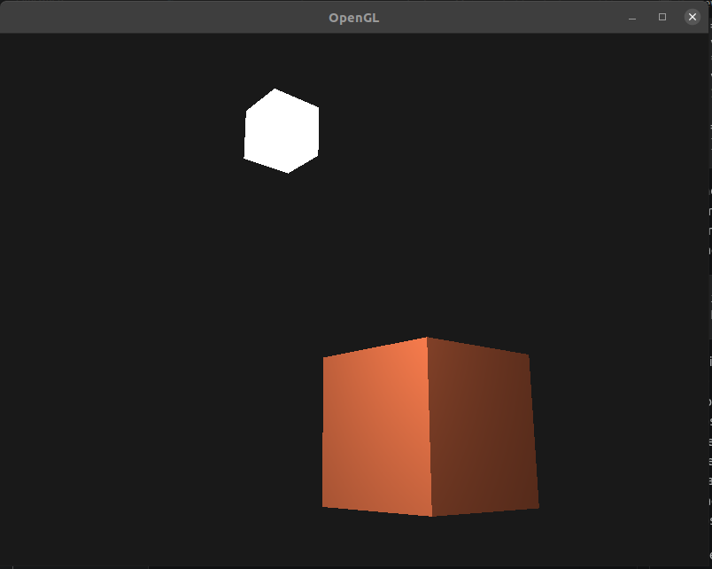

### One last thing
The calculations in the fragment shader are all done in world space, so shouldn't we transform the normal vectors to world space coordinates as well? Basically yes, but it's not as simple as simply multiplying it with a model matrix. 

- First of all, normal vectors are only direction vectors and do not represent a specific position in space. 
- Second, normal vectors do not have a homogeneous coordinate (the w component of a vertex position). This means that translations should not have any effect on the normal vectors. 

Second, if the model matrix would perform a non-uniform scale, the vertices would be changed in such a way that the normal vector is not perpendicular to the surface anymore. 

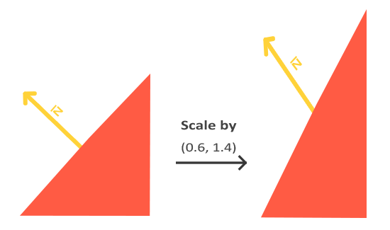

Whenever we apply a non-uniform scale (note: a uniform scale only changes the normal's magnitude, not its direction, which is easily fixed by normalizing it) the normal vectors are not perpendicular to the corresponding surface anymore which distorts the lighting. 

In the vertex shader we can generate the normal matrix by using the inverse and transpose functions in the vertex shader that work on any matrix type. Note that we cast the matrix to a 3x3 matrix to ensure it loses its translation properties and that it can multiply with the vec3 normal vector: 

``` c
Normal = mat3(transpose(inverse(model))) * aNormal;  
```

## Specular Lighting
Similar to diffuse lighting, specular lighting is based on the light's direction vector and the object's normal vectors, but this time it is also based on the view direction 

direction the player is looking at the fragment. Specular lighting is based on the reflective properties of surfaces. If we think of the object's surface as a mirror, the specular lighting is the strongest wherever we would see the light reflected on the surface. 

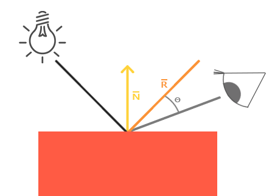

We calculate a reflection vector by reflecting the light direction around the normal vector

Then we calculate the angular distance between this reflection vector and the view direction. The closer the angle between them, the greater the impact of the specular light. The resulting effect is that we see a bit of a highlight when we're looking at the light's direction reflected via the surface. 

The view vector is the one extra variable we need for specular lighting which we can calculate using the viewer's world space position and the fragment's position. Then we calculate the specular's intensity, multiply this with the light color and add this to the ambient and diffuse components. 

> We chose to do the lighting calculations in world space, but most people tend to prefer doing lighting in view space. An advantage of view space is that the viewer's position is always at (0,0,0) so you already got the position of the viewer for free.
> If you still want to calculate lighting in view space you want to transform all the relevant vectors with the view matrix as well (don't forget to change the normal matrix too). 

To get the world space coordinates of the viewer we simply take the position vector of the camera object (which is the viewer of course).

``` c
uniform vec3 viewPos;
```
``` c
lightingShader.setVec3("viewPos", camera.Position); 
```

Now that we have all the required variables we can calculate the specular intensity. First we define a specular intensity value to give the specular highlight a medium-bright color so that it doesn't have too much of an impact: 
``` c
float specularStrength = 0.5;
```

Next we calculate the view direction vector and the corresponding reflect vector along the normal axis: 
``` c
vec3 viewDir = normalize(viewPos - FragPos);
vec3 reflectDir = reflect(-lightDir, norm); 
```

Note that we negate the lightDir vector. The reflect function expects the first vector to point from the light source towards the fragment's position, but the lightDir vector is currently pointing the other way around: from the fragment towards the light source.

To make sure we get the correct reflect vector we reverse its direction by negating the lightDir vector first. The second argument expects a normal vector so we supply the normalized norm vector. 

Then what's left to do is to actually calculate the specular component. This is accomplished with the following formula: 

``` c
float spec = pow(max(dot(viewDir, reflectDir), 0.0), 32);
vec3 specular = specularStrength * spec * lightColor;  
```

We first calculate the dot product between the view direction and the reflect direction (and make sure it's not negative) and then raise it to the power of 32. This 32 value is the shininess value of the highlight. 


``` c
vec3 result = (ambient + diffuse + specular) * objectColor;
FragColor = vec4(result, 1.0);
```

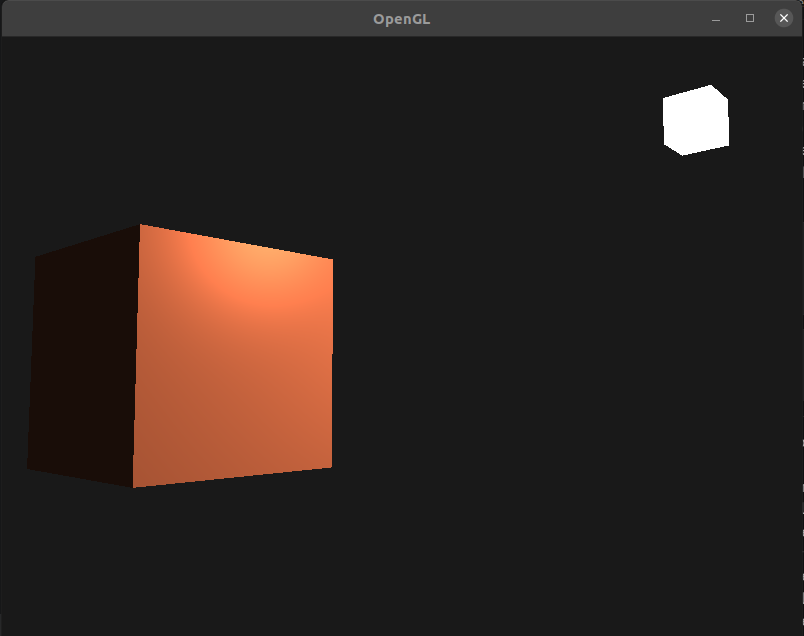

# Materials
- In the real world, each object has a different reaction to light. 
- Steel objects are often shinier than a clay vase 
- Some objects reflect the light without much scattering resulting in small specular highlights and others scatter a lot giving the highlight a larger radius.
- If we want to simulate several types of objects in OpenGL we have to define material properties specific to each surface. 
- When describing a surface we can define a material color for each of the 3 lighting components: ambient, diffuse and specular lighting

``` c
#vesrion 330 core
struct Meterial  {
    vec3 ambient;
    vec3 diffuse;
    vec3 specular;
    float shininess;
};

uniform Material material;
```
- A table as found at [devernay.free.fr](http://devernay.free.fr/cours/opengl/materials.html) shows a list of material properties that simulate real materials found in the outside world. 

## Setting materials

``` c
void main() 
{
    // abmient 
    vec3 ambient = lightColor * material.ambient;

    // diffuse 
    vec3 norm     = normalize(Normal);;
    vec3 lightDir = normalize(lightPos - FragPos);
    float diff    = max(dot(norm, lightDir), 0.0);
    vec3 diffuse  = lightColor * (diff * material.diffuse);

    // specular
    vec3 viewDir     = normalize(viewPos - FragPos);
    vec3 reflectDir  = reflect(-lightDir, norm);
    float spec       = pow(max(dot(viewDir, reflectDir), 0.0), material.shiniess);
    vec3 specular    = lightColor * (spec * material.specular);

    vec3 result = ambient + diffuse + specular;
    FagColor = vec4(result, 1.0);
}
```

Fill the struct we will have to set the individual uniforms
``` c
lightingShader.setVec3("material.ambient", 1.0f, 0.5f, 0.31f);
lightingShader.setVec3("material.diffuse", 1.0f, 0.5f, 0.31f);
lightingShader.setVec3("material.specular", 0.5f, 0.5f, 0.5f);
lightingShader.setFloat("material.shininess", 32.0f);
```

## Light properties
The object is way too bright. The reason for the object being too bright is that the ambient, diffuse and specular colors are reflected with full force from any light source. 

Light sources also have different intensities for their ambient, diffuse and specular components respectively. 

If we'd visualize lightColor as vec3(1.0) the code would look like this: 

``` c
vec3 ambient  = vec3(1.0) * material.ambient;
vec3 diffuse  = vec3(1.0) * (diff * matreial.diffuse);
vec3 specular = vec3(1.0) * (spec * material.specular);
```

These vec3(1.0) values can be influenced individually as well for each light source and this is usually what we want. 

Right now the ambient component of the object is fully influencing the color of the cube. The ambient component shouldn't really have such a big impact on the final color so we can restrict the ambient color by setting the light's ambient intensity to a lower value: 

``` c
vec3 ambient = vec3(0.1) * material.ambient;  
```

We can influence the diffuse and specular intensity of the light source in the same way. 

``` c
struct Light {
    vec3 position;
    vec3 ambient;
    vec3 diffuse;
    vec3 specular;
};

uniform Light light;
```

The diffuse component of a light source is usually set to the exact color we'd like a light to have; often a bright white color. ***The specular component is usually kept at vec3(1.0) shining at full intensity***. Note that we also added the light's position vector to the struct. 

``` c
vec3 ambient  = light.ambient * material.ambient;
vec3 diffuse  = light.diffuse * (diff * material.diffuse);
vec3 specular = light.specular * (spec * material.specular);  
```

Set the light intensities in the application: 
```c
lightingShader.setVec3("light.ambient",  0.2f, 0.2f, 0.2f);
lightingShader.setVec3("light.diffuse",  0.5f, 0.5f, 0.5f); // darken diffuse light a bit
lightingShader.setVec3("light.specular", 1.0f, 1.0f, 1.0f); 
```


# Lighting maps

## Diffuse maps
***What we want is some way to set the diffuse colors of an object for each individual fragment***. Some sort of system where we can retrieve a color value based on the fragment's position on the object? 

Using an image wrapped around an object that we can index for unique color values per fragment. ***In lit scenes this is usually called a diffuse map*** (this is generally how 3D artists call them before PBR) since a texture image represents all of the object's diffuse colors. 

This time however we store the texture as a sampler2D inside the Material struct. We replace the earlier defined vec3 diffuse color vector with the diffuse map. 

> Keep in mind that sampler2D is a so called opaque type which means we ***can't instantiate these types, but only define them as uniforms***. If the struct would be instantiated other than as a uniform (like a function parameter) GLSL could throw strange errors; the same thus applies to any struct holding such opaque types. 

We also ***remove the ambient material color vector since the ambient color is equal to the diffuse color*** anyways now that we control ambient with the light. So there's no need to store it separately: 

``` c
struct Material {
    sampler2D diffuse;
    vec3      specular;
    float     shininess;
}; 
...
in vec2 TexCoords;

```
> If you're a bit stubborn and still want to set the ambient colors to a different value (other than the diffuse value) you can keep the ambient vec3, but then the ambient colors would still remain the same for the entire object. To get different ambient values for each fragment you'd have to use another texture for ambient values alone. 

Note that we are going to need texture coordinates again in the fragment shader, so we declared an extra input variable. Then we simply sample from the texture to retrieve the fragment's diffuse color value: 

``` c
vec3 diffuse = light.diffuse * diff * vec3(texture(material.diffuse, TexCoords));
```

Also, don't forget to set the ambient material's color equal to the diffuse material's color as well: 

``` c
vec3 ambient = light.ambient * vec3(texture(material.diffuse, TexCoords));
```

The updated vertex data
``` c
    float vertices[] = {
        // positions          // normals           // texture coords
        -0.5f, -0.5f, -0.5f,  0.0f,  0.0f, -1.0f,  0.0f, 0.0f,
        ...
    };
```

Update the vertex shader 

```c

#version 330 core
layout (location = 0) in vec3 aPos;
layout (location = 1) in vec3 aNormal;
layout (location = 2) in vec2 aTexCoords;
...
out vec2 TexCoords;

void main()
{
    ...
    TexCoords = aTexCoords;
}  
```

Update the vertex attribute pointers of both VAOs 

``` c
lightingShader.setInt("material.diffuse", 0);
...
glActiveTexture(GL_TEXTURE0);
glBindTexture(GL_TEXTURE_2D, diffuseMap);
```

## Specular maps
You probably noticed that the specular highlight looks a bit odd since the object is a container that mostly consists of wood and wood doesn't have specular highlights like that.

We can fix this by setting the specular material of the object to vec3(0.0) but that would mean that the steel borders of the container would stop showing specular highlights as well and steel should show specular highlights.

We would like to control what parts of the object should show a specular highlight with varying intensity. 

We can also use a texture map just for specular highlights. This means we need to generate a black and white (or colors if you feel like it) texture that defines the specular intensities of each part of the object. 
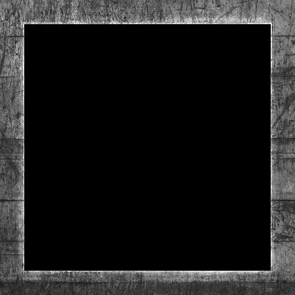

The intensity of the specular highlight comes from the brightness of each pixel in the image. Each pixel of the specular map can be displayed as a color vector where black represents the color vector vec3(0.0) and gray the color vector vec3(0.5)

Because the container mostly consists of wood, and wood as a material should have no specular highlights, the entire wooden section of the diffuse texture was converted to black: black sections do not have any specular highlight. The steel border of the container has varying specular intensities with the steel itself being relatively susceptible to specular highlights while the cracks are not. 

### Sampling specular maps
Texture sampler in the same fragment shader we have to use a different texture unit for the specular map so let's bind it to the appropriate texture unit before rendering: 

``` c
lightingShader.setInt("material.specular", 1);
...
glActiveTexture(GL_TEXTURE1);
glBindTexture(GL_TEXTURE_2D, specularMap);  

```
Then update the material properties of the fragment shader to accept a sampler2D as its specular component instead of a vec3: 

``` c
struct Material {
    sampler2D diffuse;
    sampler2D specular;
    float     shininess;
}; 
```

And lastly we want to sample the specular map to retrieve the fragment's corresponding specular intensity: 

``` c
vec3 ambient  = light.ambient  * vec3(texture(material.diffuse, TexCoords));
vec3 diffuse  = light.diffuse  * diff * vec3(texture(material.diffuse, TexCoords));  
vec3 specular = light.specular * spec * vec3(texture(material.specular, TexCoords));
FragColor = vec4(ambient + diffuse + specular, 1.0);  
```
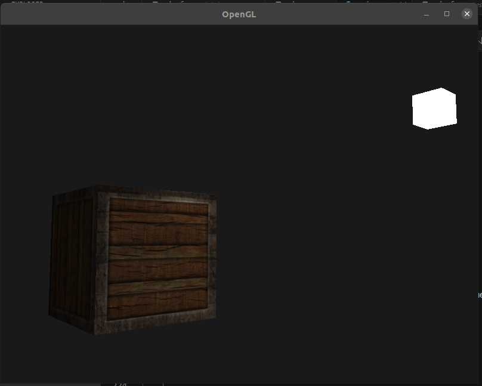


# Light casters

A light source that casts light upon objects is called a light caster. 

## Directional Light
When a light source is far away the light rays coming from the light source are close to parallel to each other. It looks like all the light rays are coming from the same direction, regardless of where the object and/or the viewer is. When a light source is modeled to be infinitely far away it is called a directional light since all its light rays have the same direction; it is independent of the location of the light source. 

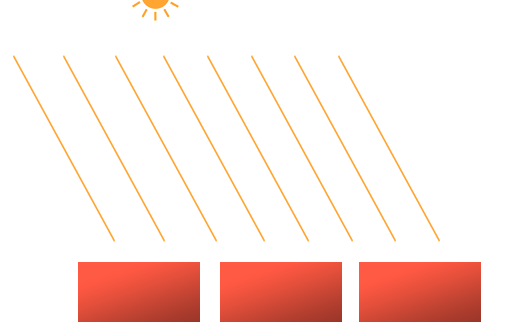

We can model such a directional light by defining a light direction vector instead of a position vector. The shader calculations remain mostly the same except this time we directly use the light's direction vector instead of calculating the lightDir vector using the light's position vector: 
``` c
struct Light {
    // vec3 position; // no longer necessary when using directional lights.
    vec3 direction;
  
    vec3 ambient;
    vec3 diffuse;
    vec3 specular;
};
[...]
void main()
{
  vec3 lightDir = normalize(-light.direction);
  [...]
}
```
Negate the light.direction vector. The lighting calculations we used so far expect the light direction to be a direction from the fragment towards the light source. *** it's now a direction vector pointing towards the light source.***

The resulting lightDir vector is then used as before in the diffuse and specular computations. 


The light source 
``` c
lightingShader.setVec3("light.direction", -0.2f, -1.0f, -0.3f); 	
```

>  Direction vectors can then be represented as: vec4(-0.2f, -1.0f, -0.3f, 0.0f). This can also function as an easy check for light types: you could check if the w component is equal to 1.0 to see that we now have a light's position vector and if w is equal to 0.0 we have a light's direction vector; so adjust the calculations based on that:
```c
if(lightVector.w == 0.0) // note: be careful for floating point errors
  // do directional light calculations
else if(lightVector.w == 1.0)
  // do light calculations using the light's position (as in previous chapters)  

```
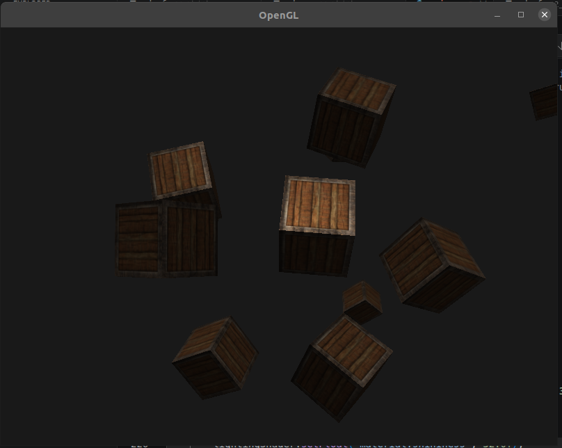


## Point lights
Directional lights are great for global lights that illuminate the entire scene, but we usually also want several point lights scattered throughout the scene. A point light is a light source with a given position somewhere in a world that illuminates in all directions, where the light rays fade out over distance. Think of light bulbs and torches as light casters that act as a point light. 


### Attenuation

To reduce the intensity of light over the distance a light ray travels is generally called attenuation. 

$$F_{att} = \frac{1.0}{K_c + K_l * d + K_q * d^2}$$

- $d$ represents the distance from the fragment to the light source.
- $K_c$: constant  
- $K_l$: linear 
- $K_q$: quadratic

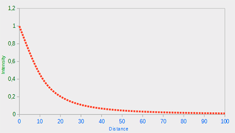

#### Choosing the right values
These values are good starting points for most lights, with courtesy of [Ogre3D's wiki](www.ogre3d.org/tikiwiki/tiki-index.php?page=-Point+Light+Attenuation): 

### Implementing attenuation
```c
struct Light {
    vec3 position;  
  
    vec3 ambient;
    vec3 diffuse;
    vec3 specular;
	
    float constant;
    float linear;
    float quadratic;
}; 
```

The light to cover a distance of 50 

``` c
lightingShader.setFloat("light.constant",  1.0f);
lightingShader.setFloat("light.linear",    0.09f);
lightingShader.setFloat("light.quadratic", 0.032f);	    

```

Implementing attenuation in the fragment shader is relatively straightforward: we simply calculate an attenuation value based on the equation and multiply this with the ambient, diffuse and specular components

We do need the distance to the light source for the equation to work though. 

``` c
float distance    = length(light.position - FragPos);
float attenuation = 1.0 / (light.constant + light.linear * distance + 
    		    light.quadratic * (distance * distance))
```

``` c
ambient  *= attenuation; 
diffuse  *= attenuation;
specular *= attenuation;   
```


## Spotlight
A spotlight is a light source that is located somewhere in the environment that, instead of shooting light rays in all directions, only shoots them in a specific direction. The result is that only the objects within a certain radius of the spotlight's direction are lit and everything else stays dark.


- LightDir: the vector pointing from the fragment to the light source.
- SpotDir: the direction the spotlight is aiming at.
- Phi $\phi$: the cutoff angle that specifies the spotlight's radius. Everything outside this angle is not lit by the spotlight.
- Theta $\theta$: the angle between the LightDir vector and the SpotDir vector. The θ value should be smaller than Φ to be inside the spotlight.  $\phi$ ($\theta < \phi$).

### Flashlight
A flashlight is a spotlight located at the viewer's position and usually aimed straight ahead from the player's perspective. A flashlight is basically a normal spotlight, but with its position and direction continually updated based on the player's position and orientation. 

``` c
struct Light {
    vec3  position;
    vec3  direction;
    float cutOff;
    ...
};    

```

Next we pass the appropriate values to the shader: 

``` c

lightingShader.setVec3("light.position",  camera.Position);
lightingShader.setVec3("light.direction", camera.Front);
lightingShader.setFloat("light.cutOff",   glm::cos(glm::radians(12.5f)));
```

As you can see we're not setting an angle for the cutoff value but calculate the cosine value based on an angle and pass the cosine result to the fragment shader. 

The reason for this is that in the fragment shader we're calculating ***the dot product between the LightDir and the SpotDir vector and the dot product returns a cosine value and not an angle***; and we can't directly compare an angle with a cosine value. 

To get the angle in the shader we then have to calculate the inverse cosine of the dot product's result which is an ***expensive operation.***

Now what's left to do is calculate the theta θ value and compare this with the cutoff ϕ value to determine if we're in or outside the spotlight: 

``` c
float theta = dot(lightDir, normalize(-light.direction));
    
if(theta > light.cutOff) 
{       
  // do lighting calculations
}
else  // else, use ambient light so scene isn't completely dark outside the spotlight.
  color = vec4(light.ambient * vec3(texture(material.diffuse, TexCoords)), 1.0);

```
> That is right, but don't forget angle values are represented as cosine values and an angle of 0 degrees is represented as the cosine value of 1.0 while an angle of 90 degrees is represented as the cosine value of 0.0 as you can see here:


### Smooth/Soft edges

To create the effect of a smoothly-edged spotlight we want to simulate a spotlight having an inner and an outer cone. We can set the inner cone as the cone defined in the previous section, but we also want an outer cone that gradually dims the light from the inner to the edges of the outer cone. 

To create an outer cone we simply define another cosine value that represents the angle between the spotlight's direction vector and the outer cone's vector (equal to its radius)

Then, if a fragment is between the inner and the outer cone it should calculate an intensity value between 0.0 and 1.0. If the fragment is inside the inner cone its intensity is equal to 1.0 and 0.0 if the fragment is outside the outer cone. 

We can calculate such a value using the following equation: 

$$I = \frac{\theta - \gamma}{\epsilon}$$

- $\theta$ (Theta)
- $\phi$ (Phi)  Inner Cutoff
- $\gamma$ (Gamma) Outer Cutoff
- $\epsilon$ (Epsilon): is the cosine difference between the inner $\phi$ and the outer cone $\gamma$ ($\epsilon = \phi - \gamma$). 
- The resulting $I$ value is then the intensity of the spotlight at the current fragment. 


``` c
float theta     = dot(lightDir, normalize(-light.direction));
float epsilon   = light.cutOff - light.outerCutOff;
float intensity = clamp((theta - light.outerCutOff) / epsilon, 0.0, 1.0);    
...
// we'll leave ambient unaffected so we always have a little light.
diffuse  *= intensity;
specular *= intensity;
...
````
Note that we use the clamp function that clamps its first argument between the values 0.0 and 1.0. This makes sure the intensity values won't end up outside the [0, 1] range.


