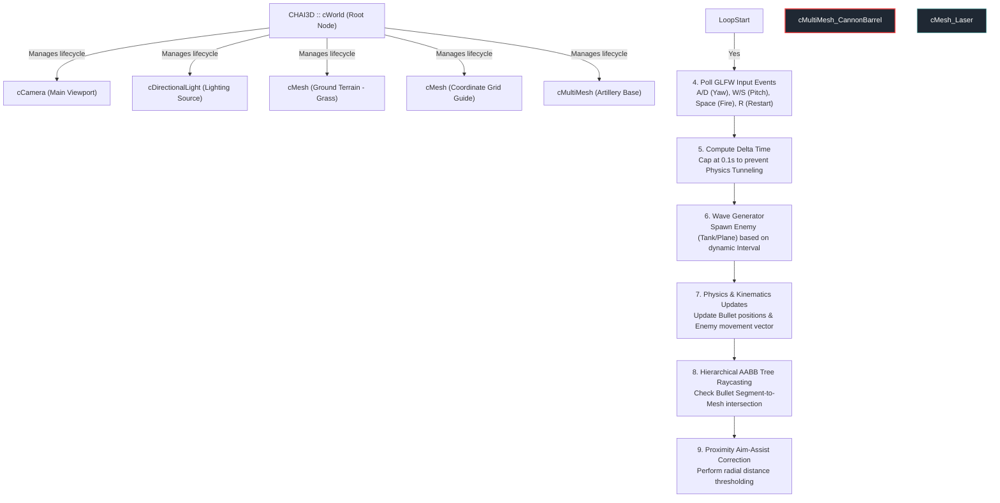
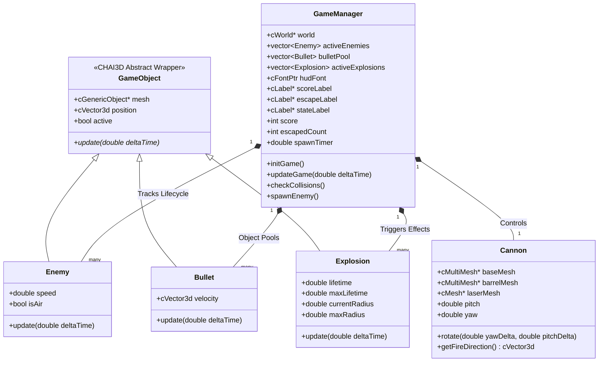
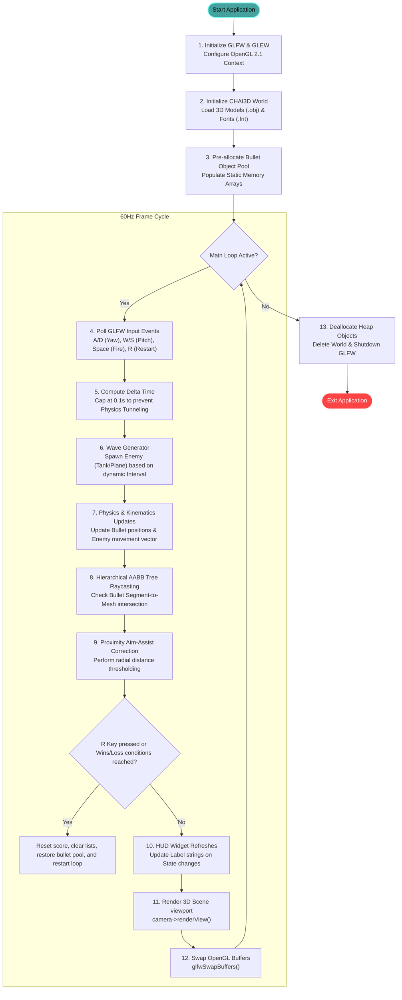
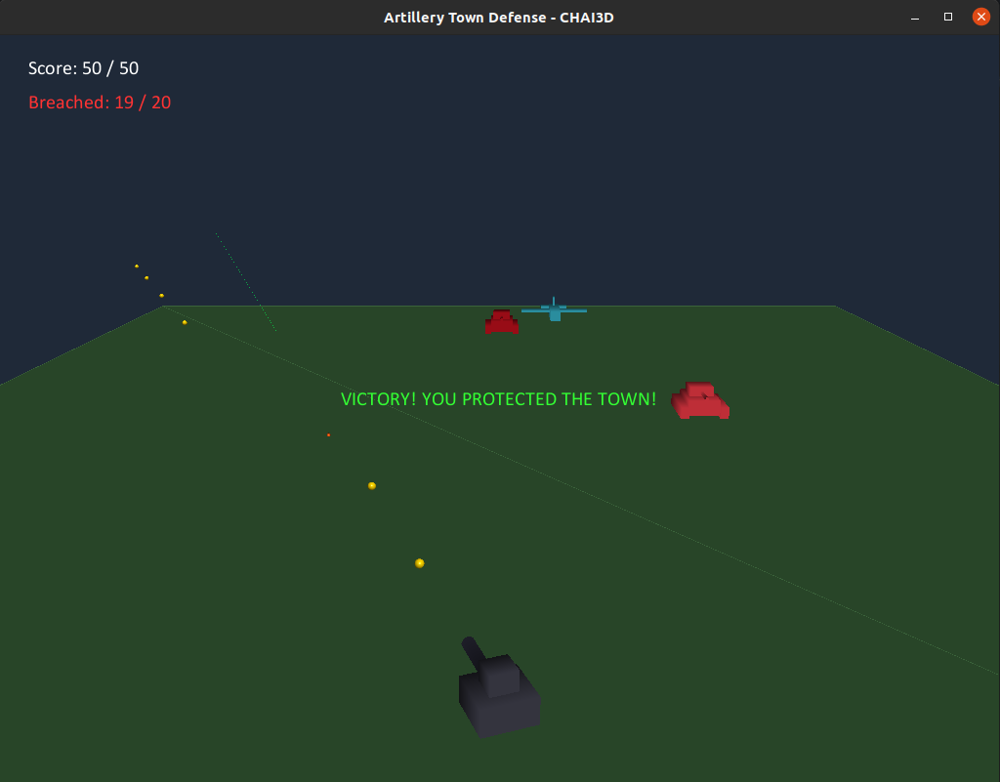
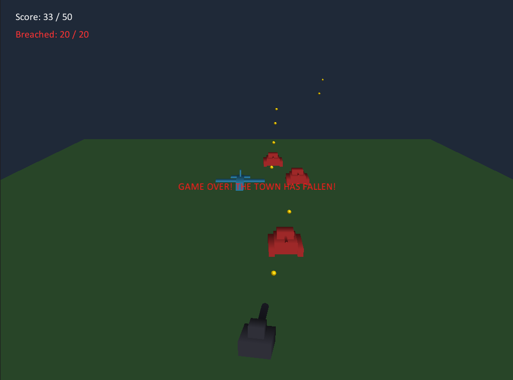

# Artillery Town Defense - Technical Specification & Game Manual

**Artillery Town Defense** is a high-performance, real-time 3D tactical defense simulation built utilizing the **CHAI3D open-source framework** and **OpenGL** (via GLFW/GLEW). This document details the architectural design, directory structure, mathematical foundations, rendering pipelines, spatialized 3D audio, and setup procedures of the system.

https://www.chai3d.org/download/doc/html/overview.html

---

## 1. Project Directory Structure

To compile the project and load asset resources successfully, organize the project directory as shown below. The CMake configuration and resource loaders automatically query paths relative to this tree structure:

```bash
WorkSpace/Program/Robot/
├── Tool/
│   └── chai3d/                    # Root directory of the compiled CHAI3D framework (contains libchai3d.a)
└── OpenGL/
    └── Assignment_2/              # Your game project directory
        ├── CMakeLists.txt         # Configuration file for CMake (version 9 with OpenAL linking)
        ├── models/                # Directory containing 3D mesh assets (.obj)
        │   ├── cannon_base.obj    # Mesh representing the rotating base of the artillery
        │   ├── cannon_barrel.obj  # Mesh representing the elevating gun barrel
        │   ├── plane_enemy.obj    # Mesh model for fast-flying aerial fighters
        │   └── tank_enemy.obj     # Mesh model for slow-moving ground armor
        ├── resources/
        │   ├── fonts/             # HUD phông font family directory
        │   │   ├── calibri-24.fnt # Calibri font definition text file
        │   │   └── calibri-24.png # Calibri glyph atlas texture image
        │   └── sounds/            # Spatial audio sample directory
        │       └── explosion.wav  # Explosion sound effect (PCM 16-bit, Mono WAV)
        └── src/
            └── main.cpp           # Main C++ source file (v17 with instant restart & audio bugfixes)
```

---

## 2. Architectural Design & Class Relationships

This project fully leverages CHAI3D’s hierarchical **Scene Graph** model. Instead of computing global spatial coordinate frames manually, game entities are organized in a parent-child node tree. This enables local coordinate systems to inherit transformations automatically from their parents.

### 2.1 Scene Graph Hierarchy (Tree Structure)


### 2.2 Class Relationships & Structure Diagram
The following class diagram represents how physical properties, behavior routines, and manager patterns are partitioned into object-oriented modules:



---

## 3. Core Game Loop & Processing Pipeline

The game operates on a highly optimized, single-threaded synchronous **Game Loop** backed by GLFW at a target rate of 60Hz.



---

## 4. Mathematical & Programmatic Core Concepts

### 4.1 Euler Angle Rotations (Artillery Yaw and Pitch)
To rotate the artillery base and barrel, we utilize **Extrinsic Euler Angle Rotations** under the $XYZ$ order. 

The Cannon Base is constrained to rotate exclusively around the Z-axis (Yaw, $\theta_{yaw}$), representing azimuthal rotation:
$$R_{base} = R_z(\theta_{yaw}) = \begin{bmatrix} \cos\theta_{yaw} & -\sin\theta_{yaw} & 0 \\ \sin\theta_{yaw} & \cos\theta_{yaw} & 0 \\ 0 & 0 & 1 \end{bmatrix}$$

The Cannon Barrel, parented to the base, rotates around the local Y-axis (Pitch, $\phi_{pitch}$), representing elevation:
$$R_{barrel} = R_y(\phi_{pitch}) = \begin{bmatrix} \cos\phi_{pitch} & 0 & \sin\phi_{pitch} \\ 0 & 1 & 0 \\ -\sin\phi_{pitch} & 0 & \cos\phi_{pitch} \end{bmatrix}$$

In code, this is executed through CHAI3D’s matrix methods:
```cpp
cMatrix3d rotBase, rotBarrel;
rotBase.setExtrinsicEulerRotationDeg(0, 0, barrelYaw, C_EULER_ORDER_XYZ);
cannonBase->setLocalRot(rotBase);

rotBarrel.setExtrinsicEulerRotationDeg(0, barrelPitch, 0, C_EULER_ORDER_XYZ);
cannonBarrel->setLocalRot(rotBarrel);
```

### 4.2 Global Firing Vector Calculation
When launching a projectile, we must calculate the exact direction vector pointing out of the muzzle tip. This is achieved by extracting the rotation columns from the global rotation matrix of the barrel.

The forward-pointing local vector of the cylinder mesh is aligned along the local $X$-axis. Therefore, the first column (Column 0, `getCol0()`) of the barrel's Global Rotation Matrix $R_{global}$ represents its world-space direction vector $\vec{d}_{fire}$:
$$\vec{d}_{fire} = \begin{bmatrix} R_{00} \\ R_{10} \\ R_{20} \end{bmatrix}$$

The bullet’s initial state is programmed as:
*   **Firing Origin**: $\vec{p}_{bullet} = \vec{p}_{barrel\_global} + 1.2 \cdot \vec{d}_{fire}$ (offset to the muzzle tip).
*   **Initial Velocity Vector**: $\vec{v}_{bullet} = 25.0 \cdot \vec{d}_{fire}$ (increased to $25\text{ m/s}$ for improved hit registration).

```cpp
cMatrix3d globalRot = cannonBarrel->getGlobalRot();
cVector3d barrelDirection = globalRot.getCol0(); // Extract local X forward column

b->position = cannonBarrel->getGlobalPos() + barrelDirection * 1.2;
b->velocity = barrelDirection * 25.0; // 25 m/s velocity vector
```

### 4.3 Memory Optimization: Object Pooling
To prevent frame-rate stutters caused by garbage collection and memory fragmentation on the Heap, the project implements an **Object Pool Pattern** for ammunition.

Instead of calling `new cShapeSphere()` and `delete` at runtime:
1.  **Allocation**: A pool of $50$ dormant sphere objects is created in heap memory during `initGame()`.
2.  **Activation**: Firing a projectile requests a dormant bullet, sets its active state to `true`, and enables its renderer: `b.mesh->setEnabled(true)`.
3.  **Recycling**: When a bullet hits a target or flies out of bounds, its active state is toggled to `false`, the mesh renderer is hidden (`setEnabled(false)`), and the memory is retained for the next shot.

```cpp
// Request an available bullet from the pool (O(1) average lookup)
Bullet* getAvailableBullet() {
    for (auto& b : bulletPool) {
        if (!b.active) {
            b.active = true;
            b.mesh->setEnabled(true);
            return &b;
        }
    }
    // Fallback: Expand pool dynamically if completely exhausted
    Bullet b;
    b.mesh = new cShapeSphere(0.08);
    b.mesh->m_material->setYellowGold();
    b.mesh->setEnabled(true);
    b.active = true;
    world->addChild(b.mesh);
    bulletPool.push_back(b);
    return &bulletPool.back();
}
```

### 4.4 Polygon-Level Collision: Hierarchical AABB Tree
For hyper-precise collision detection (especially for custom meshes like complex airplane/tank wings and armor), CHAI3D uses an **Axis-Aligned Bounding Box (AABB) Tree**.

```
             [ Root Bounding Box ]
                   /       \
         [ Box Left ]     [ Box Right ]
          /        \        /        \
     [Leaf1]    [Leaf2]  [Leaf3]   [Leaf4]
```

At each physics update step, we define a line segment $S$ from the bullet’s previous position $\vec{p}_{old}$ to its current position $\vec{p}_{new}$:
$$S(t) = \vec{p}_{old} + t(\vec{p}_{new} - \vec{p}_{old}), \quad t \in [0, 1]$$

CHAI3D recursively traverses the hierarchy tree of the enemy mesh to find intersections with segment $S$, skipping redundant polygon calculations in $O(\log N)$ average time.
```cpp
bool isHit = e.mesh->computeCollisionDetection(posOld, posNew, recorder, settings);
```

### 4.5 Proximity Aim-Assist (Hitbox Assist) Formula
Due to the high velocity of aerial targets, standard polygon collision can feel restrictive. To make gameplay satisfying, an **Aim-Assist** mathematical filter is integrated.

If the raycast segment misses the physical mesh polygon, the system measures the Euclidean distance $D$ between the bullet's current position vector $\vec{p}_{bullet}$ and the enemy's world space center $\vec{p}_{enemy}$:
$$D = \|\vec{p}_{bullet} - \vec{p}_{enemy}\| = \sqrt{(x_b - x_e)^2 + (y_b - y_e)^2 + (z_b - z_e)^2}$$

If $D < \text{Threshold}$ (where $\text{Threshold}_{Air} = 0.95\text{m}$ and $\text{Threshold}_{Ground} = 0.75\text{m}$), the game triggers a hit condition:
```cpp
double dist = (posNew - e.position).length();
double threshold = e.isAir ? 0.95 : 0.75;
if (dist < threshold) { isHit = true; }
```

### 4.6 Explosion Physics (Radius Expansion & Alpha Fading)
Vụ nổ được mô phỏng bằng một khối cầu lửa nở to và mờ dần theo thời gian tồn tại hiện tại $t_{current}$ so với tổng thời gian tối đa $t_{max} = 0.4$ giây:
*   **Normalized Progress Rate ($p$):**
    $$p = \frac{t_{current}}{t_{max}} \in [0.0, 1.0]$$
*   **Spherical Expansion ($R$):**
    $$R(p) = R_{max} \cdot p = 1.0 \cdot p$$
*   **Alpha Transparency Decay ($\alpha$):**
    $$\alpha(p) = 1.0 - p$$

In the graphics updates thread, this is applied dynamically:
```cpp
double progress = exp.lifetime / exp.maxLifetime;
exp.currentRadius = exp.maxRadius * progress;
exp.mesh->setRadius(exp.currentRadius);
exp.mesh->m_material->m_diffuse.setA(1.0f - static_cast<float>(progress)); // Fades out to 0
```

---

## 5. Spatialized 3D Audio System (OpenAL Integration)

This project integrates high-fidelity spatial 3D audio via the **OpenAL** backend supported natively by CHAI3D, giving players acoustic depth perception of battlefield explosions.

### 5.1 Architecture: Listener & Audio Sources
*   **`cAudioDevice` (Sound Listener)**: Replaces standard audio engines. Represents the player's hearing apparatus. Attached directly to `cCamera` so that listener coordinates and heading rotate with player movements.
*   **`cAudioBuffer` (Sound Card Cache)**: Holds loaded uncompressed audio payloads.
*   **`cAudioSource` (Sound Emitters)**: Placed dynamically in 3D world coordinates. When an enemy explodes, the `explosionSource` is tịnh tiến translated to $\vec{p}_{enemy}$, and `play()` is called. 
*   **Distance Falloff**: OpenAL automatically scales audio gain based on the inverse square distance law relative to the camera position ($X = -10.0$). To ensure audible explosions across the $35\text{m}$ field, gain is set to `8.0`:
    ```cpp
    explosionSource->setGain(8.0);
    ```

### 5.2 Wave Format Constraints & Conversion via FFmpeg
The CHAI3D loader (`CFileAudioWAV`) is extremely strict and **only supports uncompressed, PCM 16-bit Mono WAV files**. Stereo files will play as flat 2D audio and cannot be spatialized. If your `explosion.wav` asset does not play, convert it using the `ffmpeg` tool on Linux:
```bash
# Convert any input audio file to PCM 16-bit Mono 44.1kHz WAV
ffmpeg -i explosion.wav -acodec pcm_s16le -ac 1 -ar 44100 resources/sounds/explosion_fixed.wav
mv resources/sounds/explosion_fixed.wav resources/sounds/explosion.wav
```

### 5.3 OpenAL Soft Driver Diagnostics
On Linux (Ubuntu), you can capture real-time driver connections and hardware outputs using the `ALSOFT` debug variable:
```bash
# Run game with verbose level 3 OpenAL logging
ALSOFT_LOGLEVEL=3 ./build/artillery_game
```
*   **Verify**: Look for `Created device "ALSA Software"` or `PulseAudio` in logs to ensure audio routing is correct.

---

## 6. Key Gameplay Features & Visual Guides

*   **Randomized Enemy Colorization (Visual Variety)**: Ground tanks generate with random shades of Crimson, Brick Red, or Burnt Orange. Aerial fighters generate with Cyan, Sky Blue, or Indigo tones.
*   **Coordinate Depth Grid**: Matplotlib-style dark green grid lines on the turf floor provide clear depth perception, helping players gauge distance in the 3D viewport.
*   **Real-time Neon Laser Pointer**: A bright semi-transparent green vector beam extends $40\text{m}$ from the barrel muzzle to provide instant, precise aiming alignment.
*   **Dynamic HUD & Red Alert Alert**: Text colors adapt to risk level. The escape label changes from Yellow to Warning Red when breached enemies reach $\ge 70\%$ of the maximum allowance limit.
*   **Safe Execution Pipeline**: All label updates and GL textures are protected by a GLEW initialization checkpoint, guaranteeing immunity to memory access violations (Segmentation Faults).
*   **Instant Restart System**: Players can trigger a hot reset at any time (or on end-game states) by pressing the **`R`** key. This sweeps active entities, empties arrays, and recycles memory instantly.

---

## 7. Development & Environment Setup (Linux / Ubuntu)

### 7.1 System Prerequisite Libraries
To build and run CHAI3D projects, you must install the following development packages:
```bash
sudo apt-get update
sudo apt-get install -y cmake build-essential libglfw3-dev libglu1-mesa-dev freeglut3-dev libopenal-dev libasound2-dev libusb-1.0-0-dev libglew-dev

sudo apt install libxcursor-dev libxinerama-dev libxrandr-dev libxxf86vm-dev

git clone https://github.com/chai3d/chai3d.git

sudo apt install meshlab
```

### 7.2 Building and Compiling the Project
Navigate to the root directory where `CMakeLists.txt` is located and execute the following terminal commands:
```bash
# 1. Clean previous build caches
rm -rf build

# 2. Configure system with CMake, defining the CHAI3D folder path
cmake -B build -DCHAI3D_DIR=/home/nmc/WorkSpace/Program/Robot/Tool/chai3d -DCMAKE_BUILD_TYPE=Release

# 3. Compile the executable using all available CPU threads
cmake --build build -j$(nproc)
```

### 7.3 Executing the Simulation
Ensure the 3D model resources, fonts, and wav sound assets exist in the project tree before launching:
```bash
./build/artillery_game
```

---

## 8. Controls Guide Reference Table

| Input Key | Action Triggered |
| :--- | :--- |
| **`A` / `Left Arrow`** | Rotate Artillery Base Left (Yaw Increase) |
| **`D` / `Right Arrow`** | Rotate Artillery Base Right (Yaw Decrease) |
| **`W` / `Up Arrow`** | Elevate Barrel Up (Pitch Increase - max $65^{\\circ}$) |
| **`S` / `Down Arrow`** | Depress Barrel Down (Pitch Decrease - min $5^{\\circ}$) |
| **`SPACEBAR`** | Launch Artillery Bullet (Object Pool Retrieval) |
| **`R`** | Instant Reset Game (Wipe fields, reset scores, recycle memory) |



