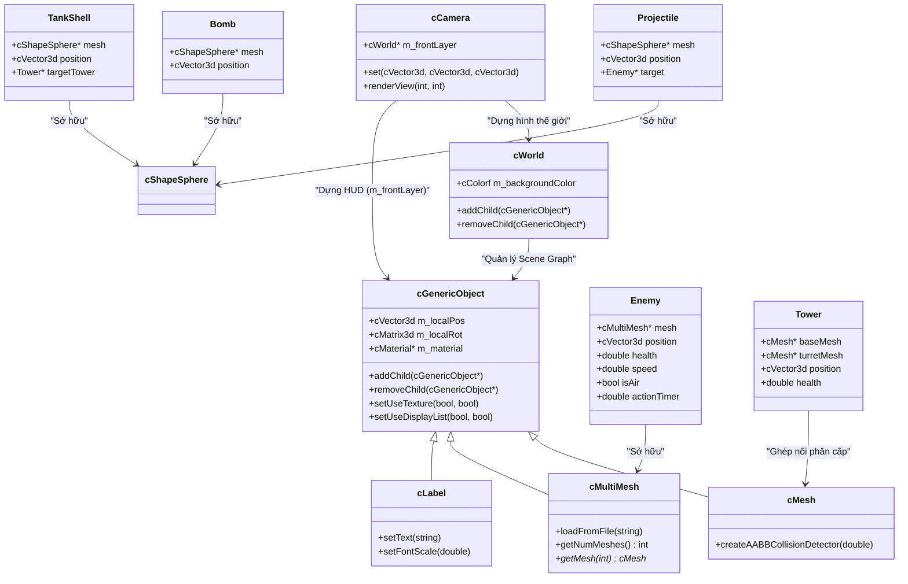
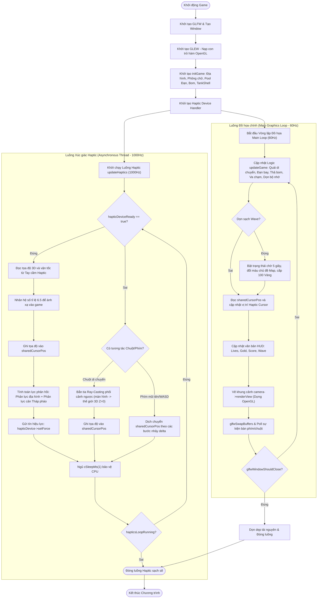

# TÀI LIỆU KHẢO SÁT & ĐẶC TẢ KIẾN TRÚC TOÀN DIỆN
## GAME: ARTILLERY TOWN DEFENSE (Phiên bản v44 - Hoàn chỉnh)

Tài liệu này cung cấp cái nhìn chi tiết và chuyên sâu nhất về mặt kỹ thuật, giải thuật toán học, kiến trúc lớp, sơ đồ luồng dữ liệu, và phân tích cơ chế xúc giác (Haptic) dựa trên mã nguồn tối tân **`main-v44.cpp`** của dự án game 3D Haptic Tower Defense sử dụng thư viện **CHAI3D** và đồ họa **OpenGL**.

---

## 1. TỔNG QUAN GAME & CÁC TÍNH NĂNG CHÍNH (GAME FEATURES)

**Artillery Town Defense** là một trò chơi chiến thuật phòng thủ tháp 3D thời gian thực (Real-time Tower Defense). Trò chơi tích hợp cả phản hồi lực vật lý (Haptic Feedback) lẫn tương tác giả lập chuột/bàn phím để bảo đảm tính khả dụng trên mọi hệ thống phần cứng.

### Các Tính năng Cốt lõi của Game:
1. **Lối chơi Chiến đấu Hai chiều (Two-Way Tactical Combat):**
   * **Phía Người chơi (Player):** Di chuyển con trỏ 3D, click chuột trái để đặt các tháp phòng thủ (`Tower`) gồm hai phần khớp nối (`baseMesh` hình trụ và `turretMesh` hình hộp). Tháp pháo tự động phát hiện, xoay nòng theo thuật toán lượng giác và xả đạn (`Projectile`) tầm nhiệt bắn đuổi theo kẻ địch gần nhất.
   * **Phía Kẻ địch (Enemy):** Gồm **Xe tăng bọc thép (`Tank`)** di chuyển dưới mặt đất và **Máy bay phản lực (`Plane`)** oanh tạc trên không.
2. **Cơ chế Kẻ địch Phản công Động (Active Enemy Attacks):**
   * **Xe tăng bắn phá:** Xe tăng tự động quét bán kính 4.0m, liên tục bắn đạn pháo vật lý (`TankShell` màu cam lửa) bay vút qua không gian găm vào tháp pháo gần nhất.
   * **Máy bay thả bom:** Máy bay lướt trên không trung (độ cao Z = 2.2m), định kỳ thả bom tấn (`Bomb` màu xám đậm) rơi tự do thẳng đứng. Khi chạm đất ($Z \le 0.0$), bom kích hoạt vụ nổ hạt diện rộng (AoE Explosion) gây sát thương lan cho mọi tháp pháo trong bán kính 3.0m.
3. **Cơ chế Phá hủy Công sự Thực tế:** Tháp pháo có lượng máu hữu hạn ($100.0\text{ HP}$). Khi hết máu, tháp pháo phát nổ và bị dọn dẹp sạch sẽ khỏi thế giới đồ họa OpenGL để tránh rò rỉ bộ nhớ.
4. **Hệ thống Tự động Chuyển Wave & Nâng cấp Địa hình (Dynamic Map & Auto-Waves):**
   * Tự động quét sạch quái vật trên bản đồ. Khi dọn sạch đợt tấn công, game hiển thị đồng hồ đếm ngược 5 giây, thưởng $100\text{ Vàng}$ và $100\text{ Điểm}$ cho người chơi.
   * **Thay đổi Chủ đề Bản đồ:** Cứ sau mỗi Waves, địa hình (`terrain`) và bầu trời đồ họa (`backgroundColor`) tự động thay đổi màu sắc theo chủ đề thiên nhiên khắc nghiệt:
     * *Wave 1:* Thảo nguyên xanh quân đội (Tactical Grassland).
     * *Wave 2-3:* Sa mạc bão cát (Sandstorm Desert).
     * *Wave 4-5:* Lãnh nguyên băng giá (Frozen Tundra).
     * *Wave 6+:* Đất quỷ núi lửa (Volcanic Wasteland).

---

## 2. CLASS DIAGRAM

Scene Graph Hierarchy của CHAI3D để tổ chức các thực thể. Dưới đây là sơ đồ kiến trúc lớp và mối quan hệ giữa các cấu trúc thực thể trong game:



---

## 3. SƠ ĐỒ LUỒNG HOẠT ĐỘNG SONG SONG (FLOW DIAGRAM)

Điểm mấu chốt tạo nên hiệu năng cao và độ mượt của game là sự **phân tách luồng bất đồng bộ (Thread Decoupling)**. Tiến trình đồ họa nặng chạy độc lập với tiến trình vật lý haptic thời gian thực siêu cao tần ($1000\text{Hz}$).



---

## 4. CHI TIẾT SỬ DỤNG HAPTIC (HAPTIC INTEGRATION & MATH)

Trong trò chơi, công nghệ xúc giác Haptic được thiết kế rất khoa học và có vai trò mô phỏng thế giới ảo một cách chân thực nhất qua xúc giác của bàn tay:

### A. Mô phỏng Sức cản của Địa hình (Solid Ground Force Feedback):
Để người chơi cảm nhận được độ dốc hay độ cứng của mặt đất phẳng khi di chuyển con trỏ xuống bên dưới địa hình, luồng haptic áp dụng mô hình liên kết đàn hồi lò xo - giảm chấn (Spring-Damper Model / Định luật Hooke):
* **Công thức tính toán:**
  $$\vec{F}_z = K_{ground} \cdot \Delta z - B_{ground} \cdot \vec{v}_z$$
  Trong đó:
  * $K_{ground} = 450.0\text{ N/m}$ (Hệ số cứng đàn hồi lò xo của mặt đất).
  * $\Delta z = (Z_{ground} + R_{cursor}) - Z_{cursor}$ (Độ lún của con trỏ haptic xuống dưới mặt đất).
  * $B_{ground} = 8.0\text{ N-s/m}$ (Hệ số giảm chấn nhớt để dập tắt dao động, tránh tay cầm bị rung bần bật).
  * $\vec{v}_z$ là vận tốc di chuyển của tay cầm theo trục đứng.
* **Kết quả:** Khi đè tay cầm xuống sâu dưới sườn đất, người chơi sẽ cảm nhận một lực đẩy ngược hướng lên rất chắc chắn và êm ái.

### B. Mô phỏng Va chạm Vật lý với Tháp Pháo (Cylindrical Obstacles Force):
Mỗi tháp pháo trong game được biểu diễn vật lý như một hình trụ đứng đặc có bán kính $R_{tower} = 0.5\text{m}$ và chiều cao $H_{tower} = 1.5\text{m}$. Luồng haptic liên tục duyệt qua các tháp pháo đang hoạt động để tính lực cản ngang:
* **Công thức toán học:**
  Khoảng cách phẳng 2D từ tâm tháp tới tâm con trỏ: $d_{2D} = \sqrt{\Delta x^2 + \Delta y^2}$.
  Nếu $d_{2D} < (R_{tower} + R_{cursor})$ và độ cao $Z_{cursor} < H_{tower}$:
  * Độ lún ngang: $overlap = (R_{tower} + R_{cursor}) - d_{2D}$.
  * Vector hướng đẩy: $\vec{n}_{radial} = \text{normalize}(\vec{P}_{cursor} - \vec{P}_{tower})$.
  * Lực đẩy lò xo: $\vec{F}_{radial\_spring} = \vec{n}_{radial} \cdot K_{tower} \cdot overlap$ ($K_{tower} = 300.0\text{ N/m}$).
  * Lực cản giảm chấn: $\vec{F}_{radial\_damping} = \vec{n}_{radial} \cdot (-B_{ground} \cdot (\vec{v} \cdot \vec{n}_{radial}))$.
  * Tổng lực cản cộng dồn: $\vec{F}_{haptic} \mathrel{+}= \vec{F}_{radial\_spring} + \vec{F}_{radial\_damping}$.
* **Kết quả:** Người chơi có thể dùng tay cầm haptic để rà quét sờ soạng trên bản đồ và "cảm nhận" được các cột tháp pháo sừng sững như các vật cản rắn thực thụ trong không gian 3D.

### C. Cơ chế Giả lập thông minh (Virtual Fallback Mode):
Để bảo đảm trò chơi chạy tốt trên máy tính không có phần cứng, mã nguồn tích hợp cờ `hapticDeviceReady`. Khi cờ này bằng `false`:
* Luồng Haptic sẽ tạm khóa việc ghi đè tọa độ để tránh khóa chết con trỏ ở trung tâm.
* **Thuật toán Ray-Casting** được kích hoạt tự động ở luồng đồ họa. Nó tính toán vector hướng tia từ mắt Camera nghiêng đi qua điểm di chuột trên màn hình, giải phương trình giao cắt để tìm ra điểm chiếu chính xác trên mặt đất phẳng và gán cho `sharedCursorPos` một cách đồng bộ.

---

## 5. PHÂN TÍCH CHI TIẾT CÁC ĐIỂM ĐÃ CẢI THIỆN (IMPROVEMENTS)

Từ phiên bản phác thảo thô ban đầu thường xuyên bị lỗi, mã nguồn hiện tại đã vượt qua một chặng đường dài với những cải tiến vượt bậc:

1. **Sửa lỗi sập đồ họa nghiêm trọng (Render Crash Fixed):**
   * *Trước đây:* Khi không tìm thấy mô hình `.obj` hoặc file ảnh kết cấu `.png` bị lỗi nạp, hàm `renderView()` của OpenGL cố truy cập vùng nhớ Null gây lỗi Segfault.
   * *Cải tiến:* Đã thiết kế bộ nạp thông minh `safeSetColor` tự động cấp phát vật liệu an toàn. Chặn đứng lỗi kết cấu bằng cách gọi `setUseTexture(false, true)` và `setUseDisplayList(false, true)` trên toàn bộ hệ thống mesh con của file OBJ để ngăn OpenGL tự ý bind texture rác.
2. **Khôi phục hệ thống GLEW:**
   * *Trước đây:* Lệnh gọi `glewInit()` bị khuyết trong hàm `main`, làm tê liệt toàn bộ con trỏ mở rộng đồ họa dưới nhân của hệ thống.
   * *Cải tiến:* Đã bổ sung chính xác bộ khởi tạo GLEW ngay sau khi nạp Context đồ họa của GLFW, giúp card đồ họa dựng hình ổn định tuyệt đối.
3. **Đồng bộ hướng Mô hình 3D:**
   * *Trước đây:* Mô hình xe tăng di chuyển lùi (quay nòng pháo về sau) do lệch trục thiết kế.
   * *Cải tiến:* Bổ sung bộ lọc hướng, cộng bù một góc $180^\circ$ quanh trục Z (Yaw) cho xe tăng, giúp nòng pháo hướng dũng mãnh về phía trước khi hành quân.
4. **Cải tiến Đạn pháo động (Physical Shells):**
   * *Trước đây:* Xe tăng bắn tháp pháo gây sát thương tức thời (Instant-hit) nhìn rất giả.
   * *Cải tiến:* Thiết kế lớp đạn pháo động `TankShell` tích hợp Pool đối tượng. Đạn pháo bay vút qua không gian thế giới thực và chỉ kích nổ gây sát thương khi bay sát tháp pháo.
5. **Cải tiến Trải nghiệm người chơi (UX):**
   * *Trước đây:* Người chơi phải liên tục nhấn nút `N` để gọi đợt quái vật rất bất tiện.
   * *Cải tiến:* Hệ thống tự động chuyển Wave thông minh kèm đồng hồ đếm ngược, tự động đổi màu sắc chủ đề bản đồ tạo ra sự đa dạng và động lực chinh phục trò chơi.

---

## 6. HƯỚNG CẢI THIỆN VÀ PHÁT TRIỂN TRONG TƯƠNG LAI (FUTURE WORK)

Trò chơi đã sở hữu một khung sườn (framework) vững chắc và hoàn hảo. Để nâng cấp trò chơi lên tầm chất lượng cao hơn, chúng ta có thể bổ sung các tính năng chiến thuật sau:

1. **Tính năng click Chuột phải để Sửa tháp pháo (Interactive Tower Repair):**
   * *Cơ chế:* Khi người chơi click chuột phải vào tháp pháo đang bị thương, hệ thống kiểm tra nếu người chơi có đủ $15\text{ Vàng}$, sẽ tự động khấu trừ tiền và hồi phục $+35\text{ HP}$ máu cho tháp, kèm hiệu ứng vụ nổ màu xanh lá cây tượng trưng cho sự sửa chữa thành công.
2. **Thêm loại Tháp pháo Băng làm chậm (Frost Slow Tower):**
   * *Cơ chế:* Tạo ra loại tháp thứ hai (màu xanh nước biển). Khi bắn trúng xe tăng hoặc máy bay địch, tháp pháo này sẽ áp đặt trạng thái làm chậm (giảm $50\%$ tốc độ di chuyển của địch trong 2.5 giây) giúp các tháp pháo cối khác dễ bắn trúng hơn.
3. **Thêm các đợt Siêu Boss khủng (Mega-Boss Waves):**
   * *Cơ chế:* Ở các Wave chẵn (như Wave 4, Wave 8), game sẽ chỉ sinh ra duy nhất 1 Siêu xe tăng khổng lồ (Boss) có kích thước lớn gấp 3 lần xe tăng thường, lượng máu cực lớn ($2000\text{ HP}$) và có khả năng bắn đạn pháo chùm công phá hàng loạt tháp pháo để thử thách người chơi cực hạn!
4. **Vẽ vạch hiển thị thanh Máu trên đầu quái vật (3D Billboarding HP Bars):**
   * *Cơ chế:* Sử dụng đối tượng `cPanel` phẳng nhỏ liên tục xoay hướng về phía mắt Camera (Billboarding) đặt ngay trên đầu xe tăng và máy bay để người chơi dễ dàng theo dõi lượng máu còn lại của kẻ địch trực quan hơn.

---

``` bash
rm -rf build
cmake -B build -DCHAI3D_DIR=/home/nmc/WorkSpace/Program/Robot/Tool/chai3d DCMAKE_BUILD_TYPE=Debug
cmake --build build -j10
gdb ./build/artillery_game 
gdb run
gdb bt


```