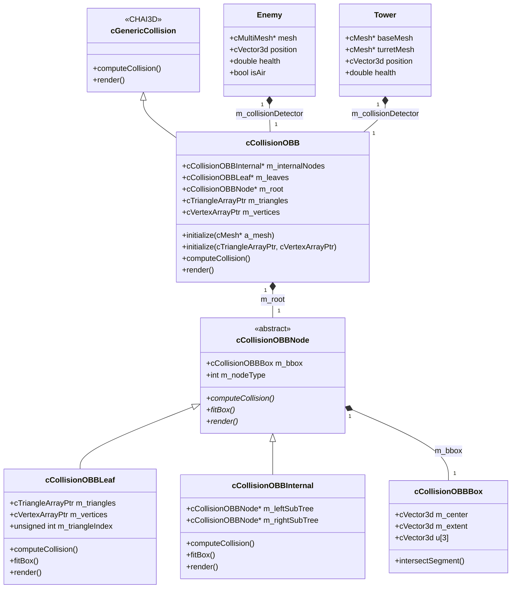
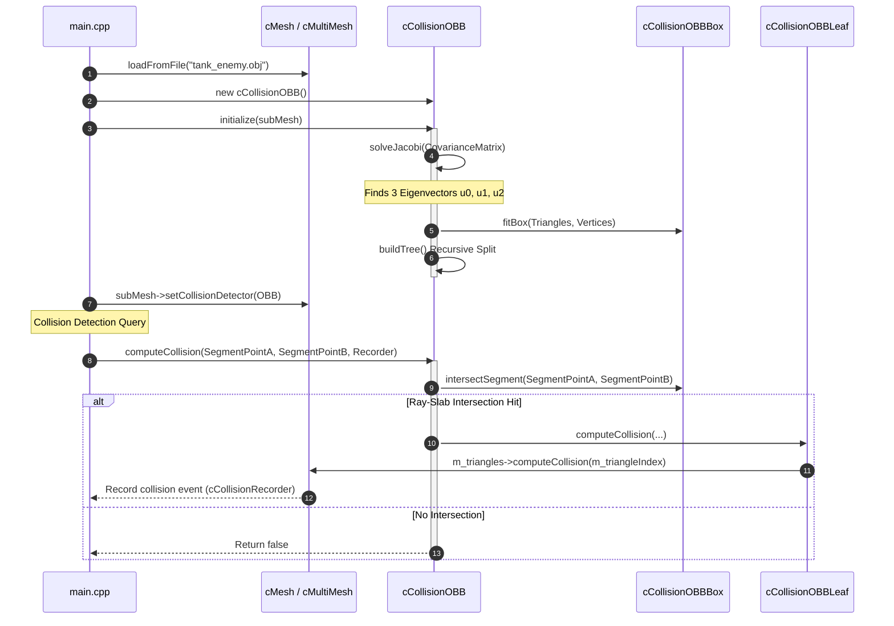
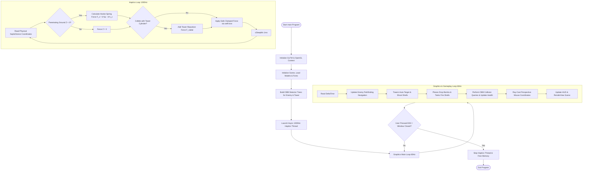

# ARTILLERY TOWN DEFENSE - 3D HAPTIC GAME
## System Architecture, OBB Tree Hierarchy, PCA & Mathematical Specifications


---

## 1. PROJECT OVERVIEW

**Artillery Town Defense** is a 3D real-time tactical tower defense game integrated with high-frequency **Haptic Feedback (1000Hz)** and **OpenGL Graphics (60Hz)**. The project is built on top of **CHAI3D 3.x** and features an advanced **Oriented Bounding Box (OBB) Tree** collision detection system constructed via **Principal Component Analysis (PCA)** and **Jacobi Diagonalization**.

### Key System Capabilities:
* **Tactical 3D Gameplay:** Defense towers with rotating turrets, enemy tanks, air strike planes dropping bombs (`bombPool`), counter-firing tank shells (`tankShellPool`), dynamic wave progression, and level terrain themes (Grassland, Desert, Frozen Tundra, Volcanic Wasteland).
* **Oriented Bounding Box (OBB Tree) BVH:** Tight-fitting bounding volumes built top-down using Gottschalk's continuous surface covariance matrix and Jacobi Eigensolver.
* **1000Hz Asynchronous Haptic Feedback Loop:** Real-time spring-damper haptic forces for ground stiffness, cylindrical tower obstacles, and motor force clamping ($F_{max} = 6.5\text{ N}$).
* **Pixel-Exact 3D Mouse Ray-Casting:** Perspective unprojection algorithm mapping mouse pixels to the $Z = 0$ ground plane without external CHAI3D `selectUnproject` dependencies.

---

## 2. FILE ARCHITECTURE & MODULE RESPONSIBILITIES

| File Name | Module Role | Key Responsibilities & Functions |
| :--- | :--- | :--- |
| **`main.cpp`** | Main Application & Logic Loop | Manages 60Hz graphics rendering, 1000Hz haptic thread, mouse 3D ray-casting, wave state transitions, entity spawning (`Enemy`, `Tower`, `Projectile`, `Bomb`), and OBB detector registration. |
| **`CCollisionOBB.h`** | OBB Tree Header | Declares `cCollisionOBB` hierarchy manager, `cCollisionOBBNode`, `cCollisionOBBInternal`, and `cCollisionOBBLeaf` with full function overloads for CHAI3D `cMesh`. |
| **`CCollisionOBB.cpp`** | OBB & Math Implementation | Implements Gottschalk '96 PCA surface covariance calculation, 3x3 Jacobi Eigensolver (`solveJacobi`), recursive BVH tree splitting (`buildTree`), and OpenGL wireframe rendering. |
| **`CCollisionOBBBox.h`** | OBB Primitive Volume | Defines OBB extent ($e_0, e_1, e_2$), center $C$, orientation axes $u_0, u_1, u_2$, and the 3D **Ray-Slab Interval Intersection** algorithm (`intersectSegment`). |
| **`CMakeLists.txt`** | Build Configuration | Configures C++11 compilation, links CHAI3D, GLFW3, GLEW, OpenGL, `pthread`, and `usb-1.0` (for physical DHD/DRD haptic device USB communication). |

---

## 3. COMPLETE MATHEMATICAL FORMULAS & ALGORITHMS

### 3.1. Gottschalk '96 PCA Continuous Surface Covariance Matrix

To compute the tightest OBB orientation axes for a 3D mesh, we compute the continuous surface covariance matrix $C_{3 \times 3}$ across all mesh triangles rather than just discrete vertices.

#### A. Triangle Area and Surface Centroid:
For a triangle $k$ with vertices $p^k, q^k, r^k$:
$$\text{Area}_k = A_k = \frac{1}{2} \| (q^k - p^k) \times (r^k - p^k) \|$$

Centroid of triangle $k$:
$$\mathbf{m}^k = \frac{p^k + q^k + r^k}{3}$$

Total surface area of all $N$ triangles:
$$A_{total} = \sum_{k=1}^N A_k$$

Global surface centroid $\mathbf{c}$:
$$\mathbf{c} = \frac{1}{A_{total}} \sum_{k=1}^N A_k \mathbf{m}^k$$

#### B. Surface Covariance Matrix $C_{ij}$:
The continuous covariance matrix elements $C_{ij}$ ($i, j \in \{0, 1, 2\}$) are given by:
$$C_{ij} = \frac{1}{A_{total}} \sum_{k=1}^N \frac{A_k}{12} \left[ 9 m_i^k m_j^k + p_i^k p_j^k + q_i^k q_j^k + r_i^k r_j^k \right] - c_i c_j$$

---

### 3.2. Jacobi Diagonalization Method (`solveJacobi`)

The covariance matrix $C_{3 \times 3}$ is real and symmetric. We diagonalize it using Jacobi Givens Rotations:
$$V^T C V = D = \begin{bmatrix} \lambda_0 & 0 & 0 \\ 0 & \lambda_1 & 0 \\ 0 & 0 & \lambda_2 \end{bmatrix}$$

#### A. Angle and Tangent Calculation:
For an off-diagonal element $C_{pq}$ ($p < q$):
$$\tau = \cot(2\theta) = \frac{C_{qq} - C_{pp}}{2 C_{pq}} \iff \tan(2\theta) = \frac{2 C_{pq}}{C_{qq} - C_{pp}}$$

To ensure numerical stability ($|t| \le 1, |\theta| \le \frac{\pi}{4}$), $t = \tan\theta$ is solved via the quadratic formula:
$$t = \frac{\text{sgn}(\tau)}{|\tau| + \sqrt{1 + \tau^2}}$$

#### B. Givens Rotation Parameters:
$$c = \cos\theta = \frac{1}{\sqrt{1 + t^2}}, \quad s = \sin\theta = t \cdot c, \quad \tau_{code} = \tan(\theta/2) = \frac{s}{1 + c}$$

#### C. Catastrophic Cancellation-Free Matrix Updates:
Off-diagonal updates for row/column $j$:
$$x' = x - s(y + x \cdot \tau_{code}), \quad y' = y + s(x - y \cdot \tau_{code})$$

Eigenvalue updates:
$$\lambda_p' = \lambda_p - t \cdot C_{pq}, \quad \lambda_q' = \lambda_q + t \cdot C_{pq}, \quad C_{pq}' = 0.0$$

The columns of $V$ converge to the **3 Eigenvectors** $u_0, u_1, u_2$, which define the OBB local orientation axes!

---

### 3.3. Ray-Slab Method for OBB Segment Intersection (`intersectSegment`)

Given a line segment $P(t) = A + t \cdot d$ with $t \in [0, 1]$, where $d = B - A$:

1. Shift origin to OBB center $C$:
   $$p = A - C$$

2. For each local axis $u_i$ ($i \in \{0, 1, 2\}$):
   $$\text{proj}_d = d \cdot u_i, \quad \text{proj}_p = p \cdot u_i$$

3. Calculate interval intersection bounds $t_1, t_2$:
   $$t_1 = \frac{-e_i - \text{proj}_p}{\text{proj}_d}, \quad t_2 = \frac{e_i - \text{proj}_p}{\text{proj}_d}$$

4. Narrow parameter range $[t_{min}, t_{max}]$:
   $$t_{min} = \max(t_{min}, \min(t_1, t_2)), \quad t_{max} = \min(t_{max}, \max(t_1, t_2))$$

5. **Collision Condition:** If $t_{min} \le t_{max}$ and $[t_{min}, t_{max}] \cap [0, 1] \neq \emptyset$, the ray intersects the OBB.

---

### 3.4. Separating Axis Theorem (SAT 15 Axes) for OBB-OBB Collisions

To test collision between OBB $A$ and OBB $B$, we test 15 potential separating axes $L$:
* 3 face normals of OBB $A$: $u_A^0, u_A^1, u_A^2$
* 3 face normals of OBB $B$: $u_B^0, u_B^1, u_B^2$
* 9 cross-product edge axes: $u_A^i \times u_B^j$ ($i, j \in \{0, 1, 2\}$)

For a test axis $L$:
$$| \mathbf{T} \cdot L | > \sum_{i=0}^2 e_{A,i} |u_A^i \cdot L| + \sum_{j=0}^2 e_{B,j} |u_B^j \cdot L|$$
If this inequality holds for **any** of the 15 axes, the OBBs are separated (no collision).

---

### 3.5. Haptic Spring-Damper Force Feedback Model

Haptic interaction forces are computed asynchronously at **1000Hz**:

#### A. Ground Stiffness (Hooke's Law Spring-Damper):
When cursor depth $z_{cursor} < z_{ground} + r_{cursor}$:
$$\Delta z = (z_{ground} + r_{cursor}) - z_{cursor}$$
$$F_z = k_{ground} \cdot \Delta z - b_{ground} \cdot v_{z, cursor}$$
where $k_{ground} = 450.0\text{ N/m}$ and $b_{ground} = 8.0\text{ N}\cdot\text{s/m}$.

#### B. Tower Cylindrical Barrier Force:
For radial distance $d_{2D} = \| (x, y)_{cursor} - (x, y)_{tower} \| < r_{tower} + r_{cursor}$:
$$\delta r = (r_{tower} + r_{cursor}) - d_{2D}$$
$$F_{radial} = k_{tower} \cdot \delta r \cdot \hat{\mathbf{r}} - b_{ground} (v_{cursor} \cdot \hat{\mathbf{r}}) \hat{\mathbf{r}}$$

#### C. Safety Force Clamping:
$$\text{If } \|F\| > F_{max} (6.5\text{ N}) \implies F \leftarrow \frac{F}{\|F\|} \cdot 6.5$$

---

### 3.6. Perspective 3D Ray-Casting Mouse Cursor Navigation

To map GLFW mouse pixels $(x_{pos}, y_{pos})$ accurately to the $Z = 0$ ground plane:

1. **Normalized Device Coordinates (NDC):**
   $$normX = \frac{2 \cdot x_{pos}}{W} - 1, \quad normY = 1 - \frac{2 \cdot y_{pos}}{H}$$

2. **Camera Frame Vectors:**
   $$F = \frac{T - C}{\|T - C\|}, \quad R = \frac{F \times U}{\|F \times U\|}, \quad U_{cam} = R \times F$$

3. **Ray Direction in World Space:**
   $$r_{cam} = \left( normX \cdot \tan\left(\frac{FOV}{2}\right) \cdot \frac{W}{H}, \; normY \cdot \tan\left(\frac{FOV}{2}\right), \; -1.0 \right)$$
   $$r_{world} = \text{normalize}\left( R \cdot r_{cam,x} + U_{cam} \cdot r_{cam,y} - F \cdot r_{cam,z} \right)$$

4. **Ground Plane ($Z = 0$) Intersection:**
   $$t = -\frac{C_z}{r_{world, z}} \implies P_{intersect} = C + t \cdot r_{world}$$

---

## 4. SYSTEM ARCHITECTURE DIAGRAMS

### 4.1. Class Diagram



---

### 4.2. Sequence Diagram (OBB Construction & Ray-Slab Traversal)



---

### 4.3. Execution Flowchart (Graphics 60Hz vs. Haptics 1000Hz Threads)



---

## 5. COMPILATION & BUILD INSTRUCTIONS

### Prerequisites
* **C++ Compiler:** GCC/G++ with C++11 support.
* **Libraries:** CHAI3D 3.x, OpenGL, GLFW3, GLEW, `libusb-1.0-dev`.

### Build Steps

1. Create a `build` directory:
   ```bash
   mkdir build && cd build
   ```

2. Generate Makefiles with CMake:
   ```bash
   cmake ..
   ```

3. Compile the project:
   ```bash
   make -j10
   ```

4. Run the application:
   ```bash
   ./artillery_game
   ```

---

## 6. CONTROLS & KEYBOARD SHORTCUTS

| Action / Input | Key / Device | Description |
| :--- | :--- | :--- |
| **Buy & Place Tower** | **Left Mouse Click** / **Spacebar** / **Haptic Button** | Spawns a defensive tower at cursor coordinates (Costs 50 Gold). |
| **Next Wave** | **N Key** | Immediately triggers the next enemy wave. |
| **Quit Game** | **ESC Key** | Exits the application cleanly. |
| **Move Cursor** | **Mouse Motion** / **Arrow Keys** / **Haptic Device** | Moves the 3D cyan cursor across the ground plane. |

---

---

### 3.8. OpenGL Wireframe Debug Rendering ()

The OBB Tree hierarchy provides real-time OpenGL wireframe visualization for debugging bounding box tightness and tree depth structure:

#### A. Internal Node Rendering ():
* **Tree Depth Limit:** Rendering is restricted to  to prevent visual clutter while inspecting upper BVH levels.
* **Level Color-Coding:**
  * Depth 0 (Root Box) : Red ()
  * Depth 1            : Orange ()
  * Depth 2+           : Yellow ()
* **Local Transformation:** Applies OpenGL matrix translation  and 4x4 rotation  constructed from local orientation axes , u_1, u_2$.

#### B. Leaf Node Rendering ():
* **Color & Style:** Rendered in **Bright Green** () with .
* **Wireframe Geometry:** Draws 12 lines (top face loop, bottom face loop, and 4 vertical connecting edges) surrounding the single triangle OBB volume.


# Building and Compiling the Project
Navigate to the root directory where `CMakeLists.txt` is located and execute the following terminal commands:
```bash
# 1. Clean previous build caches
rm -rf build

# 2. Configure system with CMake, defining the CHAI3D folder path
cmake -B build -DCHAI3D_DIR=/home/nmc/WorkSpace/Program/Robot/Tool/chai3d -DCMAKE_BUILD_TYPE=Release

# 3. Compile the executable using all available CPU threads
cmake --build build -j$(nproc)
```

# Executing the Simulation
Ensure the 3D model resources, fonts, and wav sound assets exist in the project tree before launching:
```bash
./build/artillery_game
```
