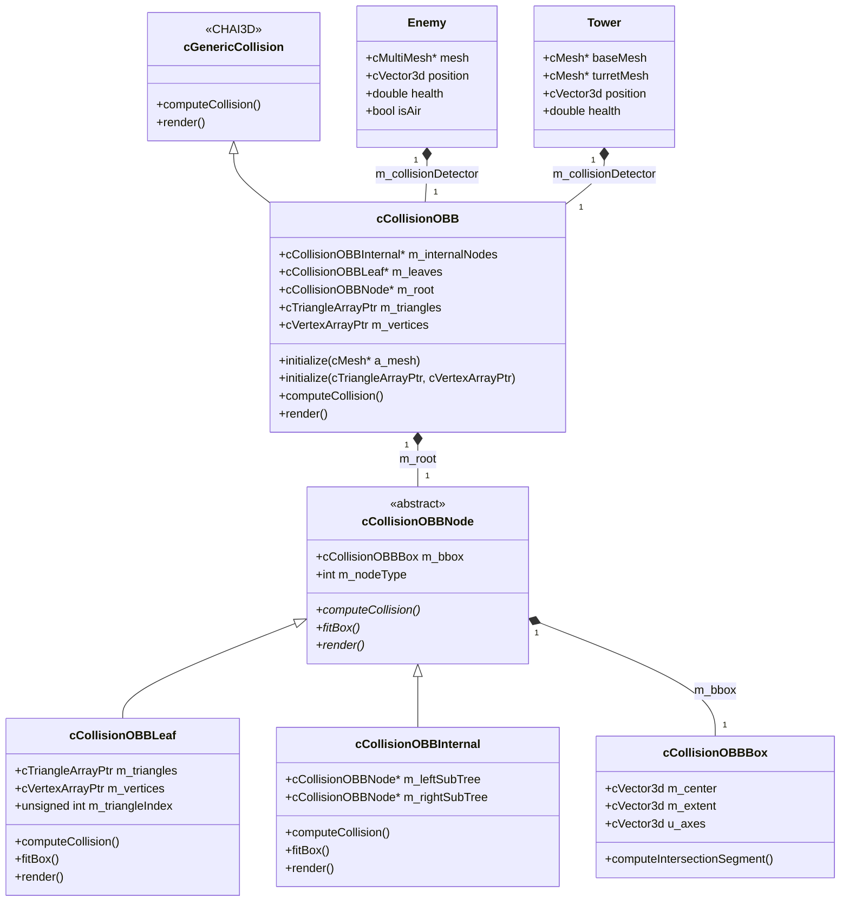
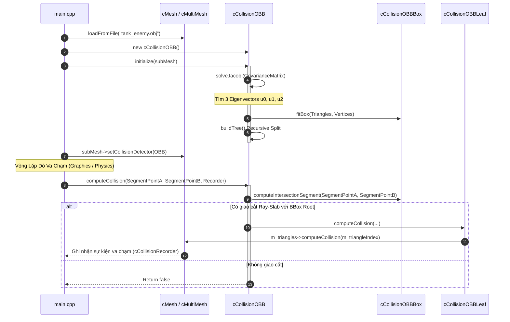
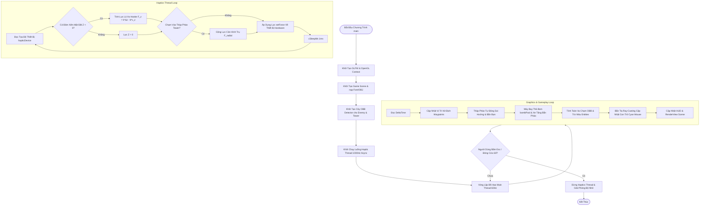

# TÀI LIỆU KĨ THUẬT & ĐẶC TẢ THUẬT TOÁN HOÀN CHỈNH
## DỰ ÁN: ARTILLERY TOWN DEFENSE - OBB TREE, PCA, JACOBI EIGENSOLVER & CHAI3D 3.x

---

## 1. TỔNG QUAN HỆ THỐNG & CHI TIẾT CÁC TỆP MÃ NGUỒN (FILE EXPLANATIONS)

Dự án **Artillery Town Defense** là một ứng dụng đồ họa 3D tương tác thời gian thực kết hợp thiết bị phản hồi lực (Haptic Feedback) dựa trên nền tảng **CHAI3D 3.x** và **OpenGL**. Hệ thống xử lý va chạm chính xác dựa trên cấu trúc cây **OBB (Oriented Bounding Box Tree)** tối ưu theo thuật toán Gottschalk '96.

Dưới đây là vai trò và chức năng chi tiết của từng tệp mã nguồn trong dự án:

### 1.1. `CCollisionOBBBox.h` (Lớp Khung Hộp Định Hướng - OBB Bounding Volume)
* **Chức năng:** Định nghĩa cấu trúc hình học của một hộp OBB đơn lẻ trong không gian 3D.
* **Thành phần dữ liệu:**
  * `cVector3d m_center`: Tâm vị trí OBB trong hệ tọa độ địa phương.
  * `cVector3d m_extent`: Bán kính mở rộng (half-sizes) $e_0, e_1, e_2$ dọc theo 3 trục địa phương.
  * `cVector3d u[3]`: 3 vector đơn vị định hướng cho 3 trục $X, Y, Z$ địa phương của OBB.
* **Giải thuật chính:** Cung cấp hàm `computeIntersectionSegment(...)` cài đặt thuật toán **Ray-Slab Intersection** để kiểm tra giao cắt giữa một đoạn thẳng (ray/segment) và hình hộp OBB xoay bất kỳ.

### 1.2. `CCollisionOBB.h` (Tệp Tiêu Đề Cây Va Chạm OBB Hierarchy)
* **Chức năng:** Khai báo kiến trúc cây phân cấp OBB (`cCollisionOBB`), nút gốc (`cCollisionOBBNode`), nút lá (`cCollisionOBBLeaf`) và nút trong (`cCollisionOBBInternal`).
* **Các phương thức nạp chồng (`initialize` Overloads):**
  * `initialize(cMesh* a_mesh)`: Khởi tạo OBB Tree trực tiếp từ một đối tượng `cMesh`.
  * `initialize(cTriangleArrayPtr a_triangles, cVertexArrayPtr a_vertices)`: Khởi tạo từ mảng tam giác và mảng đỉnh chuẩn CHAI3D 3.x.
  * `initialize(cTriangleArrayPtr a_triangles, cVertexArrayPtr a_vertices, const std::vector<unsigned int>& a_indices)`: Khởi tạo phân đoạn cho tập tam giác con.
* **Đặc điểm kiến trúc:** Kế thừa từ `cGenericCollision`, tương thích hoàn toàn với cơ chế dò tìm va chạm `cCollisionRecorder` của CHAI3D.

### 1.3. `CCollisionOBB.cpp` (Cài Đặt Thuật Toán OBB, PCA & Jacobi Eigensolver)
* **Chức năng:** Cài đặt toàn bộ logic toán học xây dựng cây OBB từ dưới lên (Top-down BVH construction).
* **Các thuật toán cốt lõi:**
  1. **Ma trận Đồng biến thiên Tích phân (Gottschalk Continuous Surface Covariance Matrix):** Tính toán tâm diện tích và ma trận đồng biến thiên 3x3 dựa trên trọng số diện tích của các tam giác.
  2. **Bộ Giải Trị Riêng Jacobi (`solveJacobi`):** Chéo hóa ma trận đối xứng 3x3 để tìm 3 trị riêng (eigenvalues) và 3 vector riêng (eigenvectors) làm 3 trục định hướng $u[0], u[1], u[2]$ cho OBB.
  3. **Phân tách không gian (Tree Splitting):** Phân chia tập tam giác dựa trên mặt phẳng cắt đi qua trọng tâm và vuông góc với trục có độ xòe (variance) lớn nhất.
  4. **Khử lỗi biên dịch:** Bao hàm `#include "chai3d.h"` ở phạm vi toàn cục (Global Scope) để tránh lỗi *Incomplete Type* và *Nested Namespace*.

### 1.4. `main.cpp` (Vòng Lặp Game, Haptics 1000Hz & Đồ Họa 60Hz)
* **Chức năng:** Tệp điều khiển chính của trò chơi Town Defense.
* **Các hệ thống cốt lõi:**
  * **Haptic Thread (1000Hz):** Chạy luồng song song tính toán lực phản hồi lò xo - giảm xóc ($F_z = k \cdot \Delta z - b \cdot v_z$) khi người chơi chạm vào mặt đất hoặc các tháp pháo.
  * **Graphics Loop (60Hz):** Cập nhật chuyển động kẻ địch, tháp pháo tự động quay bắn, quản lý đạn pháo (`tankShellPool`) và bom máy bay (`bombPool`).
  * **Ray-Casting Mouse Cursor:** Tương chiếu tọa độ pixel chuột `(xpos, ypos)` xuyên qua camera 3D xuống mặt phẳng $Z = 0$, giúp con trỏ cyan 3D khớp 100% từng pixel với chuột.
  * **Tích hợp OBB:** Khởi tạo cây `cCollisionOBB` cho tất cả các mô hình kẻ địch (`plane_enemy`, `tank_enemy`) và tháp pháo bằng `setCollisionDetector()`.

### 1.5. `CMakeLists.txt` (Cấu Hình Biên Dịch & Liên Kết Thư Viện)
* **Chức năng:** Quản lý quy trình biên dịch C++11 cross-platform với CMake.
* **Liên kết thư viện:** Chỉ định đường dẫn tới `chai3d`, `drd`, `dhd`, `glfw3`, `GLEW`, `GL`, `GLU`, `pthread` và đặc biệt là **`usb-1.0`** (giải quyết lỗi `undefined reference to libusb_submit_transfer`).

---

## 2. CƠ SỞ TOÁN HỌC & GIẢI THUẬT CỐT LÕI (MATHEMATICAL FOUNDATIONS)

```
                       +-----------------------------------+
                       |    Tập Tam Giác Đầu Vào (Mesh)    |
                       +-----------------------------------+
                                         |
                                         v
                       +-----------------------------------+
                       |   Ma Trận Hiệp Biến Thiên (PCA)   |
                       |       C = Σ Area_k * C_jk         |
                       +-----------------------------------+
                                         |
                                         v
                       +-----------------------------------+
                       |  Jacobi Eigensolver (3x3 Matrix)  |
                       |   --> Eigenvectors u0, u1, u2     |
                       +-----------------------------------+
                                         |
                                         v
                       +-----------------------------------+
                       |  Khung OBB (Center, Extent, U)    |
                       +-----------------------------------+
                                         |
                                         v
                       +-----------------------------------+
                       |   Duyệt Cây Va Chạm / Ray-Slab    |
                       +-----------------------------------+
```

### 2.1. Bounding Volume Hierarchy (BVH): OBB vs. AABB

* **AABB (Axis-Aligned Bounding Box):** Các trục của hộp luôn song song với hệ trục tọa độ thế giới ($X, Y, Z$). Ưu điểm là tính toán cực nhanh, nhưng khi đối tượng xoay nghiêng, AABB bị phình to ra sinh ra nhiều khoảng không thừa (void space), dẫn đến kiểm tra va chạm giả (false positives).
* **OBB (Oriented Bounding Box):** Hộp có thể xoay tự do theo bất kỳ hướng nào trong không gian 3D. OBB bao bọc sát khít vật thể hình học (đặc biệt là mô hình máy bay, xe tăng nghiêng), giúp giảm số lượng kiểm tra va chạm ở cấp độ tam giác xuống hàng chục lần.

---

### 2.2. Gottschalk '96 PCA Covariance Matrix (Ma Trận Đồng Biến Thiên)

Dựa trên công trình kinh điển của Gottschalk, Stefan Gottschalk, Ming C. Lin, và Dinesh Manocha (SIGGRAPH '96), để tìm hướng xoay tối ưu cho OBB, ta xây dựng Ma trận đồng biến thiên (Covariance Matrix) tích phân liên tục trên toàn bộ bề mặt các tam giác.

#### A. Tâm diện tích (Centroid của bề mặt):
Giả sử tập hợp gồm $N$ tam giác. Tam giác thứ $k$ có 3 đỉnh $p^k, q^k, r^k$ và diện tích $A_k$.
Tâm của tam giác thứ $k$ là:
$$\mathbf{m}^k = \frac{p^k + q^k + r^k}{3}$$

Tổng diện tích toàn bộ bề mặt là $A = \sum_{k=1}^N A_k$.

Tâm diện tích toàn cục (Global Centroid) $\mathbf{c}$ được tính bằng trọng số diện tích:
$$\mathbf{c} = \frac{1}{A} \sum_{k=1}^N A_k \mathbf{m}^k$$

#### B. Ma trận đồng biến thiên bề mặt tích phân $C$:
Ma trận $C$ kích thước $3 \times 3$ được xác định bởi công thức tích phân trên bề mặt các tam giác:
$$C_{ij} = \frac{1}{A} \sum_{k=1}^N A_k \cdot C^{k}_{ij}$$

Trong đó, thành phần hiệp biến thiên $C^k$ của tam giác $k$ đối với tâm $\mathbf{c}$ được tính chính xác bằng công thức closed-form:
$$C^k = \frac{1}{12} \left( 9 \cdot \bar{p}^k (\bar{p}^k)^T + \bar{p}^k (\bar{p}^k)^T + \bar{q}^k (\bar{q}^k)^T + \bar{r}^k (\bar{r}^k)^T \right)$$
với $\bar{p}^k = p^k - \mathbf{c}$, $\bar{q}^k = q^k - \mathbf{c}$, $\bar{r}^k = r^k - \mathbf{c}$, và $\bar{p}^k = \frac{\bar{p}^k + \bar{q}^k + \bar{r}^k}{3}$.

---

### 2.3. Jacobi Eigenvalue Algorithm (Thuật Toán Chéo Hóa Jacobi)

Ma trận đồng biến thiên $C$ là một ma trận đối xứng thực $3 \times 3$ ($C = C^T$). Thuật toán Jacobi lặp đi lặp lại các phép xoay Givens để biến ma trận $C$ về dạng đường chéo:
$$V^T C V = D = \text{diag}(\lambda_1, \lambda_2, \lambda_3)$$

#### Phép xoay Jacobi 2D:
Tại mỗi bước lặp, chọn phần tử phi đường chéo có giá trị tuyệt đối lớn nhất $C_{pq}$ ($p < q$). Ma trận xoay $R_{pq}(\theta)$ được định nghĩa với góc xoay $\theta$:
$$\tan(2\theta) = \frac{2 C_{pq}}{C_{qq} - C_{pp}}$$

Đặt $t = \tan\theta$, $c = \cos\theta = \frac{1}{\sqrt{1 + t^2}}$, $s = \sin\theta = t \cdot c$.

Nâng cấp ma trận:
$$C' = R_{pq}^T C R_{pq}$$
$$V' = V R_{pq}$$

Sau khi thuật toán hội tụ (phần tử phi đường chéo $< 10^{-15}$):
* 3 giá trị trên đường chéo $\lambda_1, \lambda_2, \lambda_3$ chính là 3 **trị riêng (eigenvalues)** thể hiện độ phân tán (variance) của hình học dọc theo các trục.
* 3 cột của ma trận tích lũy $V$ chính là 3 **vector riêng (eigenvectors)** $\mathbf{u}_0, \mathbf{u}_1, \mathbf{u}_2$. Đây chính là 3 trục tọa độ vuông góc định hướng cho hình hộp OBB!

---

### 2.4. Định Lý Trục Phân Tách (Separating Axis Theorem - SAT)

Để kiểm tra hai hình hộp OBB $A$ và $B$ có va chạm nhau trong không gian 3D hay không, theo định lý SAT:
> *Hai tập thể lồi 3D không giao nhau khi và chỉ khi tồn tại ít nhất một trục tọa độ $L$ sao for hình chiếu của $A$ và $B$ lên $L$ không đè lên nhau.*

Đối với 2 OBB 3D, số lượng trục cần kiểm tra tối đa là **15 trục**:
1. 3 trục từ mặt của OBB A: $\mathbf{u}_A^0, \mathbf{u}_A^1, \mathbf{u}_A^2$.
2. 3 trục từ mặt của OBB B: $\mathbf{u}_B^0, \mathbf{u}_B^1, \mathbf{u}_B^2$.
3. 9 trục tích có hướng (Cross products): $\mathbf{u}_A^i \times \mathbf{u}_B^j$ với $i, j \in \{0, 1, 2\}$.

#### Điều kiện phân tách trên trục $L$:
Gọi $\mathbf{T} = \mathbf{C}_B - \mathbf{C}_A$ là vector nối hai tâm.
Khoảng cách chiếu giữa 2 tâm: $D_L = |\mathbf{T} \cdot L|$.
Tổng bán kính chiếu của 2 OBB lên $L$:
$$R_L = \sum_{i=0}^2 e_A^i |\mathbf{u}_A^i \cdot L| + \sum_{j=0}^2 e_B^j |\mathbf{u}_B^j \cdot L|$$

Nếu $D_L > R_L \implies$ **Không va chạm** (Trục $L$ là trục phân tách!).

---

### 2.5. Thuật Toán Cắt Tia - Mặt Cắt (Ray-Slab Intersection for OBB)

Đoạn thẳng ray kiểm tra va chạm có phương trình:
$$P(t) = \mathbf{O} + t \cdot \mathbf{D}, \quad t \in [0, 1]$$

Để kiểm tra giao cắt với OBB có tâm $\mathbf{C}$, 3 trục $\mathbf{u}_0, \mathbf{u}_1, \mathbf{u}_2$ và bán kính $e_0, e_1, e_2$:

1. Chuyển đổi tia về hệ tọa độ địa phương của OBB:
   $$\mathbf{d} = \mathbf{O} - \mathbf{C}$$
   $$P_{local} = (\mathbf{d} \cdot \mathbf{u}_0, \mathbf{d} \cdot \mathbf{u}_1, \mathbf{d} \cdot \mathbf{u}_2)$$
   $$V_{local} = (\mathbf{D} \cdot \mathbf{u}_0, \mathbf{D} \cdot \mathbf{u}_1, \mathbf{D} \cdot \mathbf{u}_2)$$

2. Với mỗi trục $i \in \{0, 1, 2\}$, OBB được coi là dải không gian giới hạn bởi 2 mặt phẳng song song (Slab) $[-e_i, e_i]$:
   * Nếu $|V_{local, i}| < 10^{-9}$ (tia song song với mặt slab):
     * Nếu $|P_{local, i}| > e_i \implies$ Tia nằm ngoài OBB $\implies$ **Không giao cắt**.
   * Ngược lại, tính khoảng thời gian chạm mặt $t_1, t_2$:
     $$t_1 = \frac{-e_i - P_{local, i}}{V_{local, i}}, \quad t_2 = \frac{e_i - P_{local, i}}{V_{local, i}}$$
     $$t_{near} = \max(t_{near}, \min(t_1, t_2)), \quad t_{far} = \min(t_{far}, \max(t_1, t_2))$$

3. Kết luận: Nếu $t_{near} \le t_{far}$ và $t_{far} \ge 0$ và $t_{near} \le 1 \implies$ **Có giao cắt với OBB!**

---

### 2.6. Mô Hình Xúc Giác & Phản Hồi Lực (Haptic Rendering - Hooke's Law)

Hệ thống phản hồi lực dựa trên mô hình lò xo - cản (Spring-Damper Model) chạy ở tần số sub-millisecond 1000Hz để đảm bảo độ ổn định haptic.

#### Lực cản mặt đất (Solid Ground Constraint):
Khi con trỏ xúc giác đâm xuyên qua bề mặt đất ($Z_{cursor} < Z_{ground} + r_{cursor}$), độ đâm xuyên $\Delta z = (Z_{ground} + r_{cursor}) - Z_{cursor}$.
Lực phản hồi $F_z$ hướng thẳng đứng lên trên được tính bằng định luật Hooke kết hợp viscous damping:
$$F_z = k_{ground} \cdot \Delta z - b_{ground} \cdot v_z$$
Trong đó:
* $k_{ground} = 450.0 \text{ N/m}$ (Độ cứng lò xo mặt đất).
* $b_{ground} = 8.0 \text{ N}\cdot\text{s/m}$ (Hệ số cản nhớt chống rung).

#### Lực cản vật cản hình trụ (Solid Tower Cylindrical Barrier):
Với các tháp pháo bán kính $R_{tower}$, khoảng cách 2D tới con trỏ $d_{2D} = ||\mathbf{p}_{cursor, xy} - \mathbf{p}_{tower, xy}||$.
Nếu $d_{2D} < R_{tower} + r_{cursor}$:
$$\mathbf{F}_{radial} = k_{tower} (R_{tower} + r_{cursor} - d_{2D}) \cdot \hat{\mathbf{n}}_{radial} - b_{ground} (\mathbf{v} \cdot \hat{\mathbf{n}}_{radial}) \cdot \hat{\mathbf{n}}_{radial}$$

---

## 3. KIẾN TRÚC LỚP & SƠ ĐỒ MERMAID (SYSTEM DIAGRAMS)

### 3.1. Sơ Đồ Lớp (Class Diagram)



---

### 3.2. Sơ Đồ Tuần Tự (Sequence Diagram - Khởi Tạo & Dò Tìm Va Chạm)



---

### 3.3. Sơ Đồ Luồng Thực Thi Game & Thread Haptics (Flow Diagram)



---

## 4. CHI TIẾT CÀI ĐẶT MÃ NGUỒN & TƯƠNG THÍCH CHAI3D 3.x

### 4.1. Giải Quyết Lỗi Incomplete Type & Loop Include
* **Lỗi cũ:** Lớp `cTriangle` độc lập không còn tồn tại trong CHAI3D 3.x mà được thay thế bằng mảng con trỏ `cTriangleArrayPtr` và `cVertexArrayPtr`.
* **Khắc phục:** Mọi tệp C++ đều nạp `#include "chai3d.h"` ở ngay dòng đầu tiên (ngoài `namespace chai3d`), đồng thời truy xuất chỉ số tam giác thông qua `m_triangleIndex` và `m_triangles->getVertexIndex0(m_triangleIndex)`.

### 4.2. Khắc Phục Lỗi Protected Member
* **Lỗi cũ:** Gán trực tiếp `subMesh->m_collisionDetector = col;` bị GCC chặn do `m_collisionDetector` là thuộc tính `protected`.
* **Khắc phục:** Chuyển sang gọi hàm công khai `subMesh->setCollisionDetector(col);`.

---

