# Output an Image
The catch is, there are so many formats. Many of those are complex. I always start with a plain text ppm file. 

## The PPM Image Format
``` c
#include <ostream>
#include <iostream>

int main() {

    // Image
    int image_width = 256;
    int image_height = 256;

    // Render
    std::cout << "P3\n" << image_width << ' ' << image_height << "\n255\n";

    for (int j = 0; j < image_height; j++) {
        std::clog << "\rScanlines remaining: " << (image_height - j) << ' ' << std::flush;
        for (int i = 0; i < image_width; i++) {
            auto r = double(i) / (image_width - 1);
            auto g = double(j) / (image_height - 1);
            auto b = 0.0;

            int ir = int(255.999 * r);
            int ig = int(255.999 * g);
            int ib = int(255.999 * b);

            std::cout << ir << ' ' << ig << ' ' << ib << '\n';
        }
    }

    std::clog << "\rDone.                \n";
}
```

## Creating an Image File
``` c
cmake -B build
cmake --build build

g++ main.cpp -std=c++17 -O2 -o raytrace
xdg-open image.ppm 
```
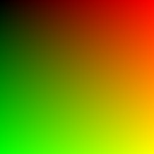

If you want to produce other image formats, I am a fan of [stb_image.h](https://github.com/nothings/stb), a header-only image library available on GitHub. 

# 3 The vec3 Class
Almost all graphics programs have some class(es) for storing geometric vectors and colors. In many systems these vectors are 4D (3D position plus a homogeneous coordinate for geometry, or RGB plus an alpha transparency component for colors). 

[vec3.h](vec3.h)

## Color Utility Functions

[color.h](color.h)

## Use
``` c
cd /home/nmc/WorkSpace/Program/Robot/OpenGL/Ray-Tracing/01_Ray_Tracing
cmake -B build
cmake --build build
./build/raytrace > image.ppm
xdg-open image.ppm 
```

# Rays, a Simple Camera, and Background

## The ray Class
Let’s think of a ray as a function 

$$
P(t)=A+tb
$$ 

Here P is a 3D position along a line in 3D.
- $A$ is the ray origin and $b$ is the ray direction.
- The ray parameter $t$ is a real number (double in the code).
- Plug in a different $t$ and $P(t)$ moves the point along the ray.
- Add in negative $t$ values and you can go anywhere on the 3D.
- For positive $t$, you get only the parts in front of $A$, and this is what is often called a ***half-line*** or a ray. 

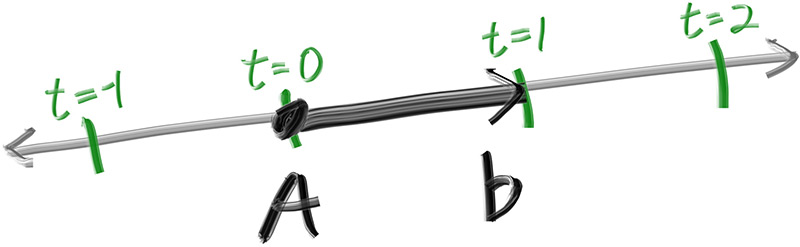

[ray.h](ray.h)

## Sending Rays Into the Scene

A ray tracer sends rays through pixels and computes the color seen in the direction of those rays. The involved steps are:

1. Calculate the ray from the “eye” through the pixel,
2. Determine which objects the ray intersects, and
3. Compute a color for the closest intersection point.

A square image has a 1∶1 aspect ratio, because its width is the same as its height. Since we want a non-square image, we'll choose 16∶9 because it's so common. A 16∶9 aspect ratio means that the ratio of image width to image height is 16∶9. Put another way, given an image with a 16∶9 aspect ratio, 

$$
width/height=16/9=1.7778
$$

For a practical example, an image 800 pixels wide by 400 pixels high has a 2∶1 aspect ratio. 

In addition to setting up the pixel dimensions for the rendered image, we also need to set up a virtual viewport through which to pass our scene rays. ***The viewport is a virtual rectangle in the 3D world that contains the grid of image pixel locations.*** If pixels are spaced the same distance horizontally as they are vertically, the viewport that bounds them will have the same aspect ratio as the rendered image. The distance between two adjacent pixels is called the pixel spacing, and square pixels is the standard. 

``` c
auto aspect_ratio = 16.0 / 9.0;
int image_width = 400;

// Calculate the image height, and ensure that it's at least 1
int image_height = int(image_wdith / aspect_ratio);
image_height = (image_height < 1) ? 1 : image_height;

// viewport widths less than one 
auto view_port_height = 2.0;
auto view_width = view_height * (double(image_width)/image_height);
```

***Note that aspect_ratio is an ideal ratio***, which we approximate as best as possible with the integer-based ratio of image width over image height. In order for our viewport proportions to exactly match our image proportions, we use the calculated image aspect ratio to determine our final viewport width. 

Next we will define the camera center: a point in 3D space from which all scene rays will originate (this is also commonly referred to as the eye point). ***The vector from the camera center to the viewport center will be orthogonal to the viewport***.

We'll initially set the distance between the viewport and the camera center point to be one unit. ***This distance is often referred to as the focal length***. 

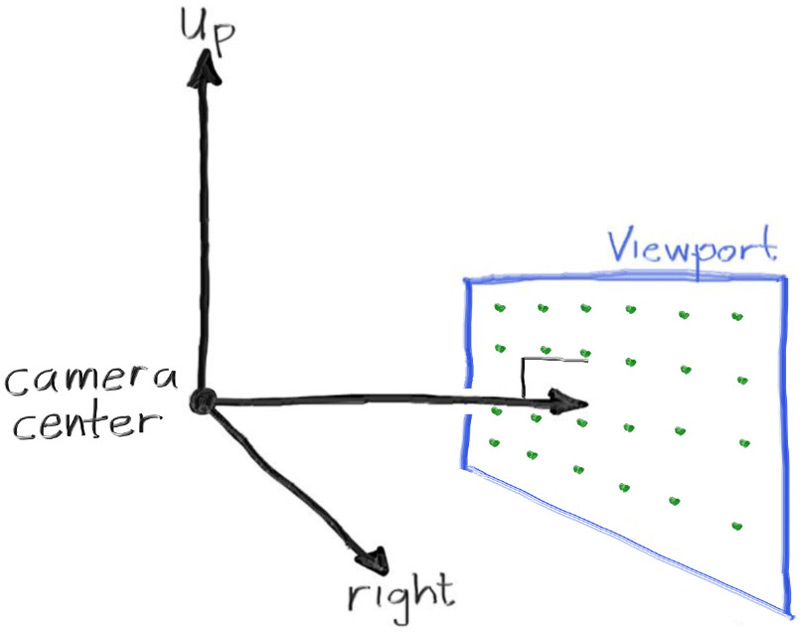
- The camera center at (0,0,0)
- The y-axis go up
- The x-axis to the right
- The negative z-axis pointing in the viewing direction

As we scan our image, we will start at the upper left pixel (pixel 0,0),
- Scan left-to-right across each row
- Then scan row-by-row
- Top-to-bottom.

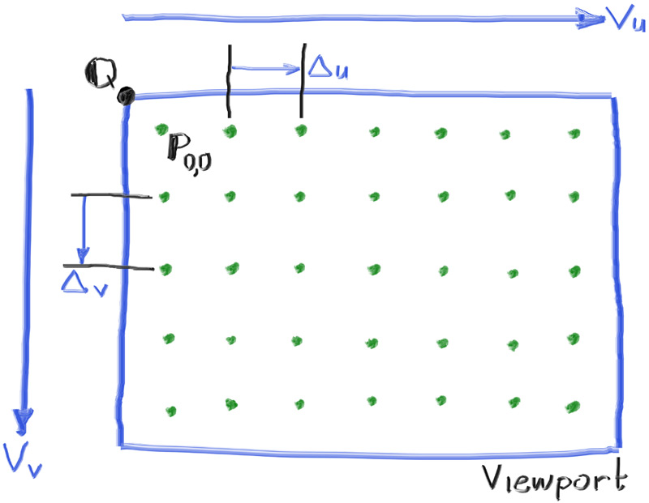
- $V_u$: vector from the left edge to the right edge (viewport_u)
- $V_v$: vector from the upper edge to the lower edge (viewport_v)
- $Q$: the viewport upper left corner
- $P_0,_0$: the pixel location
``` c
#include <iostream>

#include "color.h"
#include "vec3.h"
#include "ray.h"

color ray_color(const ray& r) {
    return color(0, 0, 0);
}

int main() {
    // Image
    auto aspect_ratio = 16.0 / 9.0;
    int image_width = 400;

    // calculate the image height
    int image_height = int(image_width / aspect_ratio);
    image_height = (image_height < 1) ? 1 : image_height;

    // camera
    auto focal_height = 1.0;
    auto viewport_height = 2.0;
    auto viewport_width = viewport_height * (double(image_width)/image_height);
    auto camera_center = point3(0, 0, 0);

    // calculator the vector across the horizontal and down the vertical viewport edges
    auto viewport_u = vec3(viewport_width, 0, 0);
    auto viewport_v = vec3(0, -viewport_height, 0);
    
    // calculator the horizontal and vertical delta vector form pixel to pixel
    auto pixel_delta_u = viewport_u / image_width;
    auto pixel_delta_v = viewport_v / image_height;

    // calculate the location of the upper left pixel
    auto viewport_upper_left = camera_center - vec3(0 ,0 ,focal_height) - viewport_u/2 - viewport_v/2;
    auto pixel00_loc = viewport_upper_left + 0.5 * (pixel_delta_u + pixel_delta_v);

    // Render
    std::cout << "P3\n" << image_width << ' ' << image_height << "\n255\n";

    for (int j = 0; j < image_height; ++j) {
        std::clog << "\rScanlines remaining: " << (image_height - j) << ' ' << std::flush;
        for (int i = 0; i < image_width; ++i) {
            auto pixel_center = pixel00_loc + (i * pixel_delta_u) + (j * pixel_delta_v);
            auto ray_direction = pixel_center - camera_center;
            ray r(camera_center, ray_direction);

            color pixel_color = ray_color(r);
            write_color(std::cout, pixel_color);
        }
    }

    std::clog << "\rDone.                \n";
    return 0;
}
```

I'll use a standard graphics trick to linearly scale $0.0≤a≤1.0$. When $a=1.0$, I want blue. When $a=0.0$, I want white. In between, I want a blend. This forms a ***“linear blend”***, or ***“linear interpolation”***. This is commonly referred to as a lerp between two values. A lerp is always of the form 
$$
blendedValue=(1−a)⋅startValue+a⋅endValue
$$

``` c
color ray_color(const ray& r) {
    vec3 unit_direction = unit_vector(r.direction());
    auto a = 0.5*(unit_direction.y() + 1.0);
    return (1.0-a)*color(1.0, 1.0, 1.0) + a*color(0.5, 0.7, 1.0);
}
```

<center></center>


# Adding a Sphere

## Ray-Sphere Intersection
The equation for a sphere of radius r that is centered at the origin is an important mathematical equation: 
$$
x^2 + y^2 + z^2 = r^2
$$

You can also think of this as saying that if a given point (x,y,z) is on the surface of the sphere.
- If a given point $(x,y,z)$ is inside the sphere, then $x^2+y^2+z^2<r^2$
- if a given point $(x,y,z)$ is outside the sphere, then $x^2+y^2+z^2>r^2$.
- If we want to allow the sphere center to be at an arbitrary point $(C_x,C_y,C_z)$

Then the equation becomes a lot less nice: 
$$
(C_x - x)^2 + (C_y - y)^2 + (C_z - z)^2 = r^2
$$

In graphics, you almost always want your formulas to be in terms of vectors so that all the $x/y/z$ stuff can be simply represented using a vec3 class.

You might note that the vector from point $P=(x,y,z)$ to center $C=(C_x,C_y,C_z)$ is $(C - P)$.

If we use the definition of the dot product: 
$$
(C - P) \cdot (C - P) = (C_x - x)^2 + (C_y - y)^2 + (C_z - z)^2
$$

Then we can rewrite the equation of the sphere in vector form as: 

$$
(C - P) \cdot (C - P) = r^2
$$

We can read this as “*any point $P$ that satisfies this equation is on the sphere*”.

We want to know if our ray $P(t)=Q+td$ ever hits the sphere anywhere. If it does hit the sphere, there is some t for which $P(t)$ satisfies the sphere equation. So we are looking for any $t $ where this is true: 

$$
(C - P(t)) \cdot (C - P(t)) = r^2
$$

which can be found by replacing P(t) with its expanded form: 

$$
(C - (Q + td)) \cdot (C - (Q + td)) = r^2
$$

We have three vectors on the left dotted by three vectors on the right. If we solved for the full dot product we would get nine vectors.

$$
(-td + (C - Q)) \cdot (-td + (C - Q)) = r^2
$$

$$
t^2 d \cdot d - 2td \cdot (C - Q) + (C - Q) \cdot (C - Q) = r^2
$$

$$
t^2 d \cdot d - 2td \cdot (C - Q) + (C - Q) \cdot (C - Q) - r^2 = 0
$$

You can solve for a quadratic equation $ax^2+bx+c=0$ by using the quadratic formula:

$$
\frac{-b \pm \sqrt{b^2 - 4ac}}{2a} 
$$

So solving for $t$ in the ray-sphere intersection equation gives us these values for $a$, $b$, and $c$: 
$$
a = d \cdot d
$$
$$
b = -2d \cdot (C - Q)
$$
$$
c = (C - Q) \cdot (C - Q) - r^2
$$

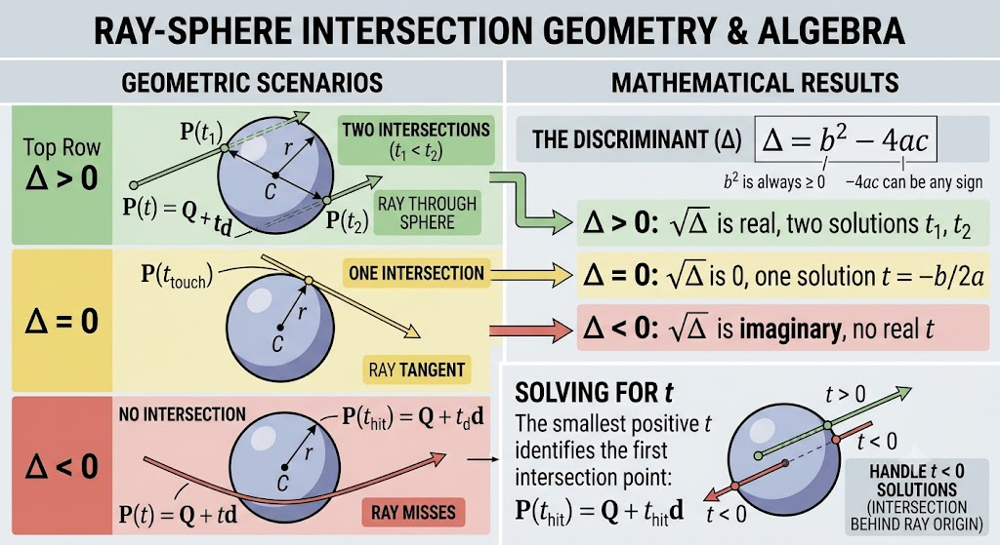

## Creating Our First Raytraced Image

```c
bool hit_sphere(const point3& center, double radius, const ray& r) {
    vec3 oc = center - r.origin();
    auto a = dot(r.direction(), r.direction());
    auto b = -2.0 * dot(r.direction(), oc);
    auto c = dot(oc, oc) - radius*radius;
    auto discriminant = b*b - 4*a*c;
    return (discriminant >= 0);
}

color ray_color(const ray& r) {
    if (hit_sphere(point3(0,0,-1), 0.5, r))
        return color(1, 0, 0);

    vec3 unit_direction = unit_vector(r.direction());
    auto a = 0.5*(unit_direction.y() + 1.0);
    return (1.0-a)*color(1.0, 1.0, 1.0) + a*color(0.5, 0.7, 1.0);
}
```

<center>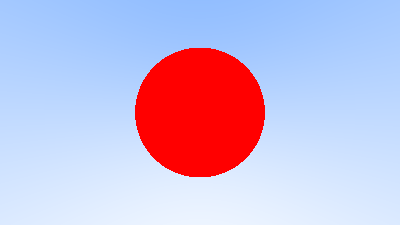</center>


# Surface Normals and Multiple Objects

## Shading with Surface Normals
This is a vector that is perpendicular to the surface at the point of intersection. 

Whether normal vectors will have an arbitrary length, or will be normalized to unit length. 

There are three important observations.

- First, if a unit-length normal vector is ever required, ***then you might as well do it up front once, instead of over and over again “just in case” for every location where unit-length is required***.
- Second, we do require unit-length normal vectors in several places.
- Third, if you require normal vectors to be unit length, then you can often efficiently generate that vector with an understanding of the specific geometry class, in its constructor, or in the hit() function.

For example, sphere normals can be made unit length simply by dividing by the sphere radius, avoiding the square root entirely. 

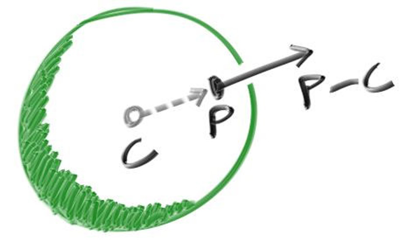

Imagine you are standing anywhere on Earth. The vector pointing from the center of the Earth through your feet and up to your head is the surface normal at your location. It is perpendicular to the ground.
$$
	ext{Outward Normal Direction} = \text{Hit Point} - \text{Sphere Center}
$$

Since the renderer does not yet have lights or shadows, the author uses a clever trick to verify that the normal vectors are being calculated correctly: ***Mapping the vector values to colors.***
- **The Problem**: The components $(x, y, z)$ of a normalized normal vector $\vec{n}$ range from $-1$ to $1$. However, colors in graphics (Red, Green, Blue) are typically represented in the range $[0, 1]$.
- The Solution (The Mapping Trick):
1. Add $1$ to each vector component: changes range from $[-1, 1]$ to $[0, 2]$.
2. Multiply by $0.5$: changes range from $[0, 2]$ to $[0, 1]$.
3. Map $(x, y, z)$ directly to $(Red, Green, Blue)$.

```c
double hit_sephere(const point3& center, double radius, const ray& r) {
    vec3 oc = center -r.origin();
    auto a = dot(r.direction(), r.direction());
    auto b = -2.0*dot(r.direction(), oc);
    auto c = dot(oc, oc) - radius*radius;
    auto discriminant = b*b - 4*a*c;

    if (discriminant < 0) {
        return -1.0;
    } else {
        return (-b - std::sqrt(discriminant) ) / (2.0*a);
    }
}

color ray_color(const ray& r) {
    auto t = hit_sephere(point3(0, 0, -1), 0.5 , r);
    if (t > 0.0) {
        vec3 N = unit_vector(r.at(t) - vec3(0, 0, -1));
        return 0.5 * color(N.x() + 1, N.y() + 1, N.z() + 1);
    }

    vec3 unit_direction = unit_vector(r.direction());
    auto a = 0.5*(unit_direction.y() + 1.0);
    return (1.0-a)*color(1.0, 1.0, 1.0) + a*color(0.5, 0.7, 1.0);
}

```

<center>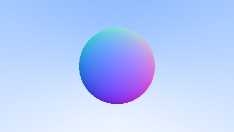</center>


## Simplifying the Ray-Sphere Intersection Code
Notice how the equation for b has a factor of negative two in it. Consider what happens to the quadratic equation if $b=−2h$: 

$$
\frac{-b \pm \sqrt{b^2 - 4ac}}{2a} 
$$

$$
= \frac{-(-2h) \pm \sqrt{(-2h)^2 - 4ac}}{2a} 
$$

$$
= \frac{2h \pm 2\sqrt{h^2 - ac}}{2a} 
$$

$$
= \frac{h \pm \sqrt{h^2 - ac}}{a} 
$$

So solving for h: 
$$
b=−2d⋅(C−Q)
$$

$$
b=−2h
$$

$$
h=\frac{b}{−2}=d⋅(C−Q)
$$

we can now simplify the sphere-intersection code to this: 

```c
double hit_sphere(const point3& center, double radius, const ray& r) {
    vec3 oc = center - r.origin();
    auto a = r.direction().length_squared();
    auto h = dot(r.direction(), oc);
    auto c = oc.length_squared() - radius*radius;
    auto discriminant = h*h - a*c;

    if (discriminant < 0) {
        return -1.0;
    } else {
        return (h - std::sqrt(discriminant)) / a;
    }
}
```

## An Abstraction for Hittable Objects
Now, how about more than one sphere?

While it is tempting to have an array of spheres, a very clean solution is to make an “abstract class” for anything a ray might hit, and make both a sphere and a list of spheres just something that can be hit.

“Surface” is often used, with the weakness being maybe we will want volumes (fog, clouds, stuff like that). ***“hittable” emphasizes the member function that unites them.***

The hit Function and The Interval $[t_{min}, t_{max}]$
- **Valid Interval**: It introduces two extra parameters: a minimum $t$ (ray_tmin) and a maximum $t$ (ray_tmax). An intersection (or "hit") is only considered valid if the resulting ray parameter $t$ falls within this interval ($t_{min} < t < t_{max}$).
- **Why the interval?** For initial rays from the camera, we usually only care about positive $t$. However, as the renderer gets more complex (handling reflections, shadows, etc.), this interval becomes essential for simplifying code, especially for solving precision issues like "self-intersection" (preventing a ray from hitting the surface it just started from by setting a slightly positive $t_{min}$).

Storing Hit Results
- The author made a design decision about when to calculate the surface normal. We might find a hit, calculate the normal, but later find another object that is closer. In that case, calculating the normal for the farther object was wasted effort.

``` c
#ifndef HITTABLE_H
#define HITTABLE_H

#include "ray.h"

class hit_record {
  public:
    point3 p;
    vec3 normal;
    double t;
};

class hittable {
  public:
    virtual ~hittable() = default;

    virtual bool hit(const ray& r, double ray_tmin, double ray_tmax, hit_record& rec) const = 0;
};

#endif
```

``` c
#ifndef SPHERE_H
#define SPHERE_H

#include "hittable.h"
#include "vec3.h"

class sphere : public hittable {
  public:
    sphere(const point3& center, double radius) : center(center), radius(std::fmax(0,radius)) {}

    bool hit(const ray& r, double ray_tmin, double ray_tmax, hit_record& rec) const override {
        vec3 oc = center - r.origin();
        auto a = r.direction().length_squared();
        auto h = dot(r.direction(), oc);
        auto c = oc.length_squared() - radius*radius;

        auto discriminant = h*h - a*c;
        if (discriminant < 0)
            return false;

        auto sqrtd = std::sqrt(discriminant);

        // Find the nearest root that lies in the acceptable range.
        auto root = (h - sqrtd) / a;
        if (root <= ray_tmin || ray_tmax <= root) {
            root = (h + sqrtd) / a;
            if (root <= ray_tmin || ray_tmax <= root)
                return false;
        }

        rec.t = root;
        rec.p = r.at(rec.t);
        rec.normal = (rec.p - center) / radius;

        return true;
    }

  private:
    point3 center;
    double radius;
};

#endif
```

## Front Faces Versus Back Faces

The second design decision for normals is whether they should always point out. At present, the normal found will always be in the direction of the center to the intersection point (the normal points out).
- ***If the ray intersects the sphere from the outside, the normal points against the ray.*** 
- ***If the ray intersects the sphere from the inside, the normal (which always points out) points with the ray***
- Alternatively, we can have the normal always point against the ray. ***If the ray is outside the sphere, the normal will point outward, but if the ray is inside the sphere, the normal will point inward***.
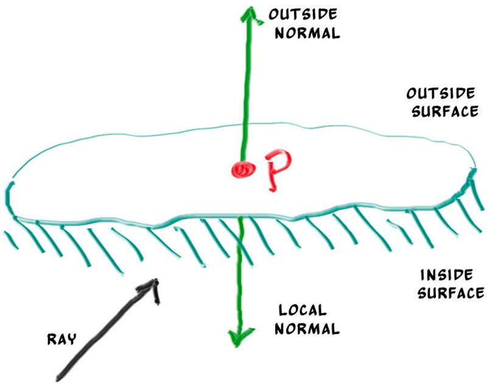


We need to choose one of these possibilities because we will eventually want to ***determine which side of the surface that the ray is coming from.***

This is important for objects that are rendered differently on each side, like the text on a two-sided sheet of paper, or for ***objects that have an inside and an outside, like glass balls.*** 
- ***If we decide to have the normals always point out***, then we will need to determine which side the ray is on when we color it. We can figure this out by comparing the ray with the normal.
    - If the ray and the normal face in the same direction, the ray is inside the object
    - if the ray and the normal face in the opposite direction, then the ray is outside the object. ***This can be determined by taking the dot product of the two vectors, where if their dot is positive, the ray is inside the sphere.***

``` c
if (dot(ray_direction, outward_normal) > 0.0) {
    // ray is inside the sphere
    ...
} else {
    // ray is outside the sphere
    ...
}
```

- ***If we decide to have the normals always point against the ray***, we won't be able to use the dot product to determine which side of the surface the ray is on. Instead, ***we would need to store that information:***

``` c
bool front_face;
if (dot(ray_direction, outward_normal) > 0.0) {
    // ray is inside the sphere
    normal = -outward_normal;
    front_face = false;
} else {
    // ray is outside the sphere
    normal = outward_normal;
    front_face = true;
}
```

We can set things up so that normals always point “outward” from the surface, or always point against the incident ray.

This decision is determined by whether you want to determine the side of the surface ***at the time of geometry intersection*** or ***at the time of coloring.***

***Geometry types***, so we'll go for less work and put the determination at geometry time. This is simply a matter of preference, and you'll see both implementations in the literature. 

```c
class hit_record {
  public:
    point3 p;
    vec3 normal;
    double t;
    bool front_face;

    void set_face_normal(const ray& r, const vec3& outward_normal) {
        // Sets the hit record normal vector.
        // NOTE: the parameter `outward_normal` is assumed to have unit length.

        front_face = dot(r.direction(), outward_normal) < 0;
        normal = front_face ? outward_normal : -outward_normal;
    }
};
```
And then we add the surface side determination to the class: 

```c
class sphere : public hittable {
    bool hit(const ray& r, double ray_tmin, double ray_tmax, hit_record& rec) const {
        ...

        rec.t = root;
        rec.p = r.at(rec.t);
        vec3 outward_normal = (rec.p - center) / radius;
        rec.set_face_normal(r, outward_normal);

        return true;
    }
}
```
## A List of Hittable Objects
We have a generic object called a hittable that the ray can intersect with. We now add a class that stores a list of hittables: 

```c 
#ifndef HITTABLE_LIST_H
#define HITTABLE_LIST_H

#include "hittable.h"

#include <memory>
#include <vector>

using std::make_shared;
using std::shared_ptr;

class hittable_list : public hittable {
  public:
    std::vector<shared_ptr<hittable>> objects;

    hittable_list() {}
    hittable_list(shared_ptr<hittable> object) { add(object); }

    void clear() { objects.clear(); }

    void add(shared_ptr<hittable> object) {
        objects.push_back(object);
    }

    bool hit(const ray& r, double ray_tmin, double ray_tmax, hit_record& rec) const override {
        hit_record temp_rec;
        bool hit_anything = false;
        auto closest_so_far = ray_tmax;

        for (const auto& object : objects) {
            if (object->hit(r, ray_tmin, closest_so_far, temp_rec)) {
                hit_anything = true;
                closest_so_far = temp_rec.t;
                rec = temp_rec;
            }
        }

        return hit_anything;
    }
};
#endif
```
## Some New C++ Features

Typically, a shared pointer is first initialized with a newly-allocated object, something like this: 

``` c
auto double_ptr = make_shared<double>(0.37);
auto vec3_ptr   = make_shared<vec3>(1.414214, 2.718281, 1.618034);
auto sphere_ptr = make_shared<sphere>(point3(0,0,0), 1.0);
```

## Common Constants and Utility Functions

``` c
#ifndef RTWEEKEND_H
#define RTWEEKEND_H

#include <cmath>
#include <iostream>
#include <limits>
#include <memory>


// C++ Std Usings

using std::make_shared;
using std::shared_ptr;

// Constants

const double infinity = std::numeric_limits<double>::infinity();
const double pi = 3.1415926535897932385;

// Utility Functions

inline double degrees_to_radians(double degrees) {
    return degrees * pi / 180.0;
}

// Common Headers

#include "color.h"
#include "ray.h"
#include "vec3.h"

#endif
```


<center>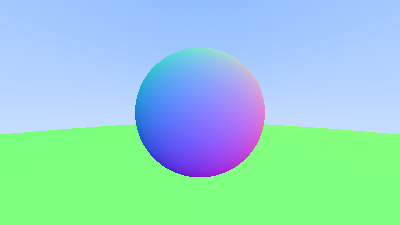</center>


## An Interval Class
We'll implement an interval class to manage real-valued intervals with a minimum and a maximum

interval.h
``` c
#ifndef INTERVAL_H
#define INTERVAL_H

#include "rtweekend.h"

class interval {
  public:
    double min, max;

    interval() : min(+infinity), max(-infinity) {} // Default interval is empty

    interval(double min, double max) : min(min), max(max) {}

    double size() const {
        return max - min;
    }

    bool contains(double x) const {
        return min <= x && x <= max;
    }

    bool surrounds(double x) const {
        return min < x && x < max;
    }

    static const interval empty, universe;
};

const interval interval::empty    = interval(+infinity, -infinity);
const interval interval::universe = interval(-infinity, +infinity);

#endif

```

rtweekend.h
``` c
// Common Headers

#include "color.h"
#include "interval.h"
```

hittable.h
``` c
class hittable {
  public:
    ...
    virtual bool hit(const ray& r, interval ray_t, hit_record& rec) const = 0;
};
```

hittable_list.h
``` c
class hittable_list : public hittable {
  public:
    ...
    bool hit(const ray& r, interval ray_t, hit_record& rec) const override {
        hit_record temp_rec;
        bool hit_anything = false;
        auto closest_so_far = ray_t.max;

        for (const auto& object : objects) {
            if (object->hit(r, interval(ray_t.min, closest_so_far), temp_rec)) {
                hit_anything = true;
                closest_so_far = temp_rec.t;
                rec = temp_rec;
            }
        }

        return hit_anything;
    }
    ...
};
```

sphere.h
``` c
class sphere : public hittable {
  public:
    ...
    bool hit(const ray& r, interval ray_t, hit_record& rec) const override {
        ...

        // Find the nearest root that lies in the acceptable range.
        auto root = (h - sqrtd) / a;
        if (!ray_t.surrounds(root)) {
            root = (h + sqrtd) / a;
            if (!ray_t.surrounds(root))
                return false;
        }
        ...
    }
    ...
};
```

main.cc
``` c
color ray_color(const ray& r, const hittable& world) {
    hit_record rec;
    if (world.hit(r, interval(0, infinity), rec)) {
        return 0.5 * (rec.normal + color(1,1,1));
    }

    vec3 unit_direction = unit_vector(r.direction());
    auto a = 0.5*(unit_direction.y() + 1.0);
    return (1.0-a)*color(1.0, 1.0, 1.0) + a*color(0.5, 0.7, 1.0);
}
```

# Moving Camera Code Into Its Own Class
The camera class. The camera class will be responsible for two important jobs: 
1. Construct and dispatch rays into the world.
2. Use the results of these rays to construct the rendered image.

We'll collect the ***ray_color()*** function, along with the image, camera, and render sections of our main program. The new camera class will contain two public methods ***initialize()*** and ***render()***, plus two private helper methods ***get_ray()*** and ***ray_color()***. 

It will be default constructed no arguments, then the owning code will modify the camera's public variables through simple assignment, and finally everything is initialized by a call to the ***initialize()*** function.

camera.h
``` c
#ifndef CAMERA_H
#define CAMERA_H

#include "hittable.h"

class camera {
public:
    // public Camera parameters 
    double aspect_ratio = 1.0; // Ratio of image width over height
    int image_width = 100;     // Rendered image width in pixel count 
    
    void render(const hittable& world) {
        initialize();

        std::cout << "P3\n" << image_width << ' ' << image_width << "\n255\n";

        for (int j = 0; j < image_height; ++j) {
            std::clog << "\rScanlines remaining: " << (image_height - j) << ' ' << std::flush;
            for (int i = 0; i < image_width; ++i) {
                auto pixel_center = pixel00_loc + (i * pixel_delta_u) + (j * pixel_delta_v);
                auto ray_direction = pixel_center - center;
                ray r(center, ray_direction);

                color pixel_color = ray_color(r, world);
                write_color(std::cout, pixel_color);
            }
        }
    }

private:
    int    image_height;   // Rendered image height
    point3 center;         // Camera center
    point3 pixel00_loc;    // Location of pixel 0, 0
    vec3   pixel_delta_u;  // Offset to pixel to the right
    vec3   pixel_delta_v;  // Offset to pixel below

    // Private camera variable 
    void initialize() {
        // calculate the image height
        int image_height = int(image_width / aspect_ratio);
        image_height = (image_height < 1) ? 1 : image_height;

        // Determine viewport dimensions.
        auto focal_length = 1.0;
        auto viewport_height = 2.0;
        auto viewport_width = viewport_height * (double(image_width)/image_height);
        center = point3(0, 0, 0);

        // calculator the vector across the horizontal and down the vertical viewport edges
        auto viewport_u = vec3(viewport_width, 0, 0);
        auto viewport_v = vec3(0, -viewport_height, 0);
        
        // calculator the horizontal and vertical delta vector form pixel to pixel
        auto pixel_delta_u = viewport_u / image_width;
        auto pixel_delta_v = viewport_v / image_height;

        // calculate the location of the upper left pixel
        auto viewport_upper_left = center - vec3(0 ,0 ,focal_length) - viewport_u/2 - viewport_v/2;
        auto pixel00_loc = viewport_upper_left + 0.5 * (pixel_delta_u + pixel_delta_v);
    }

    color ray_color(const ray& r, const hittable& world) const {
        hit_record rec;

        if (world.hit(r, interval(0, infinity), rec)) {
            return 0.5 * (rec.normal + color(1, 1, 1));
        }

        vec3 unit_driection = unit_vector(r.direction());
        auto a = 0.5*(unit_driection.y() + 1.0);
        return (1.0 - a)*color(1.0, 1.0, 1.0) + a*color(0.5, 0.7, 1.0);
    }
};

#endif
```

main.cc
``` c
#include "rtweekend.h"

#include "camera.h"
#include "hittable.h"
#include "hittable_list.h"
#include "sphere.h"

int main() {
    hittable_list world;

    world.add(make_shared<sphere>(point3(0,0,-1), 0.5));
    world.add(make_shared<sphere>(point3(0,-100.5,-1), 100));

    camera cam;

    cam.aspect_ratio = 16.0 / 9.0;
    cam.image_width  = 400;

    cam.render(world);
}
```

# Antialiasing
If you zoom into the rendered images so far, you might notice the harsh ***“stair step”*** nature of edges in our rendered images.This stair-stepping is commonly referred to as ***“aliasing”***, or ***“jaggies”***.

When a real camera takes a picture, there are usually no jaggies along edges, ***because the edge pixels are a blend of some foreground and some background***.

With a single ray through the center of each pixel, we are performing what is commonly called ***point sampling***. The problem with point sampling can be illustrated by rendering a small checkerboard far away. If this checkerboard consists of an 8×8 grid of black and white tiles, but only four rays hit it, then all four rays might intersect only white tiles, or only black, or some odd combination.

How do we integrate the light falling around the pixel? 
We'll adopt the simplest model: sampling the square region centered at the pixel that extends halfway to each of the four neighboring pixels. This is not the optimal approach, but it is the most straight-forward. ([A Pixel is Not a Little Square](https://www.researchgate.net/publication/244986797) )


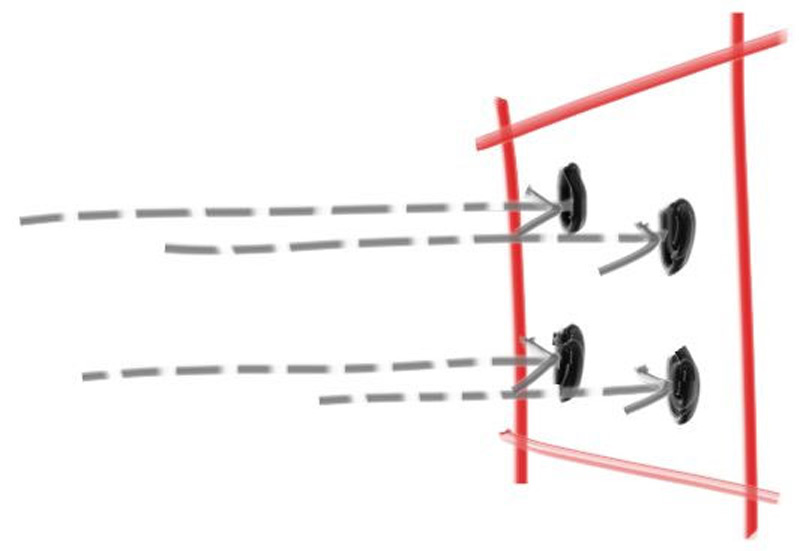

## Some Random Number Utilities
For a single pixel composed of multiple samples, we'll select samples from the area surrounding the pixel and average the resulting light (color) values together. 

First we'll update the **write_color()** function to account for the number of samples we use. we need to find the average across all of the samples that we take. To do this, we'll add the ***full color from each iteration, and then finish with a single division (by the number of samples) at the end***, before writing out the color. To ensure that the color components of the final result remain within the proper $[0,1]$ bounds, we'll add and use a small helper function: interval::clamp(x). 
- Clamping Formula:

```math
\operatorname{Clamped}(x) =
\begin{cases}
\mathrm{min} & \mathrm{if } x < \mathrm{min} \\
\mathrm{max} & \mathrm{if } x > \mathrm{max} \\
x & \mathrm{otherwise}
\end{cases}
```
- Function defined in interval::clamp: Returns $x$ restricted to $[\text{min}, \text{max}]$.
- Code segment in write_color: Uses interval $[0.000, 0.999]$ to safely map to byte $[0, 255]$ without integer overflow.

The general formula for the averaged light $L(i,j)$ falling on a specific pixel at column $i$ and row $j$ is:

$$
L_{\text{averaged}}(i,j) \approx \frac{1}{N} \sum_{k=1}^{N} L_{\text{sample}}(k)
$$

interval.h
``` c
double clamp(double x) const {
    if (x < min) return min;
    if (x > max) return max;
    return x;
}
```

color.h
``` c
#include "interval.h"
#include "vec3.h"

using color = vec3;

void write_color(std::ostream& out, const color& pixel_color) {
    auto r = pixel_color.x();
    auto g = pixel_color.y();
    auto b = pixel_color.z();

    // Translate the [0,1] component values to the byte range [0,255].
    static const interval intensity(0.000, 0.999);
    int rbyte = int(256 * intensity.clamp(r));
    int gbyte = int(256 * intensity.clamp(g));
    int bbyte = int(256 * intensity.clamp(b));

    // Write out the pixel color components.
    out << rbyte << ' ' << gbyte << ' ' << bbyte << '\n';
}
```

camera.h
``` c
class camera {
  public:
    double aspect_ratio      = 1.0;  // Ratio of image width over height
    int    image_width       = 100;  // Rendered image width in pixel count
    int    samples_per_pixel = 10;   // Count of random samples for each pixel

    void render(const hittable& world) {
        initialize();

        std::cout << "P3\n" << image_width << ' ' << image_height << "\n255\n";

        for (int j = 0; j < image_height; j++) {
            std::clog << "\rScanlines remaining: " << (image_height - j) << ' ' << std::flush;
            for (int i = 0; i < image_width; i++) {
                color pixel_color(0,0,0);
                for (int sample = 0; sample < samples_per_pixel; sample++) {
                    ray r = get_ray(i, j);
                    pixel_color += ray_color(r, world);
                }
                write_color(std::cout, pixel_samples_scale * pixel_color);
            }
        }

        std::clog << "\rDone.                 \n";
    }
    ...
  private:
    int    image_height;         // Rendered image height
    double pixel_samples_scale;  // Color scale factor for a sum of pixel samples
    point3 center;               // Camera center
    point3 pixel00_loc;          // Location of pixel 0, 0
    vec3   pixel_delta_u;        // Offset to pixel to the right
    vec3   pixel_delta_v;        // Offset to pixel below

    void initialize() {
        image_height = int(image_width / aspect_ratio);
        image_height = (image_height < 1) ? 1 : image_height;

        pixel_samples_scale = 1.0 / samples_per_pixel;

        center = point3(0, 0, 0);
        ...
    }

    ray get_ray(int i, int j) const {
        // Construct a camera ray originating from the origin and directed at randomly sampled
        // point around the pixel location i, j.

        auto offset = sample_square();
        auto pixel_sample = pixel00_loc
                          + ((i + offset.x()) * pixel_delta_u)
                          + ((j + offset.y()) * pixel_delta_v);

        auto ray_origin = center;
        auto ray_direction = pixel_sample - ray_origin;

        return ray(ray_origin, ray_direction);
    }

    vec3 sample_square() const {
        // Returns the vector to a random point in the [-.5,-.5]-[+.5,+.5] unit square.
        return vec3(random_double() - 0.5, random_double() - 0.5, 0);
    }

    color ray_color(const ray& r, const hittable& world) const {
        ...
    }
};

#endif
```

main.c
``` c
int main() {
    ...

    camera cam;

    cam.aspect_ratio      = 16.0 / 9.0;
    cam.image_width       = 400;
    cam.samples_per_pixel = 100;

    cam.render(world);
}
```


<center>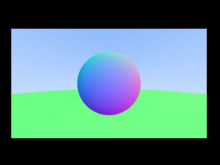</center>

# Diffuse Materials
Now that we have objects and multiple rays per pixel, we can make some realistic looking materials. We’ll start with diffuse materials .

One question is whether we ***mix and match geometry and materials*** (so that we can assign a material to multiple spheres, or vice versa) ***or if geometry and materials are tightly bound*** (which could be useful for procedural objects where the geometry and material are linked). We’ll go with separate — which is usual in most renderers

## A Simple Diffuse Material
***Diffuse objects that don’t emit their own light merely take on the color of their surroundings, but they do modulate that with their own intrinsic color***.Light that reflects off a diffuse surface has its direction randomized, so, if we send three rays into a crack between two diffuse surfaces they will each have different random behavior: 

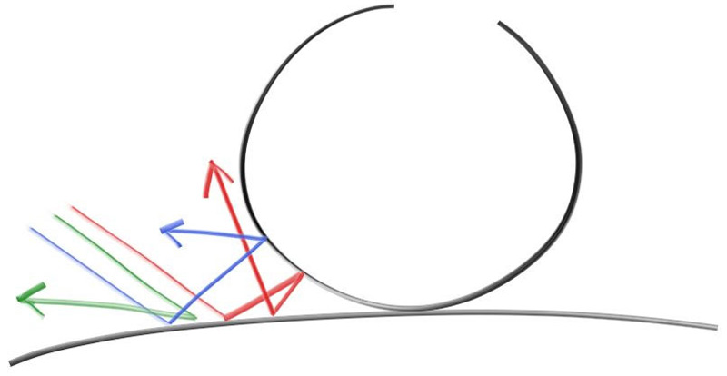

***They might also be absorbed rather than reflected. The darker the surface, the more likely the ray is absorbed (that’s why it's dark!)***.

Really any algorithm that randomizes direction will produce surfaces that look matte. Let's start with the most intuitive: a surface that randomly bounces a ray equally in all directions. For this material, a ray that hits the surface has an equal probability of bouncing in any direction away from the surface. 

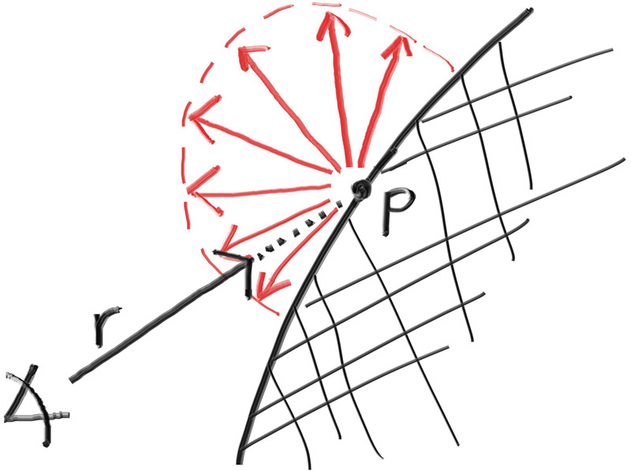

[Uniform hemisphere](https://songsmir.tistory.com/10): 

<center>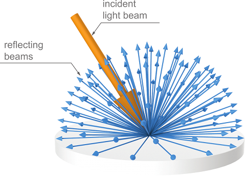</center>


he first thing we need is the ability to generate arbitrary random vectors: 

vec3.h
``` c
class vec3 {
  public:
    ...

    double length_squared() const {
        return e[0]*e[0] + e[1]*e[1] + e[2]*e[2];
    }

    static vec3 random() {
        return vec3(random_double(), random_double(), random_double());
    }

    static vec3 random(double min, double max) {
        return vec3(random_double(min,max), random_double(min,max), random_double(min,max));
    }
};
```

Then we need to figure out how to manipulate a random vector so that we only ***get results that are on the surface of a hemisphere.*** There are analytical methods of doing this, but they are actually surprisingly complicated to understand, and quite a bit complicated to implement. 

Instead, we'll use what is typically the easiest algorithm: ***A rejection method***. A rejection method works by repeatedly generating random samples until we produce a sample that meets the desired criteria. In other words, ***keep rejecting bad samples until you find a good one.***

1. Generate a random vector inside the unit sphere
2. Normalize this vector to extend it to the sphere surface
3. Invert the normalized vector if it falls onto the wrong hemisphere

First, we will use a rejection method to generate the random vector inside the unit sphere (that is, a sphere of radius 1). Pick a random point inside the cube enclosing the unit sphere (that is, where $x$, $y$, and $z$ are all in the range $[−1,+1]$). 
If this point lies outside the unit sphere, then generate a new one until we find one that lies inside or on the unit sphere. 

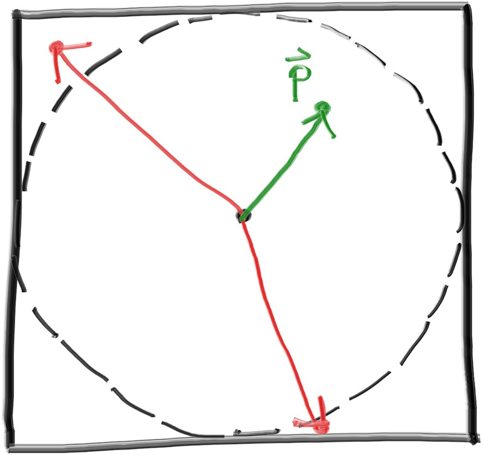

    \mathrm{pre-normalization}

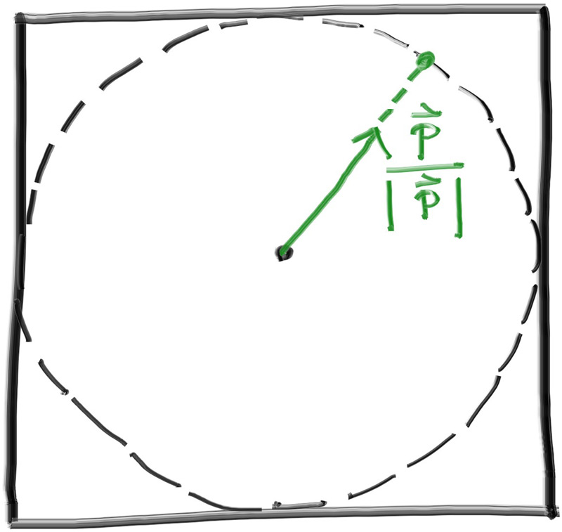

    \mathrm{normalized}

vec3.h

```c
inline vec3 unit_vector(const vec3& v) {
    return v / v.length();
}

inline vec3 random_unit_vector() {
    while (true)
    {
        auto p = vec3::random(-1, 1);
        auto lensq = p.length_squared();
        if (lensq <= 1) {
            return p/sqrt(lensq);
        }
    }
}
```

Sadly, we have a ***small floating-point abstraction leak to deal with***. Since floating-point numbers have finite precision. a very small value can underflow to zero when squared. So if all three coordinates are small enough (that is, very near the center of the sphere), the norm of the vector will be zero, and thus normalizing will yield the bogus vector $[±∞,±∞,±∞]$.

To fix this, ***we'll also reject points that lie inside this “black hole” around the center***. With double precision (64-bit floats), we can safely support values greater than $10^{-160}$. 

``` c
inline vec3 random_unit_vector() {
    while (true) {
        auto p = vec3::random(-1,1);
        auto lensq = p.length_squared();
        if (1e-160 < lensq && lensq <= 1)
            return p / sqrt(lensq);
    }
}
```

Now that we have a random unit vector, ***we can determine if it is on the correct hemisphere by comparing against the surface normal:***

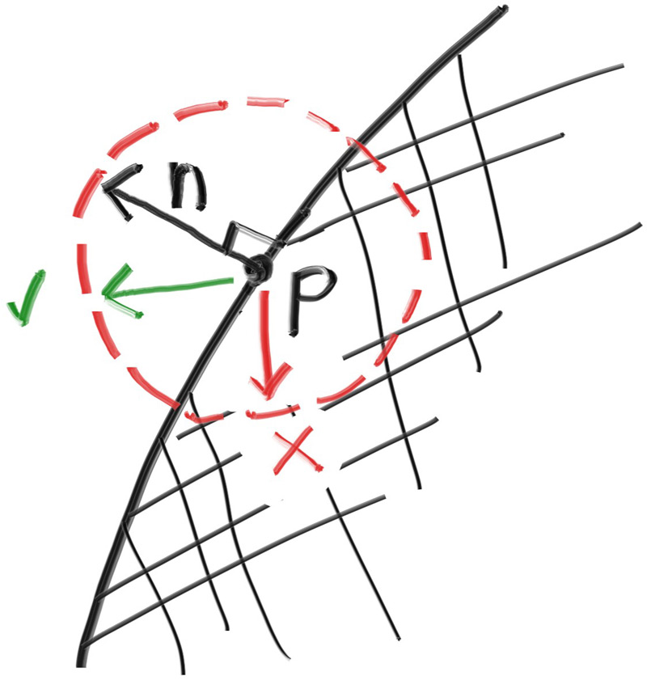

vec3.h
``` c
inline vec3 random_unit_vector() {
    while (true) {
        auto p = vec3::random(-1,1);
        auto lensq = p.length_squared();
        if (1e-160 < lensq && lensq <= 1)
            return p / sqrt(lensq);
    }
}

inline vec3 random_on_hemisphere(const vec3& normal) {
    vec3 on_unit_sphere = random_unit_vector();
    if (dot(on_unit_sphere, normal) > 0.0) // In the same hemisphere as the normal
        return on_unit_sphere;
    else
        return -on_unit_sphere;
}
```

- If a ray bounces off of a material and keeps 100% of its color, then we say that the material is white.
- If a ray bounces off of a material and keeps 0% of its color, then we say that the material is black.
- As a first demonstration of our new diffuse material we'll set the ray_color function to return 50% of the color from a bounce. We should expect to get a nice gray color. 

camera.h
``` c
class camera {
  ...
  private:
    ...
    color ray_color(const ray& r, const hittable& world) const {
        hit_record rec;

        if (world.hit(r, interval(0, infinity), rec)) {
            vec3 direction = random_on_hemisphere(rec.normal);
            // bounce -> Global Illumination
            return 0.5 * ray_color(ray(rec.p, direction), world);
        }
        ...
    }
};
```

<center>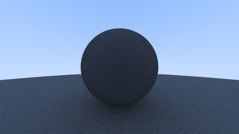</center>


Summary:
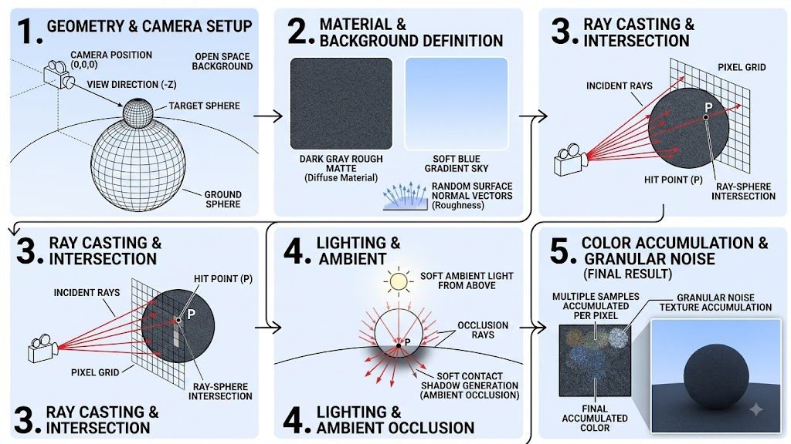

## Limiting the Number of Child Rays
There's one potential problem lurking here. Notice that the ***ray_color function is recursive. When will it stop recursing?*** 

When it fails to hit anything. In some cases, however, that may be a long time — long enough to blow the stack. To guard against that, ***let's limit the maximum recursion depth***, returning no light contribution at the maximum depth: 

camera.h
``` c
class camera {
  public:
    double aspect_ratio      = 1.0;  // Ratio of image width over height
    int    image_width       = 100;  // Rendered image width in pixel count
    int    samples_per_pixel = 10;   // Count of random samples for each pixel
    int    max_depth         = 10;   // Maximum number of ray bounces into scene

    void render(const hittable& world) {
        initialize();

        std::cout << "P3\n" << image_width << ' ' << image_height << "\n255\n";

        for (int j = 0; j < image_height; j++) {
            std::clog << "\rScanlines remaining: " << (image_height - j) << ' ' << std::flush;
            for (int i = 0; i < image_width; i++) {
                color pixel_color(0,0,0);
                for (int sample = 0; sample < samples_per_pixel; sample++) {
                    ray r = get_ray(i, j);
                    pixel_color += ray_color(r, max_depth, world);
                }
                write_color(std::cout, pixel_samples_scale * pixel_color);
            }
        }

        std::clog << "\rDone.                 \n";
    }
    ...
  private:
    ...
    color ray_color(const ray& r, int depth, const hittable& world) const {
        // If we've exceeded the ray bounce limit, no more light is gathered.
        if (depth <= 0)
            return color(0,0,0);

        hit_record rec;

        if (world.hit(r, interval(0, infinity), rec)) {
            vec3 direction = random_on_hemisphere(rec.normal);
            return 0.5 * ray_color(ray(rec.p, direction), depth-1, world);
        }

        vec3 unit_direction = unit_vector(r.direction());
        auto a = 0.5*(unit_direction.y() + 1.0);
        return (1.0-a)*color(1.0, 1.0, 1.0) + a*color(0.5, 0.7, 1.0);
    }
};
```

main.c

``` c
int main() {
    ...

    camera cam;

    cam.aspect_ratio      = 16.0 / 9.0;
    cam.image_width       = 400;
    cam.samples_per_pixel = 100;
    cam.max_depth         = 50;

    cam.render(world);
}
```
## Fixing Shadow Acne
Scattering reflected rays evenly about the hemisphere produces a nice soft diffuse model, but we can definitely do better. A more accurate representation of real diffuse objects is the Lambertian distribution.

This distribution scatters reflected rays in a manner that is proportional to $cos(ϕ)$, where $ϕ$ is the angle between the reflected ray and the surface normal.

This means that a reflected ray is most likely to scatter in a direction near the surface normal, and less likely to scatter in directions away from the normal.

**Lambert's Cosine Law**
$$
I(\phi) \propto \cos(\phi)
$$
- At an angle $\phi = 0^\circ$ (pointing straight up), $\cos(0) = 1$. This has the highest probability.
- At an angle $\phi = 90^\circ$ (horizontal/grazing angle), $\cos(90) = 0$. This has zero probability.

<center>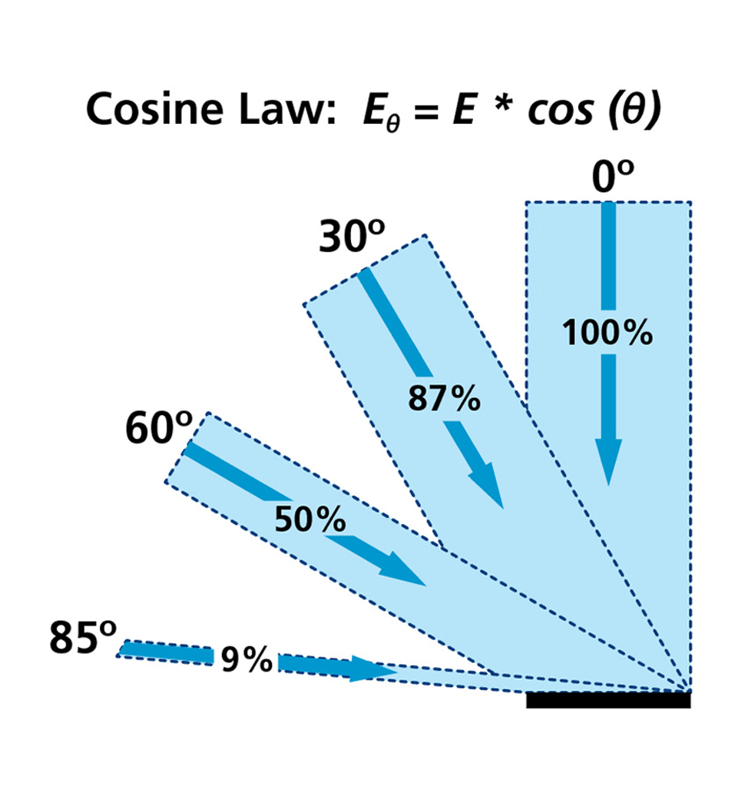</center>


**The Geometric Trick: Point S and $(n + r)$**

The point S is the geometric proof that $(n + r)$ actually creates the cosine distribution. Without expensive trigonometric functions (like sin, cos, tan), or complicated calculus sampling, we use a simple geometric hack.

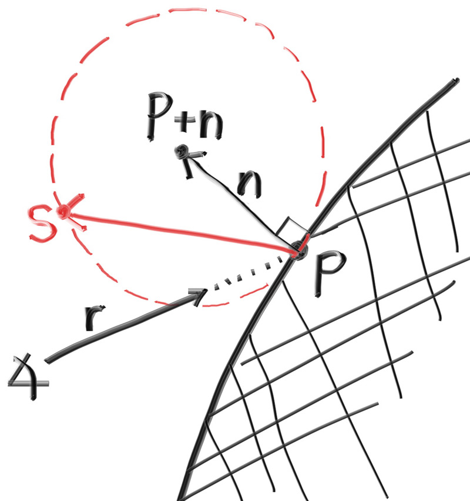

1. We have the intersection point $P$ and the surface normal $n$.
2. We imagine a unit sphere (radius = 1) tangent to the surface at point P. Its center $C$ is displaced by 1 in the direction of $n$. Therefore, center $C = P + n$.
3. We pick a random point $S$ on the surface of this imaginary sphere. We generate $S$ by generating a random unit vector $r$ and adding it to the sphere's center $C$.

```math
S = C + r \Rightarrow S = (P + n) + r
```

    The final reflected ray goes from point P to point S:

```math
\mathrm{Vector\ Direction} = (S - P)
```
```math
\mathrm{Vector\ Direction} = [(P + n) + r] - P = n + r
```
```math
\mathrm{Vector\ Direction} = \mathrm{rec.normal} + \mathrm{randomUnitVector}()
```

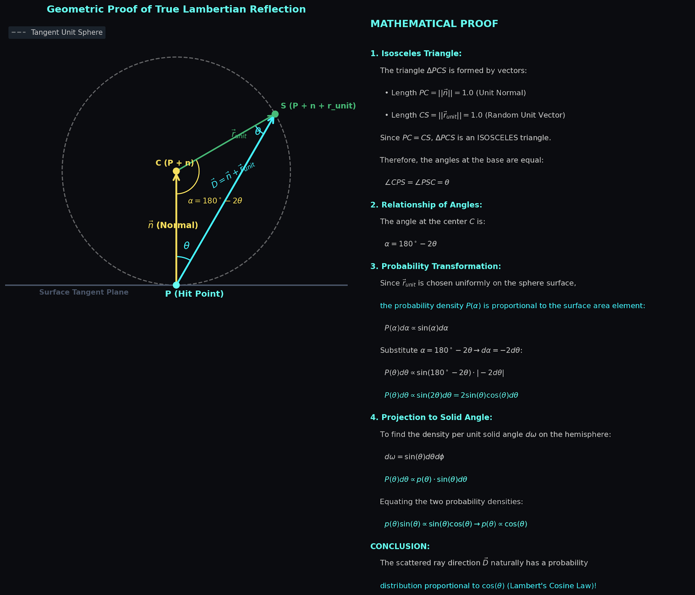

camera.h
```c
class camera {
    ...
    color ray_color(const ray& r, int depth, const hittable& world) const {
        // If we've exceeded the ray bounce limit, no more light is gathered.
        if (depth <= 0)
            return color(0,0,0);

        hit_record rec;

        if (world.hit(r, interval(0.001, infinity), rec)) {
            vec3 direction = rec.normal + random_unit_vector();
            return 0.5 * ray_color(ray(rec.p, direction), depth-1, world);
        }

        vec3 unit_direction = unit_vector(r.direction());
        auto a = 0.5*(unit_direction.y() + 1.0);
        return (1.0-a)*color(1.0, 1.0, 1.0) + a*color(0.5, 0.7, 1.0);
    }
};
```

<center>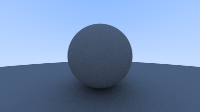</center>

## Using Gamma Correction for Accurate Color Intensity

Note the shadowing under the sphere. The picture is very dark, but our spheres only absorb half the energy of each bounce, so they are 50% reflectors. The spheres should look pretty bright (in real life, a light grey) but they appear to be rather dark. 

We can see this more clearly if we walk through the full brightness gamut for our diffuse material. We start by setting the reflectance of the ray_color function from 0.5 (50%) to 0.1 (10%): 
``` c
class camera {
    ...
    color ray_color(const ray& r, int depth, const hittable& world) const {
        // If we've exceeded the ray bounce limit, no more light is gathered.
        if (depth <= 0)
            return color(0,0,0);

        hit_record rec;

        if (world.hit(r, interval(0.001, infinity), rec)) {
            vec3 direction = rec.normal + random_unit_vector();
            return 0.1 * ray_color(ray(rec.p, direction), depth-1, world);
        }

        vec3 unit_direction = unit_vector(r.direction());
        auto a = 0.5*(unit_direction.y() + 1.0);
        return (1.0-a)*color(1.0, 1.0, 1.0) + a*color(0.5, 0.7, 1.0);
    }
};
```
<center>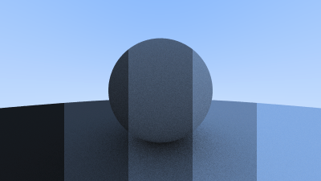</center>

Indeed, the 70% reflector is closer to middle-gray. The reason for this is that almost all computer programs assume that an image is ***“gamma corrected”*** before being written into an image file. 

This means that the 0 to 1 values have some transform applied before being stored as a byte. Images with data that are written without being transformed are said to be in linear space, whereas images that are transformed are said to be in ***gamma space***. ***This is the reason why our image appears inaccurately dark.*** 

- Linear Space: This is the mathematical "reality" inside our ray tracer. When we calculate a color component of $0.5$, it means 50% of the light photons.
- Gamma Space: To correct this, standard images (JPEGs, PNGs) and image viewers expect image data to be pre-transformed before being saved. They expect the intensity values to be "brightened" mathematically. This is called Gamma Space.


**Applying Gamma 2 Transform**

We need to transform our calculated Linear data into Gamma data before writing it to the image file.
- Formulas: A common approximation is Gamma 2.
    - Moving from Gamma Space (stored) $\to$ Linear Space (display):

```math
Brightness_{\mathrm{linear}} = (Stored_{\mathrm{gamma}})^2
```

    - Moving from Linear Space (computed) $\to$ Gamma Space (storage):

```math
Stored_{\mathrm{gamma}} = (Brightness_{\mathrm{linear}})^{1/2}
```


color.h
``` c
inline double linear_to_gamma(double linear_component)
{
    if (linear_component > 0)
        return std::sqrt(linear_component);

    return 0;
}

void write_color(std::ostream& out, const color& pixel_color) {
    auto r = pixel_color.x();
    auto g = pixel_color.y();
    auto b = pixel_color.z();

    // Apply a linear to gamma transform for gamma 2
    r = linear_to_gamma(r);
    g = linear_to_gamma(g);
    b = linear_to_gamma(b);

    // Translate the [0,1] component values to the byte range [0,255].
    static const interval intensity(0.000, 0.999);
    int rbyte = int(256 * intensity.clamp(r));
    int gbyte = int(256 * intensity.clamp(g));
    int bbyte = int(256 * intensity.clamp(b));

    // Write out the pixel color components.
    out << rbyte << ' ' << gbyte << ' ' << bbyte << '\n';
}
```

<center>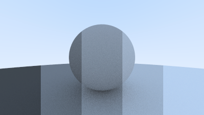</center>


# Metal

## An Abstract Class for Materials

We could have an abstract material class that encapsulates unique behavior.
- Produce a scattered ray (or say it absorbed the incident ray).
- If scattered, say how much the ray should be attenuated.

This suggests the abstract class:  material.h
``` c
#ifndef MATERIAL_H
#define MATERIAL_H

#include "hittable.h"

class material {
  public:
    virtual ~material() = default;

    virtual bool scatter(
        const ray& r_in, const hit_record& rec, color& attenuation, ray& scattered
    ) const {
        return false;
    }
};

#endif
```

## A Data Structure to Describe Ray-Object Intersections
Hittables and materials need to be able to reference the other's type in code so there is some circularity of the references.

In C++ we add the line class material; to tell the compiler that material is a class that will be defined later. Since we're just specifying a pointer to the class, the compiler doesn't need to know the details of the class, solving the circular reference issue. 

hittable.h
``` c
class material;

class hit_record {
  public:
    point3 p;
    vec3 normal;
    shared_ptr<material> mat;
    double t;
    bool front_face;

    void set_face_normal(const ray& r, const vec3& outward_normal) {
        front_face = dot(r.direction(), outward_normal) < 0;
        normal = front_face ? outward_normal : -outward_normal;
    }
};
```

When a ray hits a surface (a particular sphere for example), ***the material pointer in the hit_record will be set to point at the material pointer*** the sphere was given when it was set up in ***main()*** when we start.

When the ***ray_color()*** routine gets the ***hit_record*** it can call member functions of the ***material pointer to find out what ray, if any, is scattered.*** 

sphere.h
``` c
class sphere : public hittable {
  public:
    sphere(const point3& center, double radius) : center(center), radius(std::fmax(0,radius)) {
        // TODO: Initialize the material pointer `mat`.
    }

    bool hit(const ray& r, interval ray_t, hit_record& rec) const override {
        ...

        rec.t = root;
        rec.p = r.at(rec.t);
        vec3 outward_normal = (rec.p - center) / radius;
        rec.set_face_normal(r, outward_normal);
        rec.mat = mat;

        return true;
    }

  private:
    point3 center;
    double radius;
    shared_ptr<material> mat;
};
```

## Modeling Light Scatter and Reflectance
We will use the term **albedo** (Latin for “whiteness”). Albedo is a precise technical term in some disciplines, but in all cases it is used to define some form of ***fractional reflectance***.

Albedo will vary with material color and (as we will later implement for glass materials) can also vary with incident viewing direction (the direction of the incoming ray). 

Lambertian (diffuse) reflectance can either always scatter and attenuate light according to its reflectance $R$, or it can sometimes scatter (with probability $1−R$) with no attenuation (where a ray that isn't scattered is just absorbed into the material). 

material.h
``` c
class material {
    ...
};

class lambertian : public material {
  public:
    lambertian(const color& albedo) : albedo(albedo) {}

    bool scatter(const ray& r_in, const hit_record& rec, color& attenuation, ray& scattered)
    const override {
        auto scatter_direction = rec.normal + random_unit_vector();
        scattered = ray(rec.p, scatter_direction);
        attenuation = albedo;
        return true;
    }

  private:
    color albedo;
};
```

If the random unit vector we generate is exactly ***opposite the normal vector, the two will sum to zero***, which will result in a zero scatter direction vector. This leads to bad scenarios later on (infinities and NaNs), so we need to intercept the condition before we pass it on. 

In service of this, we'll create a new vector method — ***vec3::near_zero()*** — that returns true if the vector is very close to zero in all dimensions. 

vec3.h
``` c
class vec3 {
    ...

    double length_squared() const {
        return e[0]*e[0] + e[1]*e[1] + e[2]*e[2];
    }

    bool near_zero() const {
        // Return true if the vector is close to zero in all dimensions.
        auto s = 1e-8;
        return (std::fabs(e[0]) < s) && (std::fabs(e[1]) < s) && (std::fabs(e[2]) < s);
    }

    ...
};
```

material.h
``` c
class lambertian : public material {
  public:
    lambertian(const color& albedo) : albedo(albedo) {}

    bool scatter(const ray& r_in, const hit_record& rec, color& attenuation, ray& scattered)
    const override {
        auto scatter_direction = rec.normal + random_unit_vector();

        // Catch degenerate scatter direction
        if (scatter_direction.near_zero())
            scatter_direction = rec.normal;

        scattered = ray(rec.p, scatter_direction);
        attenuation = albedo;
        return true;
    }

  private:
    color albedo;
};
```
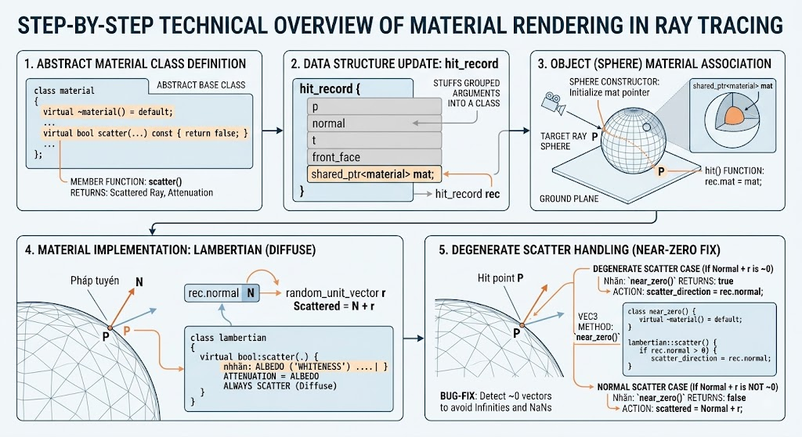


## Mirrored Light Reflection

For polished metals the ray won’t be randomly scattered. The key question is: How does a ray get reflected from a metal mirror?

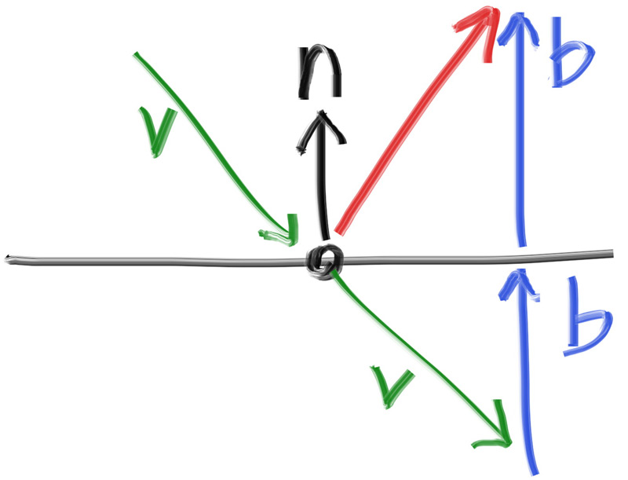

- The reflected ray direction in red is just $v+2b$. 
- $n$ is a unit vector (length one)
- vector $b$, we scale the normal vector by the length of the projection of v onto n
- which is given by the dot product $dot(v, n)$. (If n were not a unit vector, we would also need to divide this dot product by the length of $n$.)
- Finally, because $v$ points into the surface, and we want $b$ to point out of the surface, we need to negate this projection length. $-dot(v, n)$

$$
b = -\operatorname{dot}(v, n) \times n
$$
$$
V_{\text{reflect}} = v - 2 \times \operatorname{dot}(v, n) \times n
$$

vec3.h
``` c
inline vec3 random_on_hemisphere(const vec3& normal) {
    ...
}

inline vec3 reflect(const vec3& v, const vec3& n) {
    return v - 2*dot(v,n)*n;
}
```

material.h
``` c
class lambertian : public material {
    ...
};

class metal : public material {
  public:
    metal(const color& albedo) : albedo(albedo) {}

    bool scatter(const ray& r_in, const hit_record& rec, color& attenuation, ray& scattered)
    const override {
        vec3 reflected = reflect(r_in.direction(), rec.normal);
        scattered = ray(rec.p, reflected);
        attenuation = albedo;
        return true;
    }

  private:
    color albedo;
};
```

camera.h
``` c
#include "hittable.h"
#include "material.h"
...

class camera {
  ...
  private:
    ...
    color ray_color(const ray& r, int depth, const hittable& world) const {
        // If we've exceeded the ray bounce limit, no more light is gathered.
        if (depth <= 0)
            return color(0,0,0);

        hit_record rec;

        if (world.hit(r, interval(0.001, infinity), rec)) {
            ray scattered;
            color attenuation;
            if (rec.mat->scatter(r, rec, attenuation, scattered))
                return attenuation * ray_color(scattered, depth-1, world);
            return color(0,0,0);
        }

        vec3 unit_direction = unit_vector(r.direction());
        auto a = 0.5*(unit_direction.y() + 1.0);
        return (1.0-a)*color(1.0, 1.0, 1.0) + a*color(0.5, 0.7, 1.0);
    }
};
```

sphere.h
```c
class sphere : public hittable {
  public:
    sphere(const point3& center, double radius, shared_ptr<material> mat)
      : center(center), radius(std::fmax(0,radius)), mat(mat) {}

    ...
};
```

## A Scene with Metal Spheres
main.c
``` c
#include "rtweekend.h"

#include "camera.h"
#include "hittable.h"
#include "hittable_list.h"
#include "material.h"
#include "sphere.h"

int main() {
    hittable_list world;

    auto material_ground = make_shared<lambertian>(color(0.8, 0.8, 0.0));
    auto material_center = make_shared<lambertian>(color(0.1, 0.2, 0.5));
    auto material_left   = make_shared<metal>(color(0.8, 0.8, 0.8));
    auto material_right  = make_shared<metal>(color(0.8, 0.6, 0.2));

    world.add(make_shared<sphere>(point3( 0.0, -100.5, -1.0), 100.0, material_ground));
    world.add(make_shared<sphere>(point3( 0.0,    0.0, -1.2),   0.5, material_center));
    world.add(make_shared<sphere>(point3(-1.0,    0.0, -1.0),   0.5, material_left));
    world.add(make_shared<sphere>(point3( 1.0,    0.0, -1.0),   0.5, material_right));

    camera cam;

    cam.aspect_ratio      = 16.0 / 9.0;
    cam.image_width       = 400;
    cam.samples_per_pixel = 100;
    cam.max_depth         = 50;

    cam.render(world);
}
```

<center>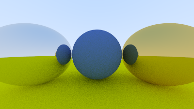</center>

## Fuzzy Reflection
We can also randomize the reflected direction by using a small sphere and choosing a new endpoint for the ray. We'll use a random point from the surface of a sphere centered on the original endpoint, scaled by the fuzz factor. 
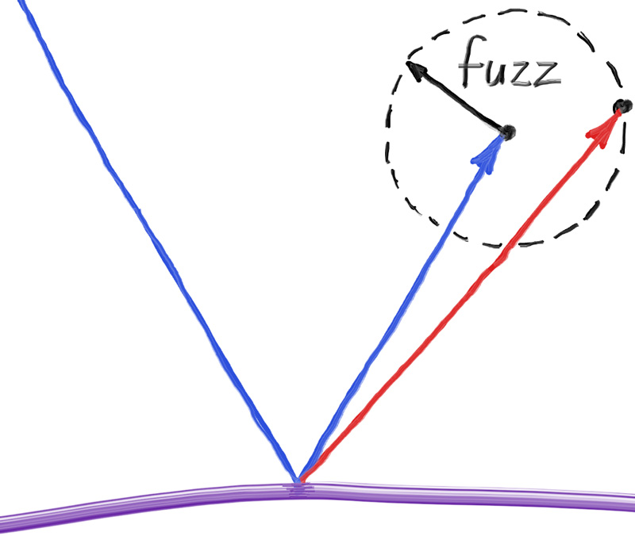

***The bigger the fuzz sphere, the fuzzier the reflections will be***. ***This suggests adding a fuzziness parameter that is just the radius of the sphere (so zero is no perturbation)***. The catch is that for big spheres or grazing rays, we may scatter below the surface. We can just have the surface absorb those. 

Also note that in order for the fuzz sphere to make sense, ***it needs to be consistently scaled compared to the reflection vector, which can vary in length arbitrarily***. To address this, we need to normalize the reflected ray. 

``` c
class metal : public material {
  public:
    metal(const color& albedo, double fuzz) : albedo(albedo), fuzz(fuzz < 1 ? fuzz : 1) {}

    bool scatter(const ray& r_in, const hit_record& rec, color& attenuation, ray& scattered)
    const override {
        vec3 reflected = reflect(r_in.direction(), rec.normal);
        reflected = unit_vector(reflected) + (fuzz * random_unit_vector());
        scattered = ray(rec.p, reflected);
        attenuation = albedo;
        return (dot(scattered.direction(), rec.normal) > 0);
    }

  private:
    color albedo;
    double fuzz;
};
``` 

**Summary:**
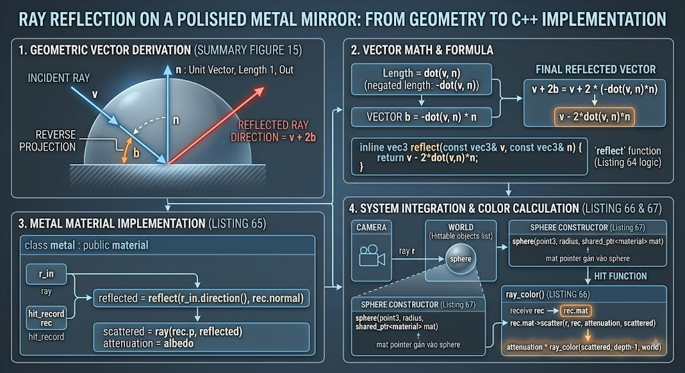

# Dielectrics

Clear materials such as water, glass, and diamond are dielectrics. ***When a light ray hits them, it splits into a reflected ray and a refracted (transmitted) ray***. We’ll handle that by randomly choosing between reflection and refraction, ***only generating one scattered ray per interaction***.  

As a quick review of terms, a reflected ray hits a surface and then ***“bounces”*** off in a new direction. 

A ***refracted*** ray bends as it transitions from a material's surroundings into the material itself (as with glass or water). This is why a pencil looks bent when partially inserted in water. 

The amount that a refracted ray bends is determined by the material's ***refractive index***. Generally, this is a single value that describes how much light bends when entering a material from a vacuum. Glass has a refractive index of something like 1.5–1.7, diamond is around 2.4, and air has a small refractive index of 1.000293. 

When a transparent material is embedded in a different transparent material, you can describe the refraction with a ***relative refraction index***: ***the refractive index of the object's material divided by the refractive index of the surrounding material.*** 

**For example**: if you want to render a glass ball under water, then the glass ball would have an effective refractive index of 1.125. This is given by the refractive index of glass (1.5) divided by the refractive index of water (1.333). 

## Refraction
The hardest part to debug is the refracted ray. I usually first just have all the light refract if there is a refraction ray at all. For this project, I tried to put two glass balls in our scene:

<center>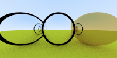</center>

Is that right? Glass balls look odd in real life. But no, it isn’t right. The world should be flipped upside down and no weird black stuff. 

## Snell's Law
The refraction is described by Snell's law:

$$
\eta \cdot \sin\theta = \eta' \cdot \sin\theta'
$$

- Where $\theta$ and $\theta'$ are the angles from the normal.
- $\eta$ and $\eta'$ (pronounced "eta" and "eta prime") are the refractive indices. The geometry is:
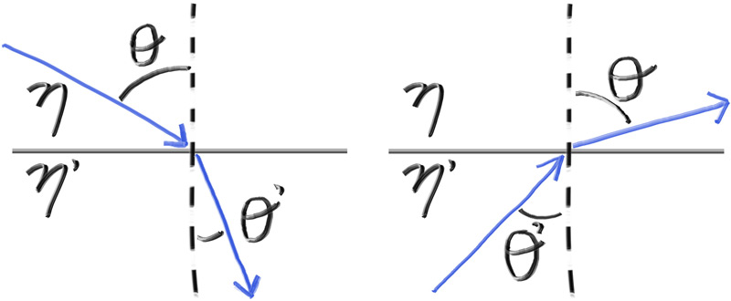

In order to determine the direction of the refracted ray, we have to solve for $\sin\theta'$:

$$
\sin\theta' = \frac{\eta}{\eta'} \cdot \sin\theta
$$

On the refracted side of the surface there is a refracted ray $R'$ and a normal $n'$, and there exists an angle, $θ'$, between them. We can split $R'$ into the parts of the ray that are perpendicular to $n'$ and parallel to $n'$: 

$$
R' = R'_{\perp} + R'_{\parallel}
$$

Dot Product:
$$
\cos\theta = -R \cdot n
$$
1. From the geometric definition of the dot product between two unit vectors $a$ and $b$:

    $a \cdot b = \left\lvert a \right\rvert \left\lvert b \right\rvert \cos(\text{angle between } a, b)$.

    Since lengths are 1, $a \cdot b = \cos(\text{angle between } a, b)$.
2. Analyze the angle of incidence $\theta$: It is defined as the angle between the normal vector $n$ (pointing outward) and the incident ray vector when flipped $-R$ (pointing outward).
3. Apply the dot product formula to vectors $n$ and $-R$:

    $n \cdot (-R) = \cos\theta$.
4. Using dot product properties: $n \cdot (-R) = -(n \cdot R) = -(R \cdot n)$.
4. Therefore: $\cos\theta = -R \cdot n$.

The Perpendicular Component Vector $R'_{\perp}$:

1. Find Magnitude of $R'_{\perp}$:

    - Consider the right triangle formed by vector $R'$ and its components. The component orthogonal to the normal has magnitude $\left\lvert R'_{\perp} \right\rvert = \left\lvert R' \right\rvert \sin\theta'$. Since $\left\lvert R' \right\rvert = 1$, $\left\lvert R'_{\perp} \right\rvert = \sin\theta'$.

    - Apply Snell's law, $\eta \sin\theta = \eta' \sin\theta'$, rewritten to isolate $\sin\theta'$: $\sin\theta' = \frac{\eta}{\eta'} \sin\theta$.

    - Substitute $r = \frac{\eta}{\eta'}$. The magnitude is $\left\lvert R'_{\perp} \right\rvert = r \sin\theta$.

2. Find Direction of $R'_{\perp}$:

    - By the Law of Refraction, the incident ray, the surface normal, and the refracted ray lie in the same plane. Therefore, the "horizontal" or perpendicular direction of the refracted ray is the same as the perpendicular direction of the incident ray.

    - Let $R_\perp$ represent the vector of the perpendicular component of incoming ray $R$ relative to normal $n$.

3. Find Vector $R_\perp$ (Perpendicular component of incident ray $R$):

    - We can orthogonally decompose incident ray $R$ along normal $n$: $R = R_{\perp\_normal} + R_{\parallel\_normal}$.

    - The component of $R$ parallel to outward normal $n$ is the projection of $R$ onto $n$: $R_{\parallel\_normal} = (R \cdot n)n$.

    - Therefore, the vector component of $R$ perpendicular to normal $n$ (lying in the surface plane) is found by subtracting the parallel component from the total vector $R$. In other words, $R_{\perp\_normal} = R - R_{\parallel\_normal} = R - (R \cdot n)n$.

    - Substitute the previous result $\cos\theta = -R \cdot n$: $R_{\perp} = R - (-\cos\theta)n = R + \cos\theta n$.

    (Note that physically, this vector points in the direction lying along the surface plane away from the intersection point, and its magnitude is $\left\lvert R_{\perp} \right\rvert = \left\lvert R \right\rvert \sin\theta = \sin\theta$).

4. Assemble Vector $R'_{\perp}$:

    - The required vector $R'_{\perp}$ is assembled by taking its known magnitude ($r \sin\theta$ from step 1) and multiplying it by the unit direction vector. $\left\lvert R_{\perp} \right\rvert = \left\lvert R \right\rvert \sin\theta = \sin\theta$.

    - The unit direction lying tangent to the surface derived from incident ray $R$ is $t = \frac{R_{\perp}}{\left\lvert R_{\perp} \right\rvert} = \frac{R_{\perp}}{\sin\theta}$.

```math
R'_{\perp} = \left\lvert R'_{\perp} \right\rvert \cdot t
```

```math
R'_{\perp} = (r \sin\theta) \cdot \frac{R_{\perp}}{\sin\theta}
```

Therefore,

```math
R'_{\perp} = r R_{\perp}
```


$$
R'_{\perp} = \frac{\eta}{\eta'}(R + \cos\theta n)
$$

Proof of the Parallel Component Vector $R'_{\parallel}$:
1. Find Magnitude of $R'_{\parallel}$:
        - Consider the right triangle formed by the unit vector $R'$ and its perpendicular and parallel components. By the Pythagorean theorem, $\left\lvert R' \right\rvert^2 = \left\lvert R'_{\perp} \right\rvert^2 + \left\lvert R'_{\parallel} \right\rvert^2$.
    - Since $\left\lvert R' \right\rvert = 1$, $1 = \left\lvert R'_{\perp} \right\rvert^2 + \left\lvert R'_{\parallel} \right\rvert^2$.
    - Rearrange and solve for the required magnitude: $\left\lvert R'_{\parallel} \right\rvert = \sqrt{1 - \left\lvert R'_{\perp} \right\rvert^2}$.

    Optionally note that physically, $\left\lvert R'_{\parallel} \right\rvert = \left\lvert R' \right\rvert \cos\theta' = \cos\theta'$. The radical form used in code avoids explicit angle calculation via trigonometry by using $1 - \sin^2\theta' = \cos^2\theta'$ applied to components.

2. Find Direction of $R'_{\parallel}$:
    -Based on geometry, the refracted ray $R'$ travels deeper into the material, away from the outward normal vector $n$. Therefore, its parallel component vector must point in the opposite direction of normal vector $n$ (which points out).
    - The inward unit direction is: $-n$.
3. Assemble Vector $R'_{\parallel}$:
        - Assemble by taking known magnitude and multiplying by direction: $R'_{\parallel} = (\text{magnitude}) \times (\text{direction}) = \left\lvert R'_{\parallel} \right\rvert \cdot (-n)$.

            Therefore,
            $R'_{\parallel} = \sqrt{1 - \left\lvert R'_{\perp} \right\rvert^2} \cdot (-n) = -\sqrt{1 - \left\lvert R'_{\perp} \right\rvert^2} \cdot n$.


vec3.h
``` c
inline vec3 reflect(const vec3& v, const vec3& n) {
    return v - 2*dot(v,n)*n;
}

inline vec3 refract(const vec3& uv, const vec3& n, double etai_over_etat) {
    auto cos_theta = std::fmin(dot(-uv, n), 1.0);
    vec3 r_out_perp =  etai_over_etat * (uv + cos_theta*n);
    vec3 r_out_parallel = -std::sqrt(std::fabs(1.0 - r_out_perp.length_squared())) * n;
    return r_out_perp + r_out_parallel;
}
```
And the dielectric material that always refracts is: 

material.h
``` c

class metal : public material {
    ...
};

class dielectric : public material {
  public:
    dielectric(double refraction_index) : refraction_index(refraction_index) {}

    bool scatter(const ray& r_in, const hit_record& rec, color& attenuation, ray& scattered)
    const override {
        attenuation = color(1.0, 1.0, 1.0);// No Absorption
        double ri = rec.front_face ? (1.0/refraction_index) : refraction_index;

        vec3 unit_direction = unit_vector(r_in.direction());
        // hitting from outside or inside
        vec3 refracted = refract(unit_direction, rec.normal, ri);

        scattered = ray(rec.p, refracted);
        return true;
    }

  private:
    // Refractive index in vacuum or air, or the ratio of the material's refractive index over
    // the refractive index of the enclosing media
    double refraction_index;
};
```

main.c
``` c
auto material_ground = make_shared<lambertian>(color(0.8, 0.8, 0.0));
auto material_center = make_shared<lambertian>(color(0.1, 0.2, 0.5));
auto material_left   = make_shared<dielectric>(1.50);
auto material_right  = make_shared<metal>(color(0.8, 0.6, 0.2), 1.0);
```

## Total Internal Reflection

One troublesome practical issue with refraction is that there are ray angles for which no solution is possible using Snell's law.

When a ray enters a medium of lower index of refraction at a sufficiently glancing angle, it can refract with an angle greater than 90°. If we refer back to Snell's law and the derivation of $sinθ'$: 
$$
\sin\theta' = \frac{\eta}{\eta'} \cdot \sin\theta
$$
If the ray is inside glass and outside is air (η=1.5 and η′=1.0): 

$$
\sin\theta' = \frac{1.5}{1.0} \cdot \sin\theta = 1.5 \cdot \sin\theta
$$

The value of sinθ′ cannot be greater than 1. So, if, 
$$
\frac{1.5}{1.0} \cdot \sin\theta > 1.0
$$

The equality between the two sides of the equation is broken, and a solution cannot exist. If a solution does not exist, the glass cannot refract, and therefore must reflect the ray: 

material.h
``` c
if (ri * sin_theta > 1.0) {
    // Must Reflect
    ...
} else {
    // Can Refract
    ...
}
```

Here all the light is reflected, and because in practice that is usually inside solid objects, it is called ***total internal reflection.***
$$
\cos\theta = R \cdot n
$$

We can solve for sin_theta using the trigonometric identities: 
$$
\sin\theta = \sqrt{1 - \cos^2\theta}
$$

material.h
```c 
double cos_theta = std::fmin(dot(-unit_direction, rec.normal), 1.0);
double sin_theta = std::sqrt(1.0 - cos_theta*cos_theta);

if (ri * sin_theta > 1.0) {
    // Must Reflect
    ...
} else {
    // Can Refract
    ...
}
```

If we render the prior scene with the new dielectric::scatter() function, we see … no change. Huh? 

Well, it turns out that given a sphere of material with an index of refraction greater than air, there's no incident angle that will yield total internal reflection — neither at the ray-sphere entrance point nor at the ray exit. 

main.c

``` c
auto material_left   = make_shared<dielectric>(1.00 / 1.33);
```


<center>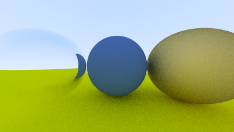</center>

**Summary:**

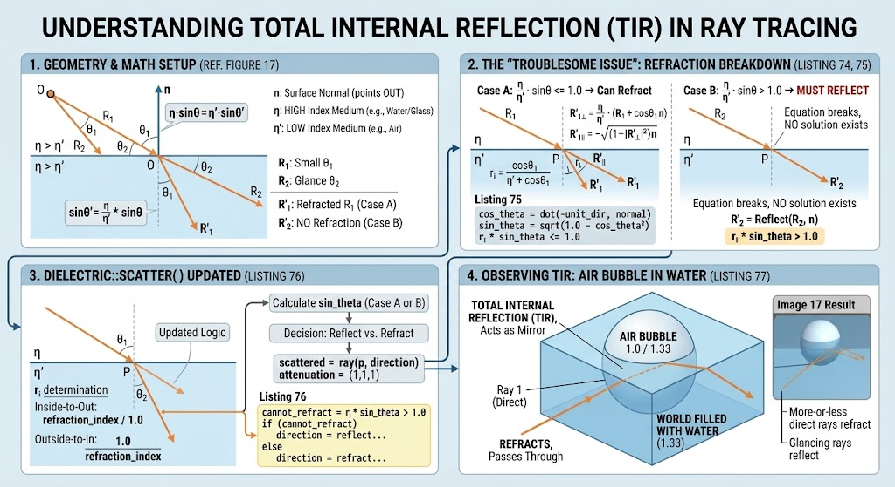

## Schlick Approximation

Now real glass has reflectivity that varies with angle — look at a window at a steep angle and it becomes a mirror. There is a big ugly equation for that, but almost everybody uses a cheap and surprisingly accurate

$$
R(\theta) = R_0 + (1 - R_0)(1 - \cos\theta)^5
$$

where

$$
R_0 = \left(\frac{1 - \eta_{ratio}}{1 + \eta_{ratio}}\right)^2
$$


material.h
``` c
class dielectric : public material {
  public:
    dielectric(double refraction_index) : refraction_index(refraction_index) {}

    bool scatter(const ray& r_in, const hit_record& rec, color& attenuation, ray& scattered)
    const override {
        attenuation = color(1.0, 1.0, 1.0);
        double ri = rec.front_face ? (1.0/refraction_index) : refraction_index;

        vec3 unit_direction = unit_vector(r_in.direction());
        double cos_theta = std::fmin(dot(-unit_direction, rec.normal), 1.0);
        double sin_theta = std::sqrt(1.0 - cos_theta*cos_theta);

        bool cannot_refract = ri * sin_theta > 1.0;
        vec3 direction;

        if (cannot_refract || reflectance(cos_theta, ri) > random_double())
            direction = reflect(unit_direction, rec.normal);
        else
            direction = refract(unit_direction, rec.normal, ri);

        scattered = ray(rec.p, direction);
        return true;
    }

  private:
    // Refractive index in vacuum or air, or the ratio of the material's refractive index over
    // the refractive index of the enclosing media
    double refraction_index;

    static double reflectance(double cosine, double refraction_index) {
        // Use Schlick's approximation for reflectance.
        auto r0 = (1 - refraction_index) / (1 + refraction_index);
        r0 = r0*r0;
        return r0 + (1-r0)*std::pow((1 - cosine),5);
    }
};
```
## Modeling a Hollow Glass Sphere

**The Concept:**

A hollow glass sphere is modeled as a thick glass shell. This requires two concentric spheres: an outer glass sphere and a smaller inner air sphere contained entirely within the first.

**Tracing the Ray Path:**

A ray traveling through such an object undergoes multiple interactions:

1. Enters from outside air, hits outer sphere surface $\rightarrow$ refracts into glass.
2. Travels through glass shell, hits outer surface of inner sphere $\rightarrow$ refracts from glass into inner air.
3. Travels through inner air, hits inner surface of inner sphere $\rightarrow$ refracts from air back into glass.
4. Travels through glass shell, hits inner surface of outer sphere $\rightarrow$ refracts from glass back into scene air.

Setting up the Refractive Indices (IOR):

The dielectric class takes a refraction_index parameter, which is interpreted as the ratio of the object's refractive index divided by the refractive index of the enclosing medium.

- Outer Sphere (Glass shell):
    - Material: Glass ($\approx 1.50$)
    - Enclosing medium: Outside Air ($\approx 1.00$)
    - Ratio: $1.50 / 1.00 = 1.50$.
    - Code: material_left = make_shared<dielectric>(1.50);
- Inner Sphere (Air bubble):
    - Material: Inside Air ($1.00$)
    - Enclosing medium: Glass shell ($\approx 1.50$)- Ratio: $1.00 / 1.50 \approx 0.67$.
    - Code: material_bubble = make_shared<dielectric>(1.00 / 1.50);

main.c
``` c
...
auto material_ground = make_shared<lambertian>(color(0.8, 0.8, 0.0));
auto material_center = make_shared<lambertian>(color(0.1, 0.2, 0.5));
// Standard Glass
auto material_left   = make_shared<dielectric>(1.50);
// Air medium inside Glass
auto material_bubble = make_shared<dielectric>(1.00 / 1.50);
auto material_right  = make_shared<metal>(color(0.8, 0.6, 0.2), 0.0);

world.add(make_shared<sphere>(point3( 0.0, -100.5, -1.0), 100.0, material_ground));
world.add(make_shared<sphere>(point3( 0.0,    0.0, -1.2),   0.5, material_center));
// Outer sphere (Glass shell), radius 0.5
world.add(make_shared<sphere>(point3(-1.0,    0.0, -1.0),   0.5, material_left));
// Inner sphere (Air bubble), SAME CENTER, smaller radius 0.4
world.add(make_shared<sphere>(point3(-1.0,    0.0, -1.0),   0.4, material_bubble));
world.add(make_shared<sphere>(point3( 1.0,    0.0, -1.0),   0.5, material_right));
...
```
<center>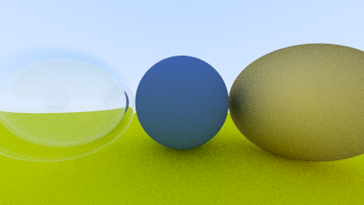</center>

# Positionable Camera
Cameras, like dielectrics, are a pain to debug, 

First, let’s allow for an adjustable field of view (fov). This is the visual angle from edge to edge of the rendered image. This is the visual angle from edge to edge of the rendered image. Since our image is not square, the fov is different horizontally and vertically. 

I always use vertical fov. I also usually specify it in degrees and change to radians inside a constructor

## Camera Viewing Geometry

First, we'll keep the rays coming from the origin and heading to the z=−1 plane. We could make it the z=−2 plane, or whatever, as long as we made h a ratio to that distance. Here is our setup: 

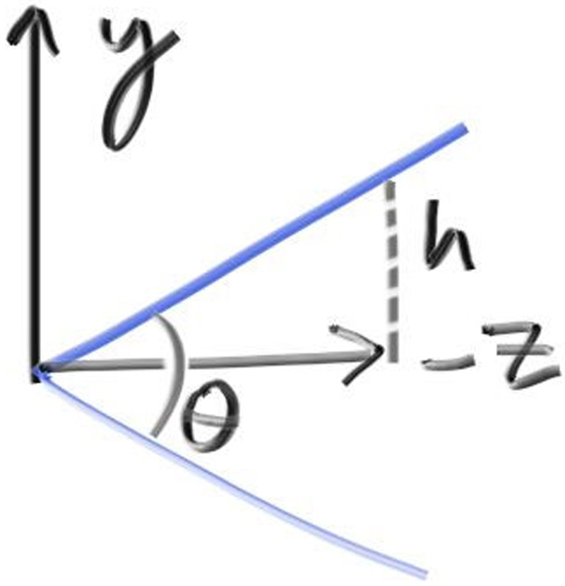

This implies $h=tan(\frac{θ}{2})$. Our camera now becomes: 

camera.h
``` c
class camera {
  public:
    double aspect_ratio      = 1.0;  // Ratio of image width over height
    int    image_width       = 100;  // Rendered image width in pixel count
    int    samples_per_pixel = 10;   // Count of random samples for each pixel
    int    max_depth         = 10;   // Maximum number of ray bounces into scene

    double vfov = 90;  // Vertical view angle (field of view)

    void render(const hittable& world) {
    ...

  private:
    ...

    void initialize() {
        image_height = int(image_width / aspect_ratio);
        image_height = (image_height < 1) ? 1 : image_height;

        pixel_samples_scale = 1.0 / samples_per_pixel;

        center = point3(0, 0, 0);

        // Determine viewport dimensions.
        auto focal_length = 1.0;
        auto theta = degrees_to_radians(vfov);
        auto h = std::tan(theta/2);
        auto viewport_height = 2 * h * focal_length;
        auto viewport_width = viewport_height * (double(image_width)/image_height);

        ...
    }

    ...
};
```

main.c
```c
int main() {
    hittable_list world;

    auto R = std::cos(pi/4);

    auto material_left  = make_shared<lambertian>(color(0,0,1));
    auto material_right = make_shared<lambertian>(color(1,0,0));

    world.add(make_shared<sphere>(point3(-R, 0, -1), R, material_left));
    world.add(make_shared<sphere>(point3( R, 0, -1), R, material_right));

    camera cam;

    cam.aspect_ratio      = 16.0 / 9.0;
    cam.image_width       = 400;
    cam.samples_per_pixel = 100;
    cam.max_depth         = 50;

    cam.vfov = 90;

    cam.render(world);
}
```

<center></center>

## Positioning and Orienting the Camera

To get an arbitrary viewpoint, let’s first name the points we care about. We’ll call the position where we place the camera ***lookfrom***, and the point we look at ***lookat***. (Later, if you want, you could define a direction to look in instead of a point to look at.) 

We also need a way to specify the ***roll***, or sideways tilt, of the camera: the rotation around the lookat-lookfrom axis. ***Another way to think about it is that even if you keep lookfrom and lookat constant***, you can still rotate your head around your nose. What we need is a way to specify an ***“up”*** vector for the camera. 

<center>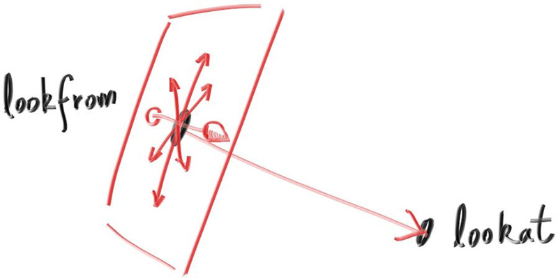</center>

We can specify any up vector we want, as long as it's not parallel to the view direction. 

Project this up vector onto the plane orthogonal to the view direction to get a camera-relative up vector. I use the common convention of naming this the ***“view up” (vup)*** vector.

After a few cross products and vector normalizations, we now have a complete orthonormal basis $(u,v,w)$ to describe our camera’s orientation.

- $u$ will be the unit vector pointing to camera right
- $v$ is the unit vector pointing to camera up
- $w$ is the unit vector pointing opposite the view direction 

(since we use right-hand coordinates), and the camera center is at the origin. 

<center>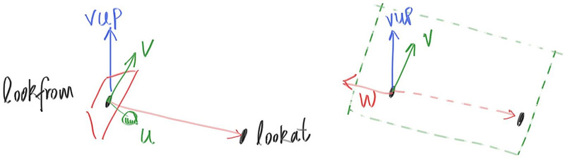</center>

Like before, when our fixed camera faced $−Z$, our arbitrary view camera faces $−w$. 

Keep in mind that we can — but we don’t have to — use world up $(0,1,0)$ to specify vup. This is convenient and will naturally keep your camera horizontally level until you decide to experiment with crazy camera angles. 

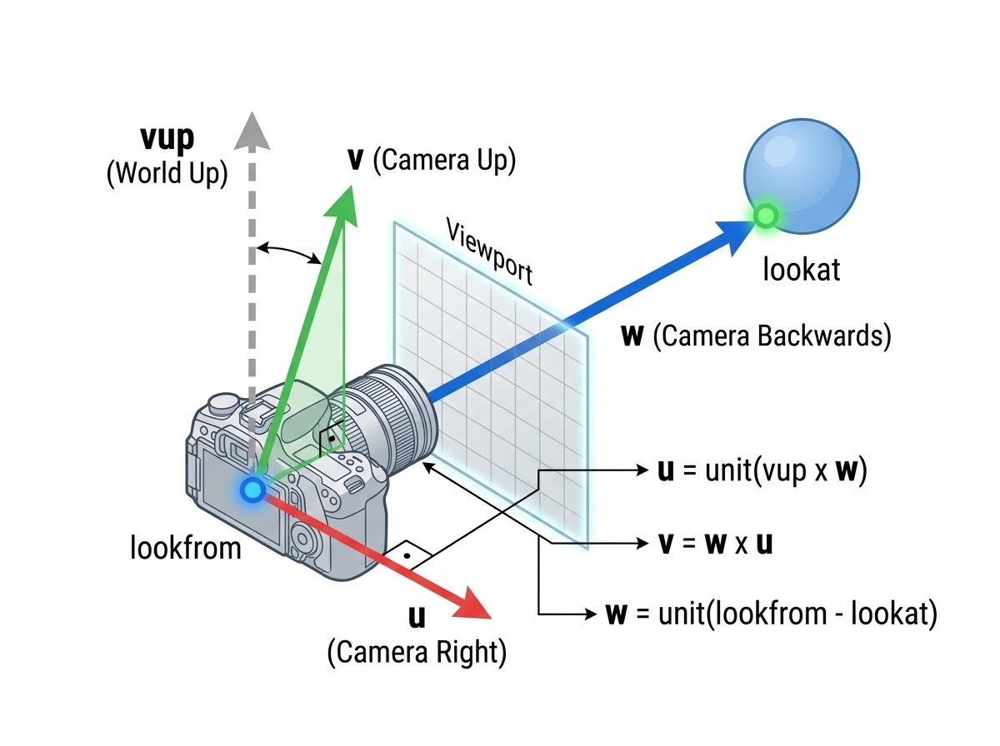
camera.h

``` c
class camera {
  public:
    double aspect_ratio      = 1.0;  // Ratio of image width over height
    int    image_width       = 100;  // Rendered image width in pixel count
    int    samples_per_pixel = 10;   // Count of random samples for each pixel
    int    max_depth         = 10;   // Maximum number of ray bounces into scene

    double vfov     = 90;              // Vertical view angle (field of view)
    point3 lookfrom = point3(0,0,0);   // Point camera is looking from
    point3 lookat   = point3(0,0,-1);  // Point camera is looking at
    vec3   vup      = vec3(0,1,0);     // Camera-relative "up" direction

    ...

  private:
    int    image_height;         // Rendered image height
    double pixel_samples_scale;  // Color scale factor for a sum of pixel samples
    point3 center;               // Camera center
    point3 pixel00_loc;          // Location of pixel 0, 0
    vec3   pixel_delta_u;        // Offset to pixel to the right
    vec3   pixel_delta_v;        // Offset to pixel below
    vec3   u, v, w;              // Camera frame basis vectors

    void initialize() {
        image_height = int(image_width / aspect_ratio);
        image_height = (image_height < 1) ? 1 : image_height;

        pixel_samples_scale = 1.0 / samples_per_pixel;

        center = lookfrom;

        // Determine viewport dimensions.
        auto focal_length = (lookfrom - lookat).length();
        auto theta = degrees_to_radians(vfov);
        auto h = std::tan(theta/2);
        auto viewport_height = 2 * h * focal_length;
        auto viewport_width = viewport_height * (double(image_width)/image_height);

        // Calculate the u,v,w unit basis vectors for the camera coordinate frame.
        w = unit_vector(lookfrom - lookat);
        u = unit_vector(cross(vup, w));
        v = cross(w, u);

        // Calculate the vectors across the horizontal and down the vertical viewport edges.
        vec3 viewport_u = viewport_width * u;    // Vector across viewport horizontal edge
        vec3 viewport_v = viewport_height * -v;  // Vector down viewport vertical edge

        // Calculate the horizontal and vertical delta vectors from pixel to pixel.
        pixel_delta_u = viewport_u / image_width;
        pixel_delta_v = viewport_v / image_height;

        // Calculate the location of the upper left pixel.
        auto viewport_upper_left = center - (focal_length * w) - viewport_u/2 - viewport_v/2;
        pixel00_loc = viewport_upper_left + 0.5 * (pixel_delta_u + pixel_delta_v);
    }

    ...

  private:
};
````

main.c

```c
int main() {
    hittable_list world;

    auto material_ground = make_shared<lambertian>(color(0.8, 0.8, 0.0));
    auto material_center = make_shared<lambertian>(color(0.1, 0.2, 0.5));
    auto material_left   = make_shared<dielectric>(1.50);
    auto material_bubble = make_shared<dielectric>(1.00 / 1.50);
    auto material_right  = make_shared<metal>(color(0.8, 0.6, 0.2), 1.0);

    world.add(make_shared<sphere>(point3( 0.0, -100.5, -1.0), 100.0, material_ground));
    world.add(make_shared<sphere>(point3( 0.0,    0.0, -1.2),   0.5, material_center));
    world.add(make_shared<sphere>(point3(-1.0,    0.0, -1.0),   0.5, material_left));
    world.add(make_shared<sphere>(point3(-1.0,    0.0, -1.0),   0.4, material_bubble));
    world.add(make_shared<sphere>(point3( 1.0,    0.0, -1.0),   0.5, material_right));

    camera cam;

    cam.aspect_ratio      = 16.0 / 9.0;
    cam.image_width       = 400;
    cam.samples_per_pixel = 100;
    cam.max_depth         = 50;


    cam.vfov     = 90;
    cam.lookfrom = point3(-2,2,1);
    cam.lookat   = point3(0,0,-1);
    cam.vup      = vec3(0,1,0);

    cam.render(world);
}
```

<center>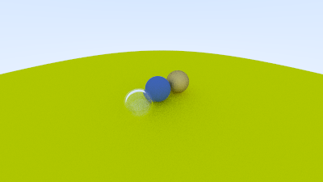</center>

And we can change field of view: 
```c
    cam.vfov     = 20; 
```

<center>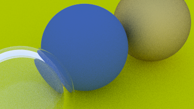</center>


# Defocus Blur
Now our final feature: ***defocus blur***. Note, photographers call this ***depth of field***, so be sure to only use the term ***defocus blur*** among your raytracing friends. 

The reason we have defocus blur in real cameras is because they need a big hole (rather than just a pinhole) through which to gather light. A large hole would defocus everything, but if we stick a lens in front of the film/sensor, there will be a certain distance at which everything is in focus.

Objects placed at that distance will appear in focus and will linearly appear blurrier the further they are from that distance. You can think of a lens this way: all light rays coming from a specific point at the focus distance — and that hit the lens — will be bent back to a single point on the image sensor. 

We call the distance between the camera center and the plane where everything is in perfect focus the ***focus distance***. Be aware that the focus distance is not usually the same as the ***focal length*** — the focal length is the distance between the camera center and the image plane. For our model, however, these two will have the same value, as we will put our pixel grid right on the focus plane, which is focus distance away from the camera center. 

In a physical camera, the focus distance is controlled by the distance between the lens and the film/sensor. That is why you see the lens move relative to the camera when you change what is in focus (that may happen in your phone camera too, but the sensor moves). The ***“aperture”*** is a hole to control how big the lens is effectively. For a real camera, if you need more light you make the aperture bigger, and will get more blur for objects away from the focus distance.  For our virtual camera, we can have a perfect sensor and never need more light, so we only use an aperture when we want defocus blur. 

## A Thin Lens Approximation!


A real camera has a complicated compound lens. For our code, we could simulate the order: ***sensor, then lens, then aperture***. Then we could figure out where to send the rays, and flip the image after it's computed (the image is projected upside down on the film). Graphics people, however, usually use a thin lens approximation: 

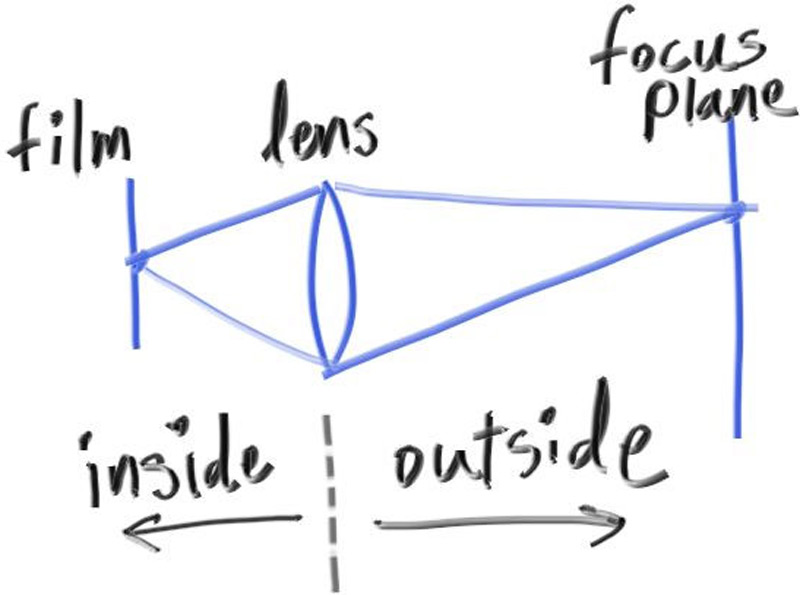

We don’t need to simulate any of the inside of the camera — for the purposes of rendering an image outside the camera, that would be unnecessary complexity. Instead, I usually start rays from an infinitely thin circular “lens”, and send them toward the pixel of interest on the focus plane (focal_length away from the lens), where everything on that plane in the 3D world is in perfect focus. 

In practice, we accomplish this by placing the viewport in this plane. Putting everything together: 
1. The focus plane is orthogonal to the camera view direction. 
2. The focus distance is the distance between the camera center and the focus plane. 
3. The viewport lies on the focus plane, centered on the camera view direction vector. 
4. The grid of pixel locations lies inside the viewport (located in the 3D world). 
5. Random image sample locations are chosen from the region around the current pixel location. 
6. The camera fires rays from random points on the lens through the current image sample location. 

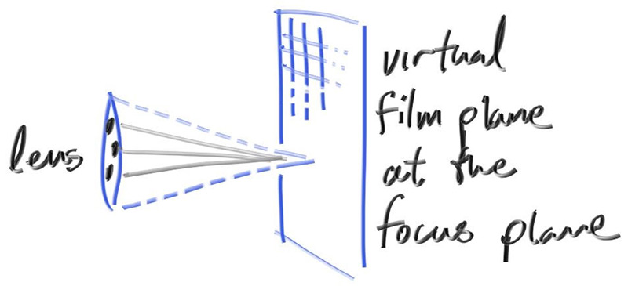

## Generating Sample Rays

Without defocus blur, all scene rays originate from the camera center (or lookfrom). In order to accomplish defocus blur, ***we construct a disk centered at the camera center***. The larger the radius, the greater the defocus blur. You can think of our original camera as having a defocus disk of radius zero (no blur at all), so all rays originated at the disk center (lookfrom). 

So, ***how large should the defocus disk be?*** 

Since the size of this disk controls how much defocus blur we get, that should be a parameter of the camera class. We could just take the radius of the disk as a camera parameter, but the blur would vary depending on the projection distance. A slightly easier parameter is to specify ***the angle of the cone with apex at viewport center and base (defocus disk) at the camera center***. This should give you more consistent results as you vary the focus distance for a given shot. 

$$
\mathrm{defocusRadius} = \mathrm{focusDist} \times \tan\left(\frac{\mathrm{defocusAngle}}{2}\right)
$$

Since we'll be choosing random points from the defocus disk, we'll need a function to do that: ***random_in_unit_disk()***. This function works using the same kind of method we use in ***random_unit_vector()***, just for two dimensions. 

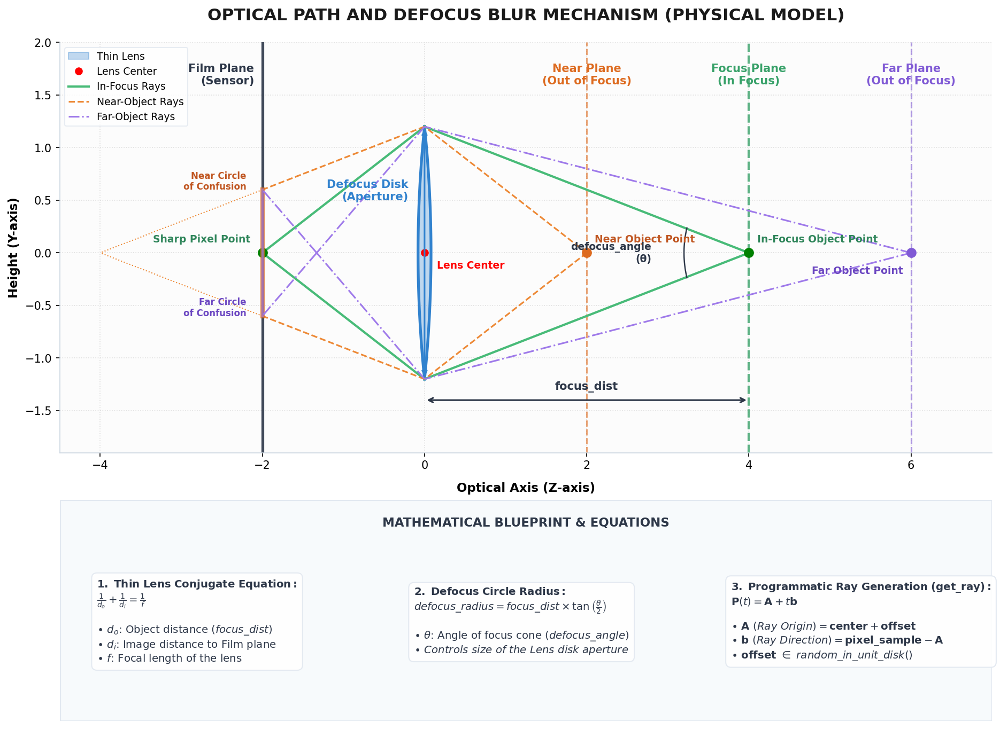

vec3.h
``` c
inline vec3 unit_vector(const vec3& u) {
    return v / v.length();
}

inline vec3 random_in_unit_disk() {
    while (true) {
        auto p = vec3(random_double(-1,1), random_double(-1,1), 0);
        if (p.length_squared() < 1)
            return p;
    }
}

```

camera.h
``` c
class camera {
  public:
    double aspect_ratio      = 1.0;  // Ratio of image width over height
    int    image_width       = 100;  // Rendered image width in pixel count
    int    samples_per_pixel = 10;   // Count of random samples for each pixel
    int    max_depth         = 10;   // Maximum number of ray bounces into scene

    double vfov     = 90;              // Vertical view angle (field of view)
    point3 lookfrom = point3(0,0,0);   // Point camera is looking from
    point3 lookat   = point3(0,0,-1);  // Point camera is looking at
    vec3   vup      = vec3(0,1,0);     // Camera-relative "up" direction

    double defocus_angle = 0;  // Variation angle of rays through each pixel
    double focus_dist = 10;    // Distance from camera lookfrom point to plane of perfect focus

    ...

  private:
    int    image_height;         // Rendered image height
    double pixel_samples_scale;  // Color scale factor for a sum of pixel samples
    point3 center;               // Camera center
    point3 pixel00_loc;          // Location of pixel 0, 0
    vec3   pixel_delta_u;        // Offset to pixel to the right
    vec3   pixel_delta_v;        // Offset to pixel below
    vec3   u, v, w;              // Camera frame basis vectors
    vec3   defocus_disk_u;       // Defocus disk horizontal radius
    vec3   defocus_disk_v;       // Defocus disk vertical radius

    void initialize() {
        image_height = int(image_width / aspect_ratio);
        image_height = (image_height < 1) ? 1 : image_height;

        pixel_samples_scale = 1.0 / samples_per_pixel;

        center = lookfrom;

        // Determine viewport dimensions.
        auto focal_length = (lookfrom - lookat).length();
        auto theta = degrees_to_radians(vfov);
        auto h = std::tan(theta/2);
        auto viewport_height = 2 * h * focus_dist;
        auto viewport_width = viewport_height * (double(image_width)/image_height);

        // Calculate the u,v,w unit basis vectors for the camera coordinate frame.
        w = unit_vector(lookfrom - lookat);
        u = unit_vector(cross(vup, w));
        v = cross(w, u);

        // Calculate the vectors across the horizontal and down the vertical viewport edges.
        vec3 viewport_u = viewport_width * u;    // Vector across viewport horizontal edge
        vec3 viewport_v = viewport_height * -v;  // Vector down viewport vertical edge

        // Calculate the horizontal and vertical delta vectors to the next pixel.
        pixel_delta_u = viewport_u / image_width;
        pixel_delta_v = viewport_v / image_height;

        // Calculate the location of the upper left pixel.
        auto viewport_upper_left = center - (focus_dist * w) - viewport_u/2 - viewport_v/2;
        pixel00_loc = viewport_upper_left + 0.5 * (pixel_delta_u + pixel_delta_v);

        // Calculate the camera defocus disk basis vectors.
        auto defocus_radius = focus_dist * std::tan(degrees_to_radians(defocus_angle / 2));
        defocus_disk_u = u * defocus_radius;
        defocus_disk_v = v * defocus_radius;
    }

    ray get_ray(int i, int j) const {
        // Construct a camera ray originating from the defocus disk and directed at a randomly
        // sampled point around the pixel location i, j.

        auto offset = sample_square();
        auto pixel_sample = pixel00_loc
                          + ((i + offset.x()) * pixel_delta_u)
                          + ((j + offset.y()) * pixel_delta_v);

        auto ray_origin = (defocus_angle <= 0) ? center : defocus_disk_sample();
        auto ray_direction = pixel_sample - ray_origin;

        return ray(ray_origin, ray_direction);
    }

    vec3 sample_square() const {
        ...
    }

    point3 defocus_disk_sample() const {
        // Returns a random point in the camera defocus disk.
        auto p = random_in_unit_disk();
        return center + (p[0] * defocus_disk_u) + (p[1] * defocus_disk_v);
    }

    color ray_color(const ray& r, int depth, const hittable& world) const {
        ...
    }
};
```

<center>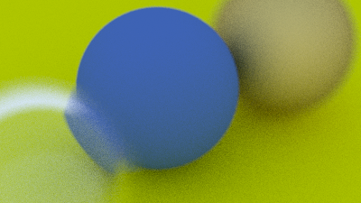</center>


# A Final Render

main.c
``` c
int main() {
    hittable_list world;

    auto ground_material = make_shared<lambertian>(color(0.5, 0.5, 0.5));
    world.add(make_shared<sphere>(point3(0,-1000,0), 1000, ground_material));

    for (int a = -11; a < 11; a++) {
        for (int b = -11; b < 11; b++) {
            auto choose_mat = random_double();
            point3 center(a + 0.9*random_double(), 0.2, b + 0.9*random_double());

            if ((center - point3(4, 0.2, 0)).length() > 0.9) {
                shared_ptr<material> sphere_material;

                if (choose_mat < 0.8) {
                    // diffuse
                    auto albedo = color::random() * color::random();
                    sphere_material = make_shared<lambertian>(albedo);
                    world.add(make_shared<sphere>(center, 0.2, sphere_material));
                } else if (choose_mat < 0.95) {
                    // metal
                    auto albedo = color::random(0.5, 1);
                    auto fuzz = random_double(0, 0.5);
                    sphere_material = make_shared<metal>(albedo, fuzz);
                    world.add(make_shared<sphere>(center, 0.2, sphere_material));
                } else {
                    // glass
                    sphere_material = make_shared<dielectric>(1.5);
                    world.add(make_shared<sphere>(center, 0.2, sphere_material));
                }
            }
        }
    }

    auto material1 = make_shared<dielectric>(1.5);
    world.add(make_shared<sphere>(point3(0, 1, 0), 1.0, material1));

    auto material2 = make_shared<lambertian>(color(0.4, 0.2, 0.1));
    world.add(make_shared<sphere>(point3(-4, 1, 0), 1.0, material2));

    auto material3 = make_shared<metal>(color(0.7, 0.6, 0.5), 0.0);
    world.add(make_shared<sphere>(point3(4, 1, 0), 1.0, material3));

    camera cam;

    cam.aspect_ratio      = 16.0 / 9.0;
    cam.image_width       = 1200;
    cam.samples_per_pixel = 500;
    cam.max_depth         = 50;

    cam.vfov     = 20;
    cam.lookfrom = point3(13,2,3);
    cam.lookat   = point3(0,0,0);
    cam.vup      = vec3(0,1,0);

    cam.defocus_angle = 0.6;
    cam.focus_dist    = 10.0;

    cam.render(world);
}
```

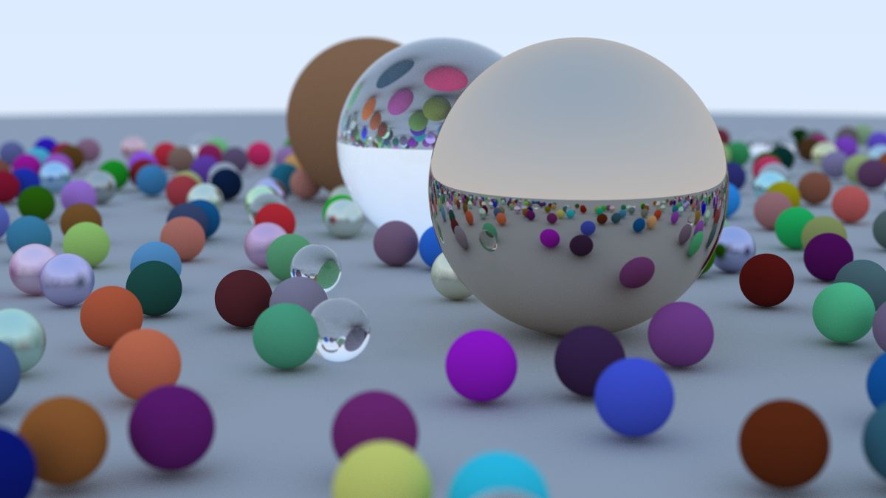