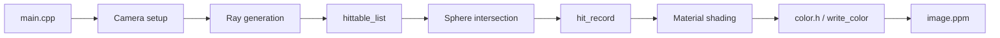
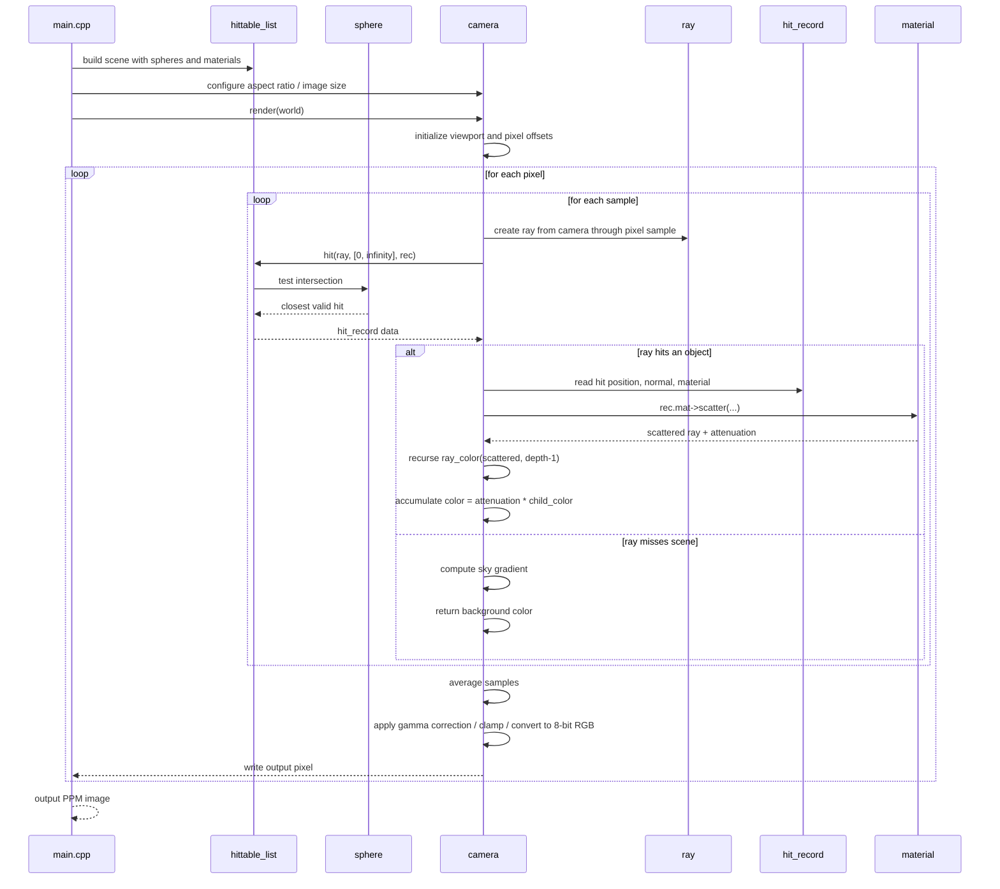
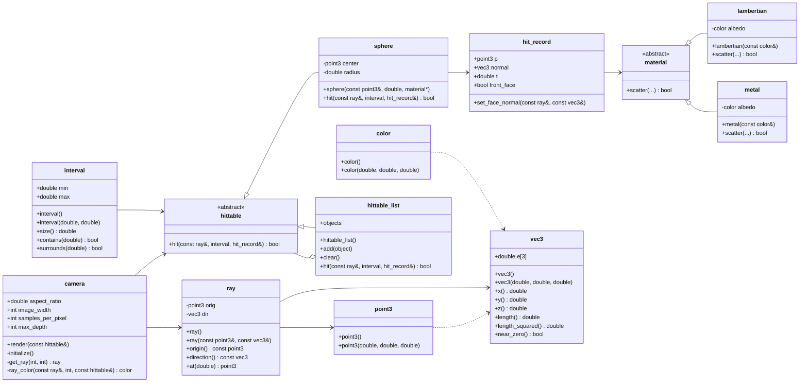

# Ray Tracing Project Architecture

This project is a small ray-tracing renderer built as a learning exercise. It follows the classic structure from the Ray Tracing in One Weekend series: a simple scene, a camera, rays, geometric primitives, and materials.

## 1. High-level architecture

The application is organized as a pipeline:

1. `main.cpp` creates the world and camera
2. Rays are generated for each pixel
3. Each ray is checked against scene objects
4. A closest hit is found
5. The hit color is computed and written to PPM output



## 2. File responsibilities

### Core math and utilities

- `vec3.h`
  - Defines the `vec3` type and related vector operations
  - Handles math such as addition, subtraction, dot products, cross products, normalization, random vectors, and reflections
  - `point3` is an alias of `vec3`

- `color.h`
  - Alias `color = vec3`
  - Converts floating color values to 8-bit RGB for PPM output
  - Applies a simple gamma correction

- `ray.h`
  - Defines the `ray` class with origin and direction
  - `at(t)` computes a point along the ray

- `interval.h`
  - Represents a numeric interval `[min, max]`
  - Stores the empty and universe intervals
  - Used for valid ray parameter ranges during intersection checks

- `rtweekend.h`
  - Central utility header
  - Defines constants like `infinity` and `pi`
  - Includes common utility functions and common headers

### Scene and geometry

- `hittable.h`
  - Abstract base class `hittable`
  - Defines the `hit()` interface used by all scene objects
  - `hit_record` stores intersection data: position, normal, material, and `t`

- `hittable_list.h`
  - Container for all objects in the scene
  - Loops through objects and keeps the closest valid hit

- `sphere.h`
  - Concrete `sphere` class derived from `hittable`
  - Performs ray-sphere intersection math
  - Computes the surface normal and material info

### Rendering and shading

- `camera.h`
  - Owns render settings: aspect ratio, image width, sample count, max depth
  - Generates rays for each pixel
  - Steps through the image and accumulates color
  - Converts the final per-pixel colors to output image data

- `material.h`
  - Defines abstract `material`
  - Implements `lambertian` and `metal` materials
  - Handles light scattering behavior used in shading calculations

### Entry point

- `main.cpp`
  - Constructs the scene with spheres
  - Configures the camera and viewport
  - Renders the image using `ray_color()`
  - Writes the result to stdout in PPM format

## 3. Main runtime flow

The render loop is the heart of the renderer. Each pixel is sampled multiple times, a ray is traced through the scene, and the final color is accumulated and written as a PPM pixel.



### Detailed color computation

For each pixel, the camera performs a small Monte Carlo-style averaging process:

1. It generates a camera ray for a random point inside the current pixel.
2. It calls `ray_color(r, depth, world)`.
3. If the ray hits an object, the hit record provides:
   - the intersection point `rec.p`
   - the normal `rec.normal`
   - the material pointer `rec.mat`
4. The material decides how the ray scatters:
   - `lambertian` uses a random direction around the surface normal
   - `metal` reflects the incoming ray around the normal
5. The reflected/scattered ray is traced recursively, and the result is combined as:

```cpp
return attenuation * ray_color(scattered, depth - 1, world);
```

6. If the ray does not hit any object, a sky background gradient is used:

```cpp
vec3 unit_direction = unit_vector(r.direction());
auto a = 0.5 * (unit_direction.y() + 1.0);
return (1.0 - a) * color(1.0, 1.0, 1.0) + a * color(0.5, 0.7, 1.0);
```

7. After all samples are collected, the average color is normalized by `samples_per_pixel`, then converted into the `[0,255]` RGB range with gamma correction in `write_color()`.

This is the exact point where the 3D scene is turned into the 2D image color values that appear in the final PPM file.

## 4. Class diagram



## 5. Relationship summary

### Inheritance

- `sphere` inherits from `hittable`
- `hittable_list` inherits from `hittable`
- `lambertian` and `metal` inherit from `material`

### Composition / ownership

- `hittable_list` owns many `shared_ptr<hittable>` objects
- `hit_record` holds a `shared_ptr<material>`
- `sphere` stores a `shared_ptr<material>` for its surface material

### Dependency

- `main.cpp` depends on the scene, camera, and utility headers
- `camera.h` depends on `hittable`, `material`, and `ray`
- `vec3.h` is a foundational type used almost everywhere
- `color.h` depends on `vec3` and `interval`

## 6. Architectural style

This code follows a simple entity-component style:

- geometry is represented by `hittable` implementations
- shared math structures are globally reused through `vec3`
- materials define shading behavior separately from object shape
- camera owns the render loop and image sampling logic
- the project acts like a minimal, data-driven ray tracer

## 7. Practical design observation

The project is intentionally modular but still compact. The important design idea is separation of concerns:

- `vec3` handles geometry math
- `ray` represents a path in space
- `hittable` defines object intersection behavior
- `material` defines how light reflects or scatters
- `camera` coordinates image generation
- `main.cpp` wires everything together

This is the core architecture behind most modern ray tracers, just simplified to a small educational project.
