# Motion Blur
When you decided to ray trace, you decided that visual quality was worth more than run-time. When rendering fuzzy reflection and defocus blur, we used multiple samples per pixel. Once you have taken a step down that road, the good news is that almost all effects can be similarly brute-forced. Motion blur is certainly one of those. 

In a real camera, the shutter remains open for a short time interval, during which the camera and objects in the world may move. To accurately reproduce such a camera shot, we seek an average of what the camera senses while its shutter is open to the world. 

## Introduction of SpaceTime Ray Tracing
We can get a random estimate of a single (simplified) photon by sending a single ray at some ***random instant in time while the shutter is open***.

As long as we can determine where the objects are supposed to be at that instant, we can get an accurate measure of the light for that ray at that same instant.

This is yet another example of how random ***(Monte Carlo)*** ray tracing ends up being quite simple. Brute force wins again!


Since the “engine” of the ray tracer can just make sure the objects are where they need to be for each ray, the intersection guts don’t change much. To accomplish this, ***we need to store the exact time for each ray***: 

ray.h
``` c
class ray {
  public:
    ray() {}

    ray(const point3& origin, const vec3& direction, double time)
      : orig(origin), dir(direction), tm(time) {}

    ray(const point3& origin, const vec3& direction)
      : ray(origin, direction, 0) {}

    const point3& origin() const  { return orig; }
    const vec3& direction() const { return dir; }

    double time() const { return tm; }

    point3 at(double t) const {
        return orig + t*dir;
    }

  private:
    point3 orig;
    vec3 dir;
    double tm;
};
```

## Managing Time
How we might manage it across one or more successive renders. There are two aspects of ***shutter timing*** to think about: 
- The time from one shutter opening to the next shutter opening.
- How long the shutter stays open for each frame.

Standard movie film used to be shot at 24 frames per second. Modern digital movies can be 24, 30, 48, 60, 120 or however many frames per second director wants. 

Each frame can have its own ***shutter speed***. This shutter speed need not be — and typically isn't — the maximum duration of the entire frame. You could have the shutter open for $1/1000th$ of a second every frame, or $1/60th$ of a second. 

If you wanted to ***render a sequence of images***, you would need to set up the camera with the appropriate shutter timings: ***frame-to-frame period, shutter/render duration, and the total number of frames (total shot time).*** 
- If the camera is moving and the world is static, you're good to go.
- If anything in the world is moving, you would need to add a method to ***hittable*** so that every object could be made aware of the current frame's time period. 

This method would provide a way for all animated objects to set up their motion during that frame. 

This is fairly straight-forward, and definitely a fun avenue for you to experiment with if you wish. However, for our purposes right now, we're going to proceed with a much simpler model. 

We will render only a single frame, implicitly assuming a start at t$ime = 0$ and ending at $time = 1$. Our first task is to modify the camera to launch rays with random times in $[0,1]$, and our second task will be the creation of an animated sphere class.

## Updating the Camera to Simulate Motion Blur
We need to modify the camera to generate rays at a random instant between the ***start time*** and the ***end time***. Should the camera keep track of the time interval, or should that be up to the user of the camera when a ray is created?  

It just sends out rays over a time period. 

camera.h
``` c
class camera {
  ...
  private:
    ...
    ray get_ray(int i, int j) const {
        // Construct a camera ray originating from the defocus disk and directed at a randomly
        // sampled point around the pixel location i, j.

        auto offset = sample_square();
        auto pixel_sample = pixel00_loc
                          + ((i + offset.x()) * pixel_delta_u)
                          + ((j + offset.y()) * pixel_delta_v);

        auto ray_origin = (defocus_angle <= 0) ? center : defocus_disk_sample();
        auto ray_direction = pixel_sample - ray_origin;
        auto ray_time = random_double();

        return ray(ray_origin, ray_direction, ray_time);
    }

    ...
};
```

## Adding Moving Spheres
Now to create a moving object. I’ll update the sphere class so that its center moves linearly from ***center1*** at $time=0$ to ***center2*** at $time=1$. 

We'll do this by replacing the 3D center point with a 3D ray that describes the original position at $time=0$ and the displacement to the end position at $time=1$. 

sphere.h

``` c
class sphere : public hittable {
  public:
    // Stationary Sphere
    sphere(const point3& static_center, double radius, shared_ptr<material> mat)
      : center(static_center, vec3(0,0,0)), radius(std::fmax(0,radius)), mat(mat) {}

    // Moving Sphere
    sphere(const point3& center1, const point3& center2, double radius,
           shared_ptr<material> mat)
      : center(center1, center2 - center1), radius(std::fmax(0,radius)), mat(mat) {}

    ...

  private:
    ray center;
    double radius;
    shared_ptr<material> mat;

};
#endif
```

The updated sphere::hit() function is almost identical to the old sphere::hit() function: we just need to now determine the current position of the animated center: 

``` c
class sphere : public hittable {
  public:
    ...
    bool hit(const ray& r, interval ray_t, hit_record& rec) const override {
        point3 current_center = center.at(r.time());
        vec3 oc = current_center - r.origin();
        auto a = r.direction().length_squared();
        auto h = dot(r.direction(), oc);
        auto c = oc.length_squared() - radius*radius;

        ...

        rec.t = root;
        rec.p = r.at(rec.t);
        vec3 outward_normal = (rec.p - current_center) / radius;
        rec.set_face_normal(r, outward_normal);
        get_sphere_uv(outward_normal, rec.u, rec.v);
        rec.mat = mat;

        return true;
    }
    ...
};
````

## Tracking the Time of Ray Intersection
Now that rays have a time property, we need to update the ***material::scatter()*** methods to account for the time of intersection: 

material.h

``` c
class lambertian : public material {
    ...
    bool scatter(const ray& r_in, const hit_record& rec, color& attenuation, ray& scattered)
    const override {
        auto scatter_direction = rec.normal + random_unit_vector();

        // Catch degenerate scatter direction
        if (scatter_direction.near_zero())
            scatter_direction = rec.normal;

        scattered = ray(rec.p, scatter_direction, r_in.time());
        attenuation = albedo;
        return true;
    }
    ...
};

class metal : public material {
    ...
    bool scatter(const ray& r_in, const hit_record& rec, color& attenuation, ray& scattered)
    const override {
        vec3 reflected = reflect(r_in.direction(), rec.normal);
        reflected = unit_vector(reflected) + (fuzz * random_unit_vector());
        scattered = ray(rec.p, reflected, r_in.time());
        attenuation = albedo;

        return (dot(scattered.direction(), rec.normal) > 0);
    }
    ...
};

class dielectric : public material {
    ...
    bool scatter(const ray& r_in, const hit_record& rec, color& attenuation, ray& scattered)
    const override {
        ...
        scattered = ray(rec.p, direction, r_in.time());
        return true;
    }
    ...
};
```

## Putting Everything Together
The code below takes the example diffuse spheres from the scene at the end of the last book, and makes them move during the image render. Each sphere moves from its center C at time $t=0$ to $C+(0,r/2,0)$ at time $t=1$: 

``` c
int main() {
    hittable_list world;

    auto ground_material = make_shared<lambertian>(color(0.5, 0.5, 0.5));
    world.add(make_shared<sphere>(point3(0,-1000,0), 1000, ground_material));

    for (int a = -11; a < 11; a++) {
        for (int b = -11; b < 11; b++) {
            auto choose_mat = random_double();
            point3 center(a + 0.9*random_double(), 0.2, b + 0.9*random_double());

            if ((center - point3(4, 0.2, 0)).length() > 0.9) {
                shared_ptr<material> sphere_material;

                if (choose_mat < 0.8) {
                    // diffuse
                    auto albedo = color::random() * color::random();
                    sphere_material = make_shared<lambertian>(albedo);
                    auto center2 = center + vec3(0, random_double(0,.5), 0);
                    world.add(make_shared<sphere>(center, center2, 0.2, sphere_material));
                } else if (choose_mat < 0.95) {
                ...
    }
    ...

    camera cam;

    cam.aspect_ratio      = 16.0 / 9.0;
    cam.image_width       = 400;
    cam.samples_per_pixel = 100;
    cam.max_depth         = 50;

    cam.vfov     = 20;
    cam.lookfrom = point3(13,2,3);
    cam.lookat   = point3(0,0,0);
    cam.vup      = vec3(0,1,0);

    cam.defocus_angle = 0.6;
    cam.focus_dist    = 10.0;

    cam.render(world);
}
```

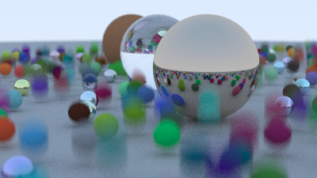


# Bounding Volume Hierarchies
This part is by far the most difficult and involved part of the ray tracer we are working on. 

Ray-object intersection is the main ***time-bottleneck*** in a ray tracer, and the run time is linear with the number of objects. But it’s a repeated search on the same scene, so we ought to be able to make it a ***logarithmic search in the spirit of binary search***. 

Because we are sending millions to billions of rays into the same scene, we can sort the objects in the scene, and then each ray intersection can be a sublinear search. The two most common methods of sorting are:
1) subdivide the space. 
2) subdivide the objects.

## The Key Idea
The key idea of ***creating bounding volumes for a set of primitives is to find a volume that fully encloses (bounds) all the objects***.

For example, suppose you computed a sphere that bounds 10 objects. 
- ***Any ray that misses the bounding sphere*** definitely ***misses all ten objects inside***. 
- If the ray ***hits the bounding sphere***, then it ***might hit one of the ten objects***.

``` c
if (ray hits bounding object)
    return whether ray hits bounded objects
else
    return false
````
***Note that***: we will use these bounding volumes to group the objects in the scene into subgroups. We are ***not dividing the screen or the scene space***. We want any given object to be in just one bounding volume, though bounding volumes can overlap. 

## Hierarchies of Bounding Volumes
To make things sub-linear we need to make the bounding volumes hierarchical.

For example, if we divided a set of objects into two groups, red and blue, and used rectangular bounding volumes.

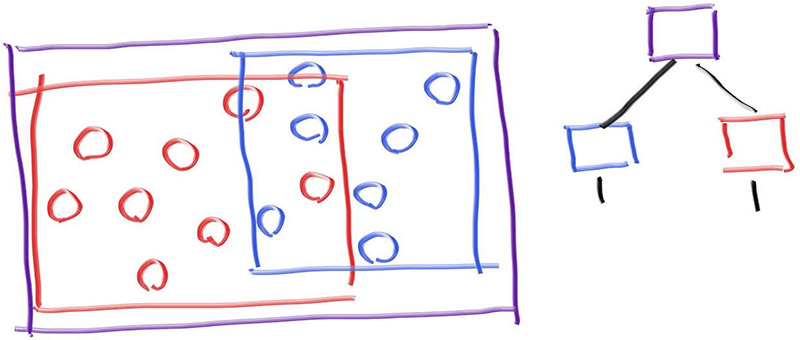

- ***Note that***: the blue and red bounding volumes are contained in the purple one, but they might overlap, and they are not ordered — they are just both inside.

- So the tree shown on the right has no concept of ordering in the left and right children

``` c
if (hits purple)
    hit0 = hits blue enclosed objects
    hit1 = hits red enclosed objects
    if (hit0 or hit1)
        return true and info of closer hit
return false
```

## Axis-Aligned Bounding Boxes (AABBs)
To get that all to work we need a way to make good divisions, rather than bad ones, and a way to intersect a ray with a bounding volume.

A ray bounding volume intersection needs to be ***fast***, and bounding volumes need to be pretty compact. In practice for most models, ***axis-aligned boxes*** work better than the alternatives (such as the spherical bounds mentioned above)

From now on we will call axis-aligned bounding rectangular parallelepipeds axis-aligned bounding boxes, or AABBs. ***And all we need to know is whether or not we hit it***; we don’t need hit points or normals or any of the stuff we need to display the object. 

Most people use the ***“slab”*** method. This is based on the observation that an ***n-dimensional AABB*** is just the intersection of ***n axis-aligned intervals***, often called “slabs”. Recall that an interval is just the points within two endpoints,

- **For example**, $x$ such that $3≤x≤5$, or more succinctly $x$ in $[3,5]$. In 2D, an AABB (a rectangle) is defined by the overlap two intervals: 

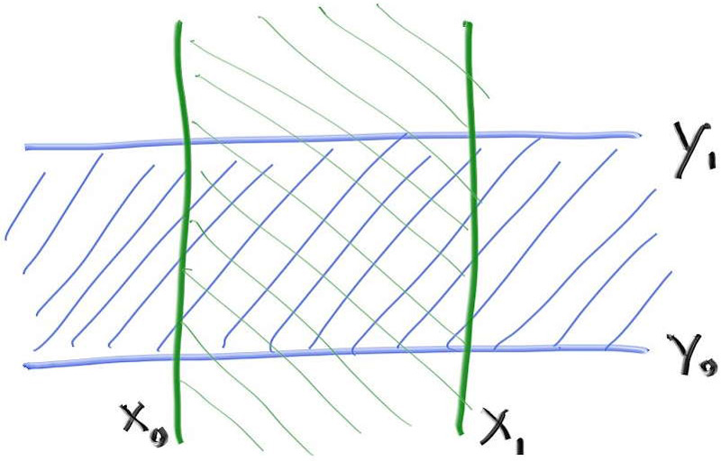

To determine if a ray hits one interval, we first need to figure out whether the ray hits the boundaries.
- **For example**, in 1D, ray intersection with two planes will yield the ray parameters $t_0$ and $t_1$. (If the ray is parallel to the planes, its intersection with any plane will be undefined.) 

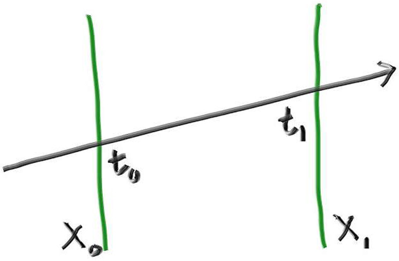


***How do we find the intersection between a ray and a plane?***

Recall that the ray is just defined by a function that—given a parameter $t$ returns a location $P(t)$: 
$$P(t)=Q+td$$

This equation applies to all three of the $x/y/z$ coordinates.

For example, $x(t)=Q_x+td_x$. This ray hits the plane $x=x_0$ at the parameter $t$ that satisfies this equation: 
$$x_0=Q_x+t_0d_x$$

So $t$ at the intersection is given by
$$t_0=\frac{x_0−Q_x}{d_x}$$

We get the similar expression for $x_1$: 
$$t_1=\frac{x_1−Q_x}{d_x}$$

The key observation to turn that 1D math into a 2D or 3D hit test is this:
- If a ray intersects the box bounded by all pairs of planes, then all ***t-intervals will overlap***. 
- For example: in 2D the green and blue overlapping only happens if the ray intersects the bounded box: 
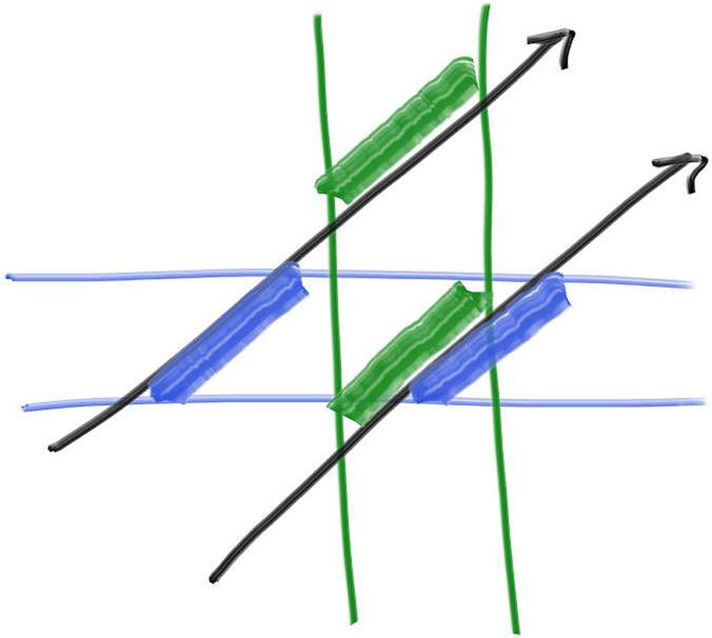
- $t_{enter} = \max(t_{x\_min}, t_{y\_min})$
- $t_{exit} = \min(t_{x\_max}, t_{y\_max})$

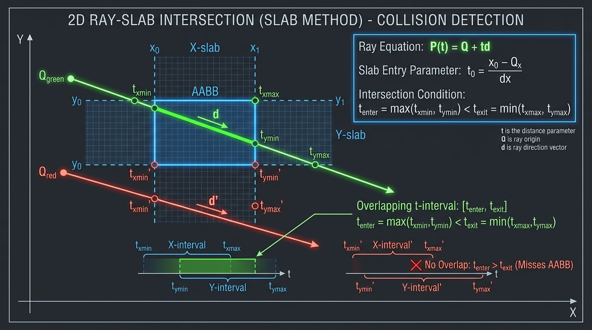

## Ray Intersection with an AABB
The following pseudocode determines whether the $t$ intervals in the slab overlap: 

``` c
interval_x ← compute_intersection_x (ray, x0, x1)
interval_y ← compute_intersection_y (ray, y0, y1)
return overlaps(interval_x, interval_y)
```

That is awesomely simple, and the fact that the 3D version trivially extends the above is why people love the slab method: 

``` c
interval_x ← compute_intersection_x (ray, x0, x1)
interval_y ← compute_intersection_y (ray, y0, y1)
interval_z ← compute_intersection_z (ray, z0, z1)
return overlaps(interval_x, interval_y, interval_z)
```

There are some caveats that make this less pretty than it first appears. Consider again the 1D equations for $t_0$ and $t_1$: 

$$t_0=\frac{x_0−Q_x}{d_x}$$

$$t_1=\frac{x_1−Q_x}{d_x}$$

- First, suppose the ray is traveling in the negative $x$ direction ($d_x < 0$). The interval $(t_{x0},t_{x1})$ as computed above might be reversed like (7,3) for example.

- Second, the denominator $d_x$ could be zero ($d_x = 0$), yielding infinite values. And if the ray origin ***lies on one of the slab boundaries*** ($0/0$), we can get a $NaN$, since both the numerator and the denominator can be zero. Also, the zero will have a $±$ sign when using **IEEE** floating point. 

The good news for $d_x=0$ is that $t_{x0}$ and $t_{x1}$ will be equal: both $+∞$ or $-∞$, if not between $x_0$ and $x_1$. So, using **min** and **max** should get us the right answers: 

$$tx0=min(\frac{x_0−Q_x}{d_x},\frac{x_1−Q_x}{d_x})$$

$$tx1=max(\frac{x_0−Q_x}{d_x},\frac{x_1−Q_x}{d_x})$$

The remaining troublesome case if we do that is if $d_x=0$ and either $x_0−Q_x=0$ or $x_1−Q_x=0$ so we get a $NaN$. In that case we can arbitrarily interpret that as either hit or no hit, but we’ll revisit that later. 

Now, let’s look at the pseudo-function ***overlaps***. Suppose we can assume the intervals are not reversed, and we want to return **true** when the intervals overlap. The boolean overlaps() function computes the overlap of the $t$ intervals $t_{interval1}$ and $t_{interval2}$, and uses that to determine if that overlap is non-empty:   

``` c
bool overlaps(t_interval1, t_interval2)
    t_min ← max(t_interval1.min, t_interval2.min)
    t_max ← min(t_interval1.max, t_interval2.max)
    return t_min < t_max
```

If there are any $NaNs$ running around there, the compare will return **false**, so we need to be sure our bounding boxes have a little padding if we care about ***grazing cases*** (and we probably should because in a ray tracer all cases come up eventually). 

To accomplish this, we'll first add a new ***interval*** function ***expand***, which pads ***(padding/tolerance)*** an interval by a given amount: 

``` c
class interval {
  public:
    ...
    double clamp(double x) const {
        if (x < min) return min;
        if (x > max) return max;
        return x;
    }

    interval expand(double delta) const {
        auto padding = delta/2;
        return interval(min - padding, max + padding);
    }

    static const interval empty, universe;
};
```

aabb.h
``` c
#ifndef AABB_H
#define AABB_H

class aabb {
  public:
    interval x, y, z;

    aabb() {} // The default AABB is empty, since intervals are empty by default.

    aabb(const interval& x, const interval& y, const interval& z)
      : x(x), y(y), z(z) {}

    aabb(const point3& a, const point3& b) {
        // Treat the two points a and b as extrema for the bounding box, so we don't require a
        // particular minimum/maximum coordinate order.

        x = (a[0] <= b[0]) ? interval(a[0], b[0]) : interval(b[0], a[0]);
        y = (a[1] <= b[1]) ? interval(a[1], b[1]) : interval(b[1], a[1]);
        z = (a[2] <= b[2]) ? interval(a[2], b[2]) : interval(b[2], a[2]);
    }

    const interval& axis_interval(int n) const {
        if (n == 1) return y;
        if (n == 2) return z;
        return x;
    }

    bool hit(const ray& r, interval ray_t) const {
        const point3& ray_orig = r.origin();
        const vec3&   ray_dir  = r.direction();

        for (int axis = 0; axis < 3; axis++) {
            const interval& ax = axis_interval(axis);
            const double adinv = 1.0 / ray_dir[axis];

            auto t0 = (ax.min - ray_orig[axis]) * adinv;
            auto t1 = (ax.max - ray_orig[axis]) * adinv;

            if (t0 < t1) {
                if (t0 > ray_t.min) ray_t.min = t0;
                if (t1 < ray_t.max) ray_t.max = t1;
            } else {
                if (t1 > ray_t.min) ray_t.min = t1;
                if (t0 < ray_t.max) ray_t.max = t0;
            }

            if (ray_t.max <= ray_t.min)
                return false;
        }
        return true;
    }
};

#endif
```
$$x \in [x_{min}, x_{max}]$$

$$y \in [y_{min}, y_{max}]$$

$$z \in [z_{min}, z_{max}]$$

1. $P_1 = (x_{min}, y_{min}, z_{min})$
2. $P_2 = (x_{max}, y_{min}, z_{min})$
3. $P_3 = (x_{max}, y_{max}, z_{min})$
4. $P_4 = (x_{min}, y_{max}, z_{min})$
5. $P_5 = (x_{min}, y_{min}, z_{max})$
6. $P_6 = (x_{max}, y_{min}, z_{max})$
7. $P_7 = (x_{max}, y_{max}, z_{max})$
8. $P_8 = (x_{min}, y_{max}, z_{max})$


## Constructing Bounding Boxes for Hittables
We now need to add a function to compute the bounding boxes of all the hittables. Then we will make a hierarchy of boxes over all the primitives, and the individual primitives—like spheres—will live at the leaves. 

Recall that ***interval*** values constructed without arguments will be ***empty by default***. Since an ***aabb*** object has an interval for each of its three dimensions, each of these will then be ***empty by default***, and therefore aabb objects will be empty by default. 

Thus, some objects may have empty bounding volumes. For example, consider a ***hittable_list object with no children***.

Finally, recall that some objects may be animated. Such objects should return their bounds over the entire range of motion, from $time=0$ to $time=1$. 

``` c
#include "aabb.h"

class material;

...

class hittable {
  public:
    virtual ~hittable() = default;

    virtual bool hit(const ray& r, interval ray_t, hit_record& rec) const = 0;

    virtual aabb bounding_box() const = 0;
};
```


``` c
class sphere : public hittable {
  public:
    // Stationary Sphere
    sphere(const point3& static_center, double radius, shared_ptr<material> mat)
      : center(static_center, vec3(0,0,0)), radius(std::fmax(0,radius)), mat(mat)
    {
        auto rvec = vec3(radius, radius, radius);
        bbox = aabb(static_center - rvec, static_center + rvec);
    }

    ...

    aabb bounding_box() const override { return bbox; }

  private:
    ray center;
    double radius;
    shared_ptr<material> mat;
    aabb bbox;

    ...
};
````

For a moving sphere, we want the bounds of its entire range of motion. To do this, we can take the box of the sphere at $time=0$, and the box of the sphere at $time=1$, and compute the box around those two boxes. 

``` c
class sphere : public hittable {
  public:
    ...

    // Moving Sphere
    sphere(const point3& center1, const point3& center2, double radius,
           shared_ptr<material> mat)
      : center(center1, center2 - center1), radius(std::fmax(0,radius)), mat(mat)
    {
        auto rvec = vec3(radius, radius, radius);
        aabb box1(center.at(0) - rvec, center.at(0) + rvec);
        aabb box2(center.at(1) - rvec, center.at(1) + rvec);
        bbox = aabb(box1, box2);
    }

    ...
};
```

Now we need a new aabb constructor that takes two boxes as input. First, we'll add a new interval constructor to do this: 

``` c
class interval {
  public:
    double min, max;

    interval() : min(+infinity), max(-infinity) {} // Default interval is empty

    interval(double _min, double _max) : min(_min), max(_max) {}

    interval(const interval& a, const interval& b) {
        // Create the interval tightly enclosing the two input intervals.
        min = a.min <= b.min ? a.min : b.min;
        max = a.max >= b.max ? a.max : b.max;
    }

    double size() const {
    ...
```

Now we can use this to construct an axis-aligned bounding box from two input boxes. 

``` c
class aabb {
  public:
    ...

    aabb(const point3& a, const point3& b) {
        ...
    }

    aabb(const aabb& box0, const aabb& box1) {
        x = interval(box0.x, box1.x);
        y = interval(box0.y, box1.y);
        z = interval(box0.z, box1.z);
    }

    ...
};
```
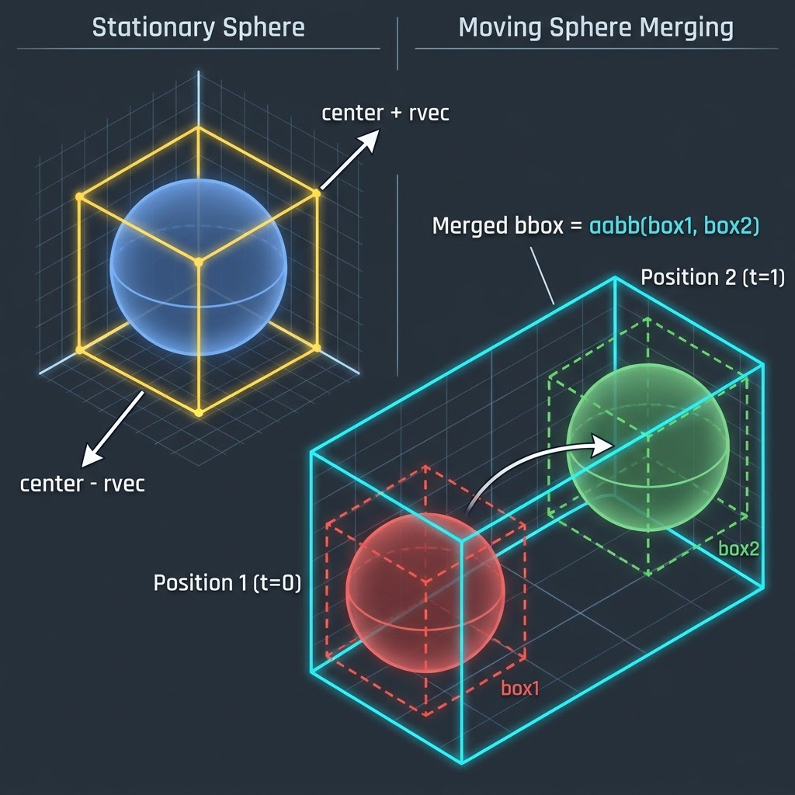

## Creating Bounding Boxes of Lists of Objects

Now we'll update the ***hittable_list*** object, computing the bounds of its children. We'll update the bounding box incrementally as each new child is added. 

``` c
#include "aabb.h"
#include "hittable.h"

#include <vector>

class hittable_list : public hittable {
  public:
    std::vector<shared_ptr<hittable>> objects;

    ...
    void add(shared_ptr<hittable> object) {
        objects.push_back(object);
        bbox = aabb(bbox, object->bounding_box());
    }

    bool hit(const ray& r, interval ray_t, hit_record& rec) const override {
        ...
    }

    aabb bounding_box() const override { return bbox; }

  private:
    aabb bbox;
};
```

## The BVH Node Class
A **BVH** is also going to be a hittable — just like lists of hittables. It’s really a container, but it can respond to the query ***“does this ray hit you?”***

One design question is whether we have two classes:
- One for the tree
- One for the nodes in the tree

Or do we have just one class and have the root just be a node we point to. 

The ***hit*** function is pretty straightforward: check whether the box for the node is hit, and if so, check the children and sort out any details. 

``` c
#ifndef BVH_H
#define BVH_H

#include "aabb.h"
#include "hittable.h"
#include "hittable_list.h"

class bvh_node : public hittable {
  public:
    bvh_node(hittable_list list) : bvh_node(list.objects, 0, list.objects.size()) {
        // There's a C++ subtlety here. This constructor (without span indices) creates an
        // implicit copy of the hittable list, which we will modify. The lifetime of the copied
        // list only extends until this constructor exits. That's OK, because we only need to
        // persist the resulting bounding volume hierarchy.
    }

    bvh_node(std::vector<shared_ptr<hittable>>& objects, size_t start, size_t end) {
        // To be implemented later.
    }

    bool hit(const ray& r, interval ray_t, hit_record& rec) const override {
        if (!bbox.hit(r, ray_t))
            return false;

        bool hit_left = left->hit(r, ray_t, rec);
        bool hit_right = right->hit(r, interval(ray_t.min, hit_left ? rec.t : ray_t.max), rec);

        return hit_left || hit_right;
    }

    aabb bounding_box() const override { return bbox; }

  private:
    shared_ptr<hittable> left;
    shared_ptr<hittable> right;
    aabb bbox;
};

#endif
```
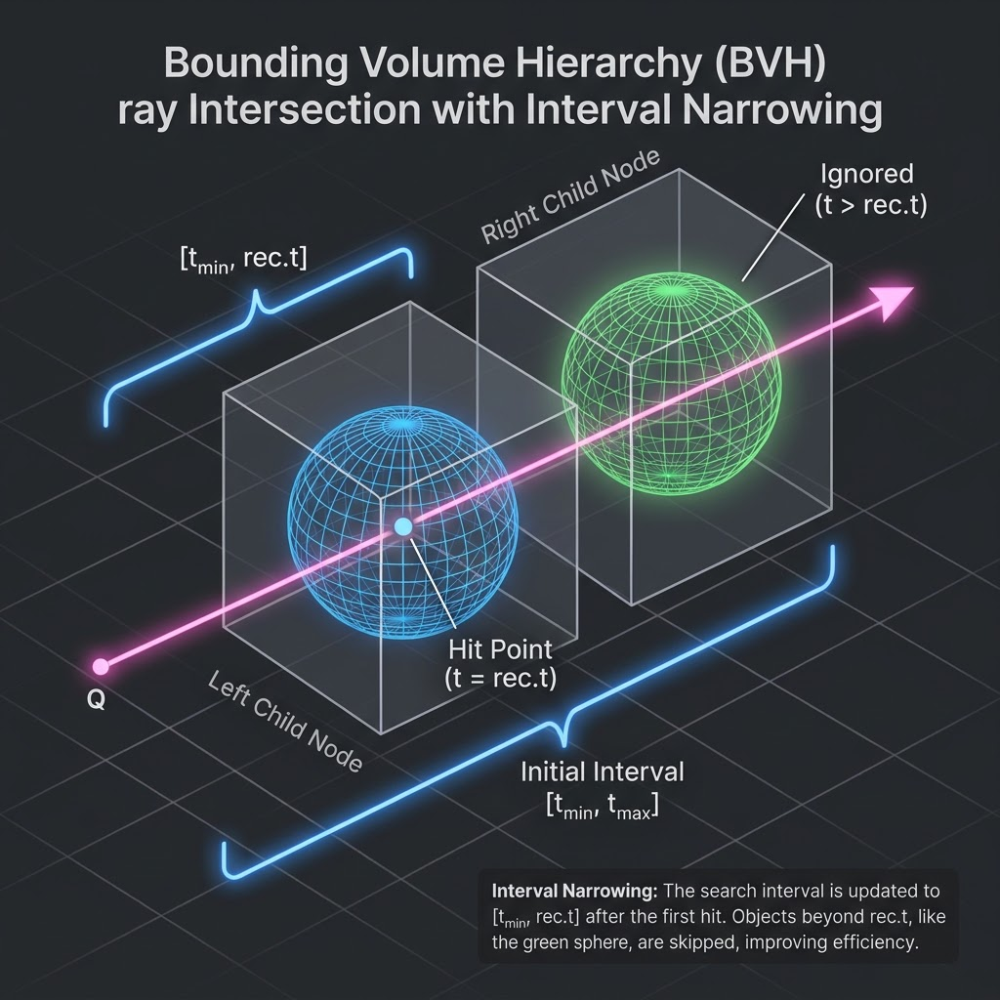


## Splitting BVH Volumes
The most complicated part of any efficiency structure, including the BVH, is building it.

We do this in the constructor. A cool thing about BVHs is that as long as the list of objects in a ***bvh_node*** gets divided into two sub-lists, the hit function will work.

It will work best if the division is done well, so that the two children have smaller bounding boxes than their parent’s bounding box, but that is for speed not correctness. I’ll choose the ***middle ground***, and at each node split the list along one axis. I’ll go for simplicity: 

1. randomly choose an axis 
2. sort the primitives (using std::sort) 
3. put half in each subtree

When the list coming in is two elements, I put one in each subtree and end the recursion.

The traversal algorithm should be smooth and not have to check for null pointers, so if I just have one element I duplicate it in each subtree.

Checking explicitly for three elements and just following one recursion would probably help a little, but I figure the whole method will get optimized later. The following code uses three method **box_x_compare**, **box_y_compare**, and **box_z_compare—that** we haven't yet defined.

``` c
#include "aabb.h"
#include "hittable.h"
#include "hittable_list.h"

#include <algorithm>

class bvh_node : public hittable {
  public:
    ...

    bvh_node(std::vector<shared_ptr<hittable>>& objects, size_t start, size_t end) {
        int axis = random_int(0,2);

        auto comparator = (axis == 0) ? box_x_compare
                        : (axis == 1) ? box_y_compare
                                      : box_z_compare;

        size_t object_span = end - start;

        if (object_span == 1) {
            left = right = objects[start];
        } else if (object_span == 2) {
            left = objects[start];
            right = objects[start+1];
        } else {
            std::sort(std::begin(objects) + start, std::begin(objects) + end, comparator);

            auto mid = start + object_span/2;
            left = make_shared<bvh_node>(objects, start, mid);
            right = make_shared<bvh_node>(objects, mid, end);
        }

        bbox = aabb(left->bounding_box(), right->bounding_box());
    }

    ...
};
```

rtweekend.h
``` c
inline double random_double(double min, double max) {
    // Returns a random real in [min,max).
    return min + (max-min)*random_double();
}

inline int random_int(int min, int max) {
    // Returns a random integer in [min,max].
    return int(random_double(min, max+1));
}

...
````

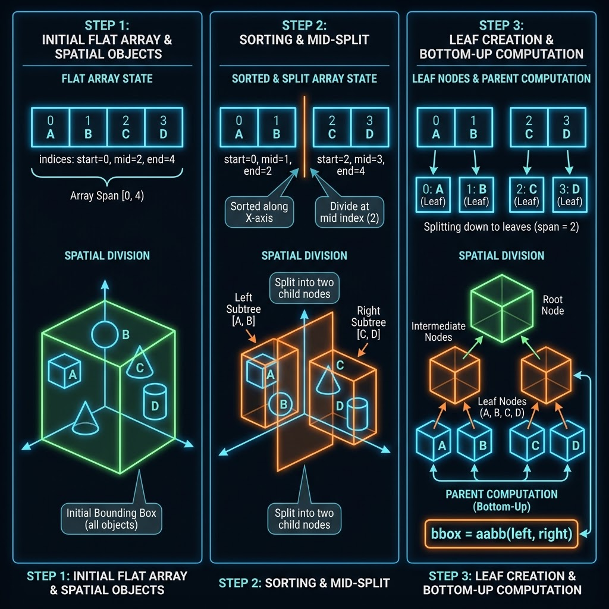
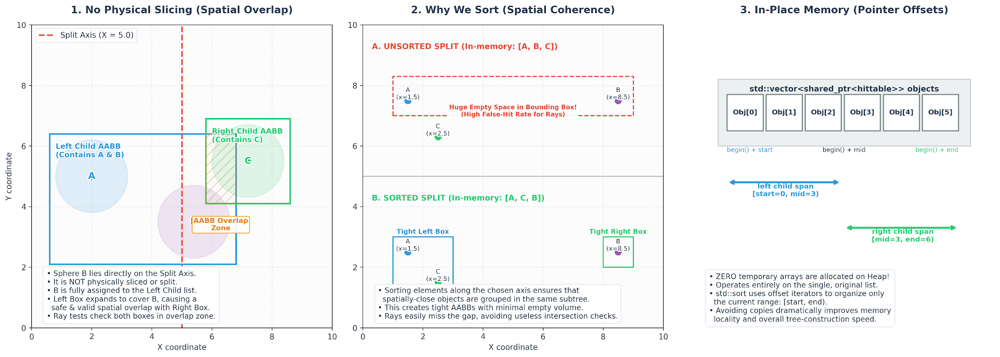

## The Box Comparison Functions

```c
class bvh_node : public hittable {
  ...

  private:
    shared_ptr<hittable> left;
    shared_ptr<hittable> right;
    aabb bbox;

    static bool box_compare(
        const shared_ptr<hittable> a, const shared_ptr<hittable> b, int axis_index
    ) {
        auto a_axis_interval = a->bounding_box().axis_interval(axis_index);
        auto b_axis_interval = b->bounding_box().axis_interval(axis_index);
        return a_axis_interval.min < b_axis_interval.min;
    }

    static bool box_x_compare (const shared_ptr<hittable> a, const shared_ptr<hittable> b) {
        return box_compare(a, b, 0);
    }

    static bool box_y_compare (const shared_ptr<hittable> a, const shared_ptr<hittable> b) {
        return box_compare(a, b, 1);
    }

    static bool box_z_compare (const shared_ptr<hittable> a, const shared_ptr<hittable> b) {
        return box_compare(a, b, 2);
    }
};
```

``` c
#include "rtweekend.h"

#include "bvh.h"
#include "camera.h"
#include "hittable.h"
#include "hittable_list.h"
#include "material.h"
#include "sphere.h"

int main() {
    ...

    auto material2 = make_shared<lambertian>(color(0.4, 0.2, 0.1));
    world.add(make_shared<sphere>(point3(-4, 1, 0), 1.0, material2));

    auto material3 = make_shared<metal>(color(0.7, 0.6, 0.5), 0.0);
    world.add(make_shared<sphere>(point3(4, 1, 0), 1.0, material3));

    world = hittable_list(make_shared<bvh_node>(world));

    camera cam;

    ...
}
```

## Another BVH Optimization
We can speed up the BVH optimization a bit more. Instead of choosing a random splitting axis, let's split the ***longest axis*** of the enclosing bounding box to get the most subdivision. The change is straight-forward, but we'll add a few things to the aabb class in the process. 

The first task is to construct an axis-aligned bounding box of the span of objects in the BVH constructor. Basically, we'll construct the bounding box of the bvh_node from this span by initializing the bounding box to empty (we'll define ***aabb::empty*** shortly), and then augment it with each bounding box in the span of objects. 
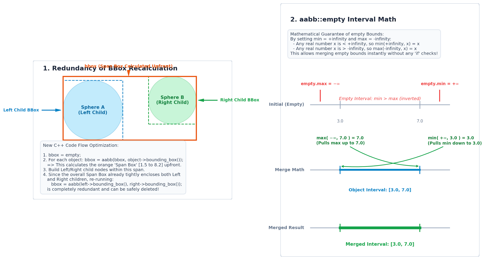

Once we have the bounding box, set the splitting axis to the one with the longest side. We'll imagine a function that does that for us: ***aabb::longest_axis()***. Finally, since we're computing the bounding box of the object span up front, we can delete the original line that computed it as the union of the left and right sides. 
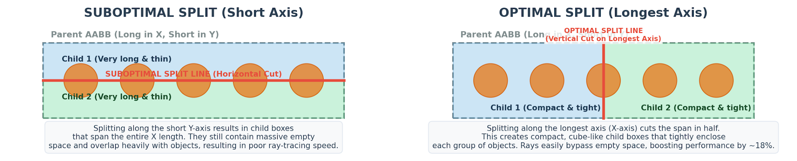

``` c
class bvh_node : public hittable {
  public:
    ...
    bvh_node(std::vector<shared_ptr<hittable>>& objects, size_t start, size_t end) {
        // Build the bounding box of the span of source objects.
        bbox = aabb::empty;
        for (size_t object_index=start; object_index < end; object_index++)
            bbox = aabb(bbox, objects[object_index]->bounding_box());

        int axis = bbox.longest_axis();

        auto comparator = (axis == 0) ? box_x_compare
                        : (axis == 1) ? box_y_compare
                                      : box_z_compare;

        ...

        // bbox = aabb(left->bounding_box(), right->bounding_box());
    }

    ...
```
``` c
class aabb {
  public:
    ...

    bool hit(const ray& r, interval ray_t) const {
        ...
    }

    int longest_axis() const {
        // Returns the index of the longest axis of the bounding box.

        if (x.size() > y.size())
            return x.size() > z.size() ? 0 : 2;
        else
            return y.size() > z.size() ? 1 : 2;
    }

    static const aabb empty, universe;
};

const aabb aabb::empty    = aabb(interval::empty,    interval::empty,    interval::empty);
const aabb aabb::universe = aabb(interval::universe, interval::universe, interval::universe);


```

# Texture Mapping
Texture mapping in computer graphics is the process of applying a material effect to an object in the scene. The “texture” part is the effect, and the “mapping” part is in the mathematical sense of mapping one space onto another. This effect could be any material property: ***color, shininess, bump geometry*** (called Bump Mapping), or even material existence (to create cut-out regions of the surface). 

The most common type of texture mapping maps an image onto the surface of an object, defining the color at each point on the object’s surface. In practice, ***we implement the process in reverse: given some point on the object, we’ll look up the color defined by the texture map.*** 

To begin with, we'll make the texture colors procedural, and will create a ***texture map of constant color***. Most programs keep constant RGB colors and textures in different classes, so feel free to do something different, but I am a big believer in this architecture because it's great being able to make any color a texture. 

In order to perform the texture lookup, we need a ***texture coordinate***. This coordinate can be defined in many ways, and we'll develop this idea as we progress. For now, we'll pass in two dimensional texture coordinates. By convention, texture coordinates are named $u$ and $v$. For a constant texture, every $(u,v)$ pair yields a constant color, so we can actually ignore the coordinates completely. However, other texture types will need these coordinates, so we keep these in the method interface. 

The primary method of our texture classes is the ***color value(...)*** method, which returns the texture color given the input coordinates. In addition to taking the point's texture coordinates $u$ and $v$, we also provide the position of the point in question, for reasons that will become apparent later. 
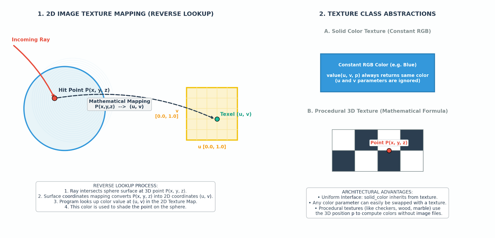

## Constant Color Texture

texture.h
``` c
#ifndef TEXTURE_H
#define TEXTURE_H

class texture {
  public:
    virtual ~texture() = default;

    virtual color value(double u, double v, const point3& p) const = 0;
};

class solid_color : public texture {
  public:
    solid_color(const color& albedo) : albedo(albedo) {}

    solid_color(double red, double green, double blue) : solid_color(color(red,green,blue)) {}

    color value(double u, double v, const point3& p) const override {
        return albedo;
    }

  private:
    color albedo;
};

#endif
```

hittable.h
``` c
class hit_record {
  public:
    vec3 p;
    vec3 normal;
    shared_ptr<material> mat;
    double t;
    double u;
    double v;
    bool front_face;

    ...
```

In the future, we'll need to compute $(u,v)$ texture coordinates for a given point on each type of ***hittable***.

## Solid Textures: A Checker Texture
A solid (or spatial) texture depends only on the position of each point in 3D space. You can think of a solid texture as if it's coloring all of the points in space itself, instead of coloring a given object in that space. For this reason, the object can move through the colors of the texture as it changes position, though usually you would to ***fix the relationship between the object and the solid texture.*** 

To explore spatial textures, we'll implement a spatial ***checker_texture*** class, which implements a three-dimensional checker pattern. Since a spatial texture function is driven by a given position in space, the texture ***value()*** function ignores the u and v parameters, and uses only the p parameter. 

To accomplish the checkered pattern, we'll first compute the ***floor*** of each component of the input point. We could truncate the coordinates, ***but that would pull values toward zero***, which would give us the same color on both sides of zero. ***The floor function will always shift values to the integer value on the left (toward negative infinity).*** 

Given these three integer results $(⌊x⌋,⌊y⌋,⌊z⌋)$ we take their ***sum and compute the result modulo two***, which gives us either 0 or 1. 
- Zero maps to the even color
- One to the odd color.

Finally, we add a ***scaling factor*** to the texture, to allow us to ***control the size of the checker pattern*** in the scene. 
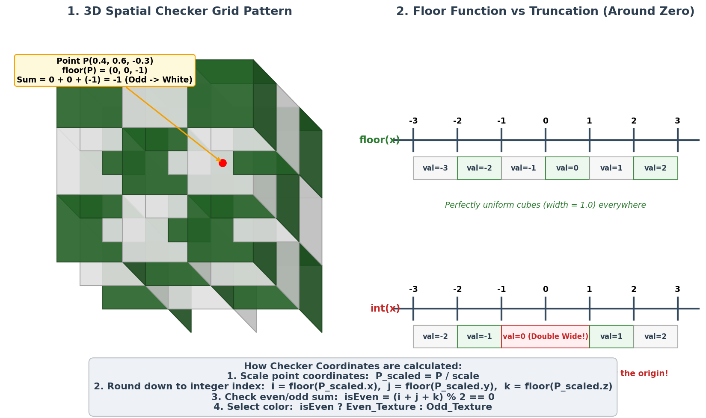

texture.h
``` c
class checker_texture : public texture {
  public:
    checker_texture(double scale, shared_ptr<texture> even, shared_ptr<texture> odd)
      : inv_scale(1.0 / scale), even(even), odd(odd) {}

    checker_texture(double scale, const color& c1, const color& c2)
      : checker_texture(scale, make_shared<solid_color>(c1), make_shared<solid_color>(c2)) {}

    color value(double u, double v, const point3& p) const override {
        auto xInteger = int(std::floor(inv_scale * p.x()));
        auto yInteger = int(std::floor(inv_scale * p.y()));
        auto zInteger = int(std::floor(inv_scale * p.z()));

        bool isEven = (xInteger + yInteger + zInteger) % 2 == 0;

        return isEven ? even->value(u, v, p) : odd->value(u, v, p);
    }

  private:
    double inv_scale;
    shared_ptr<texture> even;
    shared_ptr<texture> odd;
};
```

Those checker odd/even parameters can point to a constant texture ***or to some other procedural texture***. This is in ***the spirit of shader networks introduced by Pat Hanrahan back*** in the 1980s. 

To support procedural textures, we'll extend the ***lambertian*** class to work with textures instead of colors: 

``` c
#include "hittable.h"
#include "texture.h"

...

class lambertian : public material {
  public:
    lambertian(const color& albedo) : tex(make_shared<solid_color>(albedo)) {}
    lambertian(shared_ptr<texture> tex) : tex(tex) {}

    bool scatter(const ray& r_in, const hit_record& rec, color& attenuation, ray& scattered)
    const override {
        auto scatter_direction = rec.normal + random_unit_vector();

        // Catch degenerate scatter direction
        if (scatter_direction.near_zero())
            scatter_direction = rec.normal;

        scattered = ray(rec.p, scatter_direction, r_in.time());
        attenuation = tex->value(rec.u, rec.v, rec.p);
        return true;
    }

  private:
    shared_ptr<texture> tex;
};
```

If we add this to our main scene: 
``` c
#include "texture.h"

int main() {
    hittable_list world;

    auto checker = make_shared<checker_texture>(0.32, color(.2, .3, .1), color(.9, .9, .9));
    world.add(make_shared<sphere>(point3(0,-1000,0), 1000, make_shared<lambertian>(checker)));

    for (int a = -11; a < 11; a++) {
    ...
}
```

## Rendering The Solid Checker Texture
We're going to add a second scene to our program, and will add more scenes after that as we progress through this book. To help with this, we'll set up a switch statement to select the desired scene for a given run. It's a crude approach, but we're trying to keep things dead simple and focus on the raytracing. You may want to use a different approach in your own raytracer, such as supporting command-line arguments. 

Here's what our main.cc looks like after refactoring for our single random spheres scene. Rename main() to ***bouncing_spheres()***, and add a new ***main()*** function to call it: 

``` c

void bouncing_spheres() {
    hittable_list world;

    auto ground_material = make_shared<lambertian>(color(0.5, 0.5, 0.5));
    world.add(make_shared<sphere>(point3(0,-1000,0), 1000, ground_material));

    ...

    cam.render(world);
}

int main() {
    bouncing_spheres();
}
```

Now add a scene with two checkered spheres, one atop the other. 

``` c
void checkered_spheres() {
    hittable_list world;

    auto checker = make_shared<checker_texture>(0.32, color(.2, .3, .1), color(.9, .9, .9));

    world.add(make_shared<sphere>(point3(0,-10, 0), 10, make_shared<lambertian>(checker)));
    world.add(make_shared<sphere>(point3(0, 10, 0), 10, make_shared<lambertian>(checker)));

    camera cam;

    cam.aspect_ratio      = 16.0 / 9.0;
    cam.image_width       = 400;
    cam.samples_per_pixel = 100;
    cam.max_depth         = 50;

    cam.vfov     = 20;
    cam.lookfrom = point3(13,2,3);
    cam.lookat   = point3(0,0,0);
    cam.vup      = vec3(0,1,0);

    cam.defocus_angle = 0;

    cam.render(world);
}

int main() {
    switch (2) {
        case 1: bouncing_spheres();  break;
        case 2: checkered_spheres(); break;
    }
}
```
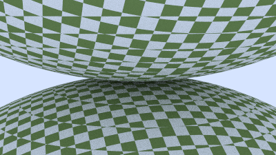

You may think the result looks a bit odd. Since checker_texture is a spatial texture, we're really looking at the surface of the sphere cutting through the three-dimensional checker space. 

## Texture Coordinates for Spheres
Constant-color textures use no coordinates. Solid (or spatial) textures use the coordinates of a point in space. Now it's time to make use of the $u$,$v$ texture coordinates. 

These coordinates specify the location on 2D source image (or in some 2D parameterized space). To get this, we need a way to find the u,v coordinates of any point on the surface of a 3D object.

This mapping is completely arbitrary, but generally you'd like to cover the entire surface, and be able to scale, orient and stretch the 2D image in a way that makes some sense. We'll start with deriving a scheme to get the u,v coordinates of a sphere. 

For spheres, texture coordinates are usually based on some form of ***longitude*** and ***latitude***, i.e., spherical coordinates. So we compute $(θ,ϕ)$ in spherical coordinates.
- Where $θ$ is the angle up from the bottom pole (that is, up from -Y)
- $ϕ$ is the angle around the Y-axis (from -X to +Z to +X to -Z back to -X). 

We want to map $θ$ and $ϕ$ to texture coordinates $u$ and $v$ each in $[0,1]$, where $(u=0,v=0)$ maps to the bottom-left corner of the texture. Thus the normalization from $(θ,ϕ)$ to $(u,v)$ would be: 
$$u = \frac{\phi}{2\pi}$$

$$v = \frac{\theta}{\pi}$$

To compute $θ$ and $ϕ$ for a given point on the unit sphere centered at the origin, we start with the equations for the corresponding Cartesian coordinates: 
$$x = -\cos\phi \sin\theta$$

$$y = -\cos\theta$$

$$z = \sin\phi \sin\theta$$

The derivation for $θ$ is more straightforward ($\arccos$ $[0, \pi]$): 
$$\theta = \arccos(-y)$$

The derivation for $\phi$:
$$\frac{z}{-x} = \frac{\sin\phi \sin\theta}{\cos\phi \sin\theta} = \frac{\sin\phi}{\cos\phi} = \tan\phi$$

Void $(x=0)$ using $atan2(z, -x)$. Which takes any pair of numbers proportional to sine and cosine and returns the angle, we can pass in $x$ and $z$ (the $sin(θ)$ cancel) to solve for $ϕ$: 
$$ϕ=atan2(z,−x)$$

$std::atan2()$ returns values in the range $[-\pi, \pi]$, +  $\pi => [0, 2\pi]$ :

$$\phi = \text{atan2}(-z, x) + \pi$$

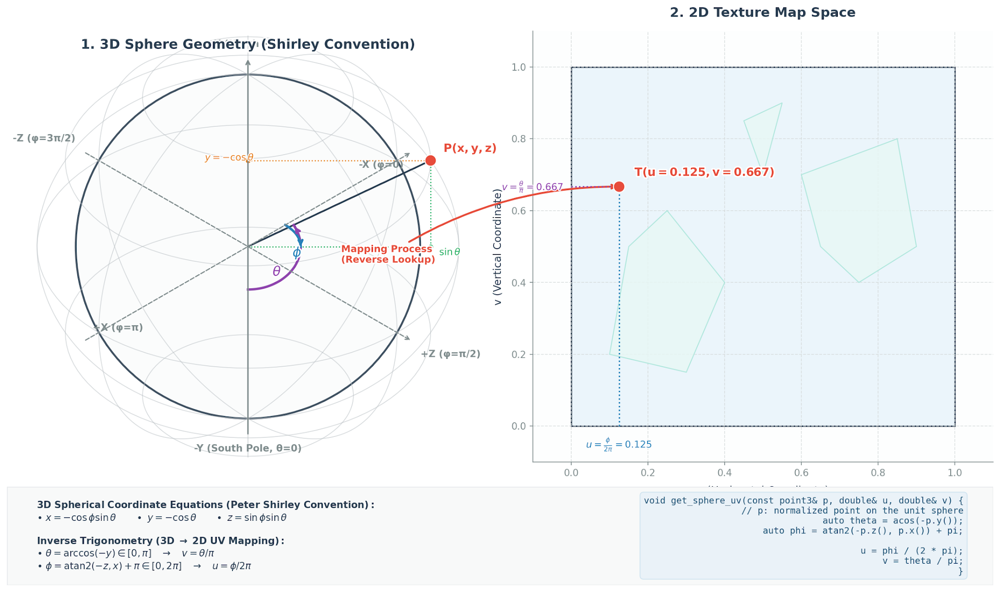

So for a sphere, the (u,v) coord computation is accomplished by a utility function that takes points on the unit sphere centered at the origin, and computes u and v: 

``` c
class sphere : public hittable {
  ...
  private:
    ...

    static void get_sphere_uv(const point3& p, double& u, double& v) {
        // p: a given point on the sphere of radius one, centered at the origin.
        // u: returned value [0,1] of angle around the Y axis from X=-1.
        // v: returned value [0,1] of angle from Y=-1 to Y=+1.
        //     <1 0 0> yields <0.50 0.50>       <-1  0  0> yields <0.00 0.50>
        //     <0 1 0> yields <0.50 1.00>       < 0 -1  0> yields <0.50 0.00>
        //     <0 0 1> yields <0.25 0.50>       < 0  0 -1> yields <0.75 0.50>

        auto theta = std::acos(-p.y());
        auto phi = std::atan2(-p.z(), p.x()) + pi;

        u = phi / (2*pi);
        v = theta / pi;
    }
};
```

Update the ***sphere::hit()*** function to use this function to update the hit record UV coordinates. 

``` c
class sphere : public hittable {
  public:
    ...
    bool hit(const ray& r, interval ray_t, hit_record& rec) const override {
        ...

        rec.t = root;
        rec.p = r.at(rec.t);
        vec3 outward_normal = (rec.p - current_center) / radius;
        rec.set_face_normal(r, outward_normal);
        get_sphere_uv(outward_normal, rec.u, rec.v);
        rec.mat = mat;

        return true;
    }
    ...
};
```

From the hitpoint **P**, we compute the surface coordinates $(u,v)$. We then use these to index into our procedural solid texture (like ***marble***). We can also read in an image and use the 2D $(u,v)$ texture coordinate to index into the image. 

A direct way to use scaled $(u,v)$ in an image is to round the $u$ and $v$ to integers, and use that as $(i,j)$ pixels. This is awkward, because we don’t want to have to change the code when we ***change image resolution***. So instead, one of the the most universal unofficial standards in graphics is to use texture coordinates instead of image pixel coordinates. ***These are just some form of fractional position in the image.***

For example, for pixel $(i,j)$ in an $N_x$ by $N_y$ image, the image texture position is:

***Normalized/Fractional Texture Coordinates:***
$$u=\frac{i}{N_x−1}$$

$$v=\frac{j}{N_y−1}$$

Why $N_x - 1$ ?

Avoid ***off-by-one error***

## Accessing Texture Image Data

Now it's time to create a texture class that holds an image. I am going to use my favorite image utility, ***stb_image***. 
- It reads image data into an array of ***32-bit floating-point*** values. 
- These are just packed RGBs with each component in the range $[0,1]$ (black to full white). 
- In addition, images are loaded in linear color space $(gamma = 1)$  the color space in which we do all our computations. 

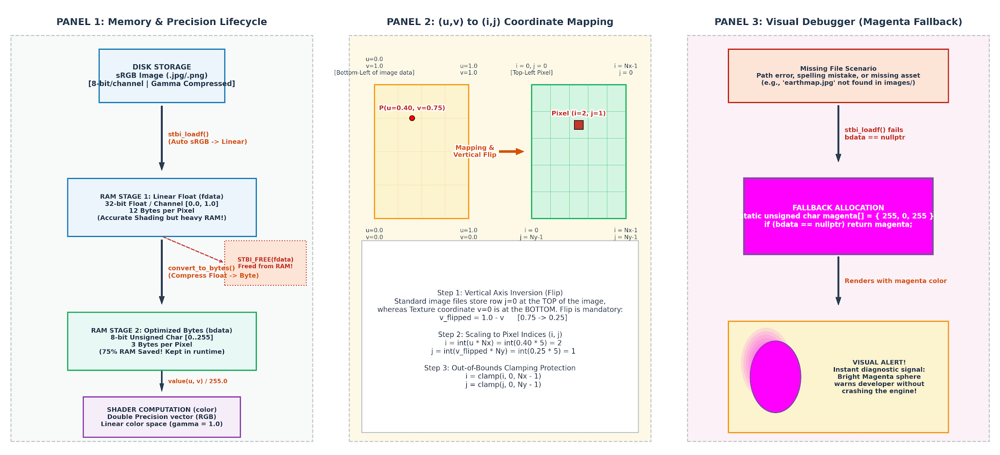


rtw_stb_image.h
``` c
#ifndef RTW_STB_IMAGE_H
#define RTW_STB_IMAGE_H

// Disable strict warnings for this header from the Microsoft Visual C++ compiler.
#ifdef _MSC_VER
    #pragma warning (push, 0)
#endif

#define STB_IMAGE_IMPLEMENTATION
#define STBI_FAILURE_USERMSG
#include "external/stb_image.h"

#include <cstdlib>
#include <iostream>

class rtw_image {
  public:
    rtw_image() {}

    rtw_image(const char* image_filename) {
        // Loads image data from the specified file. If the RTW_IMAGES environment variable is
        // defined, looks only in that directory for the image file. If the image was not found,
        // searches for the specified image file first from the current directory, then in the
        // images/ subdirectory, then the _parent's_ images/ subdirectory, and then _that_
        // parent, on so on, for six levels up. If the image was not loaded successfully,
        // width() and height() will return 0.

        auto filename = std::string(image_filename);
        auto imagedir = getenv("RTW_IMAGES");

        // Hunt for the image file in some likely locations.
        if (imagedir && load(std::string(imagedir) + "/" + image_filename)) return;
        if (load(filename)) return;
        if (load("images/" + filename)) return;
        if (load("../images/" + filename)) return;
        if (load("../../images/" + filename)) return;
        if (load("../../../images/" + filename)) return;
        if (load("../../../../images/" + filename)) return;
        if (load("../../../../../images/" + filename)) return;
        if (load("../../../../../../images/" + filename)) return;

        std::cerr << "ERROR: Could not load image file '" << image_filename << "'.\n";
    }

    ~rtw_image() {
        delete[] bdata;
        STBI_FREE(fdata);
    }

    bool load(const std::string& filename) {
        // Loads the linear (gamma=1) image data from the given file name. Returns true if the
        // load succeeded. The resulting data buffer contains the three [0.0, 1.0]
        // floating-point values for the first pixel (red, then green, then blue). Pixels are
        // contiguous, going left to right for the width of the image, followed by the next row
        // below, for the full height of the image.

        auto n = bytes_per_pixel; // Dummy out parameter: original components per pixel
        fdata = stbi_loadf(filename.c_str(), &image_width, &image_height, &n, bytes_per_pixel);
        if (fdata == nullptr) return false;

        bytes_per_scanline = image_width * bytes_per_pixel;
        convert_to_bytes();
        return true;
    }

    int width()  const { return (fdata == nullptr) ? 0 : image_width; }
    int height() const { return (fdata == nullptr) ? 0 : image_height; }

    const unsigned char* pixel_data(int x, int y) const {
        // Return the address of the three RGB bytes of the pixel at x,y. If there is no image
        // data, returns magenta.
        static unsigned char magenta[] = { 255, 0, 255 };
        if (bdata == nullptr) return magenta;

        x = clamp(x, 0, image_width);
        y = clamp(y, 0, image_height);

        return bdata + y*bytes_per_scanline + x*bytes_per_pixel;
    }

  private:
    const int      bytes_per_pixel = 3;
    float         *fdata = nullptr;         // Linear floating point pixel data
    unsigned char *bdata = nullptr;         // Linear 8-bit pixel data
    int            image_width = 0;         // Loaded image width
    int            image_height = 0;        // Loaded image height
    int            bytes_per_scanline = 0;

    static int clamp(int x, int low, int high) {
        // Return the value clamped to the range [low, high).
        if (x < low) return low;
        if (x < high) return x;
        return high - 1;
    }

    static unsigned char float_to_byte(float value) {
        if (value <= 0.0)
            return 0;
        if (1.0 <= value)
            return 255;
        return static_cast<unsigned char>(256.0 * value);
    }

    void convert_to_bytes() {
        // Convert the linear floating point pixel data to bytes, storing the resulting byte
        // data in the `bdata` member.

        int total_bytes = image_width * image_height * bytes_per_pixel;
        bdata = new unsigned char[total_bytes];

        // Iterate through all pixel components, converting from [0.0, 1.0] float values to
        // unsigned [0, 255] byte values.

        auto *bptr = bdata;
        auto *fptr = fdata;
        for (auto i=0; i < total_bytes; i++, fptr++, bptr++)
            *bptr = float_to_byte(*fptr);
    }
};

// Restore MSVC compiler warnings
#ifdef _MSC_VER
    #pragma warning (pop)
#endif

#endif
```

exture.h
``` c
#include "rtw_stb_image.h"

...

class checker_texture : public texture {
    ...
};

class image_texture : public texture {
  public:
    image_texture(const char* filename) : image(filename) {}

    color value(double u, double v, const point3& p) const override {
        // If we have no texture data, then return solid cyan as a debugging aid.
        if (image.height() <= 0) return color(0,1,1);

        // Clamp input texture coordinates to [0,1] x [1,0]
        u = interval(0,1).clamp(u);
        v = 1.0 - interval(0,1).clamp(v);  // Flip V to image coordinates

        auto i = int(u * image.width());
        auto j = int(v * image.height());
        auto pixel = image.pixel_data(i,j);

        auto color_scale = 1.0 / 255.0;
        return color(color_scale*pixel[0], color_scale*pixel[1], color_scale*pixel[2]);
    }

  private:
    rtw_image image;
};
```

## Rendering The Image Texture
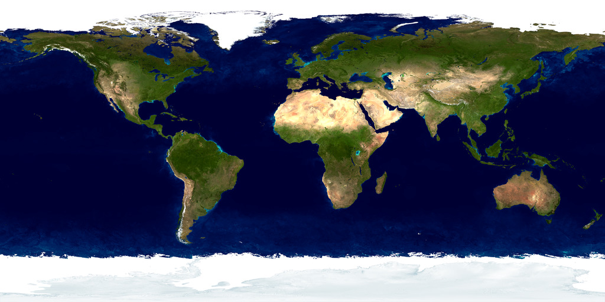

```c
void earth() {
    auto earth_texture = make_shared<image_texture>("earthmap.jpg");
    auto earth_surface = make_shared<lambertian>(earth_texture);
    auto globe = make_shared<sphere>(point3(0,0,0), 2, earth_surface);

    camera cam;

    cam.aspect_ratio      = 16.0 / 9.0;
    cam.image_width       = 400;
    cam.samples_per_pixel = 100;
    cam.max_depth         = 50;

    cam.vfov     = 20;
    cam.lookfrom = point3(0,0,12);
    cam.lookat   = point3(0,0,0);
    cam.vup      = vec3(0,1,0);

    cam.defocus_angle = 0;

    cam.render(hittable_list(globe));
}

int main() {
    switch (3) {
        case 1:  bouncing_spheres();  break;
        case 2:  checkered_spheres(); break;
        case 3:  earth();             break;
    }
}
```

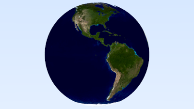

# Perlin Noise

https://thebookofshaders.com/11/?lan=vi

To get cool looking solid textures most people use some form of ***Perlin noise***. These are named after their inventor Ken Perlin. Perlin texture doesn’t return white noise like this: 

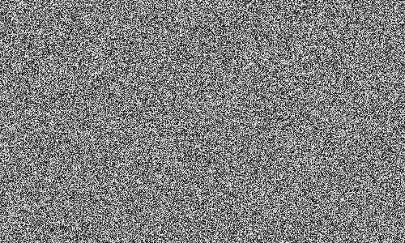


Instead it returns something similar to blurred white noise: 
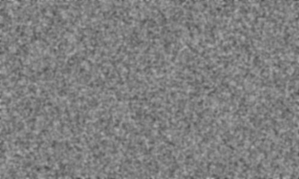

A key part of Perlin noise is that it is repeatable: it takes a 3D point as input and always returns the same randomish number. Nearby points return similar numbers. 

Another important part of Perlin noise is that it be simple and fast, so it’s usually done as a hack. I’ll build that hack up incrementally based on Andrew Kensler’s description. 

## Using Blocks of Random Numbers

We could just tile all of space with a 3D array of random numbers and use them in blocks. You get something blocky where the repeating is clear: 

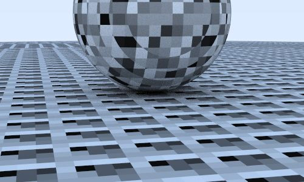

perlin.h
```c
#ifndef PERLIN_H
#define PERLIN_H

class perlin {
  public:
    perlin() {
        for (int i = 0; i < point_count; i++) {
            randfloat[i] = random_double();
        }

        perlin_generate_perm(perm_x);
        perlin_generate_perm(perm_y);
        perlin_generate_perm(perm_z);
    }

    double noise(const point3& p) const {
        auto i = int(4*p.x()) & 255;
        auto j = int(4*p.y()) & 255;
        auto k = int(4*p.z()) & 255;

        return randfloat[perm_x[i] ^ perm_y[j] ^ perm_z[k]];
    }

  private:
    static const int point_count = 256;
    double randfloat[point_count];
    int perm_x[point_count];
    int perm_y[point_count];
    int perm_z[point_count];

    static void perlin_generate_perm(int* p) {
        for (int i = 0; i < point_count; i++)
            p[i] = i;

        permute(p, point_count);
    }

    static void permute(int* p, int n) {
        for (int i = n-1; i > 0; i--) {
            int target = random_int(0, i);
            int tmp = p[i];
            p[i] = p[target];
            p[target] = tmp;
        }
    }
};

#endif
```

texture.h

``` c
#include "perlin.h"
#include "rtw_stb_image.h"

...
class noise_texture : public texture {
  public:
    noise_texture() {}

    color value(double u, double v, const point3& p) const override {
        return color(1,1,1) * noise.noise(p);
    }

  private:
    perlin noise;
};
```

main.cc

``` c
void perlin_spheres() {
    hittable_list world;

    auto pertext = make_shared<noise_texture>();
    world.add(make_shared<sphere>(point3(0,-1000,0), 1000, make_shared<lambertian>(pertext)));
    world.add(make_shared<sphere>(point3(0,2,0), 2, make_shared<lambertian>(pertext)));

    camera cam;

    cam.aspect_ratio      = 16.0 / 9.0;
    cam.image_width       = 400;
    cam.samples_per_pixel = 100;
    cam.max_depth         = 50;

    cam.vfov     = 20;
    cam.lookfrom = point3(13,2,3);
    cam.lookat   = point3(0,0,0);
    cam.vup      = vec3(0,1,0);

    cam.defocus_angle = 0;

    cam.render(world);
}

int main() {
    switch (4) {
        case 1:  bouncing_spheres();   break;
        case 2:  checkered_spheres();  break;
        case 3:  earth();              break;
        case 4:  perlin_spheres();     break;
    }
}
```

## Smoothing out the Result
To make it smooth, we can linearly interpolate: 

``` c

class perlin {
  public:
    ...

    double noise(const point3& p) const {
        auto u = p.x() - std::floor(p.x());
        auto v = p.y() - std::floor(p.y());
        auto w = p.z() - std::floor(p.z());

        auto i = int(std::floor(p.x()));
        auto j = int(std::floor(p.y()));
        auto k = int(std::floor(p.z()));
        double c[2][2][2];

        for (int di=0; di < 2; di++)
            for (int dj=0; dj < 2; dj++)
                for (int dk=0; dk < 2; dk++)
                    c[di][dj][dk] = randfloat[
                        perm_x[(i+di) & 255] ^
                        perm_y[(j+dj) & 255] ^
                        perm_z[(k+dk) & 255]
                    ];

        return trilinear_interp(c, u, v, w);
    }

    ...

  private:
    ...

    static void permute(int* p, int n) {
        ...
    }

    static double trilinear_interp(double c[2][2][2], double u, double v, double w) {
        auto accum = 0.0;
        for (int i=0; i < 2; i++)
            for (int j=0; j < 2; j++)
                for (int k=0; k < 2; k++)
                    accum += (i*u + (1-i)*(1-u))
                           * (j*v + (1-j)*(1-v))
                           * (k*w + (1-k)*(1-w))
                           * c[i][j][k];

        return accum;
    }
};

```

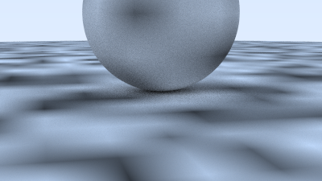

## Improvement with Hermitian Smoothing

Smoothing yields an improved result, but there are obvious grid features in there. Some of it is Mach bands, a known perceptual artifact of linear interpolation of color. A standard trick is to use a Hermite cubic to round off the interpolation: 

``` c
class perlin (
  public:
    ...
    double noise(const point3& p) const {
        auto u = p.x() - std::floor(p.x());
        auto v = p.y() - std::floor(p.y());
        auto w = p.z() - std::floor(p.z());
        u = u*u*(3-2*u);
        v = v*v*(3-2*v);
        w = w*w*(3-2*w);

        auto i = int(std::floor(p.x()));
        auto j = int(std::floor(p.y()));
        auto k = int(std::floor(p.z()));
        ...

```
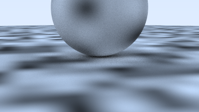

## Tweaking The Frequency
It is also a bit low frequency. We can scale the input point to make it vary more quickly: 

``` c
class noise_texture : public texture {
  public:
    noise_texture(double scale) : scale(scale) {}

    color value(double u, double v, const point3& p) const override {
        return color(1,1,1) * noise.noise(scale * p);
    }

  private:
    perlin noise;
    double scale;
};
```

``` c
void perlin_spheres() {
    ...
    auto pertext = make_shared<noise_texture>(4);
    world.add(make_shared<sphere>(point3(0,-1000,0), 1000, make_shared<lambertian>(pertext)));
    world.add(make_shared<sphere>(point3(0, 2, 0), 2, make_shared<lambertian>(pertext)));

    camera cam;
    ...
}
```

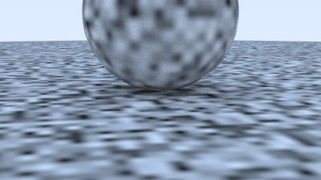

## Using Random Vectors on the Lattice Points
This is still a bit blocky looking, probably because the min and max of the pattern always lands exactly on the integer x/y/z. Ken Perlin’s very clever trick was to instead put random unit vectors (instead of just floats) on the lattice points, and use a dot product to move the min and max off the lattice. So, first we need to change the random floats to random vectors. These vectors are any reasonable set of irregular directions, and I won't bother to make them exactly uniform: 

``` c
class perlin {
  public:
    perlin() {
        for (int i = 0; i < point_count; i++) {
            randvec[i] = unit_vector(vec3::random(-1,1));
        }

        perlin_generate_perm(perm_x);
        perlin_generate_perm(perm_y);
        perlin_generate_perm(perm_z);
    }

    ...

  private:
    static const int point_count = 256;
    vec3 randvec[point_count];
    int perm_x[point_count];
    int perm_y[point_count];
    int perm_z[point_count];
    ...
};
```

``` c
class perlin {
  public:
    ...
    double noise(const point3& p) const {
        auto u = p.x() - std::floor(p.x());
        auto v = p.y() - std::floor(p.y());
        auto w = p.z() - std::floor(p.z());

        auto i = int(std::floor(p.x()));
        auto j = int(std::floor(p.y()));
        auto k = int(std::floor(p.z()));
        vec3 c[2][2][2];

        for (int di=0; di < 2; di++)
            for (int dj=0; dj < 2; dj++)
                for (int dk=0; dk < 2; dk++)
                    c[di][dj][dk] = randvec[
                        perm_x[(i+di) & 255] ^
                        perm_y[(j+dj) & 255] ^
                        perm_z[(k+dk) & 255]
                    ];

        return perlin_interp(c, u, v, w);
    }

    ...
};

```

``` c
class noise_texture : public texture {
  public:
    noise_texture(double scale) : scale(scale) {}

    color value(double u, double v, const point3& p) const override {
        return color(1,1,1) * 0.5 * (1.0 + noise.noise(scale * p));
    }

  private:
    perlin noise;
    double scale;
};
```

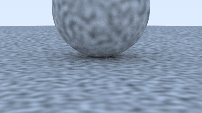

## Introducing Turbulence
Very often, a composite noise that has multiple summed frequencies is used. This is usually called turbulence, and is a sum of repeated calls to noise: 

``` c
class perlin {
  ...
  public:
    ...

    double noise(const point3& p) const {
        ...
    }

    double turb(const point3& p, int depth) const {
        auto accum = 0.0;
        auto temp_p = p;
        auto weight = 1.0;

        for (int i = 0; i < depth; i++) {
            accum += weight * noise(temp_p);
            weight *= 0.5;
            temp_p *= 2;
        }

        return std::fabs(accum);
    }

    ...
```
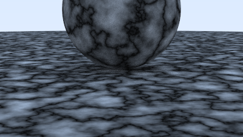

## Adjusting the Phase
However, usually turbulence is used indirectly. For example, the “hello world” of procedural solid textures is a simple marble-like texture. The basic idea is to make color proportional to something like a sine function, and use turbulence to adjust the phase (so it shifts x in sin(x)) which makes the stripes undulate. Commenting out straight noise and turbulence, and giving a marble-like effect is: 

``` c
class noise_texture : public texture {
  public:
    noise_texture(double scale) : scale(scale) {}

    color value(double u, double v, const point3& p) const override {
        return color(.5, .5, .5) * (1 + std::sin(scale * p.z() + 10 * noise.turb(p, 7)));
    }

  private:
    perlin noise;
    double scale;
};
```

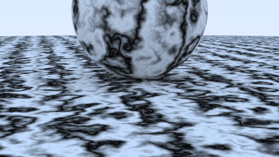